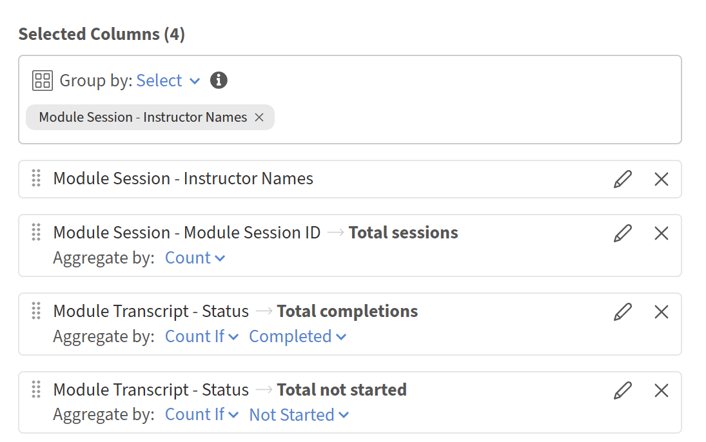
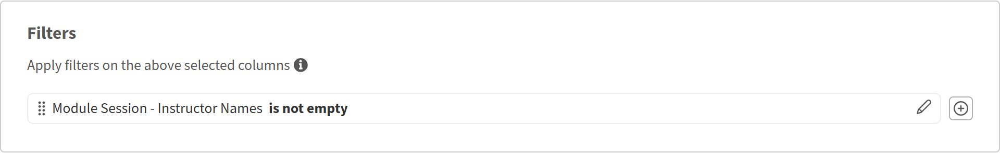

# Verifica le prestazioni dell’istruttore con il Report Builder

## Panoramica

Questo report consente ai manager di formazione di identificare gli istruttori più attivi, quanti allievi raggiungono e quanti allievi completano i corsi offerti.

## Creazione di un report sull’efficienza dell’Istruttore

1. Avvia Report Builder e seleziona **Crea report**.
2. Digitare un nome, ad esempio **Efficienza dell&#39;istruttore**.
3. Aggiungi **Nomi Istruttori** dal set di dati **Modulo**.
4. Aggiungi **ID modulo** dal set di dati **Modulo**. Questa operazione verrà aggregata per contare le sessioni.
5. Aggiungi **Stato** dal set di dati **Trascrizione modulo**. Utilizzerai il conteggio se per contare i completamenti.
6. Seleziona **Raggruppa per** su **Nomi istruttori**.
7. Applica **Count** a **ID modulo**. Digitare l&#39;alias Totale sessioni.
8. Applica **Count if** a **Status**, seleziona Completato. Digitare l&#39;alias **Completamenti totali**.
9. Per visualizzare anche il totale delle iscrizioni, aggiungi **Stato** una seconda volta. Applica **Count if** a Non avviato. Digitare l&#39;alias Totale iscrizioni.

   

10. Filtra **Nomi istruttore** per non svuotare.

    

11. Ordina in base a **Completamenti totali** che scendono fino a presentare prima gli istruttori con le prestazioni più elevate.

    

12. Selezionate **Salva report** e selezionate **Azioni** > **Scarica** per scaricare il report.

Il report scaricato riassume l’efficienza degli istruttori confrontando il totale delle sessioni di formazione, i completamenti degli allievi e le iscrizioni non iniziate per ogni istruttore, contribuendo a valutare il coinvolgimento, le prestazioni di completamento e le potenziali esigenze di follow-up della formazione.

## Procedure ottimali

* Utilizzare le etichette del catalogo per definire l&#39;ambito dei report dell&#39;istruttore in una Business Unit, un percorso o un programma specifico. Questo metodo è più preciso rispetto al filtraggio in base al solo nome del catalogo.
* Aggiungere un filtro per data, ad esempio **Data di iscrizione** negli ultimi 90 giorni, per definire l&#39;ambito del report per un periodo recente anziché per i dati di tutti i tempi.
* Ordina in base a una metrica significativa, ad esempio **Completamenti totali,** anziché in base al nome dell&#39;istruttore, in modo che le differenze di prestazioni siano immediatamente visibili.
