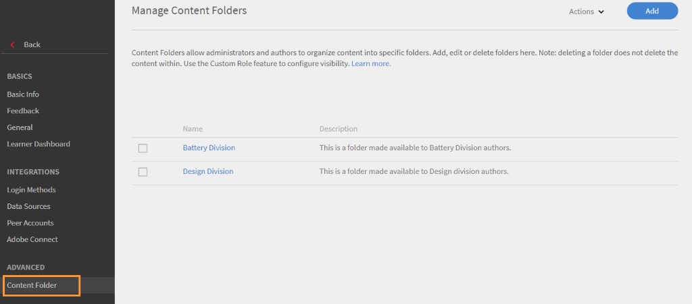
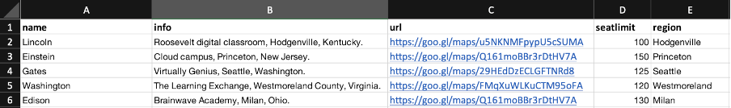

# Impostazioni

Scopri ulteriori informazioni sulle impostazioni dell’account Learning Manager che è possibile configurare come Amministratore.

Puoi modificare le impostazioni del profilo Amministratore e aggiornare le impostazioni dell’account. Visualizza le informazioni di profilo, aggiungi/modifica la foto profilo e modifica **[!UICONTROL Informazioni personali]** contenuto. Aggiorna le informazioni aziendali, configura i metodi di accesso per gli utenti e configura l’integrazione di Connect tramite le impostazioni dell’account.

## Impostazioni account {#accountsettings}

Per aggiornare le impostazioni dell&#39;account della tua organizzazione, fai clic su **[!UICONTROL Impostazioni]** nel riquadro sinistro.

**Informazioni di base (informazioni aziendali)**

Fai clic **[!UICONTROL Modifica]** nella pagina e modificare paese, fuso orario, impostazioni locali e anno finanziario.

**Configurazione dell’amministratore del contatto**

Per aggiungere o modificare gli indirizzi e-mail degli amministratori del supporto per l’organizzazione, fai clic su **[!UICONTROL Generale]** nel riquadro sinistro. Fai clic **[!UICONTROL Modifica]** adiacente a **[!UICONTROL ID e-mail supporto]** e aggiungi gli id e-mail. L’e-mail viene inviata a questi Amministratori quando l’Allievo fa clic **[!UICONTROL Contatta l’amministratore]** in fondo alla pagina.

Aggiungi altri ID e-mail con punto e virgola come separatore.

**Metodi di accesso** - Gli amministratori possono scegliere la modalità con cui gli utenti interni o esterni possono accedere all’account.

* **Utenti interni:** Per gli utenti interni, è possibile impostare Adobe ID o Single Sign-On come modalità di accesso.
* **Utenti esterni:** Per gli utenti esterni, puoi impostare l’Adobe ID, l’accesso unico o l’ID di Learning Manager.

Se scegli l’ID di Learning Manager, gli utenti esterni possono accedere a questo account dopo aver creato nome utente e password Learning Manager.

>[!NOTE]
>
>Se sono impostati più profili esterni, tutti i profili possono avere un qualsiasi tipo di accesso. Ad esempio, se il tipo di accesso è Adobe ID, tutti i profili devono accedere utilizzando solo Adobe ID. Ogni profilo non può avere il proprio tipo di accesso individuale.

Puoi accedere all’applicazione Learning Manager utilizzando Adobe ID o l’accesso unico. L’accesso unico è un meccanismo che consente a un utente di autenticarsi una volta sola e di accedere a più applicazioni più volte. Questa configurazione non è obbligatoria per l&#39;organizzazione. Se l’organizzazione dispone di un provider SSO basato su SAML 2.0, è possibile utilizzarlo per configurare l’applicazione Learning Manager. La configurazione è richiesta a livello di organizzazione e per l’applicazione Learning Manager. Se scegli di utilizzare SSO, contatta il supporto degli Adobi per ricevere le istruzioni di configurazione

**Feedback**

Fai clic **[!UICONTROL Feedback]** nel riquadro di sinistra per configurare il questionario per ottenere il feedback degli allievi al completamento di un corso. Fare riferimento a [contenuti della guida alle funzionalità dei corsi](courses.md) durante la creazione di feedback L1 e L3.

**Tentativi multipli**

Seleziona **[!UICONTROL Impostazioni]** > **[!UICONTROL Generale]** > **[!UICONTROL Tentativi multipli]**.

Se attivi la casella di controllo &quot;Tentativi multipli&quot;, gli Autori possono impostare &quot;Tentativi multipli&quot; per i corsi o i moduli di e-learning interattivi. Selezionando la seconda casella di controllo, gli Amministratori possono impostare &quot;Tentativi infiniti&quot; per impostazione predefinita per qualsiasi corso di e-learning interattivo appena creato.

*Seleziona la casella di controllo Tentativi multipli.*

**Moderazione del corso**

Fai clic **[!UICONTROL Generale]** dal riquadro a sinistra, e seleziona l’opzione Moderazione del corso per abilitare la funzionalità Moderazione del corso. Per ulteriori informazioni su questa funzione, consulta [Moderazione del corso](courses.md#main-pars_header_1879001177).

**Forum di discussione**

Se abiliti la casella di controllo Forum di discussione, allievi e istruttori possono pubblicare commenti per i corsi utilizzando la scheda Discussione dalla pagina Corsi nell’app allievi. Tuttavia, se le impostazioni a livello del corso indicano che questa funzione non è selezionata, le impostazioni a livello del corso hanno la precedenza sulle impostazioni dell’Amministratore.

**Dashboard Allievo**

Nel riquadro a sinistra, fai clic su Dashboard Allievo. Questa pagina consente di scegliere i widget da visualizzare nella pagina Allievi. Seleziona i widget da abilitare nella pagina Allievi. I widget non selezionati non verranno visualizzati nella pagina Allievi.

**Adobe Connect**

Fai clic **[!UICONTROL Adobe Connect]** nel riquadro a sinistra per configurare l’account Adobe Connect in modo che ospiti sessioni in aula virtuale. Per ulteriori informazioni, consulta  [Adobe Connect](adobeconnect-integration.md) guida alle funzionalità.

## Impostazioni generali {#general}

Abilita o disabilita le seguenti impostazioni:

<table>
 <tbody>
  <tr>
   <th>
    
<b>Nome</b>

    </th>
   <th>
    
<b>Descrizione</b>

   </th>
  </tr>
  <tr>
   <td>Mostra efficacia del corso</td>
   <td>Se questa opzione viene attivata, gli allievi possono visualizzare l’attuale efficacia del corso nel riquadro del corso. Questa funzione è disponibile solo per i corsi. La valutazione a stelle non è supportata per i programmi di apprendimento o i certificati. È disponibile per corsi e programmi di apprendimento ma non per le certificazioni.</td>
  </tr>
  <tr>
   <td>Moderazione del corso</td>
   <td>Se questa opzione è attivata, tutte le modifiche ai corsi devono richiedere l’approvazione dell’Amministratore prima che i corsi siano visibili agli Allievi.</td>
  </tr>
  <tr>
   <td>Forum di discussione</td>
   <td>Se abiliti la casella di controllo Forum di discussione, allievi e istruttori possono pubblicare commenti per i corsi utilizzando la scheda Discussione dalla pagina Corsi nell’app allievi. Tuttavia, se le impostazioni a livello del corso indicano che questa funzione non è selezionata, le impostazioni a livello del corso hanno la precedenza sulle impostazioni dell’Amministratore.</td>
  </tr>
  <tr>
   <td>Tentativi multipli</td>
   <td>Se questa opzione è attivata, l’Autore può configurare più tentativi per i moduli del corso.</td>
  </tr>
  <tr>
   <td>Esplora opzione abilità</td>
   <td>Se questa opzione è attivata, gli allievi possono esplorare le Abilità per Pari e Leadership e iscriversi alle Abilità di loro scelta.</td>
  </tr>
  <tr>
   <td>Visibilità abilità/tag</td>
   <td>Mostra tutte le abilità e i tag agli Allievi. Puoi mostrare tutte le abilità e i tag o mostrare le abilità e i tag assegnati o quelli che fanno parte dei Cataloghi visibili all’Allievo.</td>
  </tr>
  <tr>
   <td>ID univoci oggetto di apprendimento</td>
   <td>Se questa opzione è attivata, un Amministratore o un Autore può aggiungere un ID univoco per ogni oggetto di apprendimento.</td>
  </tr>
  <tr>
   <td>Mostra pannelli filtri</td>
   <td>
    
Determina quali pannelli di filtro sono disponibili per gli utenti nell’applicazione Allievo per perfezionare i risultati della ricerca. Le opzioni sono le seguenti:

    <ul>
     <li>Cataloghi</li>
     <li>Tipo</li>
     <li>Formato</li>
     <li>Durata</li>
     <li>Abilità</li>
     <li>Livelli abilità</li>
     <li>Tag</li>
    </ul>
    
Quando l’Allievo avvia l’app per Allievi, nelle sezioni Il mio apprendimento e Catalogo può visualizzare i filtri nei rispettivi pannelli.

    
<b>Nota: </b>I filtri <b>Formato </b>e <b>Durata </b>sono disattivati per impostazione predefinita e non appaiono agli allievi subito dopo l’aggiornamento. L’Amministratore deve abilitarle.  
</td>
  </tr>
  <tr>
   <td>Mostra elenco cataloghi</td>
   <td>Se questa opzione è attivata, gli allievi possono visualizzare un elenco di tutti i Cataloghi disponibili. Gli Allievi possono utilizzare questa opzione per perfezionare il modo in cui vengono visualizzati gli Oggetti di apprendimento.</td>
  </tr>
  <tr>
   <td>Terminologia del prodotto</td>
   <td>Learning Manager ha una terminologia standard utilizzata nel prodotto. Modifica la terminologia in base alle esigenze dell’organizzazione.</td>
  </tr>
  <tr>
   <td>Aggiornamento della versione del modulo</td>
   <td>Configura l’impostazione predefinita per aggiornare il contenuto. Le impostazioni possono essere modificate per ciascun contenuto dalla pagina del corso.</td>
  </tr>
  <tr>
   <td>Registra automaticamente utenti</td>
   <td>Se questa opzione è attivata, gli utenti appena importati vengono registrati automaticamente. Per impostazione predefinita, gli utenti devono essere registrati manualmente per poter iniziare a utilizzare Learning Manager.</td>
  </tr>
  <tr>
   <td>Elimina automaticamente utenti interni</td>
   <td>Se questa opzione è attivata, gli utenti interni vengono eliminati automaticamente se non accedono al sistema per un numero di giorni specificato. Questa funzione è applicabile solo agli utenti con il ruolo <b>Allievo</b>. Per ripristinare l’accesso, gli utenti devono contattare l’amministratore. </td>
  </tr>
  <tr>
   <td>Mostra etichette del catalogo</td>
   <td>Se questa opzione è attivata, gli Amministratori e gli Autori possono impostare etichette del catalogo e valori e collegarli agli Oggetti di apprendimento.</td>
  </tr>
  <tr>
   <td>Gli Allievi possono visualizzare i propri punteggi</td>
   <td>Se questa opzione è attivata, gli allievi possono visualizzare i propri punteggi nelle trascrizioni degli allievi.</td>
  </tr>
  <tr>
   <td>E-mail di riepilogo</td>
   <td>
    
Un Amministratore può abilitare o disabilitare l’invio di un’e-mail agli Allievi. L’Amministratore potrà anche controllare la frequenza delle e-mail inviate.

    <ul>
     <li>Per <b>account attivi</b>, le e-mail di riepilogo saranno disabilitate per impostazione predefinita, che l'amministratore può abilitare manualmente.</li>
     <li>Per <b>account di prova</b>, l’opzione per le e-mail di riepilogo rimarrà disabilitata e l’amministratore non potrà abilitarla.</li>
    </ul>
    
Se la funzione è disabilitata, allora:

    <ul>
     <li>Opzione <b>E-mail di riepilogo</b> verrà disabilitato.</li>
     <li>Un Allievo non può visualizzare l’impostazione utente per l’abbonamento e-mail di riepilogo.</li>
    </ul>
    
 Se la funzione è abilitata, allora:

    <ul>
     <li>L’Amministratore può abilitare e modificare l’opzione E-mail di riepilogo.</li>
     <li>Dal menu <b>Impostazioni profilo </b>nell’app per allievi, un allievo (non nell’elenco DND) può scegliere di abbonarsi/annullare l’iscrizione all’e-mail di riepilogo.</li>
    </ul></td>
  </tr>
  <tr>
   <td>Attiva icone per la scheda di formazione </td>
   <td>Se questa opzione è attivata, le icone verranno visualizzate nelle schede di formazione nell’app per Allievi. </td>
  </tr>
  <tr>
   <td>Collegamenti a piè di pagina</td>
   <td>
    
Aggiungi collegamenti o ID e-mail che vengono visualizzati come piè di pagina. Puoi aggiungere un massimo di tre collegamenti a piè di pagina.

    
Per personalizzare i collegamenti nel piè di pagina, effettua le seguenti operazioni:

    <ol>
     <li>Fai clic <b>Aggiungi altro</b>, immetti il nome e l’URL o l’ID e-mail nei campi specificati. Aggiungere all’URL il prefisso http:// o https://.</li>
     <li>Per applicare la modifica in tutte le lingue, fare clic su <b>Replica</b>. In questo modo, tutte le lingue ricevono il nome e l’URL.</li>
     <li>Per salvare le modifiche, fai clic su <b>Salva</b>. Viene visualizzato un messaggio a comparsa che conferma la modifica. Dopo aver fatto clic su OK, il piè di pagina viene compilato con i collegamenti appena aggiunti.</li>
    </ol>
    
Inoltre, è possibile:

    <ul>
     <li>Fare clic sul pulsante <b>Reimposta</b> per ripristinare i valori predefiniti nella <b>Aiuto</b> e <b>Contatta l’amministratore</b> campi.</li>
     <li>Personalizza il collegamento nel piè di pagina per tutte le lingue. Fare clic sul pulsante <b>Lingua</b> , seleziona la lingua e aggiungi il <b>Nome</b> e <b>URL</b> nei campi specificati. Dopo aver salvato le modifiche, i collegamenti aggiornati vengono visualizzati nel piè di pagina. </li>
    </ul></td>
  </tr>
  <tr>
   <td>Report fuso orario </td>
   <td>
    
Imposta una preferenza a livello di account per esportare la trascrizione di apprendimento nei seguenti fusi orari:

    <ul>
     <li>UTC (comportamento predefinito)</li>
     <li>Preferenza fuso orario a livello di account</li>
    </ul>
    
La Trascrizione Allievo scaricata tramite l’API dei processi consente di scaricare anche i dati nel fuso orario selezionato.

    
<b>Nota: </b>Per impostazione predefinita non sono previste modifiche alla Trascrizione Allievo subito dopo l’aggiornamento. Gli Amministratori possono configurare questa impostazione da Amministratore &gt; Impostazioni &gt; Generale &gt; Report fuso orario.
</td>
  </tr>
 </tbody>
</table>

<table border="0" cellpadding="0" cellspacing="0" width="1709">
 <tbody>
  <tr>
   <td height="20" width="147">Nome</td>
   <td>Descrizione</td>
  </tr>
  <tr>
   <td height="20">Mostra efficacia del corso</td>
   <td>Se questa opzione viene attivata, gli allievi possono visualizzare l’attuale efficacia del corso nel riquadro del corso.</td>
  </tr>
  <tr>
   <td height="20">Moderazione del corso</td>
   <td>Se questa opzione è attivata, tutte le modifiche ai corsi devono richiedere l’approvazione dell’Amministratore prima che i corsi siano visibili agli Allievi.</td>
  </tr>
  <tr>
   <td height="20">Forum di discussione</td>
   <td>Se abiliti la casella di controllo Forum di discussione, allievi e istruttori possono pubblicare commenti per i corsi utilizzando la scheda Discussione dalla pagina Corsi nell’app allievi. Tuttavia, se le impostazioni a livello del corso indicano che questa funzione non è selezionata, le impostazioni a livello del corso hanno la precedenza sulle impostazioni dell’Amministratore.</td>
  </tr>
  <tr>
   <td height="20">Tentativi multipli</td>
   <td>Se questa opzione è attivata, l’Autore può configurare più tentativi per i moduli del corso.</td>
  </tr>
  <tr>
   <td height="20">Esplora opzione abilità</td>
   <td>Se questa opzione è attivata, gli allievi possono esplorare le Abilità per Pari e Leadership e iscriversi alle Abilità di loro scelta.</td>
  </tr>
  <tr>
   <td height="20">Visibilità abilità/tag</td>
   <td>Mostra tutte le abilità e i tag agli Allievi. Puoi mostrare tutte le abilità e i tag o mostrare le abilità e i tag assegnati o quelli che fanno parte dei Cataloghi visibili all’Allievo.</td>
  </tr>
  <tr>
   <td height="20">ID univoci oggetto di apprendimento</td>
   <td>Se questa opzione è attivata, un Amministratore o un Autore può aggiungere un ID univoco per ogni oggetto di apprendimento.</td>
  </tr>
  <tr>
   <td rowspan="10" height="191">Mostra pannelli filtri</td>
   <td>Determina quali pannelli di filtro sono disponibili per gli utenti nell’applicazione Allievo per perfezionare i risultati della ricerca. Le opzioni sono le seguenti:</td>
  </tr>
  <tr>
   <td height="19">Cataloghi</td>
  </tr>
  <tr>
   <td height="19">Tipo</td>
  </tr>
  <tr>
   <td height="19">Formato</td>
  </tr>
  <tr>
   <td height="19">Durata</td>
  </tr>
  <tr>
   <td height="19">Abilità</td>
  </tr>
  <tr>
   <td height="19">Livelli abilità</td>
  </tr>
  <tr>
   <td height="19">Tag</td>
  </tr>
  <tr>
   <td height="19">Quando l’Allievo avvia l’app per Allievi, nelle sezioni Il mio apprendimento e Catalogo può visualizzare i filtri nei rispettivi pannelli.</td>
  </tr>
  <tr>
   <td height="20">Nota: per impostazione predefinita, i filtri Formato e Durata vengono disattivati e non appaiono agli Allievi subito dopo l’aggiornamento. L’Amministratore deve abilitarle. </td>
  </tr>
  <tr>
   <td height="20">Mostra elenco cataloghi</td>
   <td>Se questa opzione è attivata, gli allievi possono visualizzare un elenco di tutti i Cataloghi disponibili. Gli Allievi possono utilizzare questa opzione per perfezionare il modo in cui vengono visualizzati gli Oggetti di apprendimento.</td>
  </tr>
  <tr>
   <td height="20">Terminologia del prodotto</td>
   <td>Learning Manager ha una terminologia standard utilizzata nel prodotto. Modifica la terminologia in base alle esigenze dell’organizzazione.</td>
  </tr>
  <tr>
   <td height="20">Aggiornamento della versione del modulo</td>
   <td>Configura l’impostazione predefinita per aggiornare il contenuto. Le impostazioni possono essere modificate per ciascun contenuto dalla pagina del corso.</td>
  </tr>
  <tr>
   <td height="20">Registra automaticamente utenti</td>
   <td>Se questa opzione è attivata, gli utenti appena importati vengono registrati automaticamente. Per impostazione predefinita, gli utenti devono essere registrati manualmente per poter iniziare a utilizzare Learning Manager.</td>
  </tr>
  <tr>
   <td height="20">Elimina automaticamente utenti interni</td>
   <td>Se questa opzione è attivata, gli utenti interni vengono eliminati automaticamente se non accedono al sistema per un numero di giorni specificato. Questa funzione è applicabile solo agli utenti con il ruolo di Allievo. Per ripristinare l’accesso, gli utenti devono contattare l’amministratore.</td>
  </tr>
  <tr>
   <td height="20">Mostra etichette del catalogo</td>
   <td>Se questa opzione è attivata, gli Amministratori e gli Autori possono impostare etichette del catalogo e valori e collegarli agli Oggetti di apprendimento.</td>
  </tr>
  <tr>
   <td height="20">Gli Allievi possono visualizzare i propri punteggi</td>
   <td>Se questa opzione è attivata, gli allievi possono visualizzare i propri punteggi nelle trascrizioni degli allievi.</td>
  </tr>
  <tr>
   <td rowspan="9" height="172">E-mail di riepilogo</td>
   <td>Un Amministratore può abilitare o disabilitare l’invio di un’e-mail agli Allievi. L’Amministratore potrà anche controllare la frequenza delle e-mail inviate.</td>
  </tr>
  <tr>
   <td height="19">Per gli account attivi, le e-mail di riepilogo saranno disabilitate per impostazione predefinita, ma l’amministratore può abilitarle manualmente.</td>
  </tr>
  <tr>
   <td height="19">Per gli account di prova, l’opzione per le e-mail di riepilogo rimarrà disabilitata e l’amministratore non potrà abilitarla.</td>
  </tr>
  <tr>
   <td height="19">Se la funzione è disabilitata, allora:</td>
  </tr>
  <tr>
   <td height="19">L’opzione E-mail di riepilogo sarà disabilitata.</td>
  </tr>
  <tr>
   <td height="19">Un Allievo non può visualizzare l’impostazione utente per l’abbonamento e-mail di riepilogo.</td>
  </tr>
  <tr>
   <td height="19"> Se la funzione è abilitata, allora:</td>
  </tr>
  <tr>
   <td height="19">L’Amministratore può abilitare e modificare l’opzione E-mail di riepilogo.</td>
  </tr>
  <tr>
   <td height="20">Dalle Impostazioni profilo nell’app per Allievi, un Allievo (non nell’elenco DND) può scegliere di iscriversi/annullare l’iscrizione all’e-mail di riepilogo.</td>
  </tr>
  <tr>
   <td height="20">Attiva icone per la scheda di formazione</td>
   <td>Se questa opzione è attivata, le icone verranno visualizzate nelle schede di formazione nell’app per Allievi.</td>
  </tr>
  <tr>
   <td rowspan="8" height="153">Collegamenti a piè di pagina</td>
   <td>Aggiungi collegamenti o ID e-mail che vengono visualizzati come piè di pagina. Puoi aggiungere un massimo di tre collegamenti a piè di pagina.</td>
  </tr>
  <tr>
   <td height="19">Per personalizzare i collegamenti nel piè di pagina, effettua le seguenti operazioni:</td>
  </tr>
  <tr>
   <td height="19">1. Fai clic su Aggiungi altro, immetti il nome e l’URL o l’ID e-mail nei campi specificati. Aggiungere all’URL il prefisso http:// o https://.</td>
  </tr>
  <tr>
   <td height="19">2. Per applicare la modifica in tutte le lingue, fai clic su Replica. In questo modo, tutte le lingue ricevono il nome e l’URL.</td>
  </tr>
  <tr>
   <td height="19">3. Per salvare le modifiche, fai clic su Salva. Viene visualizzato un messaggio a comparsa che conferma la modifica. Dopo aver fatto clic su OK, il piè di pagina viene compilato con i collegamenti appena aggiunti.</td>
  </tr>
  <tr>
   <td height="19">Inoltre, è possibile:</td>
  </tr>
  <tr>
   <td height="19">Fai clic sull’icona Ripristina per ripristinare i valori predefiniti nei campi Aiuto e Contatta l’Amministratore.</td>
  </tr>
  <tr>
   <td height="20">Personalizza il collegamento nel piè di pagina per tutte le lingue. Fai clic sull’elenco a discesa Lingua, seleziona la lingua e aggiungi il Nome e l’URL nei campi specificati. Dopo aver salvato le modifiche, i collegamenti aggiornati vengono visualizzati nel piè di pagina.</td>
  </tr>
  <tr>
   <td rowspan="5" height="96">Report fuso orario</td>
   <td> Imposta una preferenza a livello di account per esportare la trascrizione di apprendimento nei seguenti fusi orari:</td>
  </tr>
  <tr>
   <td height="19">UTC (comportamento predefinito)</td>
  </tr>
  <tr>
   <td height="19">Preferenza fuso orario a livello di account</td>
  </tr>
  <tr>
   <td height="19">La Trascrizione Allievo scaricata tramite l’API dei processi consente di scaricare anche i dati nel fuso orario selezionato.</td>
  </tr>
  <tr>
   <td height="20">Nota: per impostazione predefinita non sono previste modifiche alla Trascrizione Allievo subito dopo l’aggiornamento. Gli Amministratori possono configurare questa impostazione da Amministratore &gt; Impostazioni &gt; Generale &gt; Report fuso orario.</td>
  </tr>
  <tr>
   <td height="19">Integrazione con Badgr</td>
   <td>Se questa opzione è attivata, gli allievi potranno caricare i propri distintivi sul sito Web Badgr. Negli scenari di formazione per i clienti, le organizzazioni desiderano poter "certificare" i propri clienti e offrire loro l’opportunità di visualizzare tali credenziali sui social media. Ciò motiva l’Allievo a seguire un corso di formazione e a condividere i propri risultati con gli altri. </td>
  </tr>
  <tr>
   <td height="135">
    
Mostra valutazione
</td>
   <td>
    <ul>
     <li>Se l’opzione <b>Efficacia del corso</b> è attivata, gli allievi potranno vedere solo il valore dell’efficacia del corso.</li>
     <li>Se l’opzione <b>Valutazione a stelle</b> è abilitata, gli allievi potranno visualizzare solo la valutazione a stelle media e il numero di allievi che hanno valutato il corso. </li>
    </ul>
    
Questa funzione è disponibile solo per i corsi. La valutazione a stelle non è supportata per i programmi di apprendimento o i certificati.  <b>Nota: </b>Questa modifica riguarda solo l’app per Allievi. 

    
In tutte le altre app (amministratore, autore, manager, amministratore personalizzato, autore personalizzato), le modifiche apportate alle impostazioni (valutazione a stelle/efficacia del corso/disattivazione della valutazione a stelle) non avranno alcun effetto. 

    
Per i nuovi account, il <b>Mostra valutazioni</b> sezione avrà l'opzione <b>Valutazione a stelle</b> attivata per impostazione predefinita.

    
Per gli account esistenti, se in precedenza l’account aveva l’opzione <b>Efficacia dei corsi</b> attivato, quindi il <b>Mostra valutazioni</b> verrà attivata con l’opzione Controllo efficacia selezionata. Se l’opzione <b>Efficacia del corso</b>s è disattivato, quindi il <b>Mostra valutazioni</b> verrà disabilitata. Quando <b>Mostra valutazioni</b> è attivata, l'opzione <b>Valutazione a stelle</b> verrà attivato per impostazione predefinita.
</td>
  </tr>
 </tbody>
</table>

<table>
 <tbody>
  <tr>
   <td>
    
Percorsi di apprendimento
</td>
   <td>
    
Se l’opzione <b>Abilitare le funzioni estese del percorso di apprendimento</b> , gli Amministratori potranno includere i Percorsi di apprendimento in altri e combinare questi ultimi con i corsi. L’opzione è irreversibile. 
</td>
  </tr>
  <tr>
   <td>
    
Gestione Istruttori 
</td>
   <td>
    
Abilita questa impostazione per limitare l’elenco di istruttori che possono essere selezionati durante la creazione di sessioni in aula/aula virtuale. Tutti gli utenti che dispongono dei privilegi di istruttore possono essere assegnati solo come istruttori a qualsiasi sessione. Questa restrizione non si applica ai flussi di lavoro di migrazione. 
</td>
  </tr>
 </tbody>
</table>

## Consiglio basato sull’intelligenza artificiale

Learning Manager include una nuova pagina principale dell’Allievo, moderna, maggiormente basata sui contenuti e personalizzata in base alle sue preferenze. I consigli per l’apprendimento basati sull’intelligenza artificiale mirano a migliorare il coinvolgimento degli Allievi e a identificare e affrontare le lacune nell’apprendimento.

L&#39;algoritmo di raccomandazione è progettato per raccogliere più fonti di input, tra cui i dati di settore sui ruoli di lavoro, titoli e descrizioni che Adobe ha ottenuto dai suoi partner. Questi dati vengono quindi utilizzati per addestrare gli algoritmi dell’intelligenza artificiale degli Adobi in modo che Learning Manager possa creare una mappa in grado di collegare le competenze allineate al settore a titoli e/o designazioni professionali. Questo diventa quindi un input per l’algoritmo di raccomandazione

Learning Manager utilizza quindi algoritmi di modellazione degli argomenti per analizzare i contenuti della formazione all’interno di un account e mapparli alle abilità.

Learning Manager utilizza i dati delle attività dei colleghi come un altro segnale per guidare l’algoritmo di raccomandazione in modo personalizzato. Qui vengono utilizzate attività come l’iscrizione, il completamento e qualsiasi feedback esplicito fornito dagli Allievi.

Inoltre, Learning Manager utilizza informazioni esplicite e implicite raccolte dai singoli Allievi per personalizzare ulteriormente i consigli. Un Allievo potrà indicare le proprie aree di interesse esplicitamente attraverso le iscrizioni e Learning Manager riceverà queste informazioni implicitamente in base a come poi l’Allievo inizia a frequentare i corsi di formazione.

Infine, l’Amministratore potrà anche influenzare l’algoritmo per la produzione di consigli utilizzando gli attributi dell’Allievo che Learning Manager dovrebbe considerare durante la definizione dei gruppi di colleghi e anche mettendo concretamente in evidenza i corsi di formazione per gruppi di utenti specifici.

## Ridenominazione degli oggetti di apprendimento {#renaminglearningobjects}

Questa funzione è disponibile solo in lingua inglese.

Gli Amministratori ora possono rinominare gli oggetti di apprendimento in Learning Manager. Di seguito sono riportati i termini che possono essere rinominati.

Modulo\
Corso\
Programma di apprendimento\
Certificazione\
Piano di apprendimento\
Risorsa formativa\
Catalogo\
Abilità\
Badge\
Annuncio\
Il mio apprendimento\
Classifica\
Efficacia\
Prerequisito\
Preparazione\
Contenuto principale\
Testout\
Autonomo\
Fusione\
Aula\
Aula virtuale\
Attività

Per rinominare i termini, attieniti alla seguente procedura.

1. Come Amministratore, fai clic su **[!UICONTROL Impostazioni]** > **[!UICONTROL Generale]** > **[!UICONTROL Terminologia del prodotto]**. Si apre l’opzione relativa alla terminologia del prodotto.

   

   *Rinominare la terminologia del prodotto*

1. Le modifiche possono essere apportate caricando un modello di terminologia del prodotto modificato scaricando il file CSV di esempio. Per scaricare il file CSV di esempio, fai clic sul pulsante **[!UICONTROL Scarica qui]** opzione.
1. Il file CSV scaricato contiene il nome degli oggetti nella colonna A. Nella colonna B, scegliete il nome da assegnare al rispettivo oggetto. È necessario aggiornare la forma singolare e plurale del nome separate da (|).
1. Potete scegliere di modificare una o più righe. Puoi mantenere le righe non modificate o rimuoverle dal file CSV prima di caricarle.
1. Carica il file CSV modificato e fai clic su **[!UICONTROL Salva]**. Learning Manager si aggiorna riflettendo le modifiche.
1. Per ripristinare i termini predefiniti, fare clic su **[!UICONTROL Ripristina terminologia del prodotto]**.

   

   *Reimpostare i termini del prodotto*

## Impostazioni profilo {#profilesettings}

1. Fai clic sulla freccia a discesa nell’angolo superiore destro, accanto a foto/account e scegli **[!UICONTROL Impostazioni profilo]**.
1. Dalla finestra a comparsa, puoi aggiungere/modificare una foto passando il mouse sopra di essa e facendo clic **[!UICONTROL Modifica]** nell’area foto profilo.
1. Aggiungi/modifica **[!UICONTROL Informazioni]** contenuto facendo clic su **[!UICONTROL Modifica]** adiacente.
1. Fai clic **[!UICONTROL Salva].**

## Cartella dei contenuti {#content-folder}

Learning Manager supporta le cartelle dei contenuti privati. Un amministratore può configurare le cartelle dei contenuti privati e fornirne l’accesso ad autori personalizzati specifici utilizzando i ruoli personalizzati. Tieni presente che gli Autori standard (chiamati anche Autori completi) continuano ad avere accesso a tutti i contenuti dell’account. Pertanto, gli autori completi hanno accesso a tutte le cartelle e a tutti i contenuti.

Le cartelle dei contenuti possono essere configurate dagli amministratori. Solo una volta configurate, le cartelle dei contenuti diventano visibili agli autori che possono inserire il contenuto in una o più cartelle.

Per aggiungere una cartella di contenuti, nell’app Amministratore fai clic su **[!UICONTROL Impostazioni]** > **[!UICONTROL Cartella dei contenuti]**.

*Modificare le impostazioni della cartella dei contenuti*

### Cartella

Una cartella è un repository di contenuti, che è un sottoinsieme dell’intera libreria di contenuti disponibile in un account con le seguenti proprietà:

* Solo un amministratore può creare, modificare o eliminare una cartella.
* Un amministratore può controllare l’accesso alle cartelle come parte della definizione dei ruoli solo per gli amministratori personalizzati.
* Contenuto **deve sempre essere associato ad almeno una cartella**. Per iniziare, tutto il contenuto sarà associato alla cartella pubblica, che potrà essere modificata in un secondo momento.
* Il contenuto può essere associato a più cartelle al momento della creazione, che sarà possibile anche con un&#39;operazione di copia
* Tutti i nomi delle cartelle devono essere univoci all’interno dell’account, altrimenti si verificherà un errore nell’assegnazione del nome a una cartella.

Le cartelle controllano solo la visibilità del contenuto e non ne creano copie. Pertanto, la modifica del contenuto si rifletterà in tutte le cartelle associate.

### Cartella pubblica

Una cartella pubblica è sempre presente in un account e inizialmente tutti i contenuti faranno parte di questa cartella. Successivamente, gli autori potranno spostare il contenuto da questa cartella ad altre cartelle. Una cartella pubblica ha le seguenti proprietà:

* Per impostazione predefinita, tutti i contenuti associati a questa cartella saranno accessibili a tutti i tipi di autori.
* Qualsiasi contenuto incluso in una cartella pubblica non può far parte di un&#39;altra cartella. E viceversa.

Questa cartella non può far parte della definizione di ruoli configurabili. Di conseguenza, l&#39;assenza di una cartella pubblica nella definizione del ruolo configurabile non limita l&#39;accesso a una cartella pubblica.

### Cartella privata

* Qualsiasi cartella creata da un amministratore è una cartella privata.

### Operazioni cartella

**Aggiungere una cartella**

Per aggiungere una cartella, fare clic su **[!UICONTROL Aggiungi]** nell&#39;angolo superiore destro della finestra.

**Eliminare una cartella**

È inoltre possibile eliminare una cartella. Selezionare la cartella da eliminare, fare clic sul menu Azioni e quindi su **[!UICONTROL Elimina cartella]**.

>[!NOTE]
>
>Le cartelle possono essere eliminate quando tutti i contenuti associati sono associati anche ad altre cartelle. Se è presente un contenuto collegato solo alla cartella da eliminare, sposta prima il contenuto in un&#39;altra cartella, quindi eliminala.

## Aule

Gli amministratori possono utilizzare questa impostazione per creare e configurare una libreria di aule. Gli Autori possono selezionare una posizione preconfigurata per configurare l’evento in aula. Selezionate una posizione dalla libreria per inserire automaticamente le informazioni sulla posizione, l’URL e il limite di partecipanti.

In qualità di amministratore, puoi:

### Importa CSV ubicazioni

Aggiungi le posizioni nel tuo account importando un file CSV di posizioni. Il file CSV deve contenere la colonna Città.

### Aggiungi un percorso

Aggiungi quanto segue:

1. Nome aula: immetti il nome dell’aula.
2. Informazioni sull&#39;ubicazione: immettere le informazioni sull&#39;ubicazione.
3. Area Ubicazione: il valore immesso viene visualizzato come filtro Percorsi di formazione per gli Allievi.
4. URL percorso: immetti l’URL del percorso.
5. Limite posti: immetti la capacità della stanza.

*Aggiungere aule*

Puoi anche aggiungere il percorso con l&#39;aiuto di un file CSV. Il file CSV deve contenere i seguenti campi:

* nome
* info
* url
* seatlimit
* area geografica

<!---->

## Domande frequenti {#frequentlyaskedquestions}

+++Come si creano cartelle diverse per la libreria dei contenuti?

Fai clic **[!UICONTROL Impostazioni]** > **[!UICONTROL Cartella dei contenuti]**. Per aggiungere una cartella, fare clic su **[!UICONTROL Aggiungi]** nell&#39;angolo superiore destro e nella finestra di dialogo, inserisci il nome e la descrizione della cartella.

Le cartelle dei contenuti possono essere configurate dagli amministratori. Solo una volta configurate, le cartelle dei contenuti diventano visibili agli autori che possono inserire il contenuto in una o più cartelle.

Per ulteriori informazioni, vedere la sezione relativa [Cartella dei contenuti](settings.md#content-folder).
+++

+++Come si aggiunge l’esercizio finanziario per l’account?

Ingresso **[!UICONTROL Impostazioni]** > **[!UICONTROL Informazioni di base]**, fare clic su **[!UICONTROL Modifica]**. Dal menu **[!UICONTROL L&#39;esercizio finanziario inizia a]** selezionare il mese.
+++
