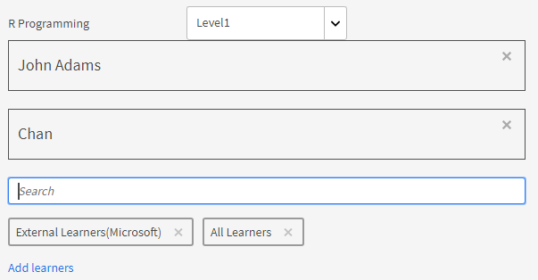
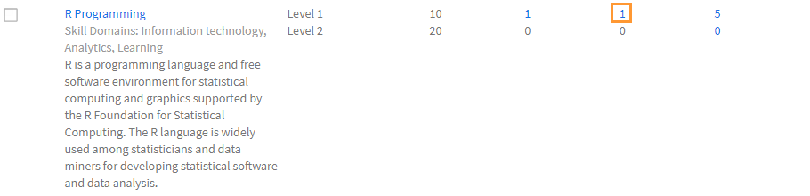
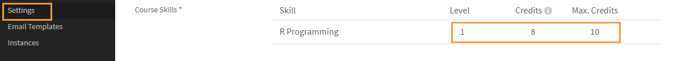

# Creazione e modifica di abilità e livelli

Crea, assegna e modifica abilità e livelli.

La mappa delle abilità racchiude i set di abilità, le conoscenze e le caratteristiche di un dipendente in un’organizzazione. Queste mappe delle abilità aiutano le aziende/organizzazioni a impostare o incrementare le prestazioni previste per i dipendenti. Le abilità consentono ai dipendenti di allineare i loro comportamenti alle aspettative dell’organizzazione.

Adobe Learning Manager ti consente di mappare le prestazioni degli Allievi in base alle loro abilità tramite la mappa delle abilità. Quando gli Allievi completano l’accettazione di alcuni corsi, possono verificare la propria reputazione rispetto a ciascuna abilità visualizzando le mappe di abilità.

Lo scopo fondamentale delle abilità in Learning Manager LMS è fornire all’Amministratore uno strumento che allinei l’apprendimento agli obiettivi aziendali.

## Aggiunta di un’abilità {#addaskill}

Come Amministratore, puoi eseguire le seguenti operazioni:

* Mappatura di un dominio a un’abilità.
* Aggiunta di più livelli di un’abilità.
* Aggiunta di un distintivo a un livello.

Per aggiungere un’abilità, attieniti ai passaggi seguenti:

1. Nel riquadro a sinistra, fai clic su **[!UICONTROL Abilità]**. Assegna un nome e una descrizione all’abilità.

   

   *Aggiungi nome e descrizione di un’abilità*

1. Assegna un dominio all’abilità. Durante la creazione di un’abilità, puoi mapparla ai domini di abilità più rilevanti supportati da Learning Manager. Per ulteriori informazioni, consulta [***Mappare abilità con domini di abilità***](/help/migrated/administrators/feature-summary/curation-skills.md).

   Inizia a digitare il dominio nel campo e per visualizzare i suggerimenti. Scegli le opzioni rilevanti per l’abilità.

   

   *Aggiungi un dominio*

1. Assegna i livelli all’abilità. Per aggiungere un livello, fai clic su **[!UICONTROL Aggiungi]**.

   Puoi creare abilità e assegnarle ai dipendenti. Esistono vari livelli di abilità e ciascuno di essi richiede un certo numero di crediti da guadagnare.

   Puoi assegnare un massimo di tre livelli a un’abilità. Il percorso di apprendimento consiste nell’iscrivere gli Allievi a vari Oggetti di apprendimento, che si traducono in un certo numero di crediti che soddisfano i requisiti per i vari livelli di un’abilità.

   Una volta raggiunti questi Oggetti di apprendimento (LO) e livelli, l’Allievo è pronto per fornire prestazioni di produttività maggiori.

   

   *Aggiungere livelli di abilità*

   Quando aggiungi un’abilità, puoi anche assegnare decimali ai crediti. I crediti sono visualizzati fino alla seconda cifra decimale.

   Il supporto delle cifre decimali è disponibile solo in lingua inglese.

1. Scegli un distintivo per il livello. Dall’elenco a discesa **[!UICONTROL Distintivo]**, seleziona un’immagine da utilizzare come distintivo per il livello.
1. Per salvare le modifiche, fai clic su **[!UICONTROL Salva]**.

   Dopo aver creato un’abilità, puoi individuarla subito nella pagina **[!UICONTROL Abilità]**. Puoi anche vedere i domini e una breve descrizione dell’abilità. Puoi anche visualizzare i livelli e i crediti assegnati a ciascun livello.

   

   *Visualizza elenco di abilità oif*

## Assegnazione dell’abilità agli Allievi {#assigntheskilltolearners}

Gli Amministratori possono assegnare abilità agli Allievi.

Una volta create e salvate, le abilità vengono elencate nella pagina delle abilità. Ora puoi iniziare ad assegnare tali abilità agli Allievi come indicato di seguito:

1. Nella pagina **[!UICONTROL Abilità]**, fai clic sul collegamento ipertestuale con il numero di Allievi iscritti all’abilità. Per un’abilità appena creata, il numero di Allievi per tutti i livelli è zero.

   

   *Visualizzare gli Allievi assegnati a un’abilità*

   In questo esempio viene mostrato come aggiungere Allievi per il Livello 1. Fai clic sul collegamento ipertestuale accanto al Livello 1.

1. Nella finestra di dialogo Allievi, fai clic su **[!UICONTROL Aggiungi Allievi]**.

   

   *Aggiunta di Allievi*

1. Cerca e aggiungi gli Allievi. Puoi anche aggiungere gruppi di utenti.

   

   *Cerca e aggiungi Allievi*

1. Per salvare le modifiche, fai clic su **[!UICONTROL Salva]**.

   Dopo aver assegnato gli Allievi, tutti gli Allievi di un gruppo di utenti, se presenti, vengono automaticamente iscritti all’abilità per impostazione predefinita. Puoi disabilitare l’opzione di iscrizione automatica per gli Allievi facendo clic sul pulsante **[!UICONTROL Iscrizione automatica]**.

   

   *Disabilita registrazione automatica*

   I singoli Allievi possono iscriversi automaticamente o possono essere iscritti dall’Amministratore a un programma di apprendimento.

1. Dopo aver fatto clic su **[!UICONTROL Chiudi]**, puoi vedere il numero totale di Allievi assegnati all’abilità che hai creato.

   In questo esempio ci sono due Allievi singoli e tre Allievi in un gruppo di utenti.

   

   *Numero di Allievi assegnati a un’abilità*

## Assegnazione dell’abilità a un corso {#assignskilltocourse}

Una volta creata l’abilità, l’Autore può creare un corso e assegnare l’abilità al corso.

*Assegnare abilità a un corso*

Dopo che l’Autore pubblica il corso, nella pagina **[!UICONTROL Abilità]**, puoi vedere il conteggio dei corsi associati a un livello di abilità, che cresce quando assegni l’abilità a un nuovo corso.

*Numero di corsi associati a un livello di abilità*

## Assegnazione di una risorsa formativa all’abilità {#assignajobaidtotheskill}

Le risorse formative sono contenuti di formazione a cui un Allievo può accedere senza iscriversi a uno specifico oggetto di apprendimento come Corso o Programma di apprendimento.

L’Autore può associare un livello di abilità a una risorsa formativa durante la creazione della risorsa formativa. Se si crea una risorsa formativa senza abilità e la si associa a un corso con un’abilità, l’abilità non verrà collegata alla risorsa formativa.

*Crea una risorsa formativa*

Nella pagina **[!UICONTROL Abilità]**, puoi vedere il numero di risorse formative associate al livello di abilità.

*Numero di risorse formative di un’abilità*

## Ricerca abilità {#searchskill}

Cerca un’abilità digitandone il nome e scegliendola dalle opzioni presenti. Anche la ricerca con completamento automatico è applicabile.

È possibile cercare le abilità nelle sezioni **[!UICONTROL Attive]** e **[!UICONTROL Ritirate]** della pagina Abilità.

## Modifica di un’abilità {#editaskill}

Nella pagina **[!UICONTROL Abilità]**, fai clic sull’abilità che desideri modificare. Nella **[!UICONTROL Modifica abilità]** , effettua le modifiche necessarie, ad esempio

* Aggiunta o eliminazione di un dominio di abilità.
* Modifica del nome e della descrizione dell’abilità.
* Aggiunta di un livello di abilità o modifica di un livello esistente.
* Aggiunta o eliminazione di un distintivo per un’abilità.

Dopo aver applicato le modifiche, fai clic su **[!UICONTROL Salva]**.

## Ritiro di un’abilità {#retireaskill}

Per ritirare un’abilità, seleziona l’abilità desiderata nella pagina **[!UICONTROL Abilità]**.

Dal menu **[!UICONTROL Azioni]** nell’angolo superiore destro della pagina, fai clic su **[!UICONTROL Ritira]**.

Quando ritiri un’abilità, essa non appare più nel corso.

Quando un’abilità viene ritirata, non potrà essere associata ad altri corsi o risorse formative o assegnata agli Allievi fino a quando non verrà ripubblicata. Le associazioni e le assegnazioni esistenti non sono influenzate dal ritiro dell’abilità.

## Ripubblicazione di un’abilità {#republishaskill}

Dopo aver ritirato un’abilità, essa appare nella scheda **[!UICONTROL Ritirate]**. La scheda mostra l’elenco di tutte le abilità ritirate.

Per ripubblicare un’abilità ritirata, scegli l’abilità e fai clic su **[!UICONTROL Pubblica di nuovo]** nel menu **[!UICONTROL Azioni]**.

Questo ripristina l’abilità potrai vederla nuovamente nella scheda **[!UICONTROL Attive]**.

## Eliminazione di un’abilità {#deleteaskill}

Puoi eliminare solo un’abilità che è stata precedentemente ritirata.

Nella scheda **[!UICONTROL Ritirate]**, seleziona l’abilità che desideri eliminare e fai clic su **[!UICONTROL Elimina]** nel menu **[!UICONTROL Azioni]**.

Un’abilità può essere eliminata solo se non è associata ad Allievi, corsi o risorse formative.

## Assegnazione di abilità agli Istruttori

Aggiungi un file CSV composto dalle abilità degli Istruttori. Tali abilità vengono quindi aggiunte al relativo elenco.

1. Nell’angolo in alto a destra dello schermo, seleziona **[!UICONTROL Aggiungi]** > **[!UICONTROL Assegnare abilità all’Istruttore]**.
1. Carica un file CSV. Le colonne del file CSV sono:

   * Nome abilità
   * Livello di abilità
   * E-mail istruttore o UUID istruttore

   Per gli account abilitati per UUID, sostituisci la colonna E-mail istruttore con UUID istruttore.

   Fai clic su Salva.

   

   *Aggiungere abilità di istruttore da un file CSV*

1. Verrà visualizzato un messaggio a comparsa di conferma.

   Nota: se il file CSV contiene campi non corretti, viene visualizzato il seguente messaggio di errore.

   

   *Messaggio di errore per campi errati*

### Pagina delle abilità

Nella pagina Abilità è presente una colonna denominata Istruttori che indica il numero di Istruttori assegnati a un’abilità. Se fai clic sul numero di istruttori, viene visualizzata una finestra a comparsa in cui sono mostrati gli istruttori assegnati all’abilità.

*Pagina delle abilità*

### Scarica il file CSV di assegnazione delle abilità

1. Nella pagina Abilità, fai clic su **[!UICONTROL Aggiungi]** > **[!UICONTROL Assegnare abilità all’Istruttore]**.
1. Nella finestra di dialogo fare clic su **[!UICONTROL Assegnazione aggiunta in precedenza]**.
1. Il file CSV caricato per ultimo verrà scaricato.

>[!NOTE]
>
>Ti consigliamo di scaricare prima il file CSV dell’assegnazione delle abilità, modificarlo e quindi caricare il file.

## Domande frequenti {#frequentlyaskedquestions}

+++Come posso rimuovere un Allievo da un’abilità?

Non è possibile rimuovere un Allievo da un’abilità. Puoi tuttavia aggiungere nuovi Allievi o gruppi di utenti all’abilità.
+++

+++Come iscrivere automaticamente gli Allievi a un’abilità?

La funzione di iscrizione automatica è disponibile solo per i gruppi di utenti. Quando iscrivi un gruppo di utenti, ad esempio Tutti gli Autori, a un’abilità e salvi il gruppo, l’iscrizione automatica è attivata per impostazione predefinita. L’abilità viene assegnata a ogni nuova aggiunta al gruppo di utenti Tutti gli Autori.

Se interrompi l’iscrizione automatica per quel livello di abilità per Tutti gli Autori, a tutti i nuovi utenti che vengono aggiunti al gruppo di utenti Tutti gli Autori non viene assegnata l’abilità.
+++

+++Come riavviare l’iscrizione automatica?

Iscrivi lo stesso gruppo di utenti al livello di abilità per il quale è stata interrotta l’iscrizione automatica.

In questo modo viene riavviata l’iscrizione automatica e l’abilità viene assegnata agli Allievi aggiunti al gruppo quando questa funzione era disattivata.

In altre parole, ogni volta che iscrivi nuovamente un gruppo di utenti per avviare l’iscrizione automatica, i membri del gruppo di utenti vengono aggiornati e l’abilità viene assegnata a tutti i membri correnti.
+++

+++Come posso assegnare un’abilità a un corso?

Consulta la sezione [Assegnazione di abilità a un corso ](skills-levels.md#assignskilltocourse) per ulteriori informazioni sulla procedura.
+++

+++Come si modifica un livello di abilità?

Per modificare uno o più livelli in un’abilità, modifica l’abilità e le proprietà dei livelli esistenti.
+++

+++Come posso abilitare i distintivi e le abilità in modo che siano associati al completamento del corso?

L’Autore può legare le abilità al completamento di un corso durante la creazione del corso. Nella sezione Impostazioni, puoi impostare i criteri dell’abilità sul completamento del corso.

Per impostare i distintivi sul completamento del corso, abilita il distintivo desiderato nella sezione **[!UICONTROL Istanze]** dell’app Autore.
+++

+++Un amministratore può contrassegnare un badge come completo anche se il badge mostra &quot;In corso&quot;?

L’Amministratore può contrassegnare un Oggetto di apprendimento come completo. Le abilità e i distintivi sono associati all’Oggetto di apprendimento e non possono essere contrassegnati separatamente come **[!UICONTROL completi]**.

In altre parole, per ottenere il distintivo **è necessario completare l’Oggetto di apprendimento associato**.
+++

### Altri contenuti simili

* [Competenze e Adobe Learning Manager](https://elearning.adobe.com/it/2018/11/skills-captivate-prime/)
