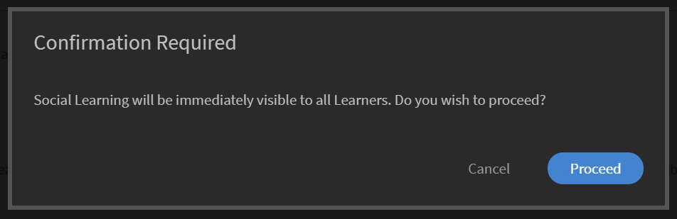
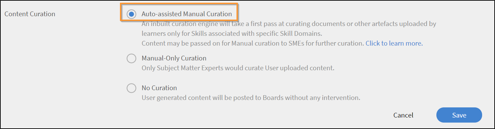
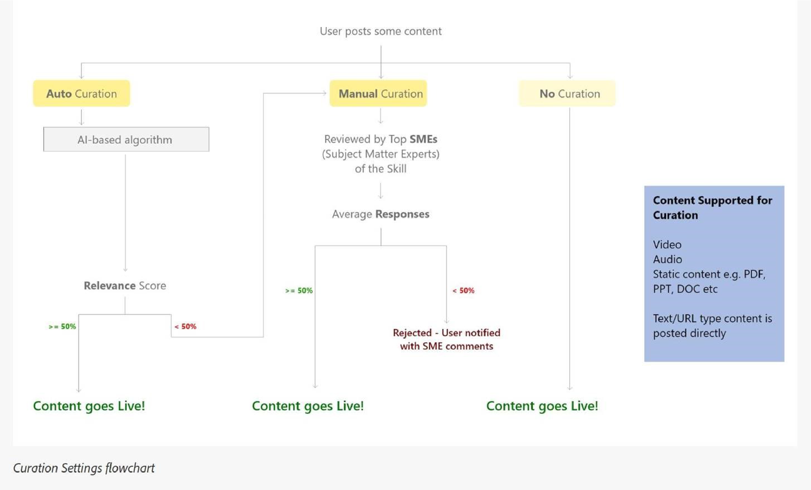
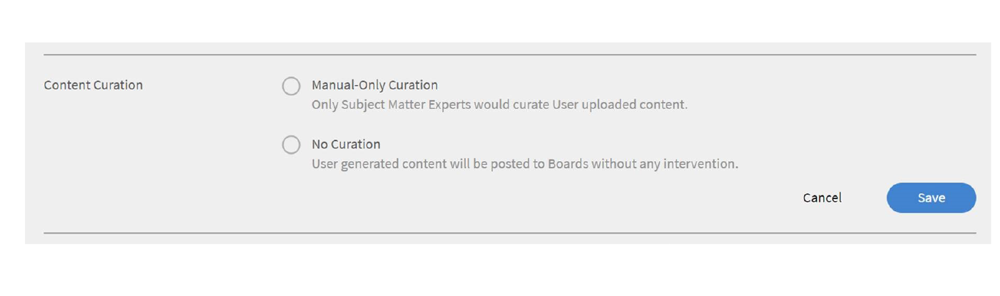
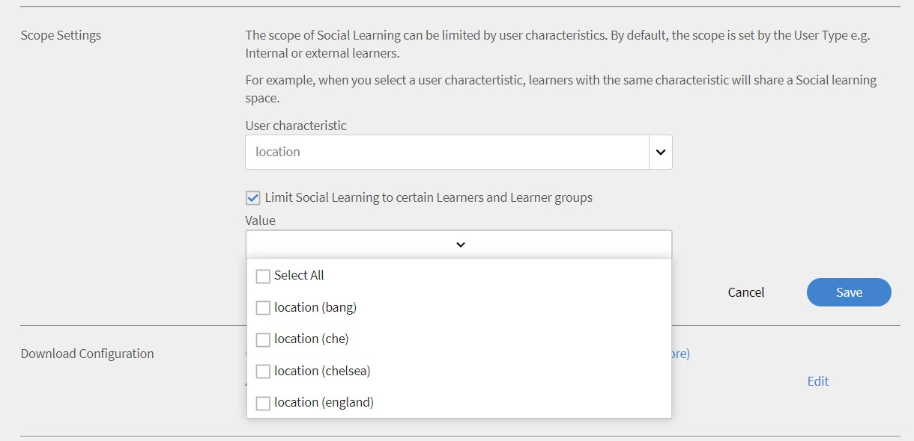

# Monitoraggio e moderazione dell’Apprendimento sociale come Amministratore

Come Amministratore, puoi abilitare, disabilitare e monitorare le attività svolte in Apprendimento sociale. Una volta attivata la funzione di Apprendimento sociale, gli Allievi possono visualizzarla e possono iniziare a partecipare all’Apprendimento sociale.

## Attivazione e configurazione delle impostazioni di apprendimento sociale {#enableandconfiguresettingsinsociallearning}

Per abilitare e configurare la funzione di Apprendimento sociale, procedi come indicato di seguito:

1. Fai clic su **[!UICONTROL Apprendimento sociale]** nel pannello di navigazione a sinistra. Verrai reindirizzato alla pagina delle attività.
1. Abilita **[!UICONTROL Apprendimento sociale]** funzione che utilizza **[!UICONTROL Abilita]** nella pagina Attività se la si attiva per la prima volta. In caso contrario, può essere attivata dal **[!UICONTROL Impostazioni]** pagina.

   Viene visualizzata una finestra di dialogo a comparsa, simile a quella riportata nella schermata sottostante.

    

   *Abilitare l’apprendimento sociale*

<!--  -->

L’Amministratore può configurare le impostazioni per Apprendimento sociale. Le impostazioni includono tipi di Content Curations come **[!UICONTROL Cura solo manuale]** e **[!UICONTROL Nessuna cura]**. Le impostazioni dell’ambito possono essere impostate su un ambito diverso, ad esempio tipo di utente (interno/esterno) o qualsiasi altro campo attivo presente nell’account. L’Amministratore può impostare il percorso URL da cui gli Allievi possono scaricare l’applicazione desktop Adobe Learning Manager.

## Cura dei contenuti {#contentcuration}

Poiché Apprendimento sociale è un apprendimento informale, il suo funzionamento è analogo a quello di altre piattaforme di social media. Spesso i social media sono fonte di distrazione perché spesso consumano contenuti irrilevanti che influiscono sulla loro produttività. Per venire incontro a ciò, occorre moderare e curare i contenuti.

**[!UICONTROL Cura solo manuale]** e **[!UICONTROL Nessuna cura]** sono due opzioni di cura che possono essere selezionate dall&#39;amministratore.

**[!UICONTROL Cura manuale auto-assistita]:** Learning Manager dispone di un motore di cura automatica basato sull’intelligenza artificiale in grado di individuare in modo intelligente l’essenza del contenuto di qualsiasi formato che potrà essere successivamente servito agli Allievi desiderati. Può inoltre approvare o rifiutare la pubblicazione di un contenuto in base al punteggio di attendibilità fornito.

Ad esempio, Adarsh è un Allievo e ha trovato un blog interessante, quindi lo pubblica sulla piattaforma di Apprendimento sociale di Adobe Learning Manager. Il post viene quindi inviato al Content Curation Engine basato sull&#39;intelligenza artificiale, che prevede le abilità presenti nel contenuto e le confronta con le abilità associate alla bacheca. Se una delle abilità corrisponde, il contenuto viene pubblicato altrimenti viene inviato per la cura solo manuale.

Il punteggio minimo di attendibilità richiesto per la registrazione è del 50%.

**[!UICONTROL Cura solo manuale]:** Per verificare l’autenticità del contenuto prima che venga pubblicato, l’Amministratore può abilitare l’impostazione Cura solo manuale. Una volta abilitata l’impostazione Cura solo manuale, il contenuto viene sottoposto all’attenzione dei principali SME (massimo 3) per la cura. In base alla risposta media, il posto è approvato/rifiutato di conseguenza. Se la risposta è maggiore o uguale al 50%, il post viene pubblicato, in caso contrario viene respinto. Per maggiori informazioni sugli SME, [fai clic qui](social-learning-configurations-as-an-admin.md#SubjectMatterExpertsSMEs).

## Cura automatica di contenuti {#autocuration}

La moderazione manuale dei contenuti è spesso soggetta a errori e richiede tempo. Inoltre, il processo non è ridimensionabile e non è adatto a un volume elevato di attività sociali. Pertanto, la cura automatica dei contenuti diventa fondamentale quando si servono molti utenti socialmente attivi.

In Learning Manager è disponibile l’opzione per la cura automatica dei contenuti. La cura è guidata da un motore basato su intelligenza artificiale, che mappa le attività con le abilità predefinite, dopo che l’Amministratore ha mappato le abilità predefinite con un’abilità. Per ulteriori informazioni, consulta [Mappatura del dominio di abilità](curation-skills.md).

I seguenti tipi di contenuti sono abilitati per la cura automatica:

* PDF
* File audio e video
* Presentazioni: PPT o PPTX
* Documenti: .doc, .docx

L’Amministratore può abilitare l’opzione di cura automatica dei contenuti dall’app di amministrazione.

1. Nel riquadro sinistro dell’app di amministrazione, fai clic su **[!UICONTROL Apprendimento sociale]**.
1. Sulla pagina, fai clic sulla scheda **[!UICONTROL Impostazioni]**.
1. Abilita l’opzione **[!UICONTROL Cura manuale auto-assistita]**.

   

   *Seleziona l’opzione Cura manuale auto-assistita*

Quando un utente carica un contenuto su una bacheca, un algoritmo basato su intelligenza artificiale preleva il testo dal contenuto; il testo viene quindi trasferito sul motore di cura. Il motore di cura tenta di individuare le abilità presenti nel contenuto.

Le abilità previste dal contenuto caricato sono confrontate con quelle della bacheca in cui il contenuto è stato caricato.  Se una competenza corrisponde a un punteggio di confidenza superiore al 50% dell’abilità della bacheca, il contenuto viene pubblicato nella bacheca. Se il punteggio di confidenza è inferiore a 50%, il contenuto viene inviato per la cura manuale.

Quando un contenuto viene sottoposto a cura automatica, all’utente viene notificato che il contenuto è disponibile sulla bacheca su cui era stato precedentemente caricato.

*Impostazioni del diagramma di flusso*

È opportuno che l’Amministratore aggiunga SME per le abilità se la Cura solo manuale è attiva. L’Amministratore può aggiungere SME assegnando in anticipo punti SME agli utenti con competenze specifiche. Per ulteriori informazioni su come fornire punti alle PMI,  [fai clic qui](social-learning-configurations-as-an-admin.md#SubjectMatterExpertsSMEs).

**Nessuna cura:** Tutti i post dell’Allievo vengono pubblicati automaticamente senza alcuna moderazione dei contenuti.

<!---->

## Domande frequenti sulla cura automatica dei contenuti {#faq-auto-curation}

+++Quanto tempo ha uno SME per curare un post?

Uno SME ha un minimo di 24 ore per curare un post, A causa delle differenze di fuso orario, può essere aumentato a 47 ore.

+++

+++Si passa al gruppo successivo di tre PMI se tutte e tre sono disponibili? Sono sempre tre gli SME che vengono invitati?

La richiesta di cura viene inviata ai primi tre SME il primo giorno. Se non rispondono, la richiesta passa ai tre SME successivi il giorno dopo.

Se i tre nuovi SME non rispondono, la richiesta viene trasferita ai moderatori della bacheca.

Se i moderatori della bacheca non rispondono, la richiesta viene approvata automaticamente.

+++

+++Se due SME si occupano della cura e uno no - la richiesta viene inoltrata al quarto SME o la richiesta prende la media delle valutazioni attribuite dal primo giro di SME al post?

Per approvare il post è necessario un punteggio del 50%. Allo stesso modo, un tasso di rifiuto del 50% viene usato per respingere il post. Ad ogni approvazione di uno SME, si valuta se ha raggiunto il 50%.

Se non raggiunge il 50% dopo un giorno, viene inviato al successivo gruppo di SME alla scadenza delle precedenti richieste di cura senza risposta.

Ad esempio, il primo giorno la richiesta cura viene inviata a tre SME e uno di loro la approva, mentre due non rispondono. Il giorno successivo, la richiesta di cura passa al successivo gruppo di tre SME; a questo livello, attualmente, vi sono quattro SME attivi in totale. Almeno due SME devono approvare la richiesta per poter ottenere l’approvazione per l’attività di cura(nel caso in cui 2 approvino e 2 respingano, verrà preso qualsiasi valore che per primo raggiunga il 50%).

+++

+++Da ciò che risulta, un &quot;Moderatore&quot; viene assegnato solo (e non è obbligatorio) quando qualcuno crea una nuova bacheca - In quali casi un Allievo può assegnare un &quot;Moderatore&quot; a una bacheca se gli SME verranno assegnati all’abilità a cui è associata una bacheca?

Di seguito sono riportate le responsabilità di un moderatore di una Bacheca social:

* Possibilità di modificare il nome della scheda, la descrizione, le impostazioni di visibilità della scheda e altre configurazioni.
* Possibilità di eliminare un post sulla scheda nel caso in cui il post non sia adatto al pubblico.
* Il moderatore riceve le notifiche &quot;Segnala abuso&quot; per la bacheca.
* Il moderatore riceve richieste di cura se non è presente alcuno SME per la bacheca.

+++

+++Il nostro team di formazione aggiungerà / monitorerà le abilità associate al livello di abilità, nonché gli SME assegnati alle abilità.

Come stabilito, gli SME vengono aggiunti/assegnati in base alle abilità, Questo è come progettato.

+++

+++Qual è la differenza tra un &quot;moderatore&quot; dell’apprendimento sociale e uno &quot;SME&quot; dell’apprendimento sociale?

**Moderatori:** proprietari secondari della bacheca. Vengono aggiunti dai creatori durante la creazione della bacheca in modo che possano controllare la bacheca in assenza del creatore. Per impostazione predefinita, il creatore della bacheca è il moderatore.

**PMI:** Gli esperti in materia sono esperti in competenze specifiche. L’amministratore può assegnare alle PMI una particolare abilità per curarne il contenuto. Gli SME ricevono le richieste di cura per le bacheche correlate alle loro abilità. Gli studenti possono anche diventare SME acquisendo punti SME.

+++

+++Se due o tre SME sono assegnati a un’abilità - L’approvazione o il rifiuto di un post sull’Apprendimento sociale dipende dalla cura di tutti gli SME o da chi lo cura per primo?

Per approvare il post è necessario un punteggio del 50%. Allo stesso modo, un tasso di rifiuto del 50% viene usato per respingere il post. Ad ogni approvazione di uno SME, si valuta se ha raggiunto il 50%.

Se non raggiunge il 50% dopo un giorno, viene inviato al successivo gruppo di SME alla scadenza delle precedenti richieste di cura senza risposta.

+++

## Impostazioni ambito {#scopesettings}

In Apprendimento sociale, un Ambito determina le bacheche visualizzate, controllando la visibilità del contenuto. Se un utente ha un ambito, ad esempio: ***Vendor_A***, può vedere solo bacheche e post associati creati da altri utenti appartenenti allo stesso ambito ***Vendor_A***.

Questo consente agli Amministratori di mantenere separata una coorte di utenti, ad esempio, fornitori, partner o reparti di un’organizzazione.

Abilita l’apprendimento sociale e la personalizzazione per utenti interni ed esterni.

Sono disponibili sezioni separate per abilitare gli utenti interni ed esterni.

**Abilita per Allievi interni**

In questa sezione, puoi scegliere la caratteristica utente per definire l’ambito di apprendimento sociale per gli utenti interni. Utenti con le stesse caratteristiche **valore** condividi lo stesso spazio di apprendimento sociale.

Dal menu **Caratteristica utente** dall&#39;elenco a discesa, scegli l&#39;opzione richiesta.

*Selezionare le caratteristiche utente per definire l&#39;ambito*

Per impostazione predefinita, l’opzione **[!UICONTROL Tutti gli utenti interni]** nell’elenco a discesa Caratteristica utente l’opzione è sempre selezionata.

Puoi definire l’ambito degli utenti interni in base ai relativi campi attivi.

**Abilita per Allievi esterni**

Per definire l’ambito dell’apprendimento per gli utenti esterni, utilizza un profilo esterno. Gli Allievi con lo stesso profilo esterno condividono uno spazio di apprendimento sociale comune.

*Abilita l’ambito per gli Allievi esterni*

Gli utenti esterni hanno un ambito basato sui profili esterni.

Ad esempio, dall’elenco riportato sopra, se attivi **[!UICONTROL Acme Corp]**, tutti gli Allievi che appartengono ad Acme Corp possono vedere le bacheche che hanno creato. Se disattivi l’opzione **Henry Cavill**, gli Allievi non vedono alcuna bacheca creata da Henry Cavill.

L’Amministratore può limitare la visibilità del contenuto in base al campo attivo visualizzato nel campo **[!UICONTROL Caratteristica utente]**.

Ad esempio, l’Amministratore può impostare l’ambito su **[!UICONTROL Tipo di utente (interno/esterno)]**. Quando si imposta l’ambito su Tipo di utente, il contenuto condiviso sulla piattaforma di Apprendimento sociale da qualsiasi Allievo interno è visibile solo agli altri Allievi interni dell’organizzazione e non agli utenti esterni, e viceversa.

Una volta selezionata una Caratteristica utente, l’Amministratore può limitare la funzione di Apprendimento sociale ad Allievi e gruppi di Allievi selezionando la casella di controllo sotto il campo Caratteristica utente. Fai clic sul campo valore per selezionare gli Allievi o i gruppi di Allievi per i quali desideri abilitare la funzione di Apprendimento sociale.

Per impostazione predefinita, l&#39;ambito viene impostato dal **[!UICONTROL Tipo utente]** ovvero Allievi interni o esterni.

Se il campo attivo non contiene nessun valore, l’elenco a discesa del campo **[!UICONTROL Valore]** non sarà visibile all’Amministratore.

<!-- -->

Gli utenti possono anche pubblicare i propri contenuti utilizzando l’applicazione desktop Adobe Learning Manager. A seconda che il sistema in uso sia Mac o Windows, fai clic sui collegamenti forniti per scaricare l’applicazione desktop e segui i passaggi descritti per installarla sul tuo sistema. In caso di problemi durante l’installazione, [fai clic qui](../../kb/troubleshooting-issues-with-adobe-learning-manager-desktop-app.md).

## Autorizzazioni per la creazione di bacheche {#permission}

Per limitare la creazione di bacheche da parte di tutti gli Allievi e moderare efficacemente le bacheche, un Amministratore può concedere autorizzazioni per creare bacheche a un gruppo di utenti selezionati.

*Impostare le autorizzazioni per creare una bacheca*

Per impostazione predefinita, l’opzione **[!UICONTROL Tutti gli Allievi]** è attivata.

**[!UICONTROL Tutti gli Allievi]:** Se scegli questa opzione, tutti gli utenti interni ed esterni possono creare bacheche.

**Un gruppo di Allievi:** Se scegli questa opzione, solo gli utenti che dispongono delle autorizzazioni per creare una bacheca vedono il collegamento **[!UICONTROL Crea nuova bacheca]** in Apprendimento sociale. Scegli il gruppo di utenti a cui deve essere concessa l’autorizzazione per creare una bacheca. Puoi anche aggiungere gruppi di utenti generati automaticamente e personalizzati.

<!---->

Gli utenti che condividono lo stesso ambito possono visualizzare solo la bacheca. Per gli utenti che non dispongono dell’autorizzazione, il collegamento **[!UICONTROL Crea nuova bacheca]** rimane invisibile.

Le modifiche verranno applicate tra 60 minuti.

## Utenti speciali {#privilege}

Un Amministratore può concedere privilegi speciali a un gruppo di utenti, selezionando i membri del gruppo che possono partecipare a tutte le bacheche. Qualsiasi restrizione imposta nella sezione Impostazioni ambito viene ignorata per il gruppo di utenti speciali.

Il gruppo di utenti può essere generato automaticamente o personalizzato.

Un utente a cui è stato concesso questo privilegio ha accesso a tutte le bacheche, tranne le **bacheche private**.

*Concedere privilegi speciali*

Per impostazione predefinita, quando l’Amministratore seleziona un gruppo di utenti, tutti gli utenti del gruppo possono accedere a tutte le bacheche, indipendentemente dall’ambito dell’utente. Qualsiasi utente con questi privilegi elevati può visualizzare e partecipare a tutte le bacheche interne ed esterne.

Gli utenti speciali ricevono richieste di cura in tutti gli ambiti se gli utenti dispongono di sufficienti punti SME per l’abilità.

Se l’utente non dispone dei punti SME richiesti, i privilegi di cura vengono trasferiti ai primi tre SME dell’abilità.

Nel nuovo ambito, l’utente ottiene punti per le attività su tutte le bacheche.

Nelle sezioni della classifica social, un utente può vedere tutti gli utenti del proprio ambito insieme agli utenti speciali.

Se ti sono stati concessi privilegi di utente speciale, potrai vedere tutti gli utenti dell’account nella tua classifica, indipendentemente dagli ambiti degli utenti.

Se gli utenti speciali diventano PMI guadagnando punti sufficienti, essi appaiono nel **[!UICONTROL Principali esperti in materia]** nella bacheca dei leader sociali.

Le modifiche verranno applicate tra 60 minuti.

## Personalizzazione dei banner social {#customize-social-banner}

L’Amministratore può personalizzare il titolo e il sottotitolo visualizzati nell’immagine dell’intestazione della pagina principale di Apprendimento sociale. Qualunque cosa l’Amministratore decida di immettere come titolo e sottotitolo, ci saranno le stesse funzioni della pagina principale di Apprendimento sociale dell’Allievo.

1. Nell’app di amministrazione, fai clic su **[!UICONTROL Apprendimento sociale]** > **[!UICONTROL Impostazioni]**.
1. Fai clic **[!UICONTROL Personalizza]**.
1. Cambia l’immagine banner. Le dimensioni dell’immagine devono essere almeno **1600 px X 240 px**.
1. Attivare/disattivare l&#39;opzione per nascondere o visualizzare **[!UICONTROL Ulteriori informazioni]** sul banner.
1. Immetti il titolo e il sottotitolo nei seguenti campi:

   

   *Personalizzare il banner social*

Sono disponibili altre opzioni:

* **[!UICONTROL Lingua]:** Dall’elenco a discesa, scegli la lingua in cui tradurre il titolo e il sottotitolo. Puoi anche aggiungere testi personalizzati in base alla lingua.
* **[!UICONTROL Replica]:** Fare clic su questo pulsante per replicare il titolo e il sottotitolo in tutte le lingue.
* **[!UICONTROL Reimposta]:** Fare clic su questo pulsante per ripristinare il titolo e il sottotitolo originali.

Nella pagina principale dell’Apprendimento sociale, le informazioni fornite dall’Amministratore vengono visualizzate come intestazione di pagina.

<!---->

## Trend {#trends}

Le tendenze dell’attività sociale dell’Allievo possono essere visualizzate e monitorate nella scheda Attività nella sezione Tendenze. È possibile consultare i dati relativi a diversi periodi di tempo, ad esempio gli ultimi sette giorni, il mese scorso, gli ultimi tre mesi e l’intero periodo.

Gli ultimi sette giorni è il valore predefinito impostato nel filtro data.

>[!NOTE]
>
>Gli ultimi sette giorni è il valore predefinito impostato nel filtro data.

Il primo elemento visivo fornisce all’Amministratore le seguenti informazioni per il periodo di tempo selezionato nel filtro data:

1. **[!UICONTROL Nuovi post]**: visualizza il numero di nuovi post creati nel periodo specificato. Viene visualizzato anche il numero totale di post per l’intero periodo.
1. **[!UICONTROL Percentuale di utenti attivi]**: visualizza la percentuale totale di utenti attivi nell’apprendimento sociale rispetto al numero totale di utenti disponibili nell’account.
1. **[!UICONTROL Nuove schede]**: visualizza il numero di nuove bacheche create. Viene visualizzato anche il numero totale di bacheche per l’intero periodo.

Il secondo elemento visivo è un grafico a linee che mostra il trend relativo al numero di bacheche o post creati in relazione al periodo di tempo selezionato nel filtro data. Fai clic sul filtro per visualizzare le diverse opzioni temporali: gli ultimi sette giorni, il mese scorso, gli ultimi tre mesi e l’intero periodo.

*Grafico a linee che mostra la tendenza*

## Abilità {#skills}

In questa sezione puoi visualizzare tutte le abilità utilizzate nella piattaforma delle attività social. L’Amministratore può utilizzare il campo di ricerca per cercare un’abilità non ancora utilizzata durante la creazione di una bacheca e la mappatura di SME alla stessa. In questo modo, gli SME ricevono una notifica quando viene creata una bacheca utilizzando questa abilità e possono esaminare il post come parte del flusso di lavoro di cura manuale.

Non vengono visualizzate abilità per un account con funzione di Apprendimento sociale disabilitata. La barra di ricerca è disponibile anche per tali account, per consentire all’Amministratore di cercare un’abilità e aggiungere SME alla stessa.

L’Amministratore può visualizzare punteggio attività, numero di post, schede, utenti e nome degli SME per ciascuna abilità utilizzata durante la creazione di una bacheca o di un post.

<!---->

<table>
 <tbody>
  <tr>
   <td>
    
<b>N. N.</b>
</td>
   <td>
    
<b>Nome Colonna</b>
</td>
   <td>
    
<b>Spiegazione</b>
</td>
  </tr>
  <tr>
   <td>
    
1
</td>
   <td>
    
Nome abilità
</td>
   <td>
    
Visualizza i nomi delle abilità utilizzate in Apprendimento sociale.
</td>
  </tr>
  <tr>
   <td>
    
2
</td>
   <td>
    
Punteggio attività
</td>
   <td>
    
Mostra la somma dei punti attività di tutte le bacheche che appartengono all’abilità.
</td>
  </tr>
  <tr>
   <td>
    
3
</td>
   <td>
    
Post
</td>
   <td>
    
Mostra il numero totale di post creati usando una specifica abilità.
</td>
  </tr>
  <tr>
   <td>
    
4
</td>
   <td>
    
Bacheche
</td>
   <td>
    
Mostra il numero totale di bacheche create usando una specifica abilità.
</td>
  </tr>
  <tr>
   <td>
    
5
</td>
   <td>
    
Utenti
</td>
   <td>
    
Mostra il numero totale di Allievi che hanno utilizzato tale abilità.
</td>
  </tr>
  <tr>
   <td>
    
6
</td>
   <td>
    
SME
</td>
   <td>
    
Mostra i 3 migliori SME attualmente disponibili per quell’abilità. L’Amministratore può aggiungere o modificare gli SME facendo clic sul collegamento.
</td>
  </tr>
 </tbody>
</table>

## Dominio di abilità {#skilldomain}

In base alle abilità utilizzate principalmente dagli utenti finali di Learning Manager, l’Adobe Learning Manager ha categorizzato un elenco di 25 domini di abilità utilizzati dal sistema di cura automatica per curare i contenuti. L’amministratore deve mappare le abilità aziendali configurate ai domini di abilità forniti da Prime. La mappatura delle abilità può essere effettuata dalla pagina delle abilità dell’amministratore durante la creazione di un’abilità o modificando un’abilità esistente. Per ulteriori informazioni su come mappare o aggiungere un’abilità, [fai clic qui](skills-levels.md#Createaskillandalevel).

+++Elenco di domini di abilità utilizzati dal sistema di cura di Learning Manager

1. Contabilità
1. Analisi
1. Etica aziendale
1. Diritto aziendale
1. Processi aziendali
1. Sicurezza del computer
1. Gestione delle relazioni con i clienti
1. Design
1. Finanza
1. Gestione delle risorse umane
1. Tecnologia dell’informazione
1. Apprendimento
1. Management
1. Marketing
1. Medicina
1. Produzione
1. Gestione della qualità
1. Vendite
1. Ricerca scientifica e progettazione
1. Social media
1. Abilità soft
1. Gestione strategica
1. Gestione della catena di distribuzione
1. Comunicazione tecnica
1. Sicurezza sul lavoro

+++

## Esperti in materia (SME) {#subjectmatterexpertssmes}

**Esperti in materia** sono persone che hanno una notevole conoscenza ed esperienza in una competenza. Un **PMI** svolge un ruolo importante nell’apprendimento sociale quando l’amministratore ha impostato le impostazioni di cura come manuali o quando il metodo di cura automatica non riesce a curare il contenuto. Nella colonna SME vengono visualizzati solo i tre SME principali.

## Requisiti per diventare SME {#requirementstobeansme}

Per diventare SME è necessario ottenere punti SME attraverso attività di Apprendimento sociale. L’Amministratore può assegnare punti a una PMI in base alla sua esperienza nel livello di abilità.

## Aggiunta di SME a un’abilità {#addingsmestoaskill}

Per aggiungere SME a un’abilità, segui la procedura descritta di seguito:

1. Fai clic **[!UICONTROL Aggiungi PMI]** oppure **[!UICONTROL Modifica PMI]**.

   

   *Aggiungi o modifica SME*

1. Fai clic **[!UICONTROL Opzioni avanzate]** dalla finestra a comparsa.

   

   *Visualizza finestra di dialogo Opzioni avanzate*

1. Cerca l’utente con esperienza nell’abilità. Una volta trovato l’utente, digita il numero di punti che vuoi assegnargli nel **Aggiungi punti** casella di immissione.

   Se l’utente ha già ottenuto altri punti, il numero di nuovi punti assegnati viene aggiunto al numero di punti corrente.

   Per impostazione predefinita, il numero di punti di ogni nuovo utente di apprendimento sociale è 0.

   

   *Aggiungere punti per un utente*

1. Selezionando la casella di controllo **[!UICONTROL Abilita numero minimo di punti SME]**, è possibile impostare un limite al numero minimo di punti richiesti affinché un utente venga visualizzato come SME nell’elenco dei principali SME. Una volta impostato il valore di soglia, gli SME con un numero di punti inferiore o uguale al numero di punti minimo richiesto non sono riportati negli elenchi di SME.

   Se il **[!UICONTROL Abilita punti SME minimi]** se la casella di controllo non è selezionata, i tre utenti con i punti più alti sono considerati gli SME per quella determinata abilità.

1. Fai clic **[!UICONTROL Salva]** per visualizzare le modifiche apportate.

## Sistema di punti SME {#smepointsystem}

**L’assegnazione di punti agli SME avviene secondo le seguenti modalità:**

* Vengono assegnati 2 punti a un utente ogni volta che un altro utente assegna un voto a favore a un post da lui creato.
* Vengono assegnati 2 punti a un utente ogni volta che un altro utente assegna un voto a favore a un suo commento.
* Vengono assegnati 5 punti a un Allievo ogni volta che risponde a una domanda.
* Vengono assegnati 2 punti in più all’Allievo ogni volta che la risposta da lui fornita riceve un voto a favore.

## Punti SME assegnati sulla base dell’attività di cura {#smestatuspointsbasedoncurationactivity}

**Agli SME vengono inoltre assegnati punti sulla base delle attività di cura, come indicato di seguito:**

* Quando un post viene inviato alla cura manuale perché la cura automatica non è in grado di stabilire se il contenuto è pertinente o meno, l’SME ottiene 5 punti all’invio della moderazione.

## Configurazioni di download {#downloadconfigurations}

<!---->

Per i server Enterprise, l’Amministratore può modificare la posizione da cui gli Allievi possono scaricare l’applicazione desktop per Windows e Mac.

*Modificare la posizione di download*

L’URL del server Enterprise deve essere ospitato pubblicamente.

## Attività social per il piano di fatturazione degli utenti attivi su base mensile {#socialactivitiesformonthlyactiveusersbillingplan}

Ogni volta che un utente crea una nuova bacheca social, post social o commento social, conterà come attività valida da contare contro il **Utente attivazione mensile**(MAU) se l’account segue il modello di fatturazione MAU. Per ulteriori informazioni, fai riferimento alla [gestione della fatturazione](billing-management.md).

## Domande frequenti {#frequentlyaskedquestions}

+++Come abilitare l’apprendimento sociale per gli Allievi esterni?

Ingresso **[!UICONTROL Apprendimento sociale]** > **[!UICONTROL Impostazioni]**, nella sezione Impostazioni ambito, abilita l’opzione **[!UICONTROL Abilita per Allievi esterni]**. Dall’elenco a discesa, scegli un profilo esterno e definisci l’ambito di apprendimento per tale profilo.

*Seleziona l’opzione Abilita per Allievi esterni*
+++
