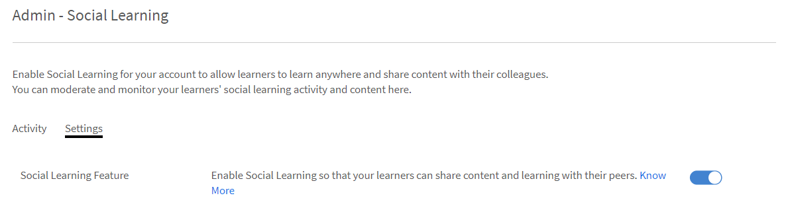

# Monitoraggio e moderazione dell’Apprendimento sociale come Amministratore

In qualità di Amministratore, puoi abilitare, disabilitare e monitorare le attività eseguite in Apprendimento sociale. Una volta abilitata la funzione Apprendimento sociale, gli Allievi possono visualizzarla e iniziare a partecipare all’Apprendimento sociale.

## Attivare e configurare le impostazioni in Apprendimento sociale {#enableandconfiguresettingsinsociallearning}

Per abilitare e configurare la funzione Apprendimento sociale, effettua le operazioni riportate di seguito:

1. Fai clic **[!UICONTROL Apprendimento sociale]** dal pannello di navigazione sinistro. Verrai reindirizzato alla pagina delle attività.
1. Abilita **[!UICONTROL Apprendimento sociale]** funzione che utilizza **[!UICONTROL Abilita]** nella pagina Attività se la si attiva per la prima volta. In caso contrario, può essere attivata dal **[!UICONTROL Impostazioni]** pagina.

   Viene visualizzata una finestra a comparsa simile alla schermata seguente.

    

   *Abilitare l’apprendimento sociale*

<!--  -->

L’Amministratore può configurare le impostazioni per Apprendimento sociale. Le impostazioni includono tipi di Content Curations come **[!UICONTROL Cura solo manuale]** e **[!UICONTROL Nessuna cura]**. Le impostazioni dell’ambito possono essere impostate su un ambito diverso, ad esempio tipo di utente (interno/esterno) o qualsiasi altro campo attivo presente nell’account. L’Amministratore può impostare il percorso URL da cui gli Allievi possono scaricare l’applicazione desktop Learning Manager di Adobe.

## Cura dei contenuti {#contentcuration}

Poiché l’Apprendimento sociale è un apprendimento informale, la sua funzionalità è simile ad altre piattaforme di social media. Spesso i social media sono fonte di distrazione perché spesso consumano contenuti irrilevanti che influiscono sulla loro produttività. Questo pensiero può essere arricchito dalla moderazione dei contenuti e dalla cura.

**[!UICONTROL Cura solo manuale]** e **[!UICONTROL Nessuna cura]** sono due opzioni di cura che possono essere selezionate dall&#39;amministratore.

**[!UICONTROL Cura manuale auto-assistita]:** Learning Manager dispone di un motore di cura automatica basato sull’intelligenza artificiale in grado di individuare in modo intelligente l’essenza del contenuto di qualsiasi formato che potrà essere successivamente servito agli Allievi desiderati. Può inoltre approvare o rifiutare la pubblicazione di un contenuto in base al punteggio di attendibilità fornito.

Ad esempio, Adarsh è un Allievo e ha trovato un blog interessante, quindi lo pubblica sulla piattaforma di Apprendimento sociale di Adobe Learning Manager. Il post viene quindi inviato al Content Curation Engine basato sull&#39;intelligenza artificiale, che prevede le abilità presenti nel contenuto e le confronta con le abilità associate alla bacheca. Se una delle abilità corrisponde, il contenuto viene pubblicato altrimenti viene inviato per la cura solo manuale.

Il punteggio minimo di attendibilità richiesto per la registrazione è del 50%.

**[!UICONTROL Cura solo manuale]:** Per verificare l’autenticità del contenuto prima che venga pubblicato, l’Amministratore può abilitare l’impostazione Cura solo manuale. Una volta attivata l’impostazione di cura solo manuale, viene visualizzata la pagina Primi SME (massimo 3) per la cura. In base alla risposta media, il posto è approvato/rifiutato di conseguenza. Se la risposta è maggiore di 50 per cento, il post va in diretta altrimenti rifiutato. Per ulteriori informazioni sulle PMI, [fai clic qui](social-learning-configurations-as-an-admin.md#SubjectMatterExpertsSMEs).

## Cura automatica dei contenuti {#autocuration}

La moderazione manuale dei contenuti è spesso soggetta a errori e richiede molto tempo. Inoltre, il processo non è scalabile ed è inadatto per un elevato volume di attività sociali. Pertanto, curare i contenuti diventa automaticamente critico quando si servono molti utenti che sono attivi socialmente.

In Learning Manager è disponibile un’opzione per la cura automatica dei contenuti. La cura è guidata da un motore abilitato all&#39;intelligenza artificiale, che mappa il funzionamento con le abilità predefinite, dopo che l&#39;amministratore mappa le abilità predefinite con un&#39;abilità. Per ulteriori informazioni, consulta [Mappatura del dominio delle abilità](curation-skills.md).

Nella cura automatica, sono consentiti i seguenti tipi di contenuto:

* PDF
* File audio e video
* Presentations- PPT o PPTX
* Documenti: .doc, .docx

Un Amministratore può abilitare l’opzione per curare automaticamente i contenuti dall’app Amministratore.

1. Nel riquadro a sinistra dell’app di amministrazione, fai clic su **[!UICONTROL Apprendimento sociale]**.
1. Nella pagina fare clic sulla scheda **[!UICONTROL Impostazioni]**.
1. Abilita l’opzione **[!UICONTROL Cura manuale auto-assistita]**.

   

   *Seleziona l’opzione Cura manuale auto-assistita*

Quando un utente carica un contenuto in una bacheca, un algoritmo basato sull&#39;intelligenza artificiale scrapes il testo dal contenuto e il testo viene quindi passato al motore di cura. Il motore di cura cerca di trovare le abilità presenti nel contenuto.

Le abilità previste dal contenuto caricato sono confrontate con quelle della bacheca in cui il contenuto è stato caricato.  Se una competenza corrisponde a un punteggio di confidenza superiore al 50% dell’abilità della bacheca, il contenuto viene pubblicato nella bacheca. Se il punteggio di confidenza è inferiore al 50%, il contenuto viene inviato per la cura manuale.

Ogni volta che un contenuto viene selezionato automaticamente, l&#39;utente riceve una notifica che il contenuto è disponibile nella bacheca in cui è stato caricato in precedenza.

*Impostazioni del diagramma di flusso*

Si consiglia che l’Amministratore aggiunga SME per le abilità se l’opzione Solo manuale è ATTIVA. L’Amministratore può aggiungere PMI fornendo in anticipo punti SME agli utenti con esperienza in un’abilità. Per ulteriori informazioni su come fornire punti alle PMI,  [fai clic qui](social-learning-configurations-as-an-admin.md#SubjectMatterExpertsSMEs).

**Nessuna cura:** Tutti i post dell’Allievo vengono pubblicati automaticamente senza alcuna moderazione dei contenuti.

<!---->

## Domande frequenti sulla cura automatica dei contenuti {#faq-auto-curation}

+++Quanto tempo ha uno SME per curare un post?

Uno SME ha un minimo di 24 ore per curare un post. A causa delle differenze di fuso orario, può essere aumentato a 47 ore.

+++

+++Si passa al gruppo successivo di tre PMI se tutte e tre sono disponibili? Sono sempre tre PMI ad essere coinvolte?

La richiesta di cura va in cima agli SME il primo giorno. Se non rispondono, la richiesta viene inoltrata ai tre SME successivi il giorno successivo.

Se i tre nuovi PMI non rispondono, la richiesta viene indirizzata ai moderatori del consiglio.

Se i moderatori della bacheca non rispondono, la richiesta viene approvata automaticamente.

+++

+++Se due SME si occupano della cura e uno no - la richiesta viene inoltrata al quarto SME o la richiesta prende la media delle valutazioni attribuite dal primo giro di SME al post?

Per approvare il post è richiesto un livello di approvazione del 50%. Allo stesso modo, per rifiutare il post viene utilizzato un punteggio di rifiuto del 50%. Ad ogni approvazione da parte di una PMI, si valuta se essa abbia raggiunto il 50%.

Se non raggiunge il 50% dopo un giorno, viene inviato al gruppo successivo di SME che scadono le precedenti richieste di cura senza risposta.

Ad esempio, il primo giorno, la richiesta di cura viene inviata a tre SME; e uno di loro la approva, due di loro non hanno risposto. Il giorno successivo, la richiesta di cura va al prossimo gruppo di tre SME; a questo livello ora, ci sono quattro SME attivi in totale. Almeno due SEM devono approvarlo per ottenere l&#39;approvazione della cura.(Nel caso in cui 2 approvi e 2 rifiuti, qualsiasi valore raggiunga il primo 50% verrà utilizzato).

+++

+++Da ciò che risulta, un &quot;Moderatore&quot; viene assegnato solo (e non è obbligatorio) quando qualcuno crea una nuova bacheca - In quali casi un Allievo può assegnare un &quot;Moderatore&quot; a una bacheca se gli SME verranno assegnati all’abilità a cui è associata una bacheca?

Di seguito sono riportate le responsabilità di un moderatore di Bacheca sociale:

* Possibilità di modificare il nome, la descrizione, le impostazioni di visibilità e altre configurazioni della bacheca.
* Possibilità di eliminare un post sulla bacheca nel caso in cui il post non sia adatto al pubblico.
* Il moderatore riceve le notifiche &quot;Segnala abuso&quot; per la bacheca.
* Il moderatore riceve richieste di cura se non è presente alcun SME per la bacheca.

+++

+++Il nostro team di formazione aggiungerà / monitorerà le abilità associate al livello di abilità, nonché gli SME assegnati alle abilità.

Le PMI vengono aggiunte/assegnate in base alle competenze, non al livello di abilità. Questo è come progettato.

+++

+++Qual è la differenza tra un &quot;moderatore&quot; dell’apprendimento sociale e uno &quot;SME&quot; dell’apprendimento sociale?

**Moderatori:** Proprietari secondari del consiglio. Vengono aggiunti dai creatori durante la creazione della bacheca in modo che possano controllare la bacheca in assenza del creatore. Per impostazione predefinita, il creatore della bacheca è il moderatore.

**PMI:** Gli esperti in materia sono esperti in competenze specifiche. L’Amministratore può assegnare alle PMI una particolare abilità per curarne il contenuto. Le PMI ricevono le richieste di cura per le commissioni legate alle loro competenze. Gli Allievi possono anche diventare PMI guadagnando punti.

+++

+++Se due o tre SME sono assegnati a un’abilità - L’approvazione o il rifiuto di un post sull’Apprendimento sociale dipende dalla cura di tutti gli SME o da chi lo cura per primo?

Per approvare il post è richiesto un livello di approvazione del 50%. Allo stesso modo, per rifiutare il post viene utilizzato un punteggio di rifiuto del 50%. Ad ogni approvazione da parte di una PMI, si valuta se essa abbia raggiunto il 50%.

Se non raggiunge il 50% dopo un giorno, viene inviato al gruppo successivo di SME che scadono le precedenti richieste di cura senza risposta.

+++

## Impostazioni ambito {#scopesettings}

In Apprendimento sociale, un Ambito determina le bacheche visualizzate, che controllano la visibilità del contenuto. Se un utente ha un ambito, ad esempio: ***Vendor_A***, può vedere solo bacheche e post associati creati da altri utenti appartenenti allo stesso ambito ***Vendor_A***.

Ciò consente agli amministratori di mantenere una coorte di utenti, ad esempio fornitori, partner o reparti in un&#39;organizzazione separata.

Abilita l’apprendimento sociale e la classifica per utenti interni ed esterni.

Sono disponibili sezioni separate per abilitare utenti interni ed esterni.

**Abilita per Allievi interni**

In questa sezione, puoi scegliere la caratteristica utente per definire l’ambito di apprendimento sociale per gli utenti interni. Utenti con le stesse caratteristiche **valore** condividi lo stesso spazio di apprendimento sociale.

Dal menu **Caratteristica utente** dall&#39;elenco a discesa, scegli l&#39;opzione richiesta.

*Selezionare le caratteristiche utente per definire l&#39;ambito*

Per impostazione predefinita, l’opzione **[!UICONTROL Tutti gli utenti interni]** nell’elenco a discesa Caratteristica utente l’opzione è sempre selezionata.

Puoi definire l&#39;ambito degli utenti interni in base ai loro campi attivi.

**Abilita per Allievi esterni**

Per definire l’ambito di apprendimento per gli utenti esterni, utilizza un profilo esterno. Gli Allievi con lo stesso profilo esterno condividono uno spazio comune di Apprendimento sociale.

*Abilita l’ambito per gli Allievi esterni*

Gli utenti esterni hanno un ambito basato sui loro profili esterni.

Ad esempio, dall’elenco riportato qui sopra, se **[!UICONTROL Acme Corp]**, tutti gli Allievi di Acme Corp possono vedere le bacheche che hanno creato. Se disattivi l’opzione **Henry Cavill** Tuttavia, gli allievi non possono vedere alcuna bacheca creata da Henry Cavill.

L’Amministratore può valutare la visibilità del contenuto in base al campo attivo visualizzato nel **[!UICONTROL Caratteristica utente]** campo.

Ad esempio, l’amministratore può impostare l’ambito su **[!UICONTROL Tipo utente (interno/esterno)]** utenti. Quando si imposta l’ambito su Tipo di utente, il contenuto condiviso sulla piattaforma di Apprendimento sociale da qualsiasi Allievo interno è visibile solo agli altri Allievi interni dell’organizzazione e non agli utenti esterni, e viceversa.

Dopo che una caratteristica utente è stata selezionata dall’Amministratore, può limitare la funzionalità di apprendimento sociale agli Allievi e ai gruppi di Allievi selezionando la casella di controllo sotto il campo delle caratteristiche utente. Fai clic sul campo dei valori per selezionare l’Allievo o i gruppi di Allievi per i quali desideri abilitare la funzione di apprendimento sociale.

Per impostazione predefinita, l&#39;ambito viene impostato dal **[!UICONTROL Tipo utente]** ovvero Allievi interni o esterni.

Se il campo attivo non contiene alcun valore, il **[!UICONTROL Valore]** l’elenco a discesa dei campi non sarà visibile all’amministratore.

<!-- -->

Gli utenti possono anche pubblicare i propri contenuti utilizzando l’applicazione desktop Adobe Learning Manager. A seconda che tu sia un utente Mac o Windows, fai clic sui collegamenti forniti per scaricare l&#39;applicazione desktop e segui i passaggi indicati per installarla nel tuo sistema. In caso di difficoltà nell&#39;installazione, [fai clic qui](../../kb/troubleshooting-issues-with-adobe-learning-manager-desktop-app.md).

## Autorizzazioni creazione bacheca {#permission}

Per limitare la creazione di bacheche da parte di tutti gli Allievi e moderarle in modo efficace, un Amministratore può concedere autorizzazioni per creare bacheche a un gruppo di utenti selezionati.

*Impostare le autorizzazioni per creare una bacheca*

Per impostazione predefinita, l’opzione **[!UICONTROL Tutti gli Allievi]** è attivato.

**[!UICONTROL Tutti gli Allievi]:** Se scegli questa opzione, tutti gli utenti interni ed esterni possono creare bacheche.

**Un gruppo di Allievi:** Se scegli questa opzione, solo gli utenti che dispongono delle autorizzazioni necessarie per creare una bacheca visualizzano **[!UICONTROL Crea nuova bacheca]** collegamento in Apprendimento sociale. Scegli il gruppo di utenti a cui deve essere concessa l’autorizzazione per creare una bacheca. Puoi anche aggiungere gruppi di utenti generati automaticamente e personalizzati.

<!---->

Gli utenti che condividono lo stesso ambito possono vedere solo la bacheca. Per gli utenti che non dispongono dell&#39;autorizzazione, è possibile **[!UICONTROL Crea nuova bacheca]** il link rimane invisibile.

Per rendere effettive le modifiche, attendere 60 minuti.

## Utenti speciali {#privilege}

Un Amministratore può concedere privilegi speciali a un gruppo di utenti, utilizzando i membri del gruppo che possono partecipare a tutte le bacheche. Eventuali limitazioni impostate nella sezione Impostazioni ambito vengono ignorate dal gruppo di utenti speciali.

Il gruppo di utenti può essere generato automaticamente o personalizzato.

Un utente a cui è stato concesso questo privilegio ha accesso a tutte le bacheche, tranne **schede private**.

*Concedere privilegi speciali*

Quando l’Amministratore seleziona un gruppo di utenti, per impostazione predefinita, tutti gli utenti del gruppo possono accedere a tutte le bacheche, indipendentemente dall’ambito dell’utente. Qualsiasi utente con questi privilegi elevati può visualizzare e partecipare a tutte le schede interne ed esterne.

Gli utenti speciali ricevono richieste di cura in tutti gli ambiti se dispongono di punti SME sufficienti per tale abilità.

Se l’utente non dispone dei punti SME richiesti, i privilegi di cura vengono trasferiti ai primi tre SME di quell’abilità.

Nel nuovo ambito, ottiene punti per attività trasversali.

Nelle sezioni della bacheca dei leader social, un utente può vedere tutti gli utenti del suo ambito insieme a utenti speciali.

Se hai ottenuto privilegi utente speciali, puoi visualizzare tutti gli utenti dell’account nella classifica, indipendentemente dagli ambiti degli utenti.

Se gli utenti speciali diventano PMI guadagnando punti sufficienti, essi appaiono nel **[!UICONTROL Principali esperti in materia]** nella bacheca dei leader sociali.

Per rendere effettive le modifiche, attendere 60 minuti.

## Personalizzare il banner social {#customize-social-banner}

L’Amministratore può personalizzare il titolo e il sottotitolo visualizzati nell’immagine dell’intestazione della pagina principale di Apprendimento sociale. Qualunque cosa l’Amministratore decida di immettere come titolo e sottotitolo, ci saranno le stesse funzioni della pagina principale di Apprendimento sociale dell’Allievo.

1. Nell’app di amministrazione, fai clic su **[!UICONTROL Apprendimento sociale]** > **[!UICONTROL Impostazioni]**.
1. Fai clic **[!UICONTROL Personalizza]**.
1. Cambia l’immagine del banner. Le dimensioni dell’immagine devono essere almeno **1600 px X 240 px**.
1. Attivare/disattivare l&#39;opzione per nascondere o visualizzare **[!UICONTROL Ulteriori informazioni]** sul banner.
1. Immetti il titolo e il sottotitolo nei seguenti campi:

   

   *Personalizzare il banner social*

Sono disponibili altre opzioni:

* **[!UICONTROL Lingua]:** Dall’elenco a discesa, scegli la lingua in cui tradurre il titolo e il sottotitolo. Puoi anche aggiungere testi personalizzati in base alla lingua.
* **[!UICONTROL Replica]:** Fare clic su questo pulsante per replicare il titolo e il sottotitolo in tutte le lingue.
* **[!UICONTROL Reimposta]:** Fare clic su questo pulsante per ripristinare il titolo e il sottotitolo originali.

Nella pagina principale di Apprendimento sociale, le informazioni fornite dall’Amministratore vengono visualizzate come intestazione di pagina.

<!---->

## Tendenze {#trends}

Le tendenze dell’attività sociale dell’Allievo possono essere visualizzate e monitorate nella scheda Attività nella sezione Tendenze. Questi dati possono essere visualizzati per periodi di tempo diversi, ad esempio gli ultimi sette giorni, il mese scorso, gli ultimi tre mesi e così via.

Ultimi sette giorni è il valore predefinito nel filtro data.

>[!NOTE]
>
>Ultimi sette giorni è il valore predefinito nel filtro data.

Il primo elemento visivo fornisce all’amministratore le seguenti informazioni per il periodo di tempo selezionato dal filtro data:

1. **[!UICONTROL Nuovi post]**: visualizza il numero di nuovi post creati nel periodo di data. Viene visualizzato anche il numero totale di post per l&#39;intero periodo.
1. **[!UICONTROL Percentuale di utenti attivi]**: visualizza la percentuale totale di utenti attivi in Apprendimento sociale rispetto al numero totale di utenti disponibili nell’account.
1. **[!UICONTROL Nuove schede]**: visualizza il numero di nuove bacheche create. Viene visualizzato anche il numero totale di bacheche per l’intero periodo.

Il secondo elemento visivo è un grafico a linee che mostra l’andamento del numero di bacheche o post creati in base al periodo di tempo selezionato dal filtro data. Fai clic sul filtro per visualizzare le diverse opzioni di ora, come ultimi sette giorni, ultimo mese, ultimi tre mesi e sempre.

*Grafico a linee che mostra la tendenza*

## Abilità {#skills}

In questa sezione puoi visualizzare tutte le abilità utilizzate nella piattaforma di attività social. L’amministratore può utilizzare il campo di ricerca per cercare un’abilità non ancora utilizzata durante la creazione di una bacheca e la mappatura degli SME. Eseguendo questa procedura, gli SME riceveranno una notifica quando una bacheca viene creata utilizzando questa abilità e potranno rivedere il post come parte del flusso di lavoro di cura manuale.

Per un account con Apprendimento sociale disattivato, non vengono visualizzate abilità. La barra di ricerca è disponibile anche per tali account, in modo che l’amministratore abbia la funzionalità di cercare un’abilità e aggiungervi SME.

L’Amministratore può visualizzare il Punteggio attività, il numero di post, bacheche, utenti e nome degli SME per ogni abilità utilizzata durante la creazione di una bacheca o post.

<!---->

<table>
 <tbody>
  <tr>
   <td>
    
<b>Sl. No.</b>
</td>
   <td>
    
<b>Nome colonna</b>
</td>
   <td>
    
<b>Descrizione</b>
</td>
  </tr>
  <tr>
   <td>
    
1
</td>
   <td>
    
Nome competenza
</td>
   <td>
    
Visualizza i nomi delle abilità utilizzate in Apprendimento sociale.
</td>
  </tr>
  <tr>
   <td>
    
2
</td>
   <td>
    
Punteggio attività
</td>
   <td>
    
Visualizza la somma dei punti attività di tutte le bacheche che appartengono all’abilità.
</td>
  </tr>
  <tr>
   <td>
    
3
</td>
   <td>
    
Post
</td>
   <td>
    
Visualizza il numero totale di post creati utilizzando un’abilità.
</td>
  </tr>
  <tr>
   <td>
    
4
</td>
   <td>
    
Schede
</td>
   <td>
    
Visualizza il numero totale di bacheche create utilizzando un’abilità.
</td>
  </tr>
  <tr>
   <td>
    
5
</td>
   <td>
    
Utenti
</td>
   <td>
    
Visualizza il numero totale di Allievi che hanno utilizzato quell’abilità.
</td>
  </tr>
  <tr>
   <td>
    
6
</td>
   <td>
    
PMI
</td>
   <td>
    
Visualizza i primi 3 SME correnti per tale abilità. L’Amministratore può aggiungere o modificare SME facendo clic sul collegamento.
</td>
  </tr>
 </tbody>
</table>

## Dominio di abilità {#skilldomain}

In base alle abilità utilizzate principalmente dagli utenti finali di Learning Manager, l’Adobe Learning Manager ha categorizzato un elenco di 25 domini di abilità utilizzati dal sistema di cura automatica per curare i contenuti. L’amministratore deve mappare le abilità aziendali configurate ai domini di abilità forniti da Prime. La mappatura delle abilità può essere effettuata dalla pagina delle abilità dell’amministratore durante la creazione di un’abilità o modificando un’abilità esistente. Per ulteriori informazioni su come mappare o aggiungere un’abilità, [fai clic qui](skills-levels.md#Createaskillandalevel).

+++Elenco di domini di abilità utilizzati dal sistema di cura di Learning Manager

1. Contabilità
1. Analytics
1. Etica aziendale
1. Diritto commerciale
1. Processo aziendale
1. Protezione del computer
1. Gestione delle relazioni con i clienti
1. Progettazione
1. Finanza
1. Gestione delle risorse umane
1. Tecnologia dell&#39;informazione
1. Apprendimento
1. Gestione
1. Marketing
1. Medicina
1. Produzione e fabbricazione
1. Gestione della qualità
1. Vendite
1. Ricerca scientifica e ingegneria
1. Social media
1. Abilità morbide
1. Gestione strategica
1. Gestione della supply chain
1. Comunicazione tecnica
1. Sicurezza sul posto di lavoro

+++

## Esperti in materia (PMI) {#subjectmatterexpertssmes}

**Esperti in materia** sono persone che hanno una notevole conoscenza ed esperienza in una competenza. Un **PMI** svolge un ruolo importante nell’apprendimento sociale quando l’amministratore ha impostato le impostazioni di cura come manuali o quando il metodo di cura automatica non riesce a curare il contenuto. Nella colonna SME vengono visualizzati solo i primi tre SME.

## Requisiti per essere una PMI {#requirementstobeansme}

Lo status di PMI può essere ottenuto solo guadagnando punti PMI attraverso attività di Apprendimento sociale. L’Amministratore può assegnare punti a una PMI in base alla sua esperienza nel livello di abilità.

## Aggiunta di PMI a un’abilità {#addingsmestoaskill}

Per aggiungere SME a un’abilità, segui i passaggi riportati di seguito:

1. Fai clic **[!UICONTROL Aggiungi PMI]** oppure **[!UICONTROL Modifica PMI]**.

   

   *Aggiungi o modifica SME*

1. Fai clic **[!UICONTROL Opzioni avanzate]** dalla finestra a comparsa.

   

   *Visualizza finestra di dialogo Opzioni avanzate*

1. Cerca l’utente con esperienza nell’abilità. Una volta trovato l’utente, digita il numero di punti che vuoi assegnargli nel **Aggiungi punti** casella di immissione.

   Se l’utente dispone già di punti, al numero corrente di punti viene aggiunto il numero di nuovi punti assegnati all’utente.

   Per impostazione predefinita, per ogni nuovo utente dell’apprendimento sociale, il punto corrente è 0.

   

   *Aggiungere punti per un utente*

1. Selezionando il **[!UICONTROL Abilita punti SME minimi]** , è possibile impostare un limite al numero minimo di punti che un utente richiede di visualizzare come SME nell&#39;elenco Primi SME. Una volta stabilito il valore di soglia, le PMI con punti inferiori o uguali al valore minimo richiesto non sono incluse negli elenchi delle PMI.

   Se il **[!UICONTROL Abilita punti SME minimi]** se la casella di controllo non è selezionata, i tre utenti con i punti più alti sono considerati gli SME per quella determinata abilità.

1. Fai clic **[!UICONTROL Salva]** per visualizzare le modifiche apportate.

## Sistema di punti SME {#smepointsystem}

**Gli SME ottengono un numero di punti in base a quanto segue:**

* Vengono assegnati 2 punti a un utente ogni volta che un altro utente aggiorna un post da lui creato.
* Vengono assegnati 2 punti a un utente ogni volta che un altro utente aggiorna il suo commento.
* Vengono assegnati 5 punti a un Allievo per rispondere a una domanda.
* Vengono assegnati altri 2 punti all’Allievo ogni volta che la risposta fornita riceve un voto positivo.

## Punti di stato PMI in base all&#39;attività di cura {#smestatuspointsbasedoncurationactivity}

**Agli SME vengono assegnati punti anche in base alle attività di cura per:**

* Quando un post viene inviato per la cura manuale perché la cura automatica non è sicura se il contenuto sia pertinente o meno, lo SME ottiene 5 punti all&#39;invio della moderazione.

## Download delle configurazioni {#downloadconfigurations}

<!---->

Per i server aziendali, l’amministratore può modificare il percorso da cui gli allievi possono scaricare l’applicazione desktop per Windows e Mac.

*Modificare la posizione di download*

L&#39;URL di Enterprise Server deve essere ospitato pubblicamente.

## Attività social per piano di fatturazione per utenti attivi mensili {#socialactivitiesformonthlyactiveusersbillingplan}

Ogni volta che un utente crea una nuova bacheca social, post social o commento social, conterà come attività valida da contare contro il **Utente attivazione mensile**(MAU) se l’account segue il modello di fatturazione MAU. Per ulteriori informazioni, consulta [gestione fatturazione](billing-management.md).

## Domande frequenti {#frequentlyaskedquestions}

+++Come abilitare l’apprendimento sociale per gli Allievi esterni?

Ingresso **[!UICONTROL Apprendimento sociale]** > **[!UICONTROL Impostazioni]**, nella sezione Impostazioni ambito, abilita l’opzione **[!UICONTROL Abilita per Allievi esterni]**. Dal menu a discesa, scegli un profilo esterno e definisci l’ambito di apprendimento per tale profilo.

*Seleziona l’opzione Abilita per Allievi esterni*
+++
