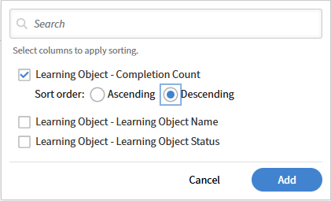

# Ordina colonne report nel Report Builder

## Panoramica

L’ordinamento determina l’ordine delle righe nel file di report scaricato. Applica l’ordinamento ogni volta che è importante un output coerente.

## Aggiungere un ordinamento

In questo esempio, scoprirai i corsi con i completamenti più elevati.

1. Avvia Report Builder e seleziona **Crea report**.
2. Digitare il nome e la descrizione del report.
3. Selezionare le colonne seguenti: <dataset>:<column name>

   * Oggetto di apprendimento - Nome dell’oggetto di apprendimento
   * Oggetto di apprendimento - Stato dell’oggetto di apprendimento
   * Oggetto di apprendimento - Conteggio completamenti

4. Nella sezione Ordinamento, seleziona **Aggiungi ordinamento**.
5. Seleziona **Oggetto di apprendimento - Conteggio completamenti**.
6. Selezionare un ordinamento - **Crescente** o **Decrescente**

   

7. Seleziona **Aggiungi**.
8. Selezionate **Salva report** e selezionate **Azioni** > **Scarica** per scaricare il report.

Nel report scaricato sono elencati tutti i record, ordinati in base al numero di completamenti del corso.

## Aggiungere l’ordinamento a più colonne

In questo esempio verrà generato un report per misurare le prestazioni tra i Manager.

Per eseguire l&#39;ordinamento in base a più colonne:

1. Avvia Report Builder e seleziona **Crea report**.
2. Digitare il nome e la descrizione del report.
3. Selezionare le colonne seguenti: <dataset>:<column name>

   * Utente - Nome
   * Utente - Nome Manager
   * Trascrizione modulo - Stato
   * Trascrizione modulo - Percentuale avanzamento

4. Aggiungere gli aggregati seguenti:

   * Raggruppa per nome utente-manager
   * Nome utente distinto conteggio
   * Count If=Trascrizione Modulo COMPLETATO - Stato
   * Media trascrizione modulo - Percentuale avanzamento

   

5. Nella sezione Ordina, aggiungi il seguente ordinamento a più colonne:

   * Trascrizione Modulo - Stato: Decrescente
   * Utente - Nome Manager: Crescente

   

6. Selezionate **Salva report** e selezionate **Azioni** > **Scarica** per scaricare il report.

Il report scaricato fornisce un riepilogo delle prestazioni per il Manager, mostrando conteggi degli Allievi distinti, conteggi delle iscrizioni basati sullo stato e percentuali medie di avanzamento. Vengono evidenziati i livelli di partecipazione e i progressi della formazione tra i diversi gruppi di manager.
