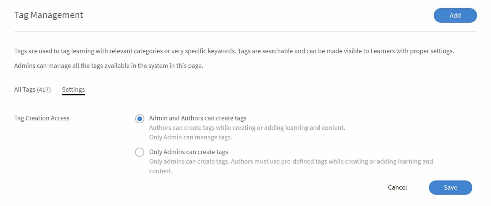

# Tag

Gli Amministratori ora possono gestire i tag su Learning Manager. Utilizza una migliore codifica e una base di dati gestibile per aiutare gli allievi a effettuare ricerche migliori e ottenere rapidamente i risultati appropriati. Puoi gestire le etichette ridondanti, errate e irrilevanti utilizzando questa funzione. Puoi anche aggiungere, modificare, eliminare, accodare o sostituire le etichette.

L’elenco di oggetti di apprendimento associati al tag può essere visualizzato facendo clic sul numero fornito accanto a ogni tag. L’elenco mostra il numero di corsi, programmi di apprendimento, certificati, risorse formative e gruppi di contenuto. Fai clic su una di queste opzioni per visualizzare l’elenco.

Puoi ordinare i tag in base all’utilizzo o all’ordine alfabetico tramite l’opzione **[!UICONTROL Ordina per]**.

## Introduzione ai tag

Questo corso spiega come aggiungere, modificare, sostituire, aggiungere ed eliminare i tag. Scoprirai inoltre come modificare le impostazioni delle autorizzazioni e utilizzare i filtri per tag.

Se non è possibile avviare il corso di formazione, scrivere a <almacademy@adobe.com>.

## Aggiungere/eliminare/modificare i tag {#adddeleteedittags}

1. Come amministratore, nel pannello di navigazione a sinistra fai clic su **[!UICONTROL Tag]**. Si apre la pagina **[!UICONTROL Gestione tag]**.
1. Per aggiungere un nuovo tag, fai clic su **[!UICONTROL Aggiungi]**. Il pulsante Aggiungi è disponibile nell’angolo in alto a destra della pagina. Se non sono presenti tag, il pulsante **[!UICONTROL Aggiungi]** sarà disponibile anche nella parte centrale della pagina **[!UICONTROL Gestione tag]**.

   Quando aggiungi più tag, separali usando (,) o (;). Un nome di tag può contenere un massimo di 50 caratteri.

1. Per eliminare un tag esistente, seleziona il tag facendo clic sulla casella di controllo. Puoi selezionare più tag, fino a cinquanta, da eliminare contemporaneamente. Per eliminarli, procedi come segue:

   * Seleziona i tag da eliminare > apri il menu a discesa **[!UICONTROL Azioni]** > seleziona **[!UICONTROL Elimina]**.

1. Puoi modificare solo un tag alla volta. Per modificare un tag, procedi come segue:

   * Seleziona il tag da modificare > apri il menu a **&#x200B; **&#x200B;[!UICONTROL Azioni] > fai clic su **[!UICONTROL Modifica]**.

   Viene visualizzata la finestra di dialogo **[!UICONTROL Modifica tag]**. Inserisci il nuovo nome del tag e fai clic su **[!UICONTROL Salva]**.

   Se il nome del tag immesso esiste già, Adobe Learning Manager visualizza un messaggio di avviso. Non possono esistere due tag con lo stesso nome.

## Sostituire i tag {#replacetags}

1. Seleziona i tag da sostituire. Puoi selezionare fino a 50 tag contemporaneamente. Apri il menu a discesa **[!UICONTROL Azioni]** e seleziona **[!UICONTROL Sostituisci]**.
1. Viene visualizzata la finestra di dialogo **[!UICONTROL Sostituisci tag]** che mostra i tag selezionati.

1. Nell’opzione **[!UICONTROL Nome per tag sostituiti]**, inserisci il nome del nuovo tag da sostituire con i tag selezionati. Puoi sostituirli con un tag esistente dal menu a discesa o aggiungere un nuovo tag.

   Il nome del tag non può contenere virgola o punto e virgola.  I tag senza punto e virgola e i messaggi di errore visualizzati quando si usano tali tag all’interno di qualche oggetto di apprendimento non saranno gestiti per gli scenari di migrazione.

1. Fai clic su **[!UICONTROL Sostituisci]**.

## Accodare i tag {#appendtags}

In caso di operazione Accoda per i tag, il tag nuovo/esistente verrà accodato a tutti gli oggetti di apprendimento e i gruppi di contenuti associati ai tag selezionati.

1. Seleziona i tag da accodare. Puoi selezionare fino a 50 tag contemporaneamente. Apri il menu a discesa Azioni e seleziona **[!UICONTROL Aggiungi]**.
1. Viene visualizzata la finestra di dialogo **[!UICONTROL Aggiungi tag]** che mostra i tag selezionati.
1. Puoi accodare un tag aggiuntivo a tutto il corso con i tag selezionati inserendo il nome del **[!UICONTROL nuovo tag]** o dall’elenco a discesa dei tag esistenti. Il nuovo tag verrà accodato a tutto il corso associato in Learning Manager.

   Il nome del tag non può contenere virgola o punto e virgola. Se utilizzati, Prime mostrerà un messaggio di errore. I tag senza punto e virgola e i messaggi di errore visualizzati quando si usano tali tag all’interno di qualche oggetto di apprendimento non saranno gestiti per gli scenari di migrazione.

1. Fai clic su **[!UICONTROL Accoda]**.

## Impostazioni {#settings}

In qualità di Amministratore, puoi autorizzare l’Autore a creare tag facendo clic sull’opzione delle impostazioni.

*Pagina delle impostazioni per la creazione di un tag*

* Quando un utente è autorizzato a creare tag e seleziona tag esistenti che al momento non sono validi,

  Viene visualizzato un messaggio di errore che indica che il tag selezionato non è più valido. I nuovi tag verranno creati rimuovendo i caratteri non supportati. In questo caso, l’autore dovrebbe visualizzare i suoi tag precedenti trasformati nei nuovi tag prima di salvarli.

* Se l’utente non dispone delle autorizzazioni necessarie per creare nuovi tag, viene visualizzato un messaggio di errore che indica che il tag selezionato non è più valido. Gli autori possono contattare gli amministratori per modificare i tag non validi.

  Gli autori non possono creare o salvare tag non validi. Possono rimuovere i tag non validi e aggiungere qualsiasi altro tag valido esistente e continuare.
