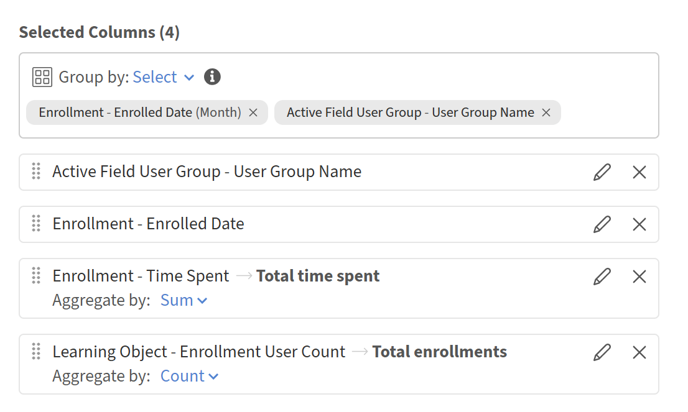

# Tenere traccia del coinvolgimento del gruppo di utenti nel Report Builder

Questo report aiuta i responsabili della formazione e gli amministratori L&amp;D a identificare i gruppi di utenti più attivi e le tendenze mese per mese del coinvolgimento. Utilizza i set di dati **Gruppo utenti campi attivi** e **Iscrizione** con funzioni di aggregazione e raggruppamento per generare una riga di riepilogo per gruppo di utenti al mese.

## Creazione del report di coinvolgimento per gruppo di utenti

1. Avvia Report Builder e seleziona **Crea report**.
2. Selezionare **Crea report**. Digitare un nome, ad esempio Coinvolgimento per gruppo di utenti MoM.
3. Nel pannello **Seleziona colonne**, espandi **Gruppo utenti campo attivo** e seleziona **+** accanto a **Nome gruppo utenti**. La colonna viene visualizzata nel pannello **Colonne selezionate**.
4. Espandi **Iscrizione** e seleziona **+** accanto a **Data di iscrizione**.
5. Seleziona **+** accanto a **Tempo impiegato**. Seleziona l&#39;icona **modifica** (matita) e immetti il tempo totale impiegato per l&#39;alias.
6. Espandi **Oggetto di apprendimento** e seleziona **+** accanto a **Conteggio utenti iscrizione**. Seleziona l&#39;icona **modifica** e immetti l&#39;alias Totale iscrizioni.
7. Seleziona **Raggruppa per: seleziona** nella parte superiore del pannello **Colonne selezionate**.
8. Scegli **Iscrizione - Data iscrizione** e imposta la granularità su **Mese**. Scegli **Gruppo di utenti campo attivo - Nome gruppo di utenti**. Entrambi vengono visualizzati come tag: Iscrizione - Data di iscrizione (mese) e Gruppo utenti campo attivo - Nome gruppo utenti.
9. Nella riga **Iscrizione - Tempo impiegato**, seleziona **Aggrega per** e scegli **Somma**.
10. Nella riga **Oggetto di apprendimento - Conteggio utenti iscrizione**, seleziona **Aggrega per** e scegli **Conteggio**.

    

11. Selezionare **Aggiungi filtro**. Scegli **Iscrizione - Data iscrizione**, seleziona un intervallo relativo, ad esempio **Ultimi 3 mesi,** o immetti un intervallo di date specifico.
12. Selezionare **+ Aggiungi ordinamento**. Ordina in base a **Iscrizione - Data di iscrizione** crescente, quindi aggiungi un ordinamento secondario in base al **tempo totale impiegato** decrescente.
13. Selezionate **Salva report** e selezionate **Azioni** > **Scarica** per scaricare il report.

Il report avrà una riga per gruppo di utenti al mese, mostrando il tempo totale impiegato e le iscrizioni totali per quel periodo.
