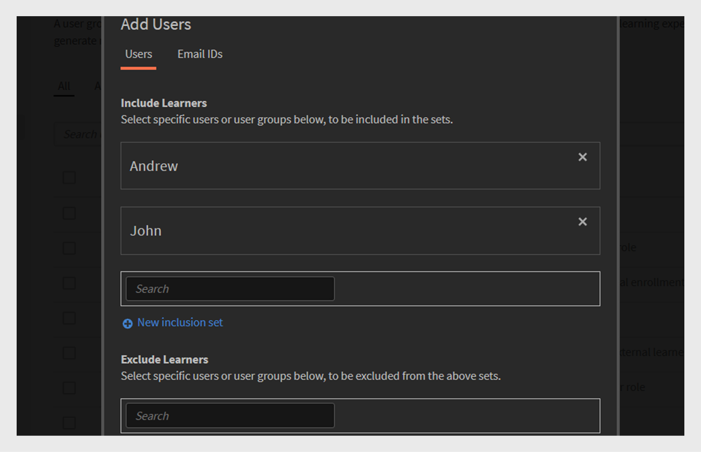
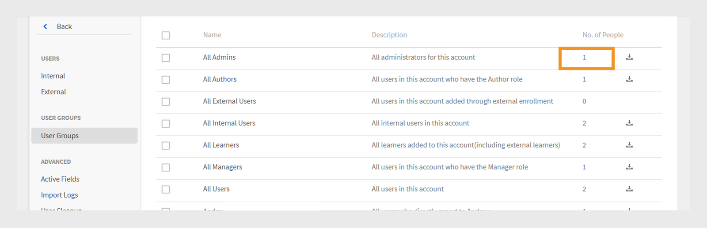

# Gruppi di utenti in Adobe Learning Manager

I gruppi di utenti in Adobe Learning Manager consentono di organizzare gli Allievi in base ad attributi comuni, ad esempio reparto, posizione o ruolo. Il raggruppamento degli utenti semplifica l’assegnazione di corsi, la gestione delle autorizzazioni e la registrazione dello stato di apprendimento per più utenti contemporaneamente.

>[!INFO]
>
>Guarda questo corso di formazione sull&#39;Accademia ALM per scoprire come creare un gruppo di utenti in base a nomi, ID e-mail e combinare più gruppi di utenti generati automaticamente.   

## Tipi di gruppi di utenti

Adobe Learning Manager supporta i seguenti gruppi di utenti:

1. **Gruppi di utenti generati automaticamente:** In Adobe Learning Manager, alcuni gruppi di utenti vengono creati automaticamente in base ai ruoli utente e agli attributi. Questi gruppi definiti dal sistema includono Tutti gli Autori, Tutti gli Amministratori, Tutti gli Allievi e Tutti i Manager. Adobe Learning Manager genera questi gruppi per facilitare l’organizzazione degli utenti in base al ruolo. Non è possibile rinominare o eliminare questi gruppi definiti dal sistema.

2. **Gruppi di utenti personalizzati:** In Adobe Learning Manager, gli amministratori possono creare gruppi di utenti personalizzati per organizzare gli Allievi in base a criteri specifici. Questi gruppi sono dinamici e aggiungono automaticamente gli utenti che soddisfano le condizioni definite. I gruppi personalizzati consentono di assegnare percorsi di apprendimento mirati, applicare branding personalizzati e generare report mirati. Sono uno strumento flessibile per la gestione e la personalizzazione dell’esperienza di apprendimento.

## Creare un gruppo di utenti personalizzato

Gli amministratori creano manualmente gruppi di utenti per organizzare gli utenti in base agli attributi definiti. Questi gruppi possono essere dinamici, aggiungendo automaticamente gli utenti che soddisfano i criteri specificati. I gruppi di utenti semplificano attività quali l’assegnazione di percorsi di apprendimento, l’applicazione di branding personalizzati e la generazione di report mirati.

Per creare un gruppo di utenti personalizzato:

1. Selezionare **Utenti** nella home page dell&#39;amministratore.
2. Seleziona **Gruppi di utenti**, quindi seleziona **Aggiungi**.

   
   _Pulsante per aggiungere un nuovo gruppo di utenti nella pagina Gruppi di utenti_

3. Digitare il nome e la descrizione del gruppo.

   
   _Immettere il nome del gruppo e la descrizione facoltativa_

## Aggiungere utenti al gruppo di utenti

Gli amministratori possono aggiungere utenti a un gruppo di utenti in due modi:

### Sezione Utenti

Gli amministratori possono utilizzare i set di inclusione ed esclusione per aggiungere o rimuovere utenti o gruppi di utenti nella sezione Utenti.

* **Set di inclusione** per aggiungere utenti a un gruppo di utenti personalizzato. È possibile includere uno o più gruppi di utenti e Adobe Learning Manager utilizza la logica (AND/OR) per decidere quale utente includere. Consultare questa [sezione](#_Inclusion_and_exclusion) per ulteriori informazioni sulla logica AND/OR.
* **I set di esclusione** rimuovono gli utenti dal gruppo, anche se facevano parte del set di inclusione. Questo perfeziona l’elenco degli utenti del gruppo.

Per aggiungere utenti al gruppo:

1. Cerca e seleziona gli utenti o il gruppo di utenti esistente nel campo **Includi Allievi**.

_Impostazioni di inclusione per aggiungere utenti o gruppi specifici a un gruppo di utenti personalizzato_

### Sezione ID e-mail

1. Digita gli indirizzi e-mail utente in un formato separato da virgole, punto e virgola o interruzione di riga per aggiungere gli utenti al gruppo.

2. Selezionare **Convalida ID e-mail**.

   
   _Selezionare Convalida ID e-mail per convalidare gli ID e-mail immessi_

   Verrà visualizzato un errore se Adobe Learning Manager non dispone dell&#39;ID e-mail o se l&#39;ID e-mail non è corretto.

   
   _Campo per immettere manualmente più indirizzi e-mail per aggiungere utenti a un gruppo_

3. Seleziona **Salva** per creare il gruppo.

## Escludere gli utenti dal gruppo

Gli amministratori possono escludere utenti specifici da un gruppo di utenti anche se soddisfano i criteri del gruppo. Ciò è utile quando si desidera fare delle eccezioni, ad esempio quando si desidera impedire a determinati utenti di ricevere corsi assegnati o di apparire nei report collegati a quel gruppo.

Per escludere utenti specifici o interi gruppi di utenti durante la creazione di un gruppo di utenti personalizzato:

1. Seleziona **Gruppi di utenti**, quindi seleziona **Aggiungi**.
2. Passa alla sezione **Escludi Allievi**.
3. Selezionare gli utenti o i gruppi da escludere.

_Impostazioni di esclusione per rimuovere utenti o gruppi da un gruppo personalizzato_

## Visualizzare i membri del gruppo

Gli amministratori possono visualizzare un elenco di utenti in un gruppo, inclusi dettagli come nome, ID e-mail e stato. Per visualizzare l’elenco degli utenti:

1. Seleziona **Utenti**, quindi seleziona **Gruppi di utenti**.
2. Selezionare un gruppo, quindi selezionare il valore in **No. della colonna Persone**.

_Elenco di utenti attualmente inclusi in un gruppo di utenti selezionato_

_Elenco di utenti disponibili nel gruppo di utenti selezionato_

## Scarica membri del gruppo

Gli amministratori possono scaricare un elenco di membri del gruppo per esaminare i dettagli degli utenti, tra cui nome, e-mail, stato, data di aggiunta (fuso orario UTC), data di eliminazione (fuso orario UTC) e data dell’ultimo accesso (fuso orario UTC). Questo consente di tenere traccia dell’appartenenza ai gruppi, di creare report e di verificarne l’appartenenza.

1. Seleziona **Utenti**, quindi seleziona **Gruppi di utenti**.
2. Seleziona l’icona di download accanto a un gruppo per esportare il report come file CSV.

_Icona di download per esportare i dati dei membri del gruppo come file CSV_

Di seguito sono riportate le colonne del report dei membri del gruppo:

* **Nome**: nome dell&#39;utente
* **E-mail**: ID e-mail dell’utente
* **Stato**: stato dell&#39;utente (Registrato o Non registrato).
* **Data di aggiunta (fuso orario UTC)**: data in cui l&#39;utente è stato aggiunto al fuso orario UTC.
* **Data di eliminazione (fuso orario UTC)**: data in cui l&#39;utente è stato eliminato nel fuso orario UTC.
* **Data ultimo accesso (fuso orario UTC)**: data dell&#39;ultimo accesso utente al fuso orario UTC.

_Il file CSV di esempio contiene i dettagli dell&#39;utente_

## Modificare un gruppo di utenti

Gli amministratori possono modificare un gruppo per cambiarne il nome, la descrizione o altri dettagli.

Per modificare un gruppo di utenti:

1. Seleziona **Utenti** nella home page dell&#39;amministratore.
2. Seleziona **Gruppi di utenti**.
3. Seleziona il gruppo di utenti da modificare.
4. Apporta le modifiche necessarie, ad esempio per aggiornare il nome, la descrizione o altri dettagli.
5. Seleziona **Salva** per applicare le modifiche. Le modifiche verranno applicate al gruppo di utenti.

_Campi per modificare il nome, la descrizione o le regole di appartenenza del gruppo di utenti_

## Eliminare un gruppo di utenti

Gli amministratori possono eliminare i gruppi di utenti che non sono più necessari per mantenere l’elenco dei gruppi organizzato e aggiornato.

Per eliminare un gruppo di utenti:

1. Seleziona **Utenti**, quindi seleziona **Gruppi di utenti**.
2. Seleziona il gruppo da eliminare.
3. Seleziona **Azioni**, quindi seleziona **Elimina**.

   
   _Opzione Elimina nel menu Azioni per rimuovere un gruppo di utenti_

4. Confermare l&#39;eliminazione quando richiesto. Il gruppo di utenti verrà eliminato da Adobe Learning Manager.

## Scarica report gruppo di utenti

I report sui gruppi di utenti di Adobe Learning Manager forniscono agli amministratori e ai manager informazioni dettagliate sulle prestazioni dei diversi gruppi di utenti, ad esempio reparti, ruoli o partner esterni. Questi report consentono il confronto tra i gruppi per valutare i progressi dell’apprendimento, i tassi di completamento dei corsi e i livelli di coinvolgimento.

Per scaricare il report:

1. Seleziona **Utenti**, quindi seleziona **Gruppi di utenti**.
2. Seleziona **Azioni**, quindi seleziona **Scarica report gruppo di utenti**.

_Opzione per scaricare informazioni e metadati a livello di gruppo dal menu Azioni_

Questo report include:

| Colonna | Descrizione |
|---|---|
| Tipo di gruppo utenti | La categoria del gruppo di utenti, ad esempio il gruppo personalizzato o generato automaticamente. |
| Nome | Nome assegnato al gruppo di utenti. |
| Descrizione | Breve spiegazione dello scopo o dell’ambito del gruppo di utenti. |
| Creato da (nome) | Nome completo dell&#39;amministratore che ha creato il gruppo. |
| Creato da (e-mail) | L’indirizzo e-mail dell’amministratore che ha creato il gruppo. |
| Data creazione (fuso orario UTC) | Data e ora di creazione del gruppo, visualizzate in UTC (Coordinated Universal Time). |
| Numero di utenti | Il numero totale di utenti attualmente inclusi nel gruppo. |

_Il report del gruppo di utenti contiene tutti i campi_

## Regole di inclusione ed esclusione per la creazione di gruppi di utenti personalizzati

Quando si crea un **gruppo di utenti personalizzato** aggiungendo gruppi di utenti generati automaticamente o esistenti, Adobe Learning Manager applica **regole di inclusione ed esclusione** specifiche in base alla **logica AND/OR**. Queste regole dipendono dal modo in cui i gruppi di utenti vengono combinati nei set di inclusione ed esclusione.

Puoi aggiungere uno o più gruppi di utenti generati automaticamente al set di inclusione. La logica applicata dipende dal modo in cui vengono selezionati questi gruppi:

### Uso della logica AND nei gruppi di utenti

Se selezioni più gruppi di utenti all’interno dello stesso set di inclusione, gli utenti devono soddisfare tutte le condizioni per essere inclusi.

Ad esempio:

* Gruppo Sales Team: 120 utenti
* Gruppo di località (Bangalore): 80 utenti
* Utenti comuni in **entrambi** gruppi: 40 utenti

Adobe Learning Manager utilizza la logica AND per creare un gruppo con solo 40 utenti. Questi utenti fanno parte del team di vendita e si trovano anche a Bangalore, soddisfacendo entrambe le condizioni.

_Esempio che mostra più gruppi combinati utilizzando la logica AND_

### Uso della logica OR nei gruppi di utenti

Se si aggiungono gruppi di utenti in set di inclusione separati, vengono inclusi gli utenti che soddisfano qualsiasi condizione. Ad esempio:

* Gruppo Sales Team: 120 utenti
* Gruppo di località (Bangalore): 80 utenti
* Totale utenti in entrambi i gruppi: 160 utenti (alcuni utenti possono essere in entrambi i gruppi)

Quando si utilizza la logica OR, Adobe Learning Manager aggiunge gli utenti che fanno parte del team vendite o che si trovano a Bangalore. Ciò significa che include gli utenti che soddisfano una qualsiasi delle due condizioni. Di conseguenza, il gruppo include 160 utenti dopo aver rimosso i duplicati.

_Esempio che mostra più gruppi combinati utilizzando la logica OR_
