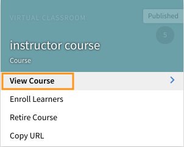

# Notifiche

La funzionalità Notifiche è applicabile a tutti gli utenti di Adobe Learning Manager. Tuttavia, ogni utente ottiene diversi tipi di notifiche a seconda degli scenari e dei ruoli. Tutti gli avvisi e le notifiche agli utenti vengono visualizzati tramite la finestra a comparsa delle notifiche.

## Notifiche di accesso {#accessnotifications}

Gli utenti possono visualizzare le notifiche facendo clic sull’icona di notifica nell’angolo superiore destro della finestra. Questa finestra a comparsa mostra un riepilogo di tutte le notifiche, insieme all’ora in cui sono state inviate e a una barra di scorrimento. Per visualizzare ulteriori informazioni su tutte le notifiche, fai clic su Mostra tutte le notifiche nella parte inferiore della finestra a comparsa. Viene visualizzata la pagina delle notifiche.

Puoi visualizzare il numero delle notifiche più recenti in base al numero evidenziato sopra l’icona delle notifiche. Ad esempio, se dall’ultimo accesso hai ricevuto cinque notifiche, sopra l’icona delle notifiche verrà visualizzato il numero 5. Questi numeri scompaiono quando visualizzi tutte le notifiche più recenti.

## Tipi di notifiche per gli Amministratori {#typesofnotificationsforadministrators}

Gli Amministratori ricevono le notifiche nelle seguenti istanze:

* Ogni volta che viene caricato correttamente un elenco CSV di utenti.
* Ogni volta che il caricamento di un elenco CSV di utenti ha esito negativo. L’Amministratore riceve un messaggio con il motivo dell’errore.
* L’Amministratore può anche configurare avvisi di notifica a livello di istanza per corsi e programmi di apprendimento. In questo caso, l’Amministratore riceve le notifiche in base alla frequenza selezionata a livello di istanza.

>[!NOTE]
>
>Se un Amministratore, oltre al suo ruolo, dispone di privilegi di Autore o di Manager riceve le notifiche relative a ciascun ruolo.

Viene visualizzata una finestra di notifica di esempio per il ruolo di Amministratore nella schermata riportata di seguito:

*Visualizzare le notifiche di amministrazione*

Questa finestra a comparsa mostra un riepilogo di tutte le notifiche, l’ora in cui sono state inviate e una barra di scorrimento. Puoi visualizzare il numero delle notifiche più recenti in base al numero evidenziato sopra l’icona delle notifiche. Ad esempio, se dall’ultimo accesso hai ricevuto cinque notifiche, sopra l’icona delle notifiche verrà visualizzato il numero 5. Questi numeri scompaiono quando visualizzi tutte le notifiche più recenti.

Fai clic **[!UICONTROL Mostra tutte le notifiche]** nella parte inferiore della finestra a comparsa delle notifiche, puoi visualizzare tutte le notifiche in una nuova pagina.

## Configurazione delle notifiche di escalation a più livelli {#setupmultilevelescalationnotifications}

Quando gli Allievi non rispettano le scadenze, le e-mail di escalation possono essere inviate al Manager e a un Manager occasionale. Puoi configurare le notifiche di escalation a più livelli per il mancato completamento del corso durante o dopo il processo di creazione di un corso. Le notifiche di escalation possono essere configurate per essere inviate con una frequenza impostata a un Manager o a un Manager occasionale.

1. Accedi come Amministratore o Autore e fai clic su Corsi.
1. Seleziona il corso per il quale desideri modificare le notifiche di escalation e fai clic su **[!UICONTROL Visualizza corso]**.

   

   *Seleziona l’opzione Visualizza corso*

1. Fai clic su **[!UICONTROL Istanze]** > **[!UICONTROL Avvisi di notifica]**.

   

   *Seleziona l’opzione Avvisi di notifica*

1. Viene aperto un calendario che indica la scadenza fissata per il corso evidenziato in rosso. Fai clic sulla data evidenziata per visualizzare i promemoria impostati per l’Allievo.

   

   *Visualizza promemoria delle scadenze*

1. Imposta i promemoria selezionando le date precedenti alla scadenza. Ciò consente di configurare i promemoria per l’Allievo in merito alla scadenza imminente.

   

   *Impostare una data di scadenza per i promemoria*

1. Seleziona una data successiva a quella di scadenza per configurare una pianificazione dei promemoria per l’Allievo e le notifiche di escalation per il Manager.

   

   *Impostare promemoria e date di escalation*

1. Se l’Allievo non riesce a completare il corso anche dopo l’escalation al Manager, le impostazioni consentono di inoltrare il problema al Manager occasionale dell’Allievo. Fai clic su una data successiva alla proroga della scadenza, seleziona la ricorrenza dei promemoria, il numero di giorni per la pianificazione e seleziona **Manager e salta manager di livello** nella **Escalation** a discesa. Fai clic sul segno di spunta blu per salvare le impostazioni di notifica.

   

   *Salva le impostazioni di notifica*

## Domande frequenti {#frequentlyaskedquestions}

+++Come si configurano le notifiche dei promemoria sull’istanza?

In un&#39;istanza, fare clic su Avvisi di notifica. Viene aperto un calendario che indica la scadenza fissata per il corso evidenziato in rosso. Fai clic sulla data evidenziata per visualizzare i promemoria impostati per l’Allievo. Imposta i promemoria, come illustrato nella presente [sezione](user-notifications.md#Setupmultilevelescalationnotifications).
+++
