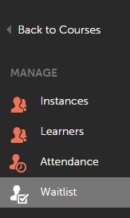

# Gestione delle liste di attesa e di frequenza

Gli Amministratori possono gestire le liste di attesa e di frequenza per i corsi degli Allievi.

## Gestione delle liste di attesa {#waitlistmanagement}

Gli Allievi vengono inseriti in liste di attesa per ogni corso in aula che prevede un numero chiuso, in base all’ordine di iscrizione. Gli Amministratori possono selezionare gli Allievi nella lista d’attesa e assegnare i posti, ignorando il limite, per qualsiasi corso in aula. Gli Allievi verranno iscritti ai corsi man mano che l’Amministratore assegna un posto.

1. Dopo aver effettuato l’accesso come Amministratore, fai clic su **[!UICONTROL Corsi]** nel riquadro a sinistra.
1. Dall’elenco dei corsi disponibili, fai clic sul nome di un corso in aula a tua scelta. Viene visualizzata una nuova pagina contenente informazioni dettagliate sul corso.

*Selezionare l&#39;opzione della lista d&#39;attesa*

1. Fai clic su **[!UICONTROL Lista d’attesa]** nel riquadro a sinistra della pagina dei dettagli del corso. L’elenco degli Allievi nella lista d’attesa viene visualizzato nella pagina.
1. Seleziona gli Allievi, quindi fai clic su **[!UICONTROL Assegna posti]** per iscriverli direttamente ai corsi, ignorando il limite.

>[!NOTE]
>
>Gli Allievi iscritti non possono essere spostati nella lista d’attesa e le loro postazioni non possono essere riassegnate ad altri Allievi.

## Gestione della frequenza {#attendancemanagement}

Questa funzione è applicabile solo ai corsi in aula e in aula virtuale. Puoi registrare le presenze procedendo come segue:

1. Fai clic su Corsi nel riquadro a sinistra dopo avere effettuato l’accesso come Amministratore.
1. Dall’elenco dei corsi disponibili, fai clic sul nome di un corso/modulo in aula a tua scelta. Viene visualizzata una nuova pagina contenente informazioni dettagliate sul corso.
1. Fai clic sulla scheda Frequenza, seleziona gli Allievi e fai clic su Salva per contrassegnare la frequenza.

>[!NOTE]
>
>Se sono presenti più moduli in un corso e l’Allievo ne ha completato solo uno, puoi selezionare un singolo modulo e fare clic su Salva. Se l’Allievo completa tutti i moduli di un corso, puoi fare clic sull’opzione Seleziona tutti e poi su Salva.

La frequenza ad Adobe Connect basata su sessioni in aula virtuale viene contrassegnata automaticamente nelle 2-3 ore successive alla sessione. Il completamento del corso in aula virtuale dell’Allievo viene contrassegnato solo dopo aver rilevato la frequenza.
