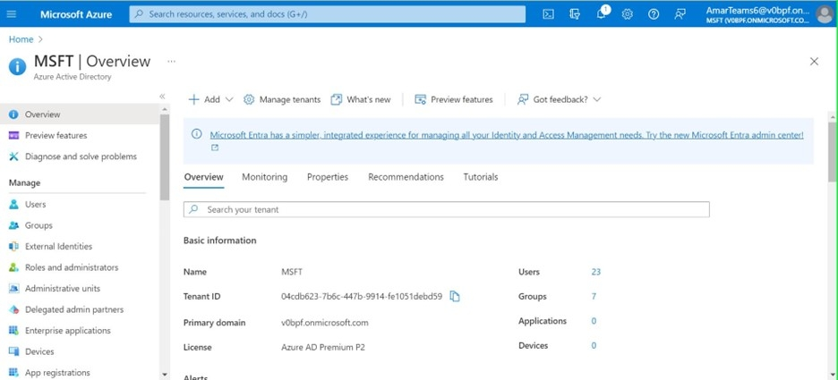

# Adobe dell’app Learning Manager per Microsoft Teams

## Come configurare

La configurazione di ALM in MS Teams prevede tre passaggi e richiede l&#39;assistenza dell&#39;amministratore ALM e dell&#39;amministratore di Microsoft Azure. In alcune organizzazioni, l’Amministratore di Azure e gli Amministratori di MS Teams non sono la stessa cosa e pertanto richiedono anche altri Amministratori di MS Teams.

**Amministratore ALM: il ruolo Amministratore di integrazione approva l’app Teams**

Una volta che l’Amministratore dell’integrazione avrà approvato l’app MS Teams, l’app Adobe Learning Manager sarà disponibile nell’app store di MS Teams e gli Allievi potranno accedervi. Tuttavia, l’app non avrà notifiche, accesso invisibile e non verrà aggiunta per gli Allievi in MS Teams.

**L&#39;amministratore di Microsoft Azure approva l&#39;autorizzazione per l&#39;app ALM nel dashboard di Azure**

L&#39;amministratore di Azure dovrà approvare le autorizzazioni richieste per l&#39;app ALM. Ciò consentirà all&#39;app ALM di inviare notifiche a MS Teams e di effettuare l&#39;accesso in modalità invisibile. In caso di accesso invisibile, gli utenti non devono accedere separatamente all’Adobe Learning Manager sul browser.

**L’amministratore di MS Teams crea una policy per i team ALM**

L’Amministratore MS Teams nel suo Admin Center deve bloccare l’app ALM per tutti gli utenti e consentirla come policy globale. Nel caso in cui ALM venga utilizzato solo da un determinato gruppo dell’azienda, l’amministratore di MS Teams deve scegliere un criterio personalizzato e applicarlo solo a quel gruppo specifico.

## Il ruolo di Amministratore di integrazione approva l’app Teams

Segui i passaggi riportati di seguito:

1. Nell’app Amministratore di integrazione, seleziona **[!UICONTROL Applicazioni]** > **[!UICONTROL App in primo piano]** e seleziona **[!UICONTROL App ALM Teams]**.

   
   *Seleziona l’app ALM Teams*

1. Nell’angolo in alto a destra dello schermo, seleziona **[!UICONTROL Approva]**.

   
   *Seleziona Approva nella pagina delle impostazioni dell’app*

1. Seleziona **[!UICONTROL OK]** nella finestra di dialogo visualizzata.

   
   *Seleziona OK dopo l’approvazione*

1. Una volta approvata, potrai visualizzare &quot;App ALM Teams&quot; nella sezione App esterne.

   
   *L’app ALM Teams viene visualizzata nella pagina App*

Ora gli utenti possono accedere all’app ALM su MS Teams.

## L&#39;amministratore di Microsoft Azure approva l&#39;autorizzazione per l&#39;app ALM nel dashboard di Azure

Segui i passaggi riportati di seguito:

1. In qualità di amministratore di Azure, vai alla sezione Gestisci Azure Active Directory nel dashboard di Azure.

   
   *Avvia dashboard di Azure*

1. Incollate il seguente collegamento in una finestra separata del browser:

   `https://login.microsoftonline.com/<tenantIdTobeReplaced>/oauth2/authorize?client_id=8d349d9f-bf59-4ece-8022-a41e87d81903&response_type=code&redirect_uri=https://learningmanager.adobe.com`

1. Nel collegamento precedente, sostituisci `<tenantIdTobeReplaced>` con l’ID tenant disponibile nella pagina Panoramica di seguito. Immetti il nuovo URL.

1. Aggiungi l’app Adobe Learning Manager alle applicazioni Azure.

   
   *Aggiungi ad Azure*

1. Selezionare la scheda Applicazioni aziendali e selezionare Tutte le applicazioni. Vedrai ALMTeamsApp elencato lì.

   
   *Visualizza l&#39;app ALM*

1. Fai clic sull’app e seleziona la scheda Autorizzazioni.

   
   *Visualizzare la scheda Autorizzazioni*

1. Nella scheda Autorizzazioni, seleziona &quot; **[!UICONTROL Concedi il consenso dell&#39;amministratore per MSFT]**&#39; per concedere le autorizzazioni dell&#39;app ALM teams.

   
   *Seleziona autorizzazioni*

1. Seleziona **[!UICONTROL Accetta]**.

   
   *Seleziona Accetta*

1. Una volta concesse, queste autorizzazioni concederanno all’app ALM di consentire accessi invisibili all’utente e di inviare notifiche agli Allievi nell’app MS Teams.

   
   *L&#39;accesso è concesso*

## L’amministratore di MS Teams crea un criterio per l’app Teams

Segui i passaggi riportati di seguito:

1. In qualità di amministratore di MS Teams, nell’interfaccia di amministrazione, crea un criterio per aggiungere l’app Teams all’app Teams degli Allievi.

   
   *Creare una policy*

1. Passa alla sezione Criteri di configurazione. Crea una policy globale e seleziona **[!UICONTROL Aggiungi app]** nella sottosezione App bloccate.

   
   *Aggiungere la policy*

1. Nella finestra di dialogo che segue, cerca **[!UICONTROL Adobe di Learning Manager]** e aggiungi l’app. In questo modo viene aggiunto un Adobe di Learning Manager nella sezione App installate.

   
   *Installa l’app*

1. Salva questa policy. In questo modo l&#39;app è disponibile per tutti gli utenti dell&#39;organizzazione.

In alternativa, gli amministratori possono creare un criterio personalizzato anziché globale. Aggiungi Learning Manager di Adobe a tale policy personalizzata, quindi applica la policy personalizzata solo agli utenti che devono accedere a Learning Manager di Adobe.
