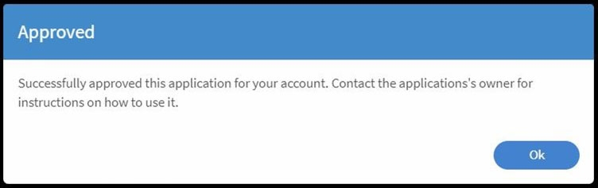
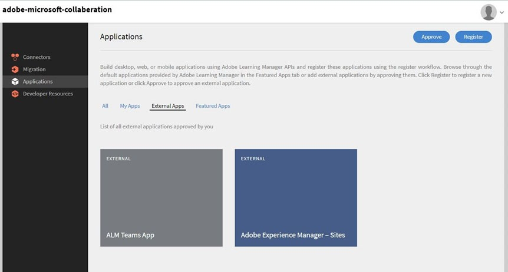

# App Adobe Learning Manager per Microsoft Teams

## Come configurare

La configurazione di ALM su MS Teams consiste di tre passaggi e richiede assistenza da parte dell’amministratore di ALM e dell’amministratore di Microsoft Azure. In alcune organizzazioni, l’amministratore di Azure e quelli di MS Teams non sono le stesse persone e pertanto sono necessari amministratori di MS Teams aggiuntivi.

**Amministratore ALM - Il ruolo Amministratore di integrazione approva l’app Teams**

Dopo che l’Amministratore dell’integrazione avrà approvato l’app MS Teams, l’app Adobe Learning Manager sarà disponibile nell’app store di MS Teams e gli Allievi potranno accedervi. Tuttavia, l’app non avrà notifiche, accesso in modalità invisibile né sarà fissata per gli Allievi in MS Teams.

**L&#39;amministratore di Microsoft Azure approva l&#39;autorizzazione per l&#39;app ALM nel dashboard di Azure**

L’amministratore di Azure dovrà approvare le autorizzazioni necessarie per l’app ALM. Questo consentirà all’app ALM di inviare notifiche a MS Teams e di effettuare l’accesso in modalità invisibile. Nell’accesso in modalità invisibile, gli utenti non devono accedere separatamente ad Adobe Learning Manager nel browser.

L&#39;amministratore di **MS Teams crea un criterio per i team ALM**

L’amministratore di MS Teams nel proprio Centro di amministrazione deve bloccare l’app ALM per tutti i propri utenti e consentirla come policy globale. Se ALM è utilizzato solo da un determinato gruppo dell’azienda, l’amministratore di MS Teams deve scegliere una policy personalizzata e applicarla solo a quello specifico gruppo.

## Il ruolo di Amministratore di integrazione approva l’app Teams

Effettua le seguenti operazioni:

1. Nell’app Amministratore di integrazione, seleziona **[!UICONTROL Applicazioni]** > **[!UICONTROL App in primo piano]** e seleziona **[!UICONTROL App ALM Teams]**.

   
   *Seleziona l&#39;app ALM Teams*

1. Nell&#39;angolo superiore destro dello schermo, seleziona **[!UICONTROL Approva]**.

   
   *Seleziona Approva nella pagina delle impostazioni dell&#39;app*

1. Seleziona **[!UICONTROL OK]** nella finestra di dialogo visualizzata.

   
   *Selezionare OK dopo l&#39;approvazione*

1. Una volta approvata, potrai visualizzare &quot;App ALM Teams&quot; nella sezione App esterne.

   
   *L&#39;app ALM Teams viene visualizzata nella pagina App*

Ora gli utenti possono accedere all’app ALM su MS Teams.

## L’amministratore di Microsoft Azure approva l’autorizzazione per l’app ALM nel dashboard di Azure

Effettua le seguenti operazioni:

1. In qualità di amministratore di Azure, vai alla sezione Gestisci Azure Active Directory nel dashboard di Azure.

   
   *Avvia dashboard di Azure*

1. Incollate il seguente collegamento in una finestra separata del browser:

   `https://login.microsoftonline.com/<tenantIdTobeReplaced>/oauth2/authorize?client_id=8d349d9f-bf59-4ece-8022-a41e87d81903&response_type=code&redirect_uri=https://learningmanager.adobe.com`

1. Nel collegamento riportato qui sopra, sostituisci `<tenantIdTobeReplaced>` con l’ID tenant disponibile nella pagina Panoramica seguente. Immetti il nuovo URL.

1. Aggiungi l’app Adobe Learning Manager alle applicazioni Azure.

   
   *Aggiungi ad Azure*

1. Seleziona la scheda Applicazioni aziendali e seleziona Tutte le applicazioni. Vedrai ALMTeamsApp elencato lì.

   
   *Visualizza l&#39;app ALM*

1. Fai clic sull’app e seleziona la scheda Autorizzazioni.

   
   *Visualizza la scheda Autorizzazioni*

1. Nella scheda Autorizzazioni, seleziona &#39; **[!UICONTROL Concedi il consenso dell&#39;amministratore per MSFT]**&#39; per concedere le autorizzazioni dell&#39;app ALM teams.

   
   *Seleziona autorizzazioni*

1. Seleziona **[!UICONTROL Accetta]**.

   
   *Seleziona Accetta*

1. Una volta concesse, queste autorizzazioni concederanno all’app ALM di consentire accessi invisibili all’utente e di inviare notifiche agli Allievi nell’app MS Teams.

   
   *Accesso concesso*

## L’amministratore di MS Teams crea una policy per l’app Teams

Effettua le seguenti operazioni:

1. In qualità di amministratore di MS Teams, nell’interfaccia di amministrazione, crea un criterio per aggiungere l’app Teams all’app Teams degli Allievi.

   
   *Creare un criterio*

1. Passa alla sezione Policy di configurazione. Crea un criterio globale e seleziona **[!UICONTROL Aggiungi app]** nella sottosezione App bloccate.

   
   *Aggiungere il criterio*

1. Nella finestra di dialogo seguente, cerca **[!UICONTROL Adobe Learning Manager]** e aggiungi l’app. In questo modo viene aggiunto Adobe Learning Manager nella sezione App installate.

   
   *Installa l&#39;app*

1. Salva questa policy. In questo modo l&#39;app è disponibile per tutti gli utenti dell&#39;organizzazione.

In alternativa, gli amministratori possono creare una policy personalizzata anziché globale. Aggiungere Adobe Learning Manager a tale criterio personalizzato e quindi applicarlo solo agli utenti che devono accedere a Adobe Learning Manager.
