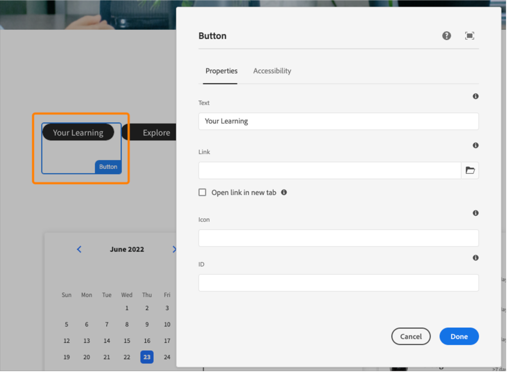

# Adobe del pacchetto per il sito di riferimento di Learning Manager (sito di riferimento ALM) per AEM Sites

Adobe Learning Manager (ALM) si integra con i siti Adobe Experience Manager (AEM). Ciò ti consente di creare il tuo sito Web e interfacce per dispositivi mobili reattive per Learning Manager, ad Adobe, con il minimo sforzo di codifica. Con questa integrazione, puoi creare esperienze di apprendimento personalizzate per i tuoi utenti.

Per creare un&#39;esperienza di questo tipo, ALM fornisce un Adobe di pacchetto per il sito di riferimento di Learning Manager (pacchetto per il sito di riferimento ALM) per AEM Sites sotto forma di file ZIP, che è possibile installare nell&#39;istanza di AEM Sites.

Il pacchetto include modelli di pagine Web e componenti di siti Web di AEM Sites, oltre a widget incorporabili, ad esempio, catalogo di apprendimento, widget incorporabili, calendario e così via.

Dopo aver installato il pacchetto per il sito di riferimento ALM, puoi iniziare a creare un sito Web per Learning Manager, ad Adobe, che puoi ospitare sulla tua istanza di AEM Sites. Gli utenti possono quindi trascinare e rilasciare i componenti sul sito Web.

Installazione del pacchetto per il sito di riferimento ALM

## Prerequisiti

* Licenze per AEM Sites e Adobe Commerce.
* AEM locale 6.5 o Adobe Experience Manager - Cloud Service
* Adobe Commerce 2.4.3

Dopo aver protetto l&#39;ambiente di AEM Sites, è necessario installare il pacchetto per il sito di riferimento ALM. Questo pacchetto include pagine Web e componenti di siti Web dell’AEM che contribuiscono a costruire la piattaforma di apprendimento.

Il pacchetto per il sito di riferimento è ospitato sul [**Repository GitHub**](https://github.com/adobe/adobe-learning-manager-reference-site/releases/tag/1.0.0).

Per ulteriori informazioni, consulta il README.

## Crea un&#39;applicazione in [!DNL Adobe Learning Manager]

Dopo aver installato il pacchetto per il sito dell’AEM, è necessario configurare un’applicazione ALM per connettere il portale di apprendimento al sito dell’AEM.

Questo scenario è applicabile quando l’AEM è utilizzato con [!DNL Adobe Learning Manager].

Segui i passaggi riportati di seguito:

1. Come Amministratore di integrazione, fai clic su **[!UICONTROL Applicazioni]**.
1. Per creare una nuova applicazione, fai clic su nell’angolo superiore destro della pagina **[!UICONTROL Registrati]**.
1. Nella schermata Registra una nuova applicazione, immetti i seguenti dettagli:

   1. Nome applicazione: il nome dell’applicazione che stai creando.
   1. URL: l&#39;URL della tua organizzazione.
   1. Domini di reindirizzamento: i domini di hosting del sito Web dell’AEM. È inoltre possibile specificare caratteri jolly.
   1. Descrizione: la descrizione dell&#39;applicazione.
   1. Ambiti: seleziona Accesso in lettura/scrittura al ruolo di Allievo.
   1. Solo per questo account?: seleziona Sì se desideri utilizzare l&#39;applicazione per l&#39;account ALM esistente.

1. Dopo aver apportato le modifiche, fai clic su Salva.

Prendi nota delle credenziali dell’applicazione dalla schermata.

*Credenziali dell&#39;applicazione*

Per approvare l’applicazione, fai clic su **[!UICONTROL Approva]**.

## Ottieni i token

1. Nella scheda Risorse sviluppatore, fai clic su **[!UICONTROL Token di accesso per test e sviluppo]**.

   

   *Seleziona token di accesso per test e sviluppo*

1. Immetti i seguenti dettagli:

   
   *Immetti i dettagli del token*

   1. Ottieni codice OAuth: immetti l’ID client della sezione precedente e modifica l’ambito. Fai clic su Invia per ottenere il codice Oauth.
   1. Ottieni token di aggiornamento: immetti l’ID client e il segreto della sezione precedente. Immetti anche il codice OAuth ottenuto dal passaggio precedente. Fai clic su Invia.
   1. Ottieni token di accesso: immetti l’ID client e il segreto della sezione precedente. Immetti anche il token di aggiornamento ottenuto dal passaggio precedente. Fai clic su Invia.
   1. Ottieni dettagli del token di accesso: immetti il token di accesso ottenuto dal passaggio precedente. Fai clic su Invia.

1. Puoi ottenere i dettagli dalla risposta JSON che segue. La risposta include token di accesso, token di aggiornamento, ruolo utente, ID account, ID utente e tempo rimanente prima della scadenza. Prendi nota del token di aggiornamento, perché verrà riutilizzato.

## Configurazione dell’account ALM in AEM

1. Avvia l’istanza AEM.
1. Fai clic su Impostazioni > Cloud Service.
1. Fai clic su Adobe di configurazione di Learning Manager.

   
   *Seleziona la configurazione di Learning Manager di Adobe*

1. Fai clic su Crea > Cartella di configurazione. Assegna un nome alla cartella.

   
   *Crea configurazione*

1. Nel progetto di apprendimento, seleziona la configurazione creata.

1. Immetti i dettagli della configurazione.

   
   *Crea cartella di configurazione*

   1. Adobe modalità Learning Manager: scegli come vuoi che sia l’esperienza di apprendimento per gli Allievi che hanno effettuato l’accesso e per quelli che non l’hanno fatto.
   1. Adobe di URL di Learning Manager: immetti l’URL dell’istanza ALM in cui sono ospitati i servizi di apprendimento.
   1. ID account: ID dell’account ALM.
   1. ID client, segreto client e token di aggiornamento autore: immetti le credenziali ottenute durante la creazione dell&#39;applicazione in ALM.
   1. Personalizzazione del widget: per ulteriori informazioni, consulta [Integrazione con AEM](/help/migrated/integrate-aem-learning-manager.md) `.`

1. Salva e chiudi la configurazione.

### AEM + Adobe Learning Manager (utenti connessi/non connessi)

Adobe Learning Manager ora ti consente di mostrare i tuoi prodotti e corsi di formazione ai clienti e ai partner esistenti e potenziali senza dover creare account o effettuare l’accesso. Questa funzionalità ti aiuterà a promuovere l’adozione di prodotti e corsi di formazione fornendo agli Allievi un’anteprima rapida e semplice dei corsi di formazione, che consente di evidenziare e promuovere le funzionalità del prodotto. Potrai quindi presentare i tuoi prodotti e le tue offerte in modo efficace, in particolare ai potenziali clienti e partner, aumentando la consapevolezza del prodotto. La facilità di accesso e una migliore raggiungibilità producono un maggiore interesse, che contribuisce a stimolare le iscrizioni ai corsi di formazione e l’adozione della soluzione di apprendimento.

Utilizzando questo flusso di lavoro, un Allievo può visualizzare in anteprima un corso di formazione, accedere alle informazioni del corso o cercare un corso di formazione senza accedere ad Adobe Learning Manager. Questo flusso di lavoro non è applicabile all’interfaccia di Learning Manager nativa (applicabile SOLO per AEM Sites e altre interfacce headless).

**Configurazione e attivazione del connettore della piattaforma di apprendimento**

Questa sezione sottolinea i passaggi necessari per configurare e attivare il seguente connettore:

**Accesso ai dati di formazione**

Questo connettore consente all’interfaccia utente headless basata su AEM Sites o a un’altra interfaccia utente personalizzata di recuperare ed eseguire il rendering delle informazioni sul corso di formazione per gli Allievi e realizzare una ricerca uniforme delle informazioni del corso prima o dopo l’accesso di un Allievo.

Questo connettore è richiesto solo se si utilizzano interfacce basate su AEM Sites o altre interfacce headless.

Il connettore esporta i metadati del corso di formazione in una soluzione di archiviazione e recupero dati, nonché in un sistema di ricerca. Di conseguenza, puoi configurare la tua interfaccia utente basata su AEM Sites o un’altra interfaccia headless personalizzata per utilizzare questi due servizi per recuperare i dati del corso di formazione, eseguire il rendering delle pagine Web e fornire agli Allievi funzionalità di ricerca ottimizzate per la formazione. Ad esempio, un’interfaccia basata su AEM Sites che non ha effettuato l’accesso può utilizzare i metadati esportati per consentire agli Allievi di cercare, sfogliare e accedere alle pagine del corso di formazione che mostrano informazioni sul corso di formazione.

Abilita questo connettore per creare ed eseguire il rendering delle pagine Web basate su AEM Sites e distribuire esperienze personalizzate agli Allievi sia prima che dopo l’accesso. Abilita questo connettore per creare ed eseguire il rendering delle pagine Web basate su AEM Sites e distribuire esperienze personalizzate agli Allievi sia prima che dopo l’accesso.

* Adobe di URL di base CDN di Learning Manager: immetti l’URL di base del percorso del servizio CDN per il recupero dei dati dalla pagina di connessione Accesso ai dati della formazione.
* Token di aggiornamento amministratore: immetti il token di aggiornamento che hai determinato nella sezione precedente.
* URL di base metadati di formazione: immetti l’URL di base del percorso del servizio di ricerca e recupero dati dalla pagina di connessione Accesso ai dati della formazione.
* Adobe di URL registro di Learning Manager: immetti l’URL di registrazione automatica generato dall’Amministratore di integrazione per l’account, che viene utilizzato dagli Allievi per iscriversi al corso di formazione.

### AEM + Adobe Learning Manager + Adobe Commerce (utenti connessi/non connessi)

Adobe Learning Manager ora offre soluzioni per integrare perfettamente la piattaforma di apprendimento con Adobe Commerce. Questa versione ti consentirà di collegare facilmente ad Adobe Commerce le tue interfacce di Learning Manager native, basate su siti AEM o altre interfacce headless. Questa integrazione consente di sfruttare le funzionalità di e-commerce all&#39;interno della piattaforma di apprendimento. Ora puoi offrire corsi di formazione a pagamento ai tuoi clienti e partner commerciali e agevolare gli acquisti di corsi di formazione su interfacce di Learning Manager native e non. Un Allievo può inoltre visualizzare in anteprima un corso di formazione, accedere alle informazioni del corso o cercare un corso di formazione senza accedere ad Adobe Learning Manager.

Invece di crearne una, l’utente può utilizzare l’applicazione AEM esistente e approvarla.

* Adobe di URL di base CDN di Learning Manager: immetti l’URL di base del percorso del servizio CDN per il recupero dei dati dalla pagina di connessione Adobe Commerce.
* URL Adobe Commerce: immetti l’URL dell’istanza Adobe Commerce in uso.
* Percorso proxy GraphQL: i componenti di Learning Manager lato client accedono direttamente all’endpoint Adobe Commerce GraphQL e, pertanto, può verificarsi un errore CORS. Per evitare questo errore, tutte le chiamate devono essere effettuate dallo stesso endpoint dell’AEM o tramite un proxy che aggiunge le intestazioni CORS.
* Nome store di Adobe Commerce: immetti il nome store di Adobe Commerce determinato nella sezione precedente.
* Durata del token cliente di Adobe Commerce (in sec): immetti la durata del token cliente che indica il periodo predeterminato per una sessione di accesso.
* Token di aggiornamento amministratore: immetti il token di aggiornamento che hai determinato nella sezione precedente.

## Personalizzare le pagine Web

Personalizza le tue pagine Web utilizzando il sito di riferimento AEM e i widget disponibili.

1. Avvia l’istanza AEM.
1. Fai clic su Siti e apri la pagina di configurazione.
1. Fai clic **[!UICONTROL Sito di apprendimento]** > **[!UICONTROL Lingua principale]** > **[!UICONTROL Inglese]**. Tutte le pagine Web del progetto sono incluse nella cartella.

   
   *Visualizza tutte le pagine Web*

1. Seleziona un modello e fai clic su **[!UICONTROL Modifica]**.

1. Nella pagina, fai clic sul pulsante Impostazioni componente e modifica le proprietà del componente.

   
   *Pulsante Seleziona impostazioni*

1. Puoi visualizzare in anteprima le modifiche o pubblicare la pagina.

## Creare pagine Web

Oltre ai modelli che è possibile utilizzare forniti dal pacchetto per il sito di riferimento, è anche possibile creare pagine Web basate sui modelli in AEM.

1. Nella pagina principale dell’AEM, fai clic su Crea > Pagina.

1. Scegli il modello da personalizzare. Fare clic su Avanti.

1. Immettere le proprietà della pagina.

   
   *Proprietà pagina*

1. Per creare la pagina, fare clic su **[!UICONTROL Crea]**.

1. Seleziona la nuova pagina e fai clic su **[!UICONTROL Modifica]**.

1. Inserire un componente nella pagina, ad esempio: **Apprendimento - Contenuti**.

   
   *Filtra per sito*

1. Scegli i filtri del catalogo richiesti che verranno visualizzati nella pagina.

## Crea sito da Blueprint

Il pacchetto per il sito di riferimento ALM fornisce un &quot;Learning Site Blueprint&quot;, che consente di creare un sito Web per la piattaforma di apprendimento. I blueprint AEM consentono di creare pagine Web direttamente dai componenti AEM Sites. Non è necessario utilizzare alcun modello.

1. Nella pagina iniziale AEM fare clic su **[!UICONTROL Siti]**.

1. Fai clic **[!UICONTROL Crea]** > **[!UICONTROL Sito]**.

1. Fai clic su Learning Site Blueprint.

   

   *Crea sito da blueprint*

1. Fare clic su Avanti.

1. Nella pagina delle proprietà, inserisci i metadati della pagina. Fai clic su Crea.

   
   *Seleziona Learning Site Blueprint*

1. Fare clic sul collegamento ipertestuale Home per passare alla home page del sito creato. In questa pagina puoi personalizzare i widget e i componenti del catalogo.

## Codifica del sito Web

Oltre a utilizzare i modelli incorporati e creare il sito Web da zero utilizzando i componenti WYSIWYG, è anche possibile scrivere codice e creare il sito.

Il codice si trova nel [Sito di riferimento Repository GitHub](https://github.com/adobe/adobe-learning-manager-reference-site) per consentirti di iniziare.

Le parti principali del modello sono:

* core: bundle Java contenente tutte le funzionalità principali come i servizi OSGi, listener o scheduler, nonché codice Java relativo ai componenti come servlet o filtri di richiesta.
* ui.apps: contiene le parti /apps (e /etc) del progetto, ad esempio i clientlib JS&amp;CSS, i componenti e i modelli.
* ui.content: contiene contenuto di esempio utilizzando i componenti di ui.apps
* ui.frontend: contiene i componenti React.

Tutto il codice è nel repository per iniziare a utilizzarlo.

## Importazione e aggiunta di componenti di Learning Manager a pagine Web o modelli esistenti

L’installazione del pacchetto per il sito di riferimento AEM aggiunge i componenti di Learning Manager all’istanza di AEM Sites. Per impostazione predefinita, puoi aggiungere questi componenti al sito di apprendimento del progetto Web (sito Web) fornito da Adobe. Questi componenti sono disponibili anche nel sito Web creato da Learning Site Blueprint.

Tuttavia, se desideri utilizzare questi componenti di Learning Manager appena aggiunti al tuo progetto Web o sito Web esistente, devi importarli utilizzando la procedura seguente.

1. Installa il pacchetto per il sito di riferimento ALM.

1. Apri il progetto Web e seleziona il file HTML (per la pagina Web o il modello Web in cui desideri aggiungere i componenti di Learning Manager).
1. Partecipazione a una riunione

   Apri il file HTML e aggiungi i seguenti snippet di codice al componente di pagina, in modo che il codice venga eseguito prima dei componenti di apprendimento presenti nel rendering della pagina.

   *`<sly data-sly-use.configModel="com.adobe.learning.core.models.GlobalConfigurationModel"/>`*
   *`<meta name="cp-config" content="${configModel.config}" />`*

   Il codice precedente aggiunge la configurazione mappata nel meta tag della pagina, necessaria per il rendering dei componenti di apprendimento. Per ulteriori dettagli, consulta [Adobe del sito di riferimento di Learning Manager](https://github.com/adobe/adobe-learning-manager-reference-site/blob/master/ui.apps/src/main/content/jcr_root/apps/learning/components/page/customheaderlibs.html).

1. Assicurati di aver mappato la configurazione con il progetto Web.
1. Apri il modello di AEM Sites in cui desideri importare i componenti di Learning Manager.
1. Nell’editor della pagina del modello, accedi al contenitore Componenti consentiti e seleziona **Policy**.
1. Nella pagina Criteri, seleziona Proprietà > Componenti consentiti e seleziona i seguenti componenti: &quot;Apprendimento - Contenuti&quot;, &quot;Apprendimento - Modulo&quot; e &quot;Apprendimento - Struttura&quot;

La procedura seguente consente al modello di soddisfare le dipendenze della libreria client dei componenti Learning Manager importati.

Le pagine Web che includono questi componenti devono caricare queste librerie per eseguire correttamente il rendering e utilizzare i componenti.

1. Nell’editor della pagina del modello, fai clic su Informazioni pagina, quindi su Criteri pagina.
1. Nella pagina dei criteri, seleziona Proprietà > Librerie client e aggiungi quanto segue alla pagina del modello:

   1. learning.site
   1. learning.ui
   1. learning.commerce

Dopo aver salvato questo modello, puoi aggiungere i componenti di Learning Manager in tutte le pagine Web derivate da questo modello.
