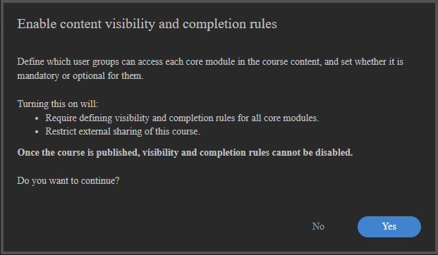
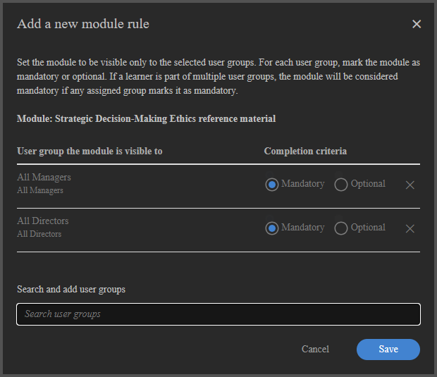
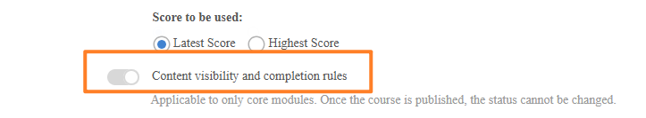
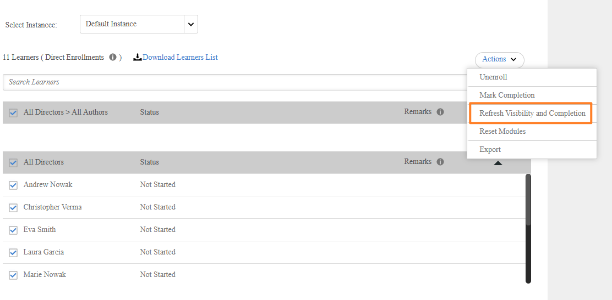

# Corsi adattativi per Autori

## Creazione e configurazione di un corso adattivo

Crea un corso con visibilità per modulo e regole di completamento in modo che gli Allievi diversi possano visualizzare e completare contenuti diversi in base ai propri gruppi di utenti.

>[!NOTE]
>
>Il tipo di corso adattivo è disponibile solo se per il tuo account sono state abilitate **regole di visibilità e completamento**. Se l’opzione per creare un corso adattivo non è disponibile, chiedi all’amministratore di abilitare l’apprendimento adattivo.

### Creazione di un corso adattivo

1. Accedi a Adobe Learning Manager come autore.

   

2. Nella barra di navigazione a sinistra, seleziona **Corsi**. Quindi seleziona **Aggiungi**.
3. Immetti il nome del corso, la descrizione e altri dettagli.
4. Seleziona l&#39;interruttore **Regole di visibilità e completamento del contenuto**.

   

5. Seleziona **Sì** nella finestra di dialogo di conferma.

   

   **Aggiungere moduli a un corso adattivo**

   Aggiungi i moduli richiesti. Aggiungi moduli di contenuti caricando il contenuto, selezionando dalla libreria di contenuti o aggiungendo sessioni in aula o in aula virtuale.

   **Tipi di moduli che supportano regole adattive (moduli contenuto):**

   * E-learning autonomo
   * Sessioni in aula
   * Sessioni in aula virtuale
   * Moduli attività

   **Tipi di modulo che NON supportano regole adattive:**

   * **Moduli di preparazione:** visualizzati da tutti gli allievi prima dell’inizio del contenuto principale. Non è possibile impostare regole di visibilità o completamento.
   * **Moduli di verifica:** disponibili per tutti gli Allievi. Il completamento di un test-out completa l’intero corso indipendentemente dallo stato del modulo dei contenuti. Non è possibile impostare regole di visibilità o completamento.
   * **Risorse formative:** visibili a tutti gli Allievi iscritti in qualsiasi momento.

6. Seleziona **Aggiungi**.

### Configurare le regole di visibilità e completamento per ciascun modulo

Dopo aver aggiunto un modulo di contenuto, configura le relative regole adattive:

1. Seleziona il modulo da configurare.
2. Nelle impostazioni del modulo, individua la sezione **Regole di visibilità e completamento**.

   

3. Seleziona **Aggiungi regole** per aggiungere i gruppi di utenti che possono visualizzare questo modulo.

   

   

   Gli Allievi in questi gruppi visualizzano il modulo nel corso, ma non devono completarlo a meno che non siano anche in modalità obbligatoria.

4. Seleziona **Salva**.
5. Ripeti l’operazione per ogni modulo di contenuto del corso.

**Regole chiave:**

* Un Allievo che appartiene a più gruppi di utenti ottiene il risultato più restrittivo: se un gruppo rende obbligatorio un modulo, questo è obbligatorio per quell’Allievo.
* È necessario configurare almeno un modulo come **Obbligatorio** per almeno un gruppo di utenti prima di poter pubblicare. Il sistema blocca la pubblicazione finché non viene soddisfatta questa condizione.

### Corso con stato Bozza

Quando un corso è in stato Bozza, rappresenta la fase in cui l’intera struttura adattiva può essere completamente progettata, configurata e perfezionata prima di essere bloccata per gli Allievi. In questa fase, gli autori possono definire se il corso deve funzionare come corso adattivo o come corso regolare e tale decisione rimane reversibile fino alla pubblicazione del corso. Questo rende la fase di bozza critica, in quanto è l&#39;unico punto in cui la natura adattiva di base del corso può essere stabilita o modificata.

Nella bozza, gli autori hanno il controllo completo sulla struttura del corso. Possono aggiungere, rimuovere e riordinare i moduli liberamente per modellare il flusso di apprendimento desiderato. Allo stesso tempo, possono configurare il comportamento adattivo a livello granulare definendo le regole di visibilità per ciascun modulo. Queste regole determinano quali gruppi di utenti possono accedere a moduli specifici, consentendo al corso di offrire in un secondo momento esperienze di apprendimento personalizzate. Oltre alla visibilità, gli autori possono anche definire regole di completamento, contrassegnando i moduli come obbligatori o facoltativi per gruppi di utenti diversi. Il sistema richiede che almeno un modulo sia obbligatorio per garantire criteri di completamento significativi.

Lo stato di bozza consente inoltre la modifica illimitata della logica adattiva. Gli Autori possono aggiungere, modificare o rimuovere le regole in modo iterativo, senza alcun vincolo di sistema, rendendo possibile sperimentare diverse configurazioni prima di finalizzare il corso. Oltre alla configurazione adattiva, tutti gli elementi standard del corso rimangono modificabili, inclusi i metadati del corso come il titolo e la descrizione, nonché i contenuti di apprendimento sottostanti, inclusi i moduli SCORM o altre risorse.

È importante comprendere che la configurazione adattiva nella bozza si applica solo ai moduli del corso principale. Altri componenti, ad esempio il contenuto di verifica o quello precedente alla lavorazione, non supportano le regole adattive e non sono interessati dalle configurazioni di visibilità o completamento.

Infine, lo stato Bozza rappresenta l’ultima opportunità per convalidare la configurazione del corso prima della pubblicazione. Una volta pubblicato il corso, la configurazione adattiva diventa permanente e non può essere ripristinata.

### Anteprima come Allievo

Selezionando **Anteprima come Allievo** vengono visualizzati tutti i moduli del corso, indipendentemente dalle regole del gruppo di utenti. In questo modo Autori e Amministratori possono avere una visione completa della struttura del corso. Gli Allievi in produzione vedono solo i moduli che i loro gruppi di utenti rendono visibili.

### Publish un corso adattivo

La pubblicazione di un corso adattivo segue lo stesso flusso di lavoro della pubblicazione di un corso normale.

Dopo aver configurato tutti i moduli e le relative regole, seleziona **Publish**.

Una volta pubblicato, il corso è disponibile per l’iscrizione. Quando aprono il corso, gli Allievi visualizzano solo i moduli configurati per i propri gruppi di utenti.

>[!IMPORTANT]
>
>Una volta pubblicato, il corso non può essere modificato da Adattivo a Normale o viceversa. Verifica la configurazione prima della pubblicazione.

### Aggiornamento di un corso adattivo pubblicato

È possibile aggiornare un corso adattivo pubblicato in qualsiasi momento. Le modifiche diventano effettive per gli Allievi iscritti quasi in tempo reale.

Tieni presente che non è più possibile modificare le impostazioni di visibilità nel corso adattivo. Non è possibile rendere il corso non adattivo.

### Aggiungere o modificare i moduli

1. Apri il corso pubblicato.
2. Seleziona **Modifica**.
3. Aggiungi, modifica o rimuovi i moduli e regola la loro visibilità e le regole di completamento.
4. Ripubblica il corso.

**Impatto:**

| Cambia | Effetto sugli Allievi iscritti in corso |
|---|---|
| Aggiunta di un nuovo modulo obbligatorio (visibile al gruppo di utenti di un Allievo) | Un modulo viene aggiunto al relativo requisito di completamento. Se il modulo è un’aula o una sessione aula virtuale senza postazioni rimanenti, l’Allievo viene inserito in lista d’attesa nel modulo. |
| Modulo rimosso o nascosto per il gruppo di utenti di un Allievo | Modulo rimosso dal requisito di completamento. Se questo era l’ultimo modulo obbligatorio, il corso viene completato automaticamente per l’Allievo. |
| Modulo cambiato da obbligatorio a facoltativo per il gruppo di utenti di un Allievo | Il modulo rimane visibile; l’Allievo non deve più completarlo per il completamento del corso. |
| Aggiunta del nuovo modulo obbligatorio (l’Allievo ha già completato il corso) | Il modulo diventa visibile per l’Allievo, ma questi non ottiene né accesso automatico a un posto né vi accede. Il nuovo modulo diventa accessibile solo quando viene attivato il completamento di un aggiornamento. |

### Comportamento cambio di istanza

Un Allievo che passa a un’altra istanza di un corso adattivo prosegue il suo avanzamento:

* I moduli già completati rimangono completati nella nuova istanza.
* Le postazioni vengono utilizzate solo per i moduli visibili non completati nella nuova istanza.
* Se i moduli visibili nella nuova istanza non hanno postazioni disponibili, l’Allievo viene inserito in lista d’attesa per tali sessioni.

## Gestire i limiti di posti e le liste di attesa nei corsi adattivi

I corsi adattativi in Adobe Learning Manager applicano i limiti dei posti a livello di singola classe o classe virtuale. A differenza dei corsi regolari, in cui una sessione completa blocca l’intera iscrizione, un corso adattivo iscrive immediatamente l’Allievo e lo mette in lista d’attesa solo nelle sessioni specifiche in cui non sono disponibili postazioni. L’Allievo può accedere a tutti gli altri moduli senza interruzioni.

### Come funzionano i limiti di posti nei corsi adattivi

Quando un Allievo si iscrive a un corso adattivo che include moduli aula o aula virtuale, il sistema verifica la disponibilità dei posti solo per le sessioni visibili all’Allievo in base ai gruppi di utenti a cui appartiene.

* Se tutte le sessioni visibili in aula o in aula virtuale hanno postazioni disponibili, l’Allievo è iscritto e ha accesso completo immediatamente.
* Se una o più sessioni visibili non hanno postazioni disponibili, l’Allievo viene iscritto e immediatamente inserito in lista d’attesa solo per tali sessioni specifiche. Possono iniziare e progredire immediatamente attraverso tutti gli altri moduli.

La tabella seguente descrive tutti gli scenari di postazioni e liste di attesa per i corsi adattivi.

| Condizione al momento dell’iscrizione | Risultato |
|---|---|
| Tutte le sessioni CR/VC visibili hanno postazioni disponibili | Iscritto con accesso completo a tutti i moduli |
| Una o più sessioni in aula virtuale visibili sono piene | Iscritto; in lista d’attesa solo per le sessioni complete; tutti gli altri moduli immediatamente accessibili |
| Allievo già iscritto; l’autore aggiunge una nuova sessione obbligatoria in aula/aula virtuale senza postazioni | L’Allievo era in lista d’attesa per la nuova sessione; l’avanzamento esistente e l’accesso non sono stati influenzati |
| Annullamento dell’iscrizione da parte dell’Allievo | Tutti i posti occupati sono stati immediatamente liberati; i prossimi Allievi in lista d’attesa sono stati cancellati nell’ordine della data di iscrizione |
| La modifica del gruppo di utenti rimuove una sessione dal set visibile dell’Allievo | Posti liberati immediatamente |
| L’Allievo completa il corso; diventa visibile una nuova sessione obbligatoria in aula/aula virtuale | Modulo visibile ma senza sedile assegnato automaticamente. L’Allievo deve attivare il completamento dell’aggiornamento per accedere alla sessione. |
| L’Amministratore o l’Istruttore assegna i posti | Tutte le sessioni in aula in aula in aula per classe virtuale per quell’Allievo vengono cancellate contemporaneamente |

### Visualizza la lista d’attesa

1. Apri il corso adattivo nella vista Amministratore.
2. Seleziona **Allievi**.
3. Selezionare la scheda **Lista d&#39;attesa**.

Nella scheda Lista di attesa sono elencati gli Allievi in lista d’attesa di uno o più moduli. Per i corsi adattivi, il report è a livello di modulo dell’istanza del corso anziché di istanza del corso, perché un Allievo può essere in corso su alcuni moduli mentre è in attesa su altri contemporaneamente.

### Cancella la lista d&#39;attesa e assegna posti

Quando una postazione diventa disponibile, a causa dell’annullamento dell’iscrizione di un Allievo, di un aumento del limite di partecipanti o dell’allocazione manuale, gli Allievi in lista d’attesa vengono cancellati in base all’ordine della data di iscrizione (prima la data di iscrizione più vicina).

Per allocare manualmente i posti a uno o più Allievi:

1. Aprire il corso adattivo.
2. Seleziona la scheda **Allievi** > **Lista d’attesa**.
3. Seleziona la casella di controllo accanto all’Allievo o agli allievi per i quali desideri assegnare postazioni.
4. Seleziona **Assegna Posti**.

Selezionando Alloca postazioni, l’Allievo selezionato viene cancellato dalla lista d’attesa su tutte le sessioni in lista d’attesa contemporaneamente, non solo sulla sessione attualmente visualizzata. Il sistema presuppone che il posto sia stato fisicamente o virtualmente organizzato per l’Allievo.

**Trigger cancellazione lista d&#39;attesa:**

La lista d’attesa viene elaborata automaticamente quando si verifica una delle seguenti situazioni:

* Un Allievo si annulla dall’iscrizione al corso (lasciando il posto in tutte le sessioni tenute)
* Il limite di seggi per una sessione è aumentato
* Un Allievo cambia istanza
* Un amministratore o un istruttore assegna le postazioni

>[!NOTE]
>
>Quando crei una nuova istanza di un corso adattivo, l’opzione **Notifica allievi in lista d’attesa** non è disponibile. Questo è il comportamento previsto e differisce dai corsi regolari.

In un corso normale, la lista d’attesa viene monitorata a livello di istanza, pertanto il sistema può richiedere di notificare agli Allievi in attesa quando viene aperta una nuova istanza. In un corso adattivo, le liste di attesa vengono registrate a livello di singola classe o aula virtuale **sessione**, non a livello di istanza. Non esiste una lista d’attesa a livello di istanza per notificare quando viene creata una nuova istanza, quindi il prompt non viene visualizzato e non vengono inviate notifiche automatiche.

## Attivazione del completamento dell’aggiornamento per un corso adattivo

L’aggiornamento del completamento in Adobe Learning Manager consente di rivalutare il completamento di un corso adattivo dell’Allievo in caso di modifica delle sue esigenze di apprendimento. Ciò è rilevante quando il gruppo di utenti di un Allievo cambia, quando un Autore aggiorna le regole del modulo o quando un Allievo desidera seguire nuovamente un corso adattivo nel suo profilo corrente.

### Che cosa fa il completamento dell’aggiornamento

In un corso adattivo, la serie di moduli obbligatori di un Allievo è determinata dai suoi gruppi di utenti nel momento in cui completa il corso. Se i gruppi di utenti cambiano in seguito o se l’Autore aggiunge nuovi moduli obbligatori, l’Allievo potrebbe dover completare contenuto aggiuntivo per soddisfare i requisiti del nuovo profilo.

L&#39;aggiornamento del completamento consente di eseguire due operazioni:

1. Ripristina il completamento del corso esistente dell’Allievo se ora dispone di nuovi moduli obbligatori incompleti.
2. Crea un nuovo record nella Trascrizione Allievo che rappresenta il requisito di completamento aggiornato.

Il record di completamento originale viene conservato nella Trascrizione Allievo come voce cronologica. I moduli completati in precedenza restano completati. L’Allievo non deve ripeterli, a meno che non si tratti di moduli obbligatori di recente istituzione che non erano visibili o non erano stati completati in precedenza.

### Quando viene applicato il completamento dell&#39;aggiornamento

**Scenario 1: la modifica del gruppo di utenti aggiunge nuovi moduli obbligatori**

Un Allievo completa un corso adattivo. Il gruppo di utenti viene successivamente modificato e il nuovo gruppo di utenti rende obbligatori i moduli precedentemente nascosti o facoltativi.

* La voce di completamento esistente rimane nella Trascrizione Allievo.
* Se l’Allievo ha nuovi moduli obbligatori non completati, viene creata una nuova riga Trascrizione Allievo e il corso viene visualizzato come in corso.
* L’Allievo deve completare i nuovi moduli obbligatori per ottenere un nuovo completamento.

**Scenario 2: la modifica del gruppo di utenti non determina la creazione di nuovi moduli obbligatori**

Un Allievo completa un corso adattivo. Il gruppo di utenti cambia, ma i requisiti del nuovo gruppo di utenti sono già soddisfatti dai completamenti esistenti.

* Il corso rimane in uno stato completato.
* Non viene creata alcuna nuova riga Trascrizione Allievo.
* Non è richiesto alcun intervento da parte dell’Allievo.

**Scenario 3: ripresa avviata dall’Allievo**

Un Allievo che ha già completato un corso adattivo può scegliere di ripeterlo per completarlo nell’ambito del profilo del gruppo di utenti corrente. Questa funzione è utile quando il ruolo di un Allievo è cambiato rispetto al completamento originale.

1. L’Allievo apre il corso adattivo completato.
2. L’Allievo seleziona l’opzione per riprendere o riavviare il corso.
3. Il corso viene rivalutato utilizzando i gruppi di utenti correnti per determinare il nuovo set di moduli obbligatori.
4. Viene creata una nuova riga Trascrizione Allievo.

**Scenario 4: comportamento del modulo di verifica**

Se un Allievo ha completato un modulo di verifica prima che venisse attivato il completamento dell’aggiornamento, tale completamento è ancora valido dopo l’aggiornamento. Una volta che il sistema ha valutato il completamento del corso (attivato da un completamento del modulo o da un’azione dell’Allievo), il corso verrà completato automaticamente di nuovo perché il test è già stato eseguito, a meno che il corso non abbia altri moduli di contenuti obbligatori ora richiesti e incompleti.

>[!NOTE]
>
>Se una nuova sessione in aula o in aula virtuale viene aggiunta al corso adattivo dopo che un Allievo l’ha completata tramite test-out e successivamente viene attivato un completamento di aggiornamento, l’Allievo potrebbe non essere visualizzato automaticamente nella scheda **Frequenza e punteggio** o nella **Lista d’attesa** per la nuova sessione. Questo si verifica perché il completamento del test mantiene il corso in uno stato completato e la logica di assegnazione del posto non viene riattivata. Se devi tenere traccia della partecipazione di un Allievo in formazione in prova per una sessione appena aggiunta, assegna manualmente il posto dalla scheda **Lista d’attesa**. Tieni presente che i moduli di verifica non sono l’approccio consigliato per i corsi adattivi.

**Scenario 5: aggiornamento attivato dall&#39;amministratore**

Un amministratore può attivare un completamento dell’aggiornamento per conto di un allievo se il suo profilo è cambiato e l’amministratore stabilisce che il record di completamento esistente non riflette più i requisiti correnti.

>[!CAUTION]
>
>Se il corso adattivo fa parte di una certificazione ricorrente, il completamento dell’aggiornamento si applica solo all’iscrizione dell’Allievo nel ciclo di certificazione principale. I cicli ricorrenti successivi contengono un&#39;istanza separata del corso adattivo non interessata dall&#39;aggiornamento. Gli Allievi iscritti a un ciclo ricorrente non vedono gli aggiornamenti dei moduli, né i loro completamenti vengono ripristinati. Se la tua organizzazione utilizza corsi adattivi nelle certificazioni ricorrenti, comunica questa limitazione agli amministratori prima di attivare i completamenti dell’aggiornamento

1. Apri il profilo dell’Allievo o la scheda Allievo del corso nella vista Amministratore.
2. Individua l’iscrizione dell’Allievo.
3. Selezionare **Aggiorna visibilità e completamento**.

ALM rivaluta i moduli obbligatori in base ai gruppi di utenti correnti dell’Allievo e ripristina il completamento se sono presenti nuovi moduli obbligatori.
