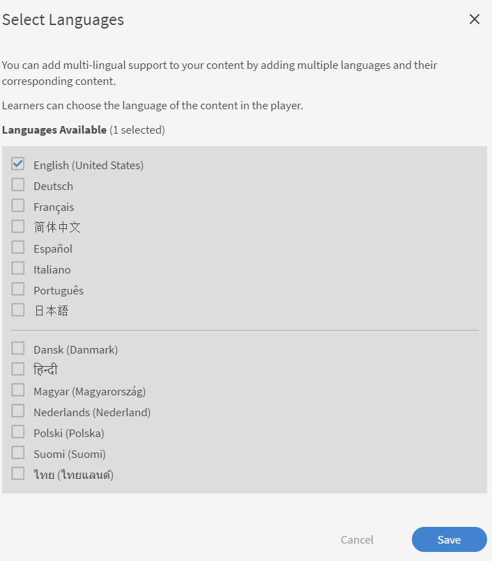

# Aggiungere oggetti di apprendimento in diverse versioni locali

Leggi questo argomento per scoprire come aggiungere corsi, certificazioni e piani di apprendimento in diverse lingue.

Come Autore, puoi creare oggetti di apprendimento quali corsi, certificazioni e piani di apprendimento. Puoi anche creare questi oggetti di apprendimento in diverse lingue.

Learning Manager ti consente di creare oggetti di apprendimento in diverse lingue. Quando crei l’oggetto di apprendimento, puoi aggiungere il contenuto e/o i metadati in più lingue. Puoi anche modificare i dettagli dell’oggetto di apprendimento in qualsiasi momento e offrire l’oggetto di apprendimento in altre lingue.

Per aggiungere una nuova lingua, fai clic sul corso, sulla certificazione o sul piano di apprendimento per cui desideri aggiungere nuove lingue. Nella pagina Informazioni di base, fai clic su Aggiungi nuova lingua nella parte superiore.

*Aggiungi una nuova lingua*

Nella finestra di dialogo a comparsa, seleziona la lingua o le lingue aggiuntive che desideri offrire agli Allievi e fai clic su Salva.

*Selezionare una lingua*

Ripubblica il corso affinché le tue modifiche abbiano effetto.

## Supporto multilingue per istanze CR/VC con assegnazione di tag alla lingua

Adobe Learning Manager (ALM) consente agli Autori di creare istanze specifiche della lingua utilizzando i tag della lingua per i moduli Aula e Aula virtuale. Questa funzione consente agli Allievi di accedere ai moduli CR/VC nella lingua preferita. Ad esempio, un autore può creare un modulo CR/VC con due istanze: una in inglese e una in francese. Gli Allievi possono selezionare le istanze nella lingua preferita.

### Flusso di lavoro

In primo luogo, l’Autore crea e pubblica un corso in più lingue, abilitando le opzioni della lingua nella pagina di creazione dell’istanza. L’autore può quindi creare diverse istanze selezionando una lingua per ciascuna di esse. Gli Allievi possono scegliere l’istanza in base alla lingua a cui sono stati mappati.

### Creazione di un corso con più lingue

Segui questi passaggi per creare un corso con più lingue:

1. Accedi come **[!UICONTROL Autore]**.
2. Seleziona **[!UICONTROL Corsi]** > **[!UICONTROL Aggiungi]** per creare un corso.
3. Digita il **[!UICONTROL Nome]** e la **[!UICONTROL Descrizione]** del corso.
4. Selezionare **[!UICONTROL Aggiungi nuova lingua]** e selezionare le lingue richieste. Verranno create più schede per ogni lingua.

   
   _Aggiungi nuova lingua - Corso_
5. Vai alle rispettive schede delle lingue e digita il **[!UICONTROL Nome]** e la **[!UICONTROL Descrizione]** del corso.
6. Nella scheda Inglese (Stati Uniti), seleziona **[!UICONTROL Aggiungi modulo]** > **[!UICONTROL Modulo aula virtuale]**.

   >[!NOTE]
   >
   >La procedura sarà la stessa anche per il modulo Classe.

   
Aggiungi nuova lingua per il modulo aula virtuale

7. Digita **[!UICONTROL Titolo]** e **[!UICONTROL Descrizione]** in ogni scheda della lingua e seleziona **[!UICONTROL Aggiungi]**.
8. Immetti i dettagli richiesti per il corso e pubblica il corso.

### Creare istanze per ogni lingua

Puoi creare le istanze per ogni lingua dalle app per Amministratori e Autori. Segui questi passaggi per creare le istanze dall’app Autore:

1. Accedi come **[!UICONTROL Autore]**.
2. Seleziona **[!UICONTROL Corsi]** e seleziona il corso multilingue.
3. Seleziona **[!UICONTROL Istanze]** > **[!UICONTROL Aggiungi nuova istanza]** per creare le istanze.
4. Digita **[!UICONTROL Nome istanza]** e seleziona la **[!UICONTROL Scadenza per il completamento]**.
5. Seleziona **[!UICONTROL Mostra più opzioni]** per visualizzare le altre opzioni.
6. Seleziona la lingua richiesta dal menu a discesa **[!UICONTROL Lingua]**.

   
   _Selezionare la lingua per l&#39;istanza_

7. Immetti gli altri dettagli e seleziona **[!UICONTROL Salva]**.
8. Create istanze per altri linguaggi seguendo gli stessi passaggi. Gli Allievi potranno visualizzare tutte le istanze della lingua per questo corso.

### Seleziona l’istanza e iscriviti - Flusso di lavoro Allievo

Gli Allievi possono visualizzare queste istanze della lingua nella propria app. Possono scegliere l’istanza della lingua preferita, iscriversi e partecipare alle sessioni di videoconferenza in quella lingua.

Segui questi passaggi per selezionare l&#39;istanza e iscriverti:

1. Nell’app per Allievi, accedi al **[!UICONTROL Catalogo]** e seleziona il corso.
2. È possibile visualizzare la schermata seguente con più istanze.

   
   _Modulo classe virtuale per Allievi_

3. Puoi escludere il filtro utilizzando l’opzione Filtro lingua. Seleziona la lingua preferita e iscriviti al corso.
4. Una volta selezionato, puoi visualizzare i seguenti dettagli nella pagina della panoramica del corso.

_Dettagli istanza_

