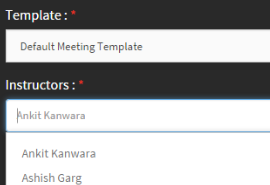

# Integrazione con Adobe Connect

Gli Autori possono creare corsi in aula virtuale con Adobe Connect durante la creazione del corso. Per abilitare Adobe Connect per il tuo account Learning Manager, devi contattare l’amministratore della tua organizzazione.

## Creazione di un corso di classe virtuale (VC) con Adobe Connect {#createvirtualclassroomvccoursewithadobeconnect}

1. Nella pagina I miei corsi, fai clic su Aggiungi moduli e scegli Classe virtuale. Viene visualizzata la finestra di dialogo Crea classe virtuale.
1. Nella **Sistema di conferenza** , scegli Adobe Connect.

   

   *Creare un’aula virtuale*

1. Inserisci titolo, descrizione, data classe virtuale, ora di inizio e di fine.

   Se Adobe Connect non è configurato per il tuo account, viene visualizzato un messaggio di avviso come illustrato nella schermata precedente. Le opzioni Modello, Istruttori e altre opzioni Adobe Connect sono disattivate. Per configurare Adobe Connect per il tuo account, contatta il tuo amministratore.

1. Adobe L’applicazione Learning Manager recupera i modelli predefiniti (riunioni, formazione ed eventi) e l’elenco degli istruttori (utenti con autorizzazioni ospitante) da Adobe Connect. Scegli il modello che preferisci.
1. Scegli l’istruttore per il corso di classe virtuale dall’elenco degli istruttori.

   

   *Seleziona l’istruttore dall’elenco*

1. Fornisci i criteri di completamento per il corso VC. I criteri di completamento corrispondono alla percentuale della durata totale del corso a cui un Allievo deve partecipare per essere considerato come completato. Ad esempio, la durata del corso è di 1 ora. Se fornisci il 50% come criterio di completamento, se un Allievo segue il corso anche per 30 minuti, il corso viene considerato completato per l’Allievo.
1. Fai clic **[!UICONTROL Fine]**.

## Modelli condivisi di Adobe Connect {#sharedtemplatesofadobeconnect}

Per impostazione predefinita, tutti i modelli condivisi creati nell’account Adobe Connect vengono recuperati nell’applicazione Learning Manager. Puoi aggiungere modelli personalizzati rendendoli condivisi nell’account Adobe Connect.
