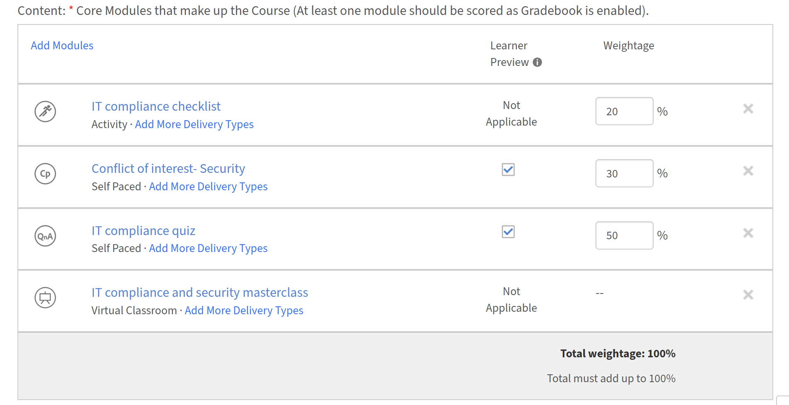
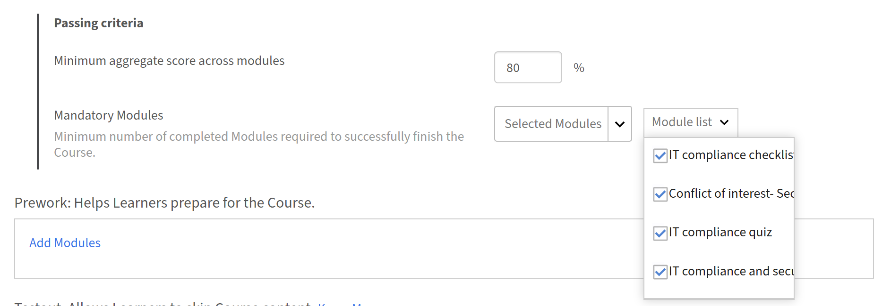
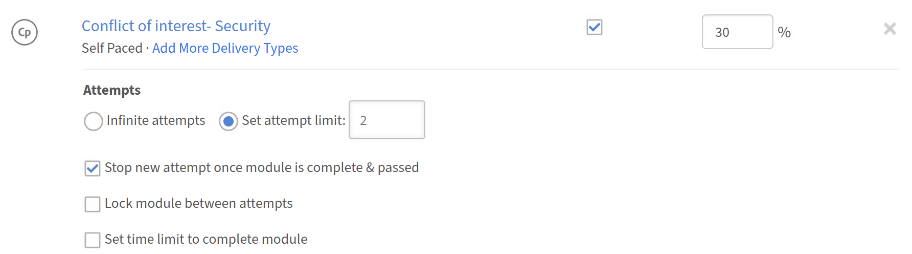
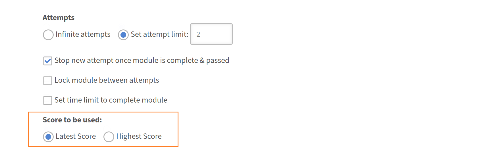

# Gradebook per autori

## Configurare Gradebook per un corso

Imposta il punteggio ponderato per un corso in Adobe Learning Manager in modo che ogni Allievo riceva un punteggio aggregato calcolato dalle prestazioni del modulo e in modo che il completamento del corso possa essere legato al raggiungimento di una soglia minima del punteggio.

Gradebook viene configurato a livello di corso durante la creazione di un nuovo corso. Non può essere aggiunto a un corso pubblicato esistente.

>[!NOTE]
>
>Per consentire agli Allievi di visualizzare il Gradebook in un corso, un Amministratore deve prima abilitare **la visibilità del Gradebook** a livello di account.

### Abilitare Gradebook per un corso

* Accedi a Adobe Learning Manager come autore.
* Nella barra di navigazione a sinistra, seleziona **Corsi** e quindi **Aggiungi** per creare un nuovo corso.
* Immetti il nome del corso, la descrizione e altri dettagli obbligatori.
* Nella sezione **Moduli**, individua l&#39;interruttore **Gradebook**.

  

* Seleziona l&#39;interruttore **Gradebook** per abilitarlo. Sotto di esso vengono visualizzate due opzioni. Entrambe sono attivate per impostazione predefinita:
  * **Mostra Gradebook agli Allievi:** gli Allievi visualizzano una scheda **Gradebook** nel lettore del corso che mostra i punteggi del modulo, la scomposizione del peso e il risultato aggregato. Disattiva questa opzione per calcolare i livelli internamente senza esporli agli Allievi.
  * **Includi moduli che non contribuiscono al voto finale:** moduli non divisibili (PDF, video, audio e simili) vengono visualizzati in Gradebook. I moduli senza punteggio non contribuiscono al punteggio finale dell’Allievo.

### Aggiungi moduli e assegna la ponderazione

Dopo aver abilitato Gradebook, aggiungi i moduli di contenuto e assegna una percentuale di ponderazione a ciascun modulo con punteggio. Prima di poter salvare la configurazione, le percentuali di ponderazione devono essere sommate esattamente a 100.

* Selezionare **Aggiungi moduli**.
* Nel selettore di moduli, seleziona i moduli da aggiungere e seleziona **Aggiungi**. I moduli vengono visualizzati nella sezione **Contenuto**. I moduli con punteggio, SCORM, contenuti Captivate, AICC, xAPI, quiz nativi, moduli attività, sessioni in aula e sessioni in aula virtuale visualizzano un campo di input **Ponderazione**. I moduli senza punteggio mostrano un trattino nella colonna Peso.
* Immettere un valore percentuale nel campo **Ponderazione** per ogni modulo con punteggio. Un indicatore di **peso totale** si aggiorna durante la digitazione e deve raggiungere esattamente il **100%** prima di poter salvare.

  

* Per i moduli con più tipi di recapito: la ponderazione può essere assegnata solo se **tutti** i tipi di recapito nel modulo supportano il punteggio. Se un tipo di consegna non supporta il punteggio, non è possibile pesare l&#39;intero modulo.

>[!NOTE]
>
>Non è necessario che la scala di punteggio corrisponda tra i tipi di recapito. Una sessione in classe con un punteggio su 100 e un modulo SCORM con un punteggio su 10 possono coesistere nello stesso Gradebook. La formula normalizza automaticamente ogni contributo.

### Imposta il punteggio minimo di superamento

* Nell’editor del corso, individua la sezione **Criteri di superamento**.
* Nel campo **Punteggio aggregato minimo tra i moduli**, immettere una percentuale compresa tra 0 e 100.
* Un valore di **0** indica che il corso viene completato solo in base al completamento del modulo richiesto, senza soglia di punteggio aggregata.
* Un valore superiore a 0 indica che l’Allievo deve completare i moduli richiesti E soddisfare o superare questo punteggio aggregato.
* Nel campo **Moduli obbligatori**, immetti il numero richiesto o selezionalo dal menu a discesa.

  

* Seleziona **Salva**.

Il punteggio minimo di superamento è visibile agli Allievi nella scheda **Gradebook**, in modo che conoscano la soglia prima di iniziare.

### Configurare le impostazioni del punteggio per i moduli con più tentativi {#configurescoresettingsmultipleattempts}

Quando un modulo consente più tentativi, scegliere il punteggio dei tentativi da utilizzare nel calcolo Gradebook.

* Nell’editor del corso, individua un modulo per il quale sono abilitati più tentativi.

  

* Individuare l&#39;impostazione **Punteggio da utilizzare** accanto al modulo.
* Seleziona **Più recente** o **Più recente**:
  * **Più recente:** viene sempre utilizzato il punteggio dei tentativi più recente. Un punteggio più basso in un tentativo successivo sostituisce un punteggio più alto precedente.
  * **Massimo:** viene mantenuto il punteggio migliore di qualsiasi tentativo. Un punteggio inferiore in un tentativo successivo non riduce il punteggio memorizzato.

    

* Seleziona **Salva**.

### Publish del corso

Dopo aver configurato tutte le impostazioni del Gradebook, pubblica il corso utilizzando il flusso di lavoro standard. Seleziona **Salva**, quindi seleziona **Publish** per rendere il corso disponibile agli Allievi.

### Procedure ottimali

* Assegna un fattore di ponderazione che rifletta l’importanza relativa di ciascun modulo. Assegnare percentuali più elevate ai moduli più critici per l’obiettivo di apprendimento.
* Abilita **Mostra disegno agli Allievi** a meno che non ci sia un motivo specifico per nascondere i punteggi. Gli Allievi che possono visualizzare il peso e il punteggio di esecuzione si trovano in una posizione migliore per assegnare le priorità alle proprie attività.
* Imposta il punteggio minimo richiesto prima dell’iscrizione degli Allievi. La modifica dopo le iscrizioni attive può influire sui completamenti in corso.
* Usa **Massimo** per l’impostazione a tentativi multipli quando i moduli sono valutazioni che gli Allievi devono riprovare. Utilizza **Ultime** per acquisire il livello di conoscenza corrente anziché le prestazioni migliori.
* Verifica che l&#39;indicatore **Peso totale** mostri esattamente il 100% prima di salvare.
