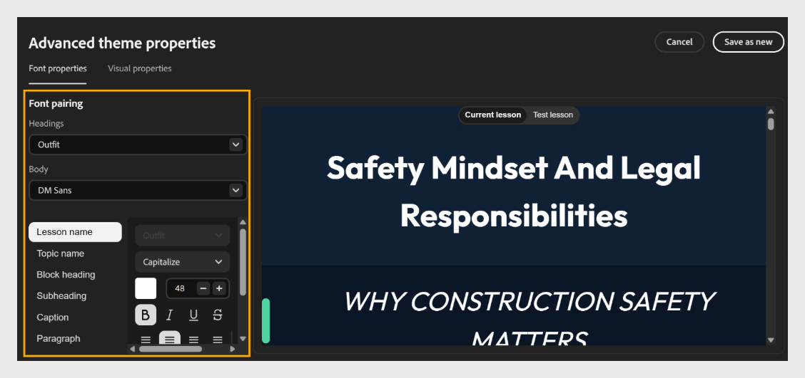

# Personalizzazione avanzata del tema in Composizione contenuto

## Personalizzare le proprietà avanzate del tema nell’app

Utilizzare le proprietà avanzate del tema per un controllo più granulare sui singoli elementi, ad esempio i nomi di lezioni, argomenti, intestazioni di blocchi, sottotitoli, didascalie e paragrafi.

1. Seleziona **Temi**, passa il mouse sul tema applicato, seleziona **Modifica**, quindi seleziona **Avanzate**.
   

2. Nel pannello Proprietà font, imposta **Associazione font** per il corso:

   - Seleziona il menu a discesa **Intestazioni** e scegli un font per tutte le intestazioni.

   - Seleziona il menu a discesa **Corpo** e scegli un font per il corpo del testo.
     

3. Impostare l&#39;elenco di elementi: **Nome lezione**, **Nome argomento**, **Intestazione blocco**, **Sottotitolo**, **Didascalia** e **Paragrafo;** selezionare l&#39;elemento che si desidera personalizzare.

4. Nel pannello [!UICONTROL Proprietà visive] è possibile regolare il layout e la spaziatura nel corso.

   - Impostate la spaziatura tra gli elementi utilizzando le opzioni di densità del contenuto.

   - Per impostare il **raggio angolo scheda/immagine**, trascinate il cursore o immettete un valore per impostare la rotondità delle schede e delle immagini. Ad esempio, imposta il raggio su 17 px.

   - Seleziona **Lezione** per modificare il colore di sfondo o l&#39;immagine di una lezione.

   - Selezionare **Argomento** per impostare il colore o il bordo di sfondo di un argomento.

   - Selezionare **Intestazione/Piè di pagina** per impostare l&#39;intestazione e le proprietà.

   Composizione contenuto visualizza automaticamente in anteprima le modifiche apportate nell’area di lavoro.

5. Per l&#39;elemento selezionato, personalizzarne le proprietà in base alle esigenze:

   - Scegliete uno **stile font**, ad esempio Maiuscolo.

   - Imposta la **dimensione font** utilizzando i controlli **+** e **-**.

   - Scegli un **colore font**.

   - Applicate formattazione, ad esempio **Grassetto**, *Corsivo*, <u>Sottolineato</u> o ~~Barrato~~.

   - Impostare l&#39;**allineamento del testo**.

6. Visualizza in anteprima le modifiche nell&#39;area di lavoro a destra. Utilizza le schede **Lezione corrente** e **Lezione di prova** per verificare come vengono visualizzate le modifiche nelle diverse lezioni.
   

7. Seleziona **Salva come nuovo** o **Salva**.
