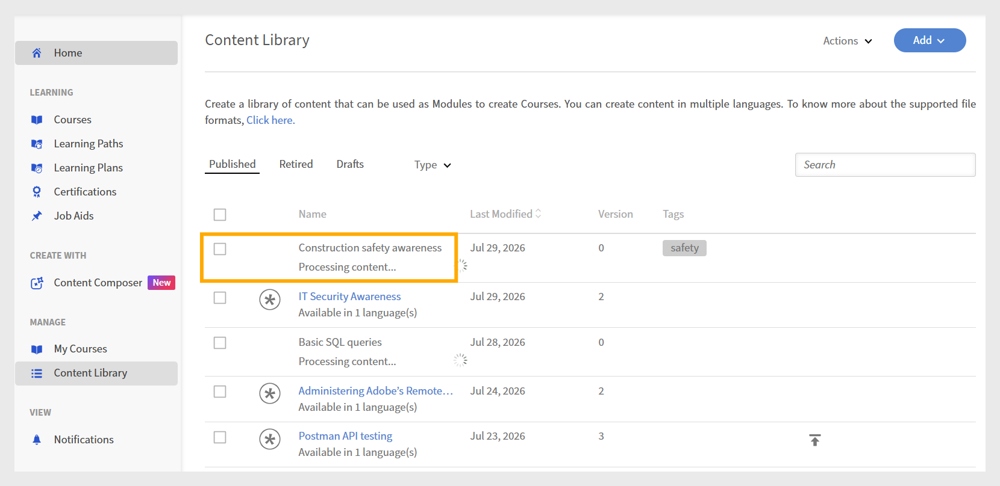

# Collaborazione tra Adobe Learning Manager Content Composer e Adobe Learning Manager

Content Composer gestisce la creazione. Adobe Learning Manager gestisce la consegna, l&#39;iscrizione, il tracciamento e la creazione di rapporti. I due prodotti si connettono tramite un passaggio di pubblicazione. Una volta pubblicato da Content Composer, il corso diventa un modulo nella libreria dei contenuti ALM, dove può essere assemblato in un corso e assegnato agli allievi.

## Controlli di Composizione contenuto

- Struttura della lezione e dell’argomento

- Contenuto del corso: testo, immagini, video, componenti e verifiche della conoscenza

- Quiz di fine lezione, inclusi i tipi di domande e le opzioni di risposta

- Tema visivo

- Criteri di completamento e criteri di successo

- Versione SCORM utilizzata per la creazione di report

## Controlli di Adobe Learning Manager

- Iscrizione e accesso degli Allievi

- Metadati modulo: durata, tag, ID univoci, scadenza

- Assemblaggio del corso: combinazione dei moduli Content Composer con altri contenuti di apprendimento

- Tracciamento, reporting e trascrizioni degli Allievi

- Controllo delle versioni dei corsi

- Notifiche e promemoria

## Dalla creazione del corso al completamento dell’Allievo

1. **Creazione del corso in Content Composer**: creazione di un corso in Content Composer che includa lezioni, argomenti, temi, quiz e impostazioni di completamento. Prima della pubblicazione, configura le impostazioni del corso (criteri di completamento, criteri di successo e punteggio dei quiz).
Per ulteriori informazioni, consulta [Configurare le impostazioni del corso](#settings).

2. **Da Publish a Adobe Learning Manager:** al termine della creazione, connetti Composizione contenuti al tuo account ALM tramite le impostazioni **Esporta** e pubblica il corso. Content Composer invia il corso alla libreria dei contenuti ALM come modulo conforme allo standard SCORM.
   

3. **Configurare il modulo in ALM:** una volta pubblicato, il corso viene visualizzato come modulo nella libreria dei contenuti ALM. Un Autore ALM configura i metadati del modulo, tra cui durata, tag, ID univoci e impostazioni di scadenza, e aggiunge il modulo a un corso ALM insieme ad altri contenuti di apprendimento.
   

>[!NOTE]
>
>Se impostate i criteri di completamento e successo in Adobe Learning Manager (ALM), tali impostazioni hanno la precedenza su quelle definite in Composizione contenuto.

4.**Publish del corso ALM:** Un autore ALM assembla il modulo in un corso ALM, aggiunge immagini e impostazioni del corso e lo pubblica. Gli Allievi possono essere iscritti solo dopo questo passaggio.

Per ulteriori informazioni, consulta [Adobe Learning Manager](https://experienceleague.adobe.com/en/docs/learning-manager/using/get-started/getting-started-author).

Per ulteriori informazioni, consulta [Creazione del corso come autore su ALM](https://experienceleague.adobe.com/en/docs/learning-manager/using/authors/courses).

5.**Gli Allievi completano il corso:** accedono al corso tramite Adobe Learning Manager, avviano il modulo Content Composer, completano le lezioni e i quiz e ricevono i punteggi in base ai criteri di completamento e di successo configurati nel passaggio 1.

Per ulteriori informazioni, consulta [Accedere al corso come Allievo](https://experienceleague.adobe.com/en/docs/learning-manager/using/get-started/getting-started-learner).

&#x200B;6. ALM registra i progressi degli allievi: lo stato di completamento, i punteggi dei quiz e i dati degli allievi vengono registrati in ALM e resi disponibili tramite le trascrizioni degli allievi e i report amministrativi.

7.**Aggiornare il corso utilizzando il controllo delle versioni**: quando aggiorni il contenuto in Content Composer e lo ripubblichi, ALM crea una nuova versione del modulo. Gli Autori ALM possono aggiornare i corsi esistenti per utilizzare la versione più recente.
