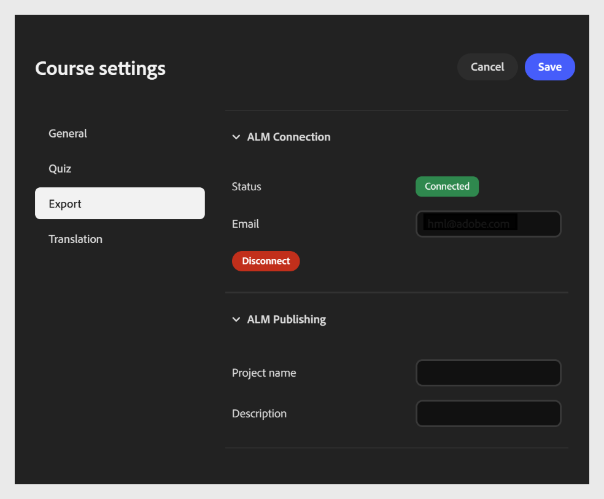
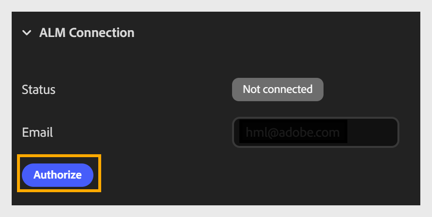
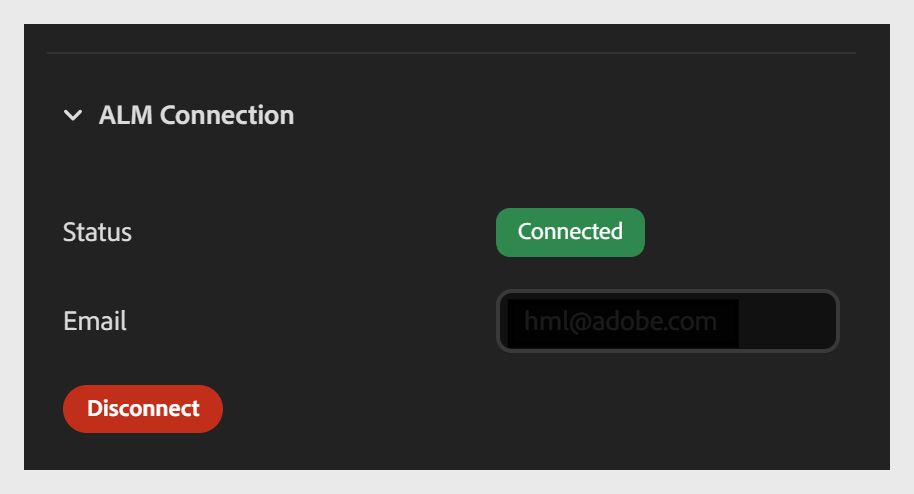

# Connetti e pubblica su Adobe Learning Manager

La scheda **Esporta** consente di collegare il corso a Adobe Learning Manager (ALM) e di pubblicarlo direttamente nella libreria dei contenuti ALM. Per configurare la connessione, immetti l’indirizzo e-mail nel campo **E-mail**. Assicurati di avere un account ALM con lo stesso ID di accesso e-mail. Una volta connesso, puoi pubblicare il corso su ALM come modulo.

Questa connessione viene configurata una sola volta per corso. Una volta stabilito, non è necessario riconnettersi ogni volta che si pubblica o si esporta.

Esso è suddiviso in due sezioni:

- Sezione Connessione ALM

- Sezione Pubblicazione ALM

**Per configurare le impostazioni di esportazione**

1. Apri **Impostazioni corso** e seleziona la scheda **Esporta** a sinistra.

2. Espandere la sezione **Connessione ALM** (se non è già stata espansa).

   - Immetti l&#39;**indirizzo e-mail** associato al tuo account Adobe Learning Manager.

   - Seleziona **Autorizza** per accedere e connettere il corso al tuo account ALM.
     

   - Dopo l&#39;autorizzazione, confermare gli aggiornamenti del campo **Stato** da **Disconnetti** a **Connessi**.
     

## Dettagli pubblicazione Adobe Learning Manager

Dopo aver collegato il tuo account, configura i dettagli di pubblicazione nella sezione Pubblicazione ALM.

- Immetti un nome di **progetto** per identificare il corso. Questo nome viene visualizzato come titolo del corso nella libreria dei contenuti ALM.

- Immetti una **Descrizione**: un breve riepilogo del corso visualizzato accanto ad esso nella libreria dei contenuti ALM per aiutare Allievi e Amministratori a comprenderne lo scopo.

- Seleziona **Publish** per inviare il corso alla libreria dei contenuti ALM come modulo.
