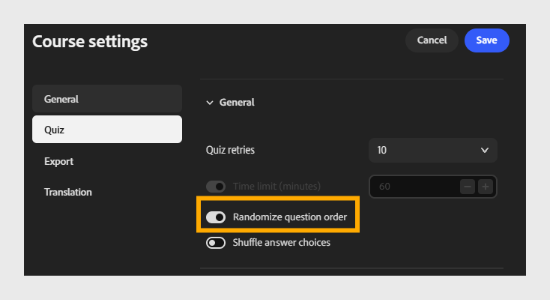
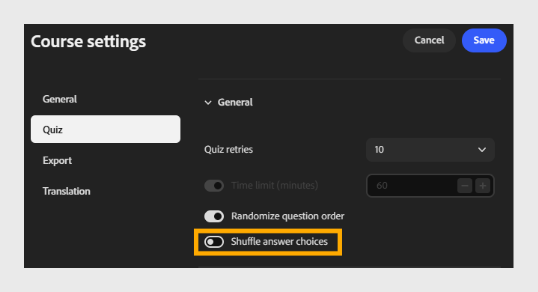

# Configurare le impostazioni del quiz

Seleziona **Quiz** per configurare il comportamento e il punteggio del quiz.

Questa scheda contiene due sezioni: **Generale** e **Punteggio**.

## Sezione Generale

- **Tentativi di quiz**: scegli il numero di tentativi a disposizione di un Allievo per completare il quiz. Ad esempio, seleziona **3** per consentire un massimo di 3 tentativi.
  

- **Limite di tempo (minuti)**: seleziona l&#39;interruttore per abilitare un limite di tempo, quindi immetti la durata in minuti. Ad esempio, immetti **60** per dare agli Allievi 60 minuti per completare il quiz.

- **Ordine casuale delle domande**: seleziona l’interruttore per visualizzare le domande in ordine casuale per ogni Allievo.
  

- **Scelte di risposta casuali:** Selezionare l&#39;opzione per attivare o disattivare lo slittamento delle scelte di risposta per ogni domanda.
  

## Sezione Punteggio

- **Standard**:

Seleziona la versione SCORM utilizzata per segnalare i risultati del quiz al tuo LMS. Scegliere la versione che soddisfa i requisiti di compatibilità del sistema LMS.
Ad esempio, selezionare **SCORM 1.2**.

>[!NOTE]
>
>Se non siete sicuri di quale versione SCORM scegliere, rivolgetevi all’amministratore LMS.

