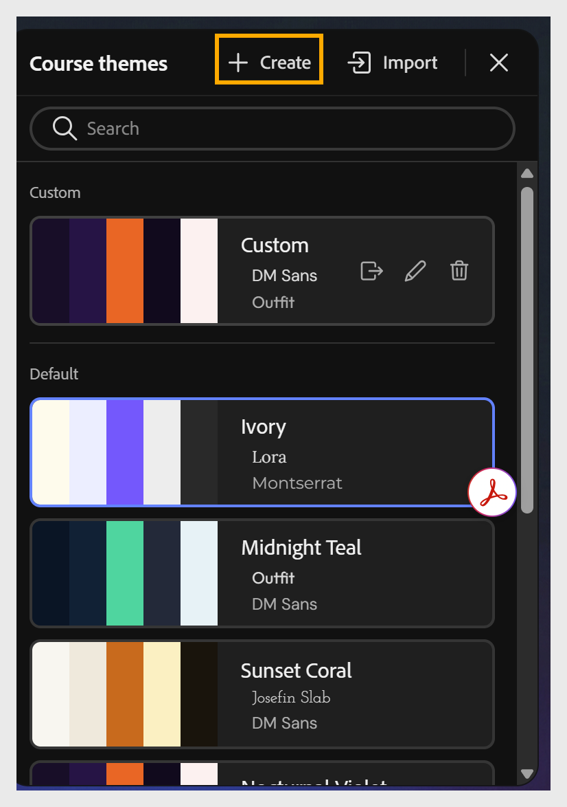
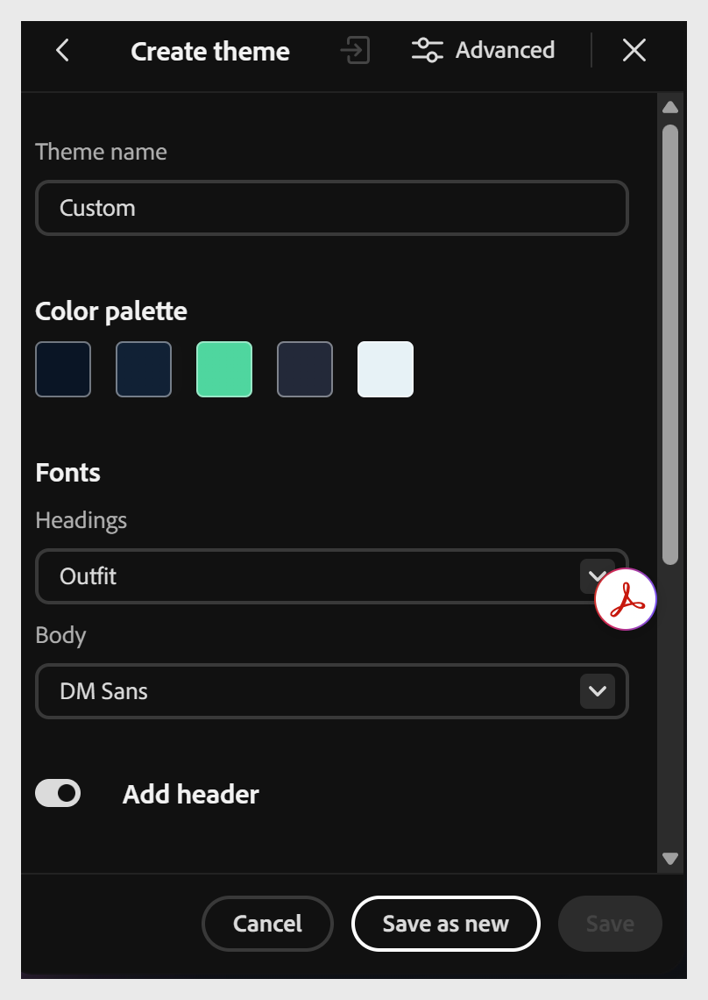
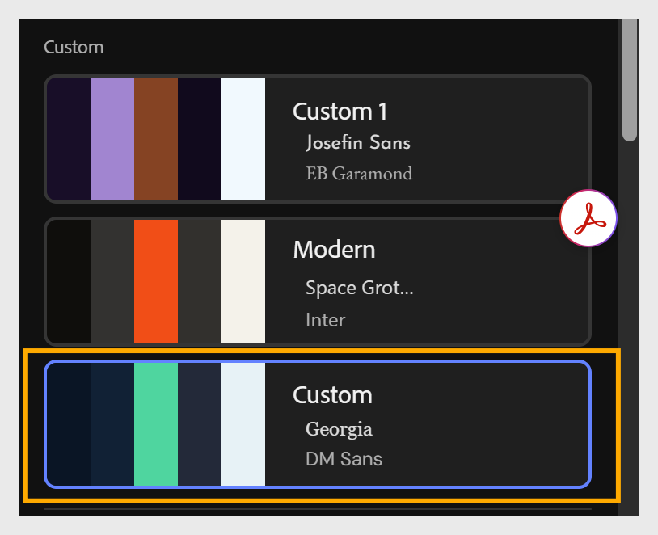

# Creare un tema

Due modi per creare un tema personalizzato, entrambi consentono di aggiungere il risultato all&#39;elenco dei temi **Personalizzati**:

- **Creare da zero** utilizzando l&#39;opzione **Crea** nella barra degli strumenti: configurare la tavolozza dei colori, i font e altre proprietà, quindi **Salva come nuovo**.

- **Importare un File JSON personalizzato**: esporta un tema esistente come JSON, modificalo in un editor di testo o di codice, quindi importalo di nuovo.

**È necessario un maggiore controllo?**

Per la composizione tipografica per elemento (nomi di lezioni, argomenti, intestazioni di blocchi, didascalie), la personalizzazione a livello di token di colore e l&#39;accesso completo allo schema JSON, il tipo di controllo desiderato in genere dal team della piattaforma o del marchio, vedere [Personalizzazione avanzata del tema](advanced-theme-customization.md).

## Creare un tema da zero

1. Seleziona **Crea** dalla barra degli strumenti per aprire il pannello **Temi corso**.
   

2. Configura la tavolozza dei colori, i font e altre proprietà del tema in base alle esigenze.
   

3. Seleziona **Salva come nuovo** per aggiungere il tema all&#39;elenco dei temi **Personalizzati**.
   

## Creare un tema importando JSON

1. Seleziona **Temi** dalla barra degli strumenti per aprire il pannello **Temi del corso**.

2. Passa il mouse sul tema che desideri utilizzare come base e seleziona **Esporta** per scaricarlo come File JSON.

3. Aprite il File JSON in un editor di testo o di codice e aggiornatene le proprietà, ad esempio raggio, spaziatura, tavolozza di colori o font.

4. Salvate il File JSON.

5. In Composizione contenuti, seleziona **Importa** dal pannello **Temi corso**.

6. Scegli il File JSON aggiornato dal computer.

7. Seleziona **Salva come nuovo** per aggiungere il tema all&#39;elenco dei temi **Personalizzati**.
