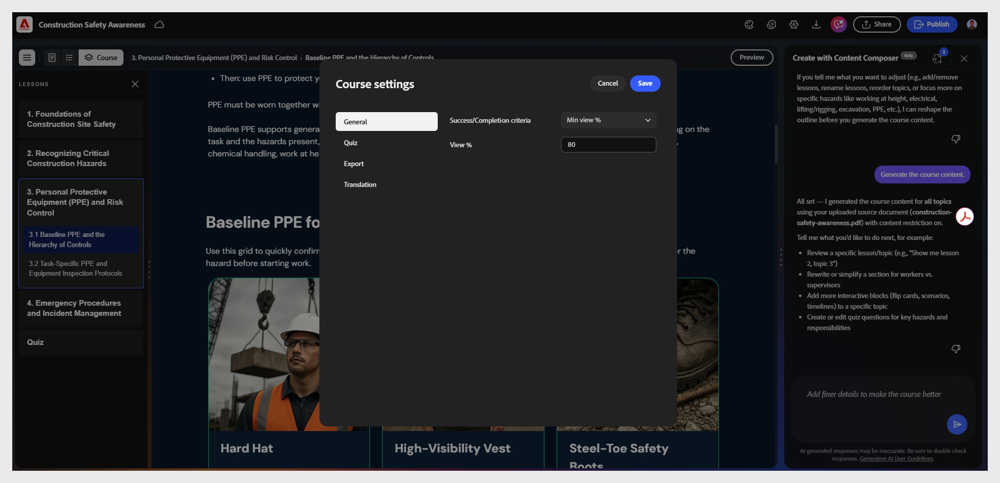

# Impostazioni generali del corso

1. Apri il tuo corso.

2. Seleziona **Impostazioni** per aprire **Impostazioni corso**.
   

3. Selezionare **Generale** per configurare i criteri di **completamento** e **successo**:

I criteri di completamento determinano quando un corso viene contrassegnato come completato nel sistema LMS, in base all’avanzamento dell’Allievo, non alle prestazioni.
