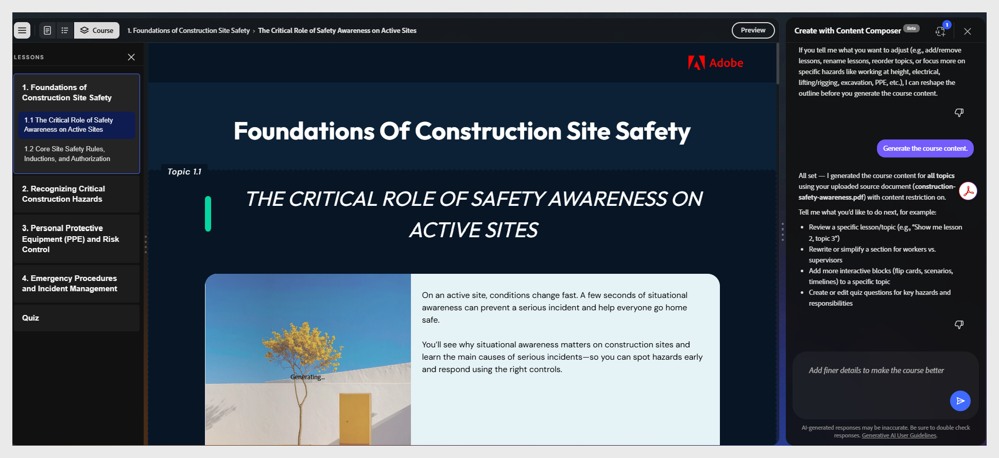

# Rivedi il corso generato

Adobe Learning Manager Content Composer genera l’intero corso con testo, immagini, verifiche della conoscenza e un quiz, in un unico passaggio. L&#39;editor **Corso** si apre automaticamente al termine della generazione.

Il pannello a sinistra mostra la navigazione per lezioni e argomenti. Nell&#39;area di lavoro viene visualizzato il contenuto dell&#39;argomento selezionato. Il pannello Chat rimane aperto per la modifica a livello di conversazione.

>[!CAUTION]
>
>Esamina tutti i contenuti generati prima di condividerli o pubblicarli. L&#39;output dell&#39;intelligenza artificiale può variare tra le generazioni e può contenere imprecisioni. La revisione dell&#39;autore è obbligatoria prima della distribuzione.

