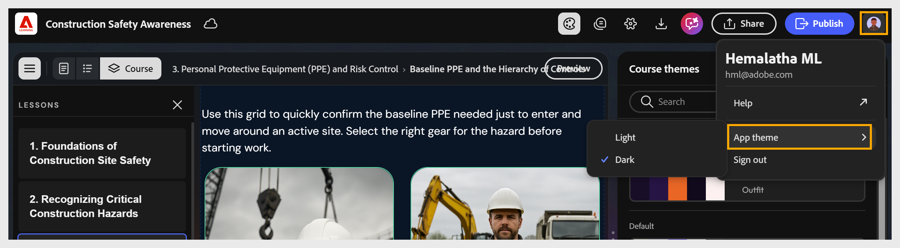

# Imposta la modalità chiara o scura per il corso

<!--Select **light/dark** mode in the toolbar to toggle between modes. Content Composer updates the canvas to reflect the selected mode.-->

Seleziona il [!UICONTROL menu Account] > [!UICONTROL Applica tema] > modalità chiara o scura. Composizione contenuto aggiorna l’area di lavoro in base alla modalità selezionata.

