# Libreria dei contenuti

Scopri come creare contenuti da allineare ai corsi come contenuti autonomi.

## Libreria dei contenuti {#contentlibrary}

I contenuti sono gli elementi costitutivi di un corso. Gli Autori creano una libreria di moduli che può essere allineata ai corsi come contenuto autonomo. Solo gli Autori hanno accesso alla libreria di contenuti.

## Tipi di contenuto supportati {#supported}

Nella libreria puoi caricare sia contenuti interattivi che statici.

La tabella seguente mostra i tipi di file interattivi e statici che è possibile caricare nella libreria.

<table>
 <tbody>
  <tr>
   <td>
    
<b>Contenuti interattivi</b>
</td>
   <td>
    
<b>Tipo di contenuto</b>
</td>
   <td>
    
<b>Estensioni</b>
</td>
  </tr>
  <tr>
   <td>
    
 
</td>
   <td>
    

    <ul>
     <li>SCORM 1.2</li>
     <li>SCORM 2004</li>
     <li>AICC</li>
     <li>TinCan</li>
    </ul>
    

</td>
   <td>
    
zip
</td>
  </tr>
  <tr>
   <td>
    
<b>Contenuti statici</b>
</td>
   <td>
    
<b>Tipo di contenuto</b>
</td>
   <td>
    
<b>Estensioni</b>
</td>
  </tr>
  <tr>
   <td>
    
 
</td>
   <td>
    
Video
</td>
   <td>
    
mp4, wmv, 3gp, 3g2, 3gp2, asf, avi, f4v h264, mpe, mpeg, mpg, mpg2, m4v, mov, wmv
</td>
  </tr>
  <tr>
   <td>
    
 
</td>
   <td>
    
Audio
</td>
   <td>
    
mp3, wav, aac, m4a, wma, vorbis, pcm, eac3, amr, ac3
</td>
  </tr>
  <tr>
   <td>
    
 
</td>
   <td>
    
PDF
</td>
   <td>
    
pdf
</td>
  </tr>
  <tr>
   <td>
    
 
</td>
   <td>
    
MS PowerPoint
</td>
   <td>
    
pptx, ppt
</td>
  </tr>
  <tr>
   <td>
    
 
</td>
   <td>
    
MS Word
</td>
   <td>
    
docx, doc
</td>
  </tr>
  <tr>
   <td>
    
 
</td>
   <td>
    
MS Excel
</td>
   <td>
    
xlsx, xls
</td>
  </tr>
  <tr>
   <td>
    
 
</td>
   <td>
    
HTML
</td>
   <td>
    
file zip
</td>
  </tr>
 </tbody>
</table>

## Aggiunta di nuovi contenuti alla libreria {#addnewcontentinthelibrary}

**Gli autori** possono aggiungere contenuti in ALM. In ALM sono presenti due tipi di contenuto: **[!UICONTROL Contenuto]** e **[!UICONTROL Quiz]**. Per informazioni su come aggiungere contenuti, consulta [Aggiungere contenuti statici](content-library.md#addstaticcontent) e [Creare un quiz](content-library.md##createaquiz).

## Aggiunta di contenuti statici {#addstaticcontent}

1. Seleziona **[!UICONTROL Libreria dei contenuti]** nel riquadro a sinistra dopo aver effettuato l’accesso come **Autore** e seleziona **[!UICONTROL Aggiungi]**.

   In alternativa, puoi selezionare **[!UICONTROL Crea contenuto]** dalla pagina **[!UICONTROL Guida introduttiva]**.

1. Nel campo **[!UICONTROL Nome]**, digita un nome per il contenuto da caricare.
1. Nel campo **[!UICONTROL Descrizione]** digitare la descrizione del contenuto. Assicurati che la descrizione che vuoi inserire sia provvista di significato. Il limite di caratteri è pari a 400 caratteri.
1. Per aggiungere il contenuto, selezionare **[!UICONTROL Aggiungi file di contenuto]** e caricare il file di risorse. Quando si aggiungono contenuti per più lingue, non è possibile combinare contenuti statici e interattivi all’interno di un singolo gruppo. I contenuti di tutte le versioni locali devono essere o tutti statici o tutti interattivi.

   Se desideri sostituire il contenuto, poi sostituire un contenuto statico con un altro contenuto statico. Lo stesso vale per il contenuto interattivo.

1. Nel campo **[!UICONTROL Durata]** è possibile digitare facoltativamente il tempo previsto che un Allievo dovrebbe dedicare a questo modulo. La durata è espressa in minuti.

   Se l’Allievo contrassegna un corso come completato, il tempo di apprendimento viene calcolato in base alla durata specificata. Se l’Allievo utilizza i contenuti nel lettore, il tempo impiegato per tale operazione viene sommato al tempo di apprendimento impiegato. Se il tempo del contenuto effettivo è inferiore alla durata specificata, il lettore visualizza il tempo del contenuto così come è. In questo caso non viene apportata alcuna modifica.

1. Nel campo **[!UICONTROL Tag]**, digita i tag per il contenuto caricato in modo che il tuo contenuto diventi rilevabile.

   L’Autore può utilizzare questi tag per cercare il contenuto durante l’aggiunta del contenuto al corso.

### Aggiungere il tipo di file HTML5 nella raccolta di contenuti

Gli autori possono aggiungere contenuti HTML5 come file .zip ai contenuti autonomi. La cartella .zip deve contenere un file HTML denominato `index.html`. Se sono presenti più file HTML, questi devono essere tutti collegati con il file principale denominato `index.html`. Gli Allievi possono visualizzare i contenuti di HTML5 nel lettore Fluidic. L’Autore può aggiungere questo contenuto HTML5 al modulo autonomo di un corso e impostare i criteri di completamento. Gli Autori possono impostare i criteri per il completamento del corso di HTML in due modi:

* L’Allievo può contrassegnarlo come completato autonomamente.
* Verrà contrassegnato come completato una volta avviato il corso.

Per aggiungere il tipo di file HTML (.zip) alla raccolta di contenuti, eseguire la procedura seguente.

1. Nell&#39;app Autore, seleziona **[!UICONTROL Crea contenuto]** nella home page.
1. Nella schermata **[!UICONTROL Libreria dei contenuti]**, seleziona **[!UICONTROL Aggiungi]** > **[!UICONTROL Contenuto]**.
1. Digitare il nome e la descrizione del contenuto.
1. Seleziona l&#39;opzione **[!UICONTROL Aggiungi file di contenuto]**, quindi sfoglia e seleziona i file di HTML (compressi come cartella).
1. Una volta aggiunto il contenuto, puoi visualizzarlo nella sezione **[!UICONTROL Libreria dei contenuti]**.
1. Seleziona il contenuto HTML, quindi seleziona **[!UICONTROL Modifica]**.
1. Selezionare una delle opzioni seguenti dall&#39;opzione **[!UICONTROL Criteri di completamento]**.
   * **[!UICONTROL All’avvio dei contenuti]**: il corso verrà contrassegnato come completato automaticamente all’avvio dell’Allievo.
   * **[!UICONTROL L’Allievo segna il completamento]**: può contrassegnare il corso come completato nel lettore Fluidic.

   
   _Criteri di completamento_

1. Seleziona **[!UICONTROL Salva]**.
1. Crea un corso aggiungendo questo contenuto.  Per ulteriori informazioni, consulta [Creazione, modifica e pubblicazione di corsi](/help/migrated/authors/feature-summary/courses.md).

Nell’app per Allievi, se un Autore seleziona i criteri di selezione come **[!UICONTROL All’avvio dei contenuti]**, il corso verrà contrassegnato come completato quando l’Allievo lo avvia. Quando un Autore sceglie **[!UICONTROL Gli Allievi indicano il completamento]**, l’Allievo avrà la possibilità di contrassegnare il corso come completato.

_Gli Allievi indicano come completati_

### Controllo delle versioni {#versioning}

La libreria dei contenuti registra anche il controllo delle versioni per i contenuti caricati. Se apporti modifiche al contenuto, ad esempio a una presentazione di PowerPoint, e carichi nuovamente il file PPT nella libreria, il numero di versione aumenta di un’unità. Questo ti aiuta a tenere traccia delle modifiche nel tuo contenuto.

## Aggiunta di contenuto interattivo {#addinteractivecontent}

1. Seleziona **[!UICONTROL Libreria dei contenuti]** nel riquadro a sinistra dopo aver effettuato l’accesso come **Autore** e seleziona **[!UICONTROL Aggiungi]**.

   In alternativa, puoi selezionare **[!UICONTROL Crea contenuto]** dalla pagina **[!UICONTROL Guida introduttiva]**.

1. Nel campo **[!UICONTROL Nome]**, digita un nome per il contenuto da caricare.
1. Nel campo **[!UICONTROL Descrizione]** digitare la descrizione del contenuto.

   >[!NOTE]
   >
   >Assicurati che la descrizione che vuoi inserire sia provvista di significato. Il limite di caratteri è pari a 245 caratteri.

1. Per aggiungere il contenuto, selezionare **[!UICONTROL Aggiungi file di contenuto]** e caricare il file di risorse. Quando si aggiungono contenuti per più lingue, non è possibile combinare contenuti statici e interattivi all’interno di un singolo gruppo. I contenuti di tutte le versioni locali devono essere o tutti statici o tutti interattivi.

* [Tipi di file supportati](content-library.md#supported)

  Il contenuto interattivo può essere un progetto pubblicato SCORM, AICC o Captivate. Il file deve essere un file zip.

  Puoi anche aggiungere contenuto HTML generato da Captivate, Presenter o Presenter Video Express.

1. Adobe Learning Manager supporta i sottotitoli per i contenuti video caricati in Adobe Learning Manager. Ora gli autori possono caricare il file contenente le didascalie insieme al file video.

   Gli Allievi possono quindi visualizzare i sottotitoli durante la riproduzione del modulo video.

   Il formato supportato è [Web Video Text Tracks (webVTT)](https://www.w3.org/TR/webvtt1/).

   Il supporto per sottotitoli è disponibile per i contenuti video caricati nella Libreria dei contenuti di Adobe Learning Manager.

   In qualità di autore, quando caricherai un contenuto video o audio, puoi anche caricare il file VTT che contiene i sottotitoli.

   I sottotitoli vengono quindi visualizzati nel lettore Fluidic. I sottotitoli sono conformi anche agli [standard WCAG2.0](https://www.w3.org/TR/WCAG20/).

   Quando aggiungi un contenuto video alla libreria, puoi anche aggiungere il file VTT, che **deve** essere un file valido.

   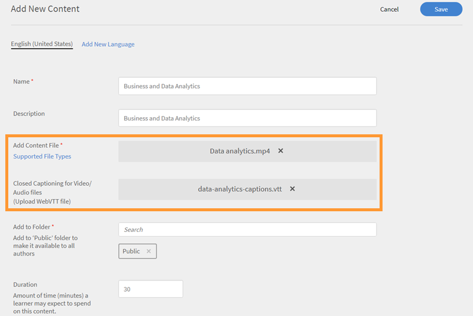

   *Aggiungere un file webvtt*

   Il file VTT caricato corrisponde alla versione esistente del contenuto. In questo modo, il file caricato su webVTT non si collega alla versione precedente del contenuto.

   Se crei il contenuto in lingue diverse, puoi caricare un file webVTT diverso per ogni lingua. Gli studenti potranno visualizzare le didascalie corrispondenti alla lingua selezionata durante la riproduzione.

   >[!NOTE]
   >
   >   Un file VTT supporta una sola lingua. Per supportare più lingue, carica più file video per ogni lingua di contenuto, quindi carica il rispettivo file VTT per ogni file video.

   Come autore, ogni volta che modificate il contenuto, video o audio, Adobe Learning Manager richiede un nuovo file vtt.

   Dopo aver aggiunto questo contenuto a un corso e quando visualizzi in anteprima il corso come studente, puoi vedere le didascalie nel video.

   Sul lettore, attiva o disattiva il pulsante CC del lettore Fluidic per visualizzare o nascondere le didascalie.

   La stessa visualizzazione è presente nell’**app per Allievi** e nell’**Anteprima come Allievo**.

   Quando **aggiungi, aggiorni o elimini** il file vtt, ricevi una notifica.
Il supporto del formato WebVTT non è disponibile per:

   1. Annunci video.
   1. Video riprodotto all’interno dei contenuti di eLearning. Questo dipende dal contenuto.
   1. Video caricato in Apprendimento sociale.
   1. Video creato nell’app desktop Adobe Learning Manager.
   1. Contenuto video creato con il processo di migrazione.
   1. Riproduzione di video nell’app mobile in modalità offline.

1. Nel campo **[!UICONTROL Durata]** è possibile immettere facoltativamente il tempo previsto che un Allievo trascorrerebbe in questo modulo. La durata è espressa in minuti.
1. Nel campo **[!UICONTROL Tag]**, immettete i tag per il contenuto caricato in modo che il contenuto diventi rilevabile.

### Supporto per il catalogo condiviso

Se un account venditore condivide un catalogo che contiene i corsi, e i corsi contengono i moduli, audio o video con i sottotitoli, i corsi devono essere identici a quelli disponibili nell’account acquirente.

La propagazione del modulo deve funzionare correttamente dall’account venditore all’account acquirente. Questo può includere: modifica/elimina/aggiunta del file vtt nel modulo.

Una volta caricato il contenuto, puoi visualizzare una notifica facendo clic sull’icona raffigurante una campana nell’angolo in alto a destra della pagina. Ogni volta che modifichi un contenuto e lo carichi nuovamente, ricevi una notifica. Se apporti le modifiche, solo tu ricevi la notifica, e non gli altri autori.

## Crea un quiz {#createaquiz}

Crea valutazioni all’interno di Adobe Learning Manager con il nuovo strumento per la creazione di quiz nella pagina Libreria dei contenuti. Le valutazioni create diventano parte della Libreria dei contenuti e possono essere aggiunte a una cartella &quot;pubblica&quot; per consentire il riutilizzo del corso.

1. Selezionate Libreria contenuti nel pannello a sinistra.
1. Nell&#39;angolo superiore destro della schermata, seleziona **Aggiungi > Quiz**.
1. Nella pagina Crea quiz, digita il nome e la descrizione del quiz.
1. Nella sezione Contenuto quiz, seleziona **Aggiungi domanda per il quiz**.
1. Nella finestra di dialogo della domanda del quiz, seleziona il tipo di domanda. Esistono Sono disponibili tre tipi di domande:
   * Domanda a scelta multipla
   * True o false
   * Compila lo spazio vuoto
1. Immetti la domanda e seleziona la risposta corretta.
1. Definisci i punti per il quiz.
1. Se desideri che alla domanda venga fornita una risposta corretta per superare il quiz, seleziona la casella di controllo **È obbligatorio rispondere correttamente per superare il quiz**.
1. Seleziona **Salva e chiudi**.
1. Immetti i punti per superare il quiz nel campo **Criteri di superamento**.
1. Se desideri che un Allievo visualizzi una risposta corretta, attiva l’opzione **Mostra risposte corrette** per gli Allievi dopo il quiz.
1. Se desideri che le domande e le risposte vengano visualizzate in modo casuale, attiva le opzioni:
   * Ordine domande casuale
   * Ordine delle opzioni di risposta casuale
1. Specifica una cartella in cui aggiungere il quiz per renderlo disponibile a tutti gli autori.
1. Nel campo **Durata**, specifica il tempo che l’Allievo deve dedicare al quiz.
1. Specifica un tag dall’elenco dei tag già creati.
1. Aggiungi un logo e uno sfondo al quiz.
1. Nell&#39;angolo superiore destro della pagina, seleziona **Publish**.

Per aggiungere i quiz in una lingua diversa, procedere come segue:

1. Per aggiungere il quiz per lingue diverse, selezionate la scheda **Aggiungi nuova lingua** e scegliete le lingue desiderate. Utilizzando questo approccio, puoi aggiungere il supporto multilingue per il tuo contenuto.

   

   *Aggiungi nuova lingua per un contenuto*

1. Ripeti la procedura di caricamento del contenuto per le nuove lingue.
1. Per rimuovere una lingua, selezionare la scheda **[!UICONTROL Aggiungi nuova lingua]** e deselezionare la lingua desiderata.

   Dopo aver apportato le modifiche, fai clic su **[!UICONTROL Salva]**. Nella libreria, il nuovo contenuto ora è disponibile per l’uso.

Il quiz è stato aggiunto alla **[!UICONTROL Libreria dei contenuti]**. Come per qualsiasi contenuto nella Libreria dei contenuti, puoi ritirare un quiz e quindi eliminarlo.

## Aggiunta nella cartella {#add-folder}

Dopo che un Amministratore crea le cartelle dei contenuti, come autore puoi caricare un contenuto in una cartella di contenuti affinché il contenuto sia visibile solo a te o a un gruppo di autori selezionato nell’account. Puoi anche rendere il contenuto pubblico e visibile a tutti gli autori nell’account.

**Esempio di utilizzo**

Ad esempio, le agenzie vogliono mantenere il controllo completo dei contenuti e gli utenti che supervisionano i contenuti devono avere accesso a tutti i contenuti. Allo stesso tempo, i creatori di contenuti delle agenzie devono avere accesso solo ai propri contenuti e, in alcuni casi, ai contenuti di qualcun altro.

La Libreria dei contenuti con i contenuti esistenti (ovvero i contenuti caricati prima di configurare le cartelle dei contenuti) viene definita come **cartella pubblica**. Questa cartella non può essere ritirata o eliminata. I contenuti che fanno parte della cartella pubblica sono accessibili a tutti i tipi di autori. Una volta configurate le cartelle dei contenuti, gli autori standard e gli autori personalizzati devono selezionare la cartella in cui inserire il contenuto, mentre caricano il nuovo contenuto.

>[!NOTE]
>
>Le cartelle pubbliche e private si escludono a vicenda. Il contenuto **non può** essere associato contemporaneamente a una cartella pubblica e a una cartella privata. Può essere associata a una cartella pubblica, **o** può essere associata a una o più cartelle private in qualsiasi momento.

Quando aggiungi un contenuto, puoi scegliere la cartella in cui risiederà il contenuto.

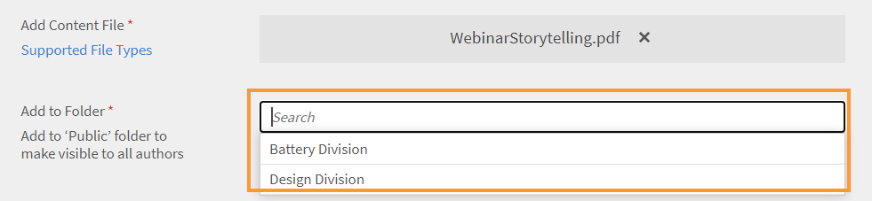

*Aggiungere contenuti alla cartella*

Se scegli **Pubblico**, il contenuto sarà visibile a tutti gli autori. Per impostazione predefinita, tutti i contenuti presenti nell’account che non fanno parte di alcuna cartella si troveranno nella cartella pubblica.

Tieni presente che le cartelle dei contenuti sono semplicemente dei comparti virtuali usati per collegare il contenuto. Se un contenuto viene inserito in due cartelle, significa che il file di contenuto è sempre un unico file ma collegato a più cartelle. Pertanto, nel caso in cui il contenuto venga aggiornato dall’autore personalizzato 1 con accesso alla cartella personalizzata 1, lo stesso contenuto aggiornato si rifletterà anche nella cartella personalizzata 2 cui accede l’autore personalizzato 2.

Nella Libreria dei contenuti sono disponibili due opzioni per la gestione delle cartelle di contenuti:

**Tutte le cartelle**

Si tratta di un elenco che visualizza tutte le cartelle create nell’account.

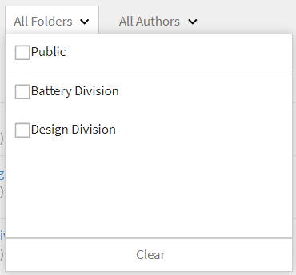

*Visualizza tutte le cartelle*

**Tutti gli autori**

È un elenco che mostra gli autori che hanno creato contenuti e li hanno caricati nella libreria.

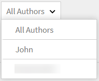

*Visualizza tutti gli autori*

È disponibile **solo** quando un amministratore crea una nuova cartella.

## Spostamento del contenuto nella cartella {#movecontenttofolder}

Per spostare un contenuto da una cartella pubblica a una cartella privata:

1. Selezionare la cartella **pubblica** dall&#39;elenco a discesa **Tutte le cartelle**.

   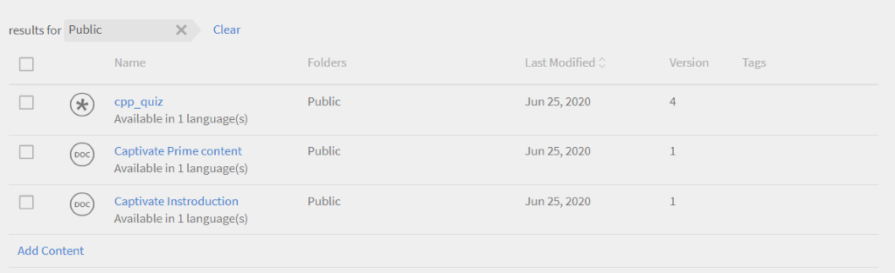

   *Visualizza tutti i contenuti caricati*

1. Scegli il contenuto che desideri spostare in una cartella. Quindi fai clic su **[!UICONTROL Azioni]** > **[!UICONTROL Organizza contenuto]** > **[!UICONTROL Sposta contenuto nella cartella]**.

   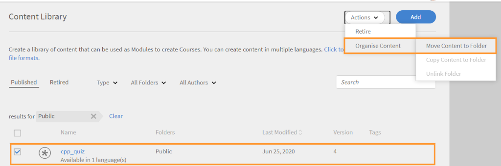

   *Sposta un contenuto selezionato nella cartella*

1. Scegli la cartella in cui desideri spostare il contenuto. Fai clic su **[!UICONTROL Sposta]**.

## Copia del contenuto nella cartella {#copycontenttofolder}

Quando si copia una cartella, viene aggiunto un tag alla cartella. L’operazione di copia non consiste nella creazione di copie del contenuto, ma solo nell’aggiunta di un’associazione con le cartelle specificate.

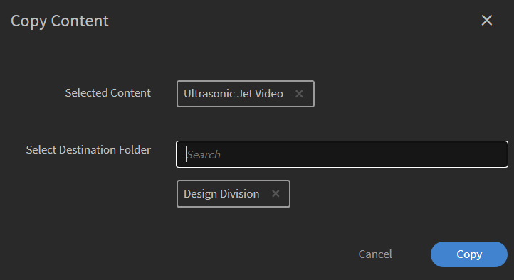

*Copiare una cartella*

## Scollegamento della cartella {#unlinkfolder}

Scollegare significa rimuovere il contenuto dalla cartella selezionata.

È possibile scollegare il contenuto da una cartella specificata **SOLO** se è associato anche ad altre cartelle. Se il contenuto da scollegare è associato solo a una cartella, è consigliabile utilizzare l’operazione SPOSTA.

>[!NOTE]
>
>Il menu Organizza, in Azioni, è inizialmente disabilitato. Per utilizzarlo, devi prima selezionare una cartella nell’elenco a discesa delle cartelle.

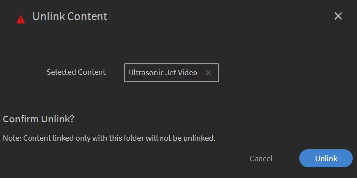

*Scollegare una cartella*

## Aggiunta di contenuto per lingue diverse {#addcontentfordifferentlanguages}

1. Per aggiungere contenuti per lingue diverse, fare clic sulla scheda **Aggiungi nuova lingua** e scegliere le lingue desiderate. Utilizzando questo approccio, puoi aggiungere il supporto multilingue per il tuo contenuto.

   

   *Aggiungi nuova lingua per un contenuto*

1. Ripeti la procedura di caricamento del contenuto per le nuove lingue.
1. Per rimuovere una lingua, fai clic sulla scheda Aggiungi una nuova lingua e annulla la selezione corrispondente.

   Dopo aver apportato le modifiche, fai clic su Salva. Nella libreria, il nuovo contenuto ora è disponibile per l’uso.

## Impostazione dei criteri di completamento {#setcompletioncriteria}

<table>
 <tbody>
  <tr>
   <td>
    
<b>Contenuti statici</b>
</td>
   <td>
    
<b>Contenuti interattivi</b>
</td>
  </tr>
  <tr>
   <td>
    
Puoi impostare solo i criteri <b>Completamento</b> per il contenuto relativo alle seguenti opzioni:

    <ul>
     <li>All’avvio del contenuto</li>
     <li>In base alla percentuale minima richiesta</li>
    </ul></td>
   <td>
    
Puoi impostare sia i criteri <b>Completamento</b> sia i criteri <b>Operazione riuscita</b> per il contenuto per le opzioni seguenti:

    <ul>
     <li>All’avvio del contenuto</li>
     <li>In base alla percentuale minima richiesta</li>
     <li>Opzioni Quiz superato o Tentativi nei quiz</li>
    </ul>
    
<b>NOTA:</b> È possibile modificare contenuti HTML solo da Captivate, Presenter Video Express o Presenter.
</td>
  </tr>
 </tbody>
</table>

Dopo aver aggiunto il contenuto, puoi modificare i criteri di completamento per il contenuto.

In Adobe Learning Manager, i distintivi e le abilità vengono assegnati in base al successo e al completamento. Se lo studente ha completato un corso ma non ha ottenuto il successo, non riceve il badge e l’abilità corrispondente all’oggetto di apprendimento.

Ad esempio, se hai utilizzato Adobe Captivate per creare il tuo corso e hai impostato i parametri di apprendimento nella finestra di dialogo Preferenze, le stesse impostazioni vengono migrate su Adobe Learning Manager nelle opzioni Criteri di completamento.

Nella sezione Criteri di completamento puoi impostare le opzioni indicate di seguito:

**All’avvio del contenuto:** se abiliti questa opzione definisci i criteri di completamento del contenuto quando uno studente apre il contenuto.

**In base alla percentuale minima richiesta:** imposta un valore come percentuale minima d’uso da parte del tuo allievo. Ad esempio, se imposti la percentuale su 50, lo studente può utilizzare solo il 50% del contenuto e soddisfare comunque i criteri di completamento.

**Quiz:** scegli uno dei seguenti criteri:

* **Quiz superato:** lo stato viene segnalato come Completo solo se uno studente supera il quiz.
* **Tentativi nei quiz:** lo stato viene segnalato come Completo se gli studenti tentano di superare il quiz, indipendentemente dal fatto che lo superino o meno.
* **Quiz superato o limite raggiunto:** lo stato viene segnalato come Completo se gli studenti superano il quiz o hanno effettuato tutti i tentativi consentiti. Ad esempio, se il numero di tentativi impostati nel corso è pari a due:

   * Se gli Allievi accettano il primo tentativo e lo superano, lo stato viene segnalato come Completato e Superato.
   * Se gli Allievi effettuano il primo tentativo e falliscono, lo stato viene segnalato come Incompleto e Non riuscito poiché il limite dei tentativi non è ancora stato raggiunto.
   * Se gli Allievi rispondono nuovamente al quiz ma non riescono, lo stato viene segnalato come Completato e Non riuscito.
   * Se gli Allievi tentano di ripetere il quiz e lo superano, lo stato viene segnalato come Completato e Superato.

## Impostazione dei criteri di successo {#setsuccesscriteria}

Allo stesso modo, puoi definire i criteri di successo per il corso. Un criterio di successo indica che le prestazioni di un Allievo sono Superate o Non riuscite. Se hai creato un corso in Captivate puoi impostare i criteri di successo per il corso nella finestra di dialogo Preferenze, come mostrato di seguito:

Ad esempio, hai caricato un modulo che contiene un quiz. Ora hai impostato i Criteri di completamento per quel modulo su All’avvio del contenuto e i Criteri di successo su Quiz superato.

Se lo studente ha avviato il corso e non ha superato il quiz, il corso viene contrassegnato come Completato, ma i Criteri di successo saranno soddisfatti solo quando lo studente supererà il test.

## Opzioni filtro contenuto {#contentfilteroptions}

### Ordina in base alla data {#sortaccordingtodate}

Organizza il contenuto in base a quando il contenuto è stato modificato per l’ultima volta. Puoi ordinare il contenuto in ordine crescente o decrescente.

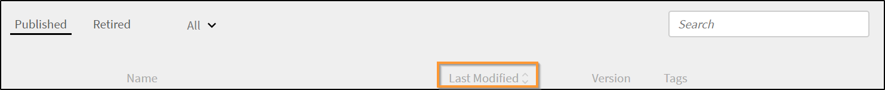

*Ordina i contenuti per data*

### Ordina in base all’utilizzo {#sortaccordingtousage}

Organizza il contenuto in base al suo utilizzo nei corsi. Nel menu a discesa Tipo, scegli In uso o Non utilizzato.

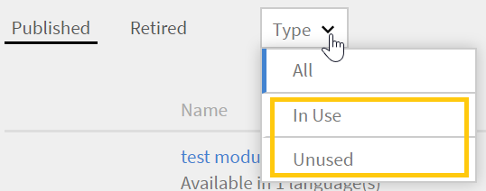

*Ordinare i contenuti in base all&#39;utilizzo*

## Aggiungi ID univoco del contenuto e data di scadenza

### Che cos’è l’ID univoco del contenuto

L’ID univoco del contenuto è un codice univoco assegnato a ciascun elemento di contenuto in Adobe Learning Manager. Consente agli amministratori e agli autori di trovare e gestire facilmente i contenuti, soprattutto quando vengono aggiornati o spostati da un sistema all&#39;altro. Questo ID univoco del contenuto è utile anche per integrare il contenuto con altri strumenti come HR o i sistemi di conformità. Lo stesso ID univoco del contenuto viene utilizzato in tutte le versioni linguistiche, in modo che tutto resti coerente per gli Allievi.

* Gli ID univoci del contenuto devono essere univoci per tutti i contenuti.
* L&#39;ID univoco del contenuto non può includere spazi o caratteri speciali.
* Se viene immesso un ID univoco contenuto duplicato, durante la creazione verrà visualizzato un errore.

### Che cos’è la data di scadenza

La data di scadenza contrassegna i contenuti che potrebbero essere obsoleti o non più necessari. Anche dopo la data di scadenza, il contenuto rimane disponibile, ma ricorda agli autori e agli amministratori di controllarlo e aggiornarlo se necessario. In base alle impostazioni, il contenuto scaduto può essere rimosso da nuove iscrizioni o archiviato. Like the Content unique ID, the Expiry Date works the same way for all language versions, helping keep content clean and up to date for everyone.

* Il contenuto rimane disponibile anche dopo la scadenza.
* Se viene selezionata una data passata, viene visualizzato un avviso.
* The expiry field accepts any date between 1990 and 2037.

This helps organizations maintain content relevance without accidentally removing published items.

The Content unique ID and Expiry Date apply to all language versions of a content group, ensuring a consistent experience for all users, no matter the language. Authors can use the Content unique ID to quickly search for and find specific content, making it easier to manage and update training materials.

The **[!UICONTROL Training report]** now includes two new columns: **[!UICONTROL Content Expiry Date (UTC TimeZone)]** and **[!UICONTROL Content Unique ID]**, to track Content unique ID and Expiry Date. Questi campi possono essere aggiunti tramite interfaccia utente o migrazione e l’amministratore può monitorarli centralmente tramite i report di formazione.

### Aggiungi ID univoco del contenuto e data di scadenza

Authors can add a Content unique ID and set an Expiry Date date when creating content.

To add Content unique ID and Expiry Date:

1. Accedi come Autore.
2. Select **[!UICONTROL Create Content]** or select **[!UICONTROL Content Library]** in the left panel.

   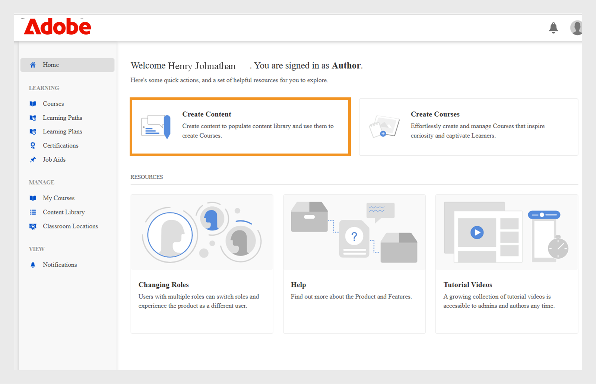
   _Selezionare Crea contenuto nella home page_

3. Seleziona **[!UICONTROL Aggiungi]**, quindi seleziona **[!UICONTROL Contenuto]** nella home page dell&#39;autore.

   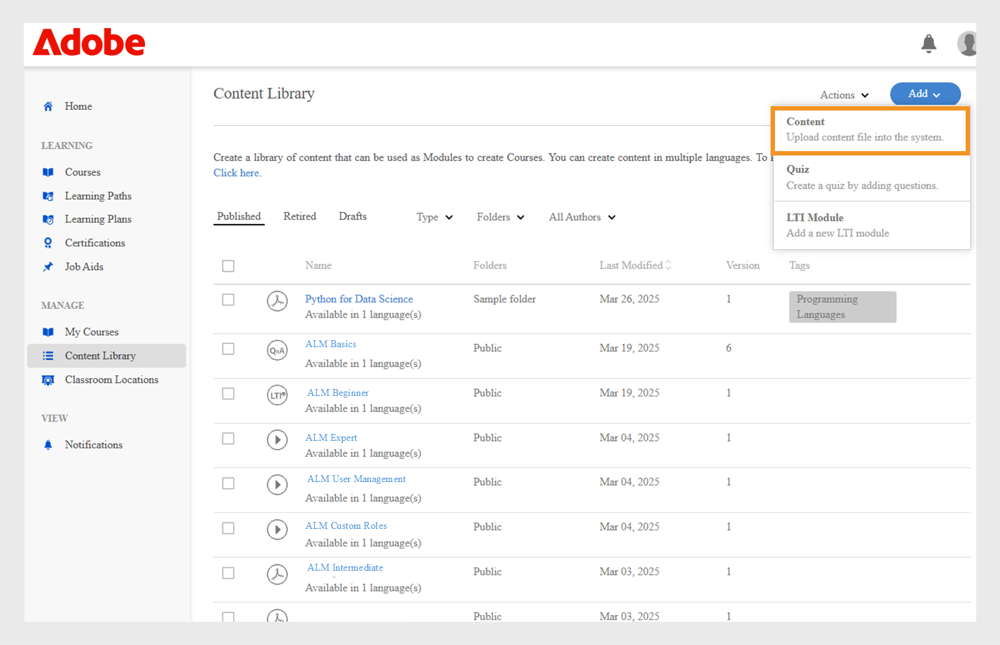
   _Select Add content in the Content Library_

4. Type the **[!UICONTROL Name]** and **[!UICONTROL Description]**

5. Select the content from the **[!UICONTROL Add Content File]** option
6. Select the folder from **[!UICONTROL Add to Folder]** option to add the content to folder.

   
   _Add new content_

7. Digitare l&#39;ID del contenuto caricato nel campo **[!UICONTROL ID univoco contenuto]**. The ID must be unique and follow the correct naming guidelines. The ID must not contain non-ASCII characters or spaces. If you enter a duplicate ID, an error message is displays.

   
   _Field for entering a unique alphanumeric Content ID_

8. Select the Expiry Date for the content. This date does not affect content availability or learner access. You can choose any date between 1990 and 2037. If a past date is selected, a warning appears, but the content can still be published.
9. Seleziona **[!UICONTROL Salva]**.
Il contenuto caricato viene ora visualizzato nella **[!UICONTROL Libreria dei contenuti]**.

### Set Content unique ID and Expiry Date for languages

The Content Unique ID and Expiry Date are defined at the content group level, meaning they are set once and automatically apply to all language versions of the content.

1. Select the content in the **[!UICONTROL Content Library]**.
2. Seleziona **[!UICONTROL Modifica]**.
3. Select **[!UICONTROL Add New Language]**.
4. Select any language from the list.
5. Seleziona **[!UICONTROL Salva]**.
The Content unique ID and Expiry Date are now displayed on the language-specific version of the content, such as German in this example.

### Search using the Content unique ID

You can use the Content Unique ID to search for content across all language versions, making it easier to locate and manage specific items. Additionally, both the Content Unique ID and Expiry Date are included in training reports for consistent tracking and reporting.

1. Launch the **[!UICONTROL Content Library]**.
2. Type the **[!UICONTROL Content unique ID]** in the search bar.

   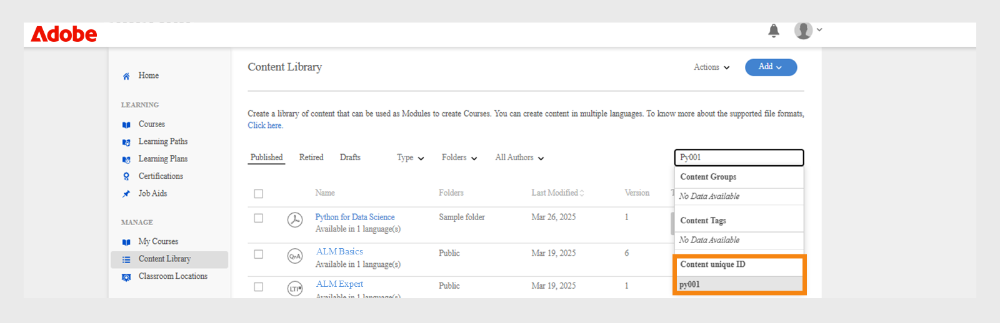
   _Searching content using the Content unique ID_
3. Select the content to view or edit it.

### Content migration support

When migrating content, you can include the **expiryDate** and **uniqueContentId** in the module_version.csv file. This ensures continuity of metadata when moving content between systems.

### Segnalazione delle modifiche

Two new columns, Content unique ID and Content Expiry Date, are now available in the Training Report. These fields help administrators monitor content expiration dates more effectively.

## Ritiro di contenuti {#retirecontent}

Una volta pubblicato un contenuto, non puoi eliminarlo. Devi prima ritirare il contenuto. Quando contrassegni un contenuto come Ritirato, il contenuto non è più visibile agli studenti. The content also moves to the **[!UICONTROL Retired]** section.

Per ritirare un contenuto, attieniti alla seguente procedura:

* In **[!UICONTROL Content library]**, select the content you want to retire.
* Select **[!UICONTROL Action]** and then select **[!UICONTROL Retire]**.

I contenuti utilizzati negli oggetti di apprendimento non vengono modificati. Gli Allievi possono continuare ad accedere al contenuto.

>[!NOTE]
>
>You can also add content from the **[!UICONTROL Retired]** section, navigate to **[!UICONTROL Content Library]** and then select **[!UICONTROL Retired]**. Select **[!UICONTROL Add Content]**. For more details, see [Add static content](content-library.md#addstaticcontent).

## Ricerca dei contenuti {#searchforcontent}

Nella Libreria dei contenuti puoi cercare un contenuto scegliendo il nome del contenuto o i tag associati al contenuto stesso.

Nella barra di ricerca, immetti il nome di un corso o un tag e visualizza i consigli corrispondenti.

<!--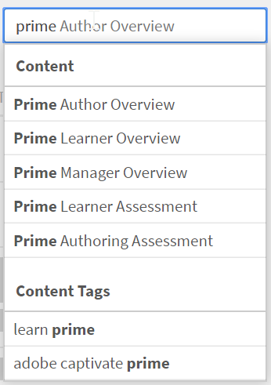-->

## Ripubblicazione di contenuto ritirato {#republishretiredcontent}

Una volta che hai ritirato un contenuto, puoi decidere di ripubblicarlo e tornare a visualizzarlo nell’elenco Pubblicato. Ad esempio, se hai ritirato la versione 1 di un contenuto e desideri sostituirla con la versione 2, puoi spostare version1.pptx nell’elenco Pubblicato e aggiornare il file con version2.pptx. Il nuovo file diventa disponibile per l’utilizzo in vari corsi.

Per ripubblicare il contenuto ritirato,

1. Passa alla scheda **Ritirato** e seleziona il contenuto che desideri ripubblicare.
1. Select **Action** > **Republish**.

Il contenuto ora appare nell’elenco Pubblicato.

## Update the content

Authors can update the content in the published course.
To update the content:

1. Login as an author.
2. Select **[!UICONTROL Content Library]**.
3. Search for the content and select **[!UICONTROL Edit]**.
4. Remove older content and upload new file and publish.

This will help learners get the latest version of the content.

Check out this [blog](https://elearning.adobe.com/2024/06/how-to-update-the-content-in-the-course/) for more information.

### Content version control for learners who have completed a course

Adobe Learning Manager ora offre agli autori opzioni più chiare per gestire gli aggiornamenti dei contenuti. Gli Autori possono aggiornare i contenuti già disponibili in un corso. Quando viene aggiunta una nuova versione, il numero di versione viene visualizzato accanto al contenuto.

Quando un Amministratore visita un corso con contenuti aggiornati, vedrà un pulsante Aggiorna accanto alla nuova versione. Gli Amministratori visualizzeranno anche chiare opzioni di aggiornamento per scegliere come la nuova versione dei contenuti viene applicata agli Allievi.

| Stato Allievo | Aggiorna ora | Aggiorna alla fine | Aggiornamento non avviato |
|---|---|---|---|
| Non iscritto | V2 | V2 | V2 |
| Ancora da iniziare | V2 | V2 | V2 |
| In corso | V2 * | V1 → V2 * | V1 |
| Completata | V2 * | V2 * | V1 (conservato) |

(*) Indica che il modulo verrà reimpostato quando la versione viene aggiornata.

Con l’aggiornamento non avviato, gli allievi che hanno già completato il corso continuano a visualizzare la versione del contenuto originale (V1). In questo modo si evitano problemi di riproduzione imprevisti e si garantisce un’esperienza uniforme per gli Allievi che rivedono i corsi completati.

### Opzioni di aggiornamento del contenuto

Quando un amministratore fa clic su **[!UICONTROL Aggiorna]**, può scegliere tra le seguenti opzioni:

* **[!UICONTROL Aggiorna tutti gli Allievi ora]**: applica immediatamente l’aggiornamento dei contenuti per tutti gli Allievi. Gli Allievi Non avviati, In corso e Completati passano immediatamente alla nuova versione.
* **[!UICONTROL Aggiorna tutti gli Allievi alla fine]**: applica l’aggiornamento per tutti gli Allievi in più fasi. Gli Allievi non avviati e completati ricevono ora la nuova versione. Gli Allievi In corso ricevono l’aggiornamento dopo aver completato la versione corrente.
* **[!UICONTROL Aggiornamento solo allievi non avviati]**: applica l’aggiornamento solo agli allievi che non hanno ancora iniziato il corso. Gli Allievi In corso e Completati rimangono sulla versione originale.

_Content update options available in Update settings_

## Elimina contenuto {#deletecontent}

Dopo che hai ritirato un contenuto, puoi eliminarlo.

* Passa alla scheda Ritirato e seleziona il contenuto che desideri eliminare.
* Seleziona Azione > Elimina.

Ricorda che i corsi esistenti che utilizzano il contenuto eliminato dalla libreria dei contenuti continueranno a utilizzare tale contenuto.

## Domande frequenti {#frequentlyaskedquestions}

+++ How to upload a SCORM content in Adobe Learning Manager?

Crea un corso di e-learning conforme allo standard SCORM in qualsiasi strumento, ad esempio Adobe Captivate, e pubblica il contenuto come file zip. Then in Adobe Learning Manager, upload the zip file in the catalog, and set the completion and success criteria.
+++

+++How do I upload a new version of the same content to Adobe Learning Manager?

In Adobe Learning Manager, the content library also maintains versions of your uploaded contents. Se apporti modifiche al contenuto, ad esempio a una presentazione di PowerPoint, e carichi nuovamente la presentazione nella libreria, il numero di versione aumenta di un’unità. Questo ti aiuta a tenere traccia delle modifiche nel tuo contenuto. Una nuova versione del contenuto può essere applicata contemporaneamente a tutti gli oggetti di apprendimento oppure puoi applicare singoli aggiornamenti per ogni corso.
+++

+++How to edit the details of a course in a different language?
Dopo aver aggiunto una o più lingue, come descritto nella sezione precedente, fai clic sulla scheda di ciascuna lingua e aggiungi/modifica le informazioni sul corso.

<!--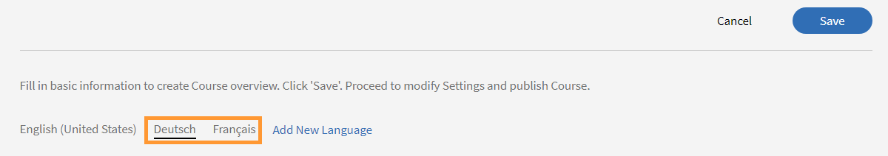-->
+++
