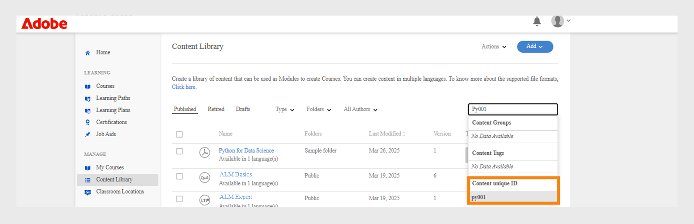

# Libreria dei contenuti

Scopri come creare contenuti da allineare ai corsi come contenuti autonomi.

## Libreria dei contenuti {#contentlibrary}

I contenuti sono gli elementi costitutivi di un corso. Gli Autori creano una libreria di moduli che può essere allineata ai corsi come contenuto autonomo. Solo gli Autori hanno accesso alla libreria di contenuti.

## Tipi di contenuto supportati {#supported}

Nella libreria puoi caricare sia contenuti interattivi che statici.

La tabella seguente mostra i tipi di file interattivi e statici che è possibile caricare nella libreria.

<table>
 <tbody>
  <tr>
   <td>
    
<b>Contenuti interattivi</b>
</td>
   <td>
    
<b>Tipo di contenuto</b>
</td>
   <td>
    
<b>Estensioni</b>
</td>
  </tr>
  <tr>
   <td>
    
 
</td>
   <td>
    

    <ul>
     <li>SCORM 1.2</li>
     <li>SCORM 2004</li>
     <li>AICC</li>
     <li>TinCan</li>
    </ul>
    

</td>
   <td>
    
zip
</td>
  </tr>
  <tr>
   <td>
    
<b>Contenuti statici</b>
</td>
   <td>
    
<b>Tipo di contenuto</b>
</td>
   <td>
    
<b>Estensioni</b>
</td>
  </tr>
  <tr>
   <td>
    
 
</td>
   <td>
    
Video
</td>
   <td>
    
mp4, wmv, 3gp, 3g2, 3gp2, asf, avi, f4v h264, mpe, mpeg, mpg, mpg2, m4v, mov, wmv
</td>
  </tr>
  <tr>
   <td>
    
 
</td>
   <td>
    
Audio
</td>
   <td>
    
mp3, wav, aac, m4a, wma, vorbis, pcm, eac3, amr, ac3
</td>
  </tr>
  <tr>
   <td>
    
 
</td>
   <td>
    
PDF
</td>
   <td>
    
pdf
</td>
  </tr>
  <tr>
   <td>
    
 
</td>
   <td>
    
MS PowerPoint
</td>
   <td>
    
pptx, ppt
</td>
  </tr>
  <tr>
   <td>
    
 
</td>
   <td>
    
MS Word
</td>
   <td>
    
docx, doc
</td>
  </tr>
  <tr>
   <td>
    
 
</td>
   <td>
    
MS Excel
</td>
   <td>
    
xlsx, xls
</td>
  </tr>
  <tr>
   <td>
    
 
</td>
   <td>
    
HTML
</td>
   <td>
    
file zip
</td>
  </tr>
 </tbody>
</table>

## Aggiunta di nuovi contenuti alla libreria {#addnewcontentinthelibrary}

**Gli autori** possono aggiungere contenuti in ALM. In ALM sono presenti due tipi di contenuto: **[!UICONTROL Contenuto]** e **[!UICONTROL Quiz]**. Per informazioni su come aggiungere contenuti, consulta [Aggiungere contenuti statici](content-library.md#addstaticcontent) e [Creare un quiz](content-library.md##createaquiz).

## Aggiunta di contenuti statici {#addstaticcontent}

1. Seleziona **[!UICONTROL Libreria dei contenuti]** nel riquadro a sinistra dopo aver effettuato l’accesso come **Autore** e seleziona **[!UICONTROL Aggiungi]**.

   In alternativa, puoi selezionare **[!UICONTROL Crea contenuto]** dalla pagina **[!UICONTROL Guida introduttiva]**.

1. Nel campo **[!UICONTROL Nome]**, digita un nome per il contenuto da caricare.
1. Nel campo **[!UICONTROL Descrizione]** digitare la descrizione del contenuto. Assicurati che la descrizione che vuoi inserire sia provvista di significato. Il limite di caratteri è pari a 400 caratteri.
1. Per aggiungere il contenuto, selezionare **[!UICONTROL Aggiungi file di contenuto]** e caricare il file di risorse. Quando si aggiungono contenuti per più lingue, non è possibile combinare contenuti statici e interattivi all’interno di un singolo gruppo. I contenuti di tutte le versioni locali devono essere o tutti statici o tutti interattivi.

   Se desideri sostituire il contenuto, poi sostituire un contenuto statico con un altro contenuto statico. Lo stesso vale per il contenuto interattivo.

1. Nel campo **[!UICONTROL Durata]** è possibile digitare facoltativamente il tempo previsto che un Allievo dovrebbe dedicare a questo modulo. La durata è espressa in minuti.

   Se l’Allievo contrassegna un corso come completato, il tempo di apprendimento viene calcolato in base alla durata specificata. Se l’Allievo utilizza i contenuti nel lettore, il tempo impiegato per tale operazione viene sommato al tempo di apprendimento impiegato. Se il tempo del contenuto effettivo è inferiore alla durata specificata, il lettore visualizza il tempo del contenuto così come è. In questo caso non viene apportata alcuna modifica.

1. Nel campo **[!UICONTROL Tag]**, digita i tag per il contenuto caricato in modo che il tuo contenuto diventi rilevabile.

   L’Autore può utilizzare questi tag per cercare il contenuto durante l’aggiunta del contenuto al corso.

### Aggiungere il tipo di file HTML5 nella raccolta di contenuti

Gli autori possono aggiungere contenuti HTML5 come file .zip ai contenuti autonomi. La cartella .zip deve contenere un file HTML denominato `index.html`. Se sono presenti più file HTML, questi devono essere tutti collegati con il file principale denominato `index.html`. Gli Allievi possono visualizzare i contenuti di HTML5 nel lettore Fluidic. L’Autore può aggiungere questo contenuto HTML5 al modulo autonomo di un corso e impostare i criteri di completamento. Gli Autori possono impostare i criteri per il completamento del corso di HTML in due modi:

* L’Allievo può contrassegnarlo come completato autonomamente.
* Verrà contrassegnato come completato una volta avviato il corso.

Per aggiungere il tipo di file HTML (.zip) alla raccolta di contenuti, eseguire la procedura seguente.

1. Nell&#39;app Autore, seleziona **[!UICONTROL Crea contenuto]** nella home page.
1. Nella schermata **[!UICONTROL Libreria dei contenuti]**, seleziona **[!UICONTROL Aggiungi]** > **[!UICONTROL Contenuto]**.
1. Digitare il nome e la descrizione del contenuto.
1. Seleziona l&#39;opzione **[!UICONTROL Aggiungi file di contenuto]**, quindi sfoglia e seleziona i file di HTML (compressi come cartella).
1. Una volta aggiunto il contenuto, puoi visualizzarlo nella sezione **[!UICONTROL Libreria dei contenuti]**.
1. Seleziona il contenuto HTML, quindi seleziona **[!UICONTROL Modifica]**.
1. Selezionare una delle opzioni seguenti dall&#39;opzione **[!UICONTROL Criteri di completamento]**.
   * **[!UICONTROL All’avvio dei contenuti]**: il corso verrà contrassegnato come completato automaticamente all’avvio dell’Allievo.
   * **[!UICONTROL L’Allievo segna il completamento]**: può contrassegnare il corso come completato nel lettore Fluidic.

   
   _Criteri di completamento_

1. Seleziona **[!UICONTROL Salva]**.
1. Crea un corso aggiungendo questo contenuto.  Per ulteriori informazioni, consulta [Creazione, modifica e pubblicazione di corsi](/help/migrated/authors/feature-summary/courses.md).

Nell’app per Allievi, se un Autore seleziona i criteri di selezione come **[!UICONTROL All’avvio dei contenuti]**, il corso verrà contrassegnato come completato quando l’Allievo lo avvia. Quando un Autore sceglie **[!UICONTROL Gli Allievi indicano il completamento]**, l’Allievo avrà la possibilità di contrassegnare il corso come completato.

_Gli Allievi indicano come completati_

### Controllo delle versioni {#versioning}

La libreria dei contenuti registra anche il controllo delle versioni per i contenuti caricati. Se apporti modifiche al contenuto, ad esempio a una presentazione di PowerPoint, e carichi nuovamente il file PPT nella libreria, il numero di versione aumenta di un’unità. Questo ti aiuta a tenere traccia delle modifiche nel tuo contenuto.

## Aggiunta di contenuto interattivo {#addinteractivecontent}

1. Seleziona **[!UICONTROL Libreria dei contenuti]** nel riquadro a sinistra dopo aver effettuato l’accesso come **Autore** e seleziona **[!UICONTROL Aggiungi]**.

   In alternativa, puoi selezionare **[!UICONTROL Crea contenuto]** dalla pagina **[!UICONTROL Guida introduttiva]**.

1. Nel campo **[!UICONTROL Nome]**, digita un nome per il contenuto da caricare.
1. Nel campo **[!UICONTROL Descrizione]** digitare la descrizione del contenuto.

   >[!NOTE]
   >
   >Assicurati che la descrizione che vuoi inserire sia provvista di significato. Il limite di caratteri è pari a 245 caratteri.

1. Per aggiungere il contenuto, selezionare **[!UICONTROL Aggiungi file di contenuto]** e caricare il file di risorse. Quando si aggiungono contenuti per più lingue, non è possibile combinare contenuti statici e interattivi all’interno di un singolo gruppo. I contenuti di tutte le versioni locali devono essere o tutti statici o tutti interattivi.

* [Tipi di file supportati](content-library.md#supported)

  Il contenuto interattivo può essere un progetto pubblicato SCORM, AICC o Captivate. Il file deve essere un file zip.

  Puoi anche aggiungere contenuto HTML generato da Captivate, Presenter o Presenter Video Express.

1. Adobe Learning Manager supporta i sottotitoli per i contenuti video caricati in Adobe Learning Manager. Ora gli Autori possono caricare il file contenente i sottotitoli insieme al file video.

   Gli studenti possono quindi visualizzare le didascalie durante la riproduzione del modulo video.

   Il formato supportato è [Web Video Text Tracks (webVTT)](https://www.w3.org/TR/webvtt1/).

   Il supporto per sottotitoli è disponibile per i contenuti video caricati nella Libreria dei contenuti di Adobe Learning Manager.

   In qualità di autore, quando caricherai un contenuto video o audio, puoi anche caricare il file VTT che contiene i sottotitoli.

   I sottotitoli vengono quindi visualizzati nel lettore Fluidic. I sottotitoli sono inoltre conformi agli standard [WCAG2.0](https://www.w3.org/TR/WCAG20/).

   Quando aggiungi un contenuto video alla libreria, puoi anche aggiungere il file VTT, che **deve** essere un file valido.

   

   *Aggiungere un file webvtt*

   Il file VTT caricato corrisponde alla versione esistente del contenuto. In questo modo, il file caricato su webVTT non si collega alla versione precedente del contenuto.

   Se crei il contenuto in lingue diverse, puoi caricare un file webVTT diverso per ogni lingua. Gli studenti potranno visualizzare le didascalie corrispondenti alla lingua selezionata durante la riproduzione.

   >[!NOTE]
   >
   >   Un file VTT supporta una sola lingua. Per supportare più lingue, carica più file video per ogni lingua di contenuto, quindi carica il rispettivo file VTT per ogni file video.

   Come autore, ogni volta che modificate il contenuto, video o audio, Adobe Learning Manager richiede un nuovo file vtt.

   Dopo aver aggiunto questo contenuto a un corso e quando lo visualizzi in anteprima come Allievo, puoi visualizzare i sottotitoli nel video.

   Sul lettore, attiva o disattiva il pulsante CC del lettore Fluidic per visualizzare o nascondere le didascalie.

   La stessa visualizzazione è presente nell’**app per Allievi** e nell’**Anteprima come Allievo**.

   Quando **aggiungi, aggiorni o elimini** il file vtt, ricevi una notifica.
Il supporto del formato WebVTT non è disponibile per:

   1. Annunci video.
   1. Video riprodotto all’interno dei contenuti di eLearning. Questo dipende dal contenuto.
   1. Video caricato in Apprendimento sociale.
   1. Video creato nell’app desktop Adobe Learning Manager.
   1. Contenuto video creato con il processo di migrazione.
   1. Riproduzione di video nell’app mobile in modalità offline.

1. Nel campo **[!UICONTROL Durata]** è possibile immettere facoltativamente il tempo previsto che un Allievo trascorrerebbe in questo modulo. La durata è espressa in minuti.
1. Nel campo **[!UICONTROL Tag]**, immettete i tag per il contenuto caricato in modo che il contenuto diventi rilevabile.

### Supporto per il catalogo condiviso

Se un account del venditore condivide un catalogo che contiene i corsi e questi contengono i moduli, audio o video con i sottotitoli, i corsi devono comportarsi allo stesso modo nell’account dell’acquirente.

La propagazione del modulo deve funzionare correttamente dall’account venditore all’account acquirente. Questo può includere: modifica/elimina/aggiunta del file vtt nel modulo.

Una volta caricato il contenuto, puoi visualizzare una notifica facendo clic sull’icona raffigurante una campana nell’angolo in alto a destra della pagina. Ogni volta che modifichi un contenuto e lo carichi nuovamente, ricevi una notifica. Se apporti le modifiche, solo tu ricevi la notifica, e non gli altri autori.

## Crea un quiz {#createaquiz}

Crea valutazioni all’interno di Adobe Learning Manager con il nuovo strumento per la creazione di quiz nella pagina Libreria dei contenuti. Le valutazioni create diventano parte della Libreria dei contenuti e possono essere aggiunte a una cartella &quot;pubblica&quot; per consentire il riutilizzo del corso.

1. Selezionate Libreria contenuti nel pannello a sinistra.
1. Nell&#39;angolo superiore destro della schermata, seleziona **Aggiungi > Quiz**.
1. Nella pagina Crea quiz, digita il nome e la descrizione del quiz.
1. Nella sezione Contenuto quiz, seleziona **Aggiungi domanda per il quiz**.
1. Nella finestra di dialogo della domanda del quiz, seleziona il tipo di domanda. Esistono Sono disponibili tre tipi di domande:
   * Domanda a scelta multipla
   * True o false
   * Compila lo spazio vuoto
1. Immetti la domanda e seleziona la risposta corretta.
1. Definisci i punti per il quiz.
1. Se desideri che alla domanda venga fornita una risposta corretta per superare il quiz, seleziona la casella di controllo **È obbligatorio rispondere correttamente per superare il quiz**.
1. Seleziona **Salva e chiudi**.
1. Immetti i punti per superare il quiz nel campo **Criteri di superamento**.
1. Se desideri che un Allievo visualizzi una risposta corretta, attiva l’opzione **Mostra risposte corrette** per gli Allievi dopo il quiz.
1. Se desideri che le domande e le risposte vengano visualizzate in modo casuale, attiva le opzioni:
   * Ordine domande casuale
   * Ordine delle opzioni di risposta casuale
1. Specifica una cartella in cui aggiungere il quiz per renderlo disponibile a tutti gli autori.
1. Nel campo **Durata**, specifica il tempo che l’Allievo deve dedicare al quiz.
1. Specifica un tag dall’elenco dei tag già creati.
1. Aggiungi un logo e uno sfondo al quiz.
1. Nell&#39;angolo superiore destro della pagina, seleziona **Publish**.

Per aggiungere i quiz in una lingua diversa, procedere come segue:

1. Per aggiungere il quiz per lingue diverse, selezionate la scheda **Aggiungi nuova lingua** e scegliete le lingue desiderate. Utilizzando questo approccio, puoi aggiungere il supporto multilingue per il tuo contenuto.

   

   *Aggiungi nuova lingua per un contenuto*

1. Ripeti la procedura di caricamento del contenuto per le nuove lingue.
1. Per rimuovere una lingua, selezionare la scheda **[!UICONTROL Aggiungi nuova lingua]** e deselezionare la lingua desiderata.

   Dopo aver apportato le modifiche, fai clic su **[!UICONTROL Salva]**. Nella libreria, il nuovo contenuto ora è disponibile per l’uso.

Il quiz è stato aggiunto alla **[!UICONTROL Libreria dei contenuti]**. Come per qualsiasi contenuto nella Libreria dei contenuti, puoi ritirare un quiz e quindi eliminarlo.

## Aggiunta nella cartella {#add-folder}

Dopo che un Amministratore crea le cartelle dei contenuti, come autore puoi caricare un contenuto in una cartella di contenuti affinché il contenuto sia visibile solo a te o a un gruppo di autori selezionato nell’account. Puoi anche rendere il contenuto pubblico e visibile a tutti gli autori nell’account.

**Esempio di utilizzo**

Ad esempio, le agenzie desiderano mantenere il pieno controllo del contenuto e chi lo sovrasta deve avere accesso a tutto il contenuto. Allo stesso tempo, i creatori di contenuti delle agenzie devono avere accesso solo ai propri contenuti e, in alcuni casi, ai contenuti di qualcun altro.

La libreria di contenuti con contenuto esistente (ad esempio, il contenuto caricato prima della configurazione delle cartelle dei contenuti) viene definita come **cartella pubblica**. Impossibile ritirare o eliminare la cartella. Il contenuto che fa parte della cartella pubblica è accessibile a tutti i tipi di autori. Una volta configurate le cartelle dei contenuti, gli autori standard e gli autori personalizzati devono selezionare la cartella in cui deve essere inserito il contenuto durante il caricamento di nuovo contenuto.

>[!NOTE]
>
>Le cartelle pubbliche e private si escludono a vicenda. Il contenuto **non può** essere associato contemporaneamente a una cartella pubblica e a una cartella privata. Può essere associata a una cartella pubblica, **o** può essere associata a una o più cartelle private in qualsiasi momento.

Quando aggiungi un contenuto, puoi scegliere la cartella in cui risiederà il contenuto.

*Aggiungere contenuti alla cartella*

Se scegli **Pubblico**, il contenuto sarà visibile a tutti gli autori. Per impostazione predefinita, tutti i contenuti presenti nell’account che non fanno parte di alcuna cartella vengono inseriti nella cartella pubblica.

Tieni presente che le cartelle dei contenuti sono semplicemente dei comparti virtuali usati per collegare il contenuto. Nel caso in cui un contenuto venga inserito in due cartelle, significa che il file di contenuto è sempre un singolo file ma collegato a più cartelle. Pertanto, nel caso in cui il contenuto venga aggiornato dall&#39;autore personalizzato-1 che ha accesso a custom-folder-1, lo stesso contenuto aggiornato si rifletterà anche in custom-folder-2 a cui accede l&#39;autore-2 personalizzato.

Nella Libreria dei contenuti sono disponibili due opzioni per la gestione delle cartelle di contenuti:

**Tutte le cartelle**

Si tratta di un elenco che visualizza tutte le cartelle create nell’account.

*Visualizza tutte le cartelle*

**Tutti gli autori**

È un elenco che mostra gli autori che hanno creato contenuti e li hanno caricati nella libreria.

*Visualizza tutti gli autori*

È disponibile **solo** quando un amministratore crea una nuova cartella.

## Spostamento del contenuto nella cartella {#movecontenttofolder}

Per spostare il contenuto di una cartella pubblica in una cartella privata,

1. Selezionare la cartella **pubblica** dall&#39;elenco a discesa **Tutte le cartelle**.

   

   *Visualizza tutti i contenuti caricati*

1. Scegli il contenuto che desideri spostare in una cartella. Quindi fai clic su **[!UICONTROL Azioni]** > **[!UICONTROL Organizza contenuto]** > **[!UICONTROL Sposta contenuto nella cartella]**.

   

   *Sposta un contenuto selezionato nella cartella*

1. Scegli la cartella in cui desideri spostare il contenuto. Fai clic su **[!UICONTROL Sposta]**.

## Copia del contenuto nella cartella {#copycontenttofolder}

Quando si copia una cartella, viene aggiunto un tag alla cartella. L&#39;operazione di copia non creerà copie del contenuto, ma aggiungerà solo un&#39;associazione con le cartelle specificate.

*Copiare una cartella*

## Scollegamento della cartella {#unlinkfolder}

Per scollegare si intende la rimozione del contenuto dalla cartella selezionata.

È possibile scollegare il contenuto da una cartella specificata **SOLO** se è associato anche ad altre cartelle. Se il contenuto non è collegato, è associato solo a una cartella, si consiglia di utilizzare l&#39;operazione MOVE.

>[!NOTE]
>
>Il menu Organizza, in Azioni, è inizialmente disabilitato. Per utilizzarlo, devi prima selezionare una cartella nell’elenco a discesa delle cartelle.

*Scollegare una cartella*

## Aggiunta di contenuto per lingue diverse {#addcontentfordifferentlanguages}

1. Per aggiungere contenuti per lingue diverse, fare clic sulla scheda **Aggiungi nuova lingua** e scegliere le lingue desiderate. Utilizzando questo approccio, puoi aggiungere il supporto multilingue per il tuo contenuto.

   

   *Aggiungi nuova lingua per un contenuto*

1. Ripeti la procedura di caricamento del contenuto per le nuove lingue.
1. Per rimuovere una lingua, fai clic sulla scheda Aggiungi una nuova lingua e annulla la selezione corrispondente.

   Dopo aver apportato le modifiche, fai clic su Salva. Nella libreria, il nuovo contenuto ora è disponibile per l’uso.

## Impostazione dei criteri di completamento {#setcompletioncriteria}

<table>
 <tbody>
  <tr>
   <td>
    
<b>Contenuti statici</b>
</td>
   <td>
    
<b>Contenuti interattivi</b>
</td>
  </tr>
  <tr>
   <td>
    
Puoi impostare solo i criteri <b>Completamento</b> per il contenuto relativo alle seguenti opzioni:

    <ul>
     <li>All’avvio del contenuto</li>
     <li>In base alla percentuale minima richiesta</li>
    </ul></td>
   <td>
    
Puoi impostare sia i criteri <b>Completamento</b> sia i criteri <b>Operazione riuscita</b> per il contenuto per le opzioni seguenti:

    <ul>
     <li>All’avvio del contenuto</li>
     <li>In base alla percentuale minima richiesta</li>
     <li>Opzioni Quiz superato o Tentativi nei quiz</li>
    </ul>
    
<b>NOTA:</b> è possibile modificare solo i contenuti HTML di Captivate, Presenter Video Express o Presenter.
</td>
  </tr>
 </tbody>
</table>

Dopo aver aggiunto il contenuto, puoi modificare i criteri di completamento per il contenuto.

In Adobe Learning Manager, i distintivi e le abilità vengono assegnati in base al successo e al completamento. Se lo studente ha completato un corso ma non ha ottenuto il successo, non riceve il badge e l’abilità corrispondente all’oggetto di apprendimento.

Ad esempio, se hai utilizzato Adobe Captivate per creare il tuo corso e hai impostato i parametri di apprendimento nella finestra di dialogo Preferenze, le stesse impostazioni vengono migrate su Adobe Learning Manager nelle opzioni Criteri di completamento.

Nella sezione Criteri di completamento puoi impostare le opzioni indicate di seguito:

**All’avvio del contenuto:** se abiliti questa opzione definisci i criteri di completamento del contenuto quando uno studente apre il contenuto.

**In base alla percentuale minima richiesta:** imposta un valore come percentuale minima d’uso da parte del tuo allievo. Ad esempio, se imposti la percentuale su 50, lo studente può utilizzare solo il 50% del contenuto e soddisfare comunque i criteri di completamento.

**Quiz:** scegli uno dei seguenti criteri:

* **Quiz superato:** lo stato viene segnalato come Completo solo se uno studente supera il quiz.
* **Tentativi nei quiz:** lo stato viene segnalato come Completo se gli studenti tentano di superare il quiz, indipendentemente dal fatto che lo superino o meno.
* **Quiz superato o limite raggiunto:** lo stato viene segnalato come Completo se gli studenti superano il quiz o hanno effettuato tutti i tentativi consentiti. Ad esempio, se il numero di tentativi impostati nel corso è pari a due:

   * Se gli Allievi accettano il primo tentativo e lo superano, lo stato viene segnalato come Completato e Superato.
   * Se gli Allievi effettuano il primo tentativo e falliscono, lo stato viene segnalato come Incompleto e Non riuscito poiché il limite dei tentativi non è ancora stato raggiunto.
   * Se gli Allievi rispondono nuovamente al quiz ma non riescono, lo stato viene segnalato come Completato e Non riuscito.
   * Se gli Allievi tentano di ripetere il quiz e lo superano, lo stato viene segnalato come Completato e Superato.

## Impostazione dei criteri di successo {#setsuccesscriteria}

Allo stesso modo, puoi definire i criteri di successo per il corso. Un criterio di successo indica che le prestazioni di un Allievo sono Superate o Non riuscite. Se hai creato un corso in Captivate puoi impostare i criteri di successo per il corso nella finestra di dialogo Preferenze, come mostrato di seguito:

Ad esempio, hai caricato un modulo che contiene un quiz. Ora hai impostato i Criteri di completamento per quel modulo su All’avvio del contenuto e i Criteri di successo su Quiz superato.

Se lo studente ha avviato il corso e non ha superato il quiz, il corso viene contrassegnato come Completato, ma i Criteri di successo saranno soddisfatti solo quando lo studente supererà il test.

## Opzioni filtro contenuto {#contentfilteroptions}

### Ordina in base alla data {#sortaccordingtodate}

Organizza il contenuto in base a quando il contenuto è stato modificato per l’ultima volta. Puoi ordinare il contenuto in ordine crescente o decrescente.

*Ordina i contenuti per data*

### Ordina in base all’utilizzo {#sortaccordingtousage}

Organizza il contenuto in base al suo utilizzo nei corsi. Nel menu a discesa Tipo, scegli In uso o Non utilizzato.

*Ordinare i contenuti in base all&#39;utilizzo*

## Aggiungi ID univoco del contenuto e data di scadenza

### Che cos’è l’ID univoco del contenuto

L’ID univoco del contenuto è un codice univoco assegnato a ciascun elemento di contenuto in Adobe Learning Manager. Consente agli amministratori e agli autori di trovare e gestire facilmente i contenuti, soprattutto quando vengono aggiornati o spostati da un sistema all&#39;altro. Questo ID univoco del contenuto è utile anche per integrare il contenuto con altri strumenti come HR o i sistemi di conformità. Lo stesso ID univoco del contenuto viene utilizzato in tutte le versioni linguistiche, in modo che tutto resti coerente per gli Allievi.

* Gli ID univoci del contenuto devono essere univoci per tutti i contenuti.
* L&#39;ID univoco del contenuto non può includere spazi o caratteri speciali.
* Se viene immesso un ID univoco contenuto duplicato, durante la creazione verrà visualizzato un errore.

### Che cos’è la data di scadenza

La data di scadenza contrassegna i contenuti che potrebbero essere obsoleti o non più necessari. Anche dopo la data di scadenza, il contenuto rimane disponibile, ma ricorda agli autori e agli amministratori di controllarlo e aggiornarlo se necessario. In base alle impostazioni, il contenuto scaduto può essere rimosso da nuove iscrizioni o archiviato. Analogamente all’ID univoco del contenuto, la Data di scadenza funziona allo stesso modo per tutte le versioni linguistiche, consentendo di mantenere il contenuto pulito e aggiornato per tutti.

* Il contenuto rimane disponibile anche dopo la scadenza.
* Se viene selezionata una data passata, viene visualizzato un avviso.
* Il campo scadenza accetta qualsiasi data compresa tra il 1990 e il 2037.

Ciò consente alle organizzazioni di mantenere la pertinenza del contenuto senza rimuovere accidentalmente gli elementi pubblicati.

L’ID univoco del contenuto e la Data di scadenza si applicano a tutte le versioni linguistiche di un gruppo di contenuti, garantendo un’esperienza uniforme per tutti gli utenti, indipendentemente dalla lingua. Gli autori possono utilizzare l’ID univoco del contenuto per cercare e trovare rapidamente contenuti specifici, semplificando la gestione e l’aggiornamento dei materiali di formazione.

Il **[!UICONTROL report sulla formazione]** include ora due nuove colonne: **[!UICONTROL Data di scadenza contenuto (fuso orario UTC)]** e **[!UICONTROL ID univoco contenuto]**, per tenere traccia dell&#39;ID univoco del contenuto e della data di scadenza. Questi campi possono essere aggiunti tramite interfaccia utente o migrazione e l’amministratore può monitorarli centralmente tramite i report di formazione.

### Aggiungi ID univoco del contenuto e data di scadenza

Durante la creazione del contenuto, gli autori possono aggiungere un ID univoco del contenuto e impostare una data di scadenza.

Per aggiungere l’ID univoco del contenuto e la data di scadenza:

1. Accedi come Autore.
2. Selezionate **[!UICONTROL Crea contenuto]** o **[!UICONTROL Libreria dei contenuti]** nel pannello a sinistra.

   
   _Selezionare Crea contenuto nella home page_

3. Seleziona **[!UICONTROL Aggiungi]**, quindi seleziona **[!UICONTROL Contenuto]** nella home page dell&#39;autore.

   
   _Selezionare Aggiungi contenuto nella libreria dei contenuti_

4. Digita **[!UICONTROL Nome]** e **[!UICONTROL Descrizione]**

5. Selezionare il contenuto dall&#39;opzione **[!UICONTROL Aggiungi file di contenuto]**
6. Selezionare la cartella dall&#39;opzione **[!UICONTROL Aggiungi alla cartella]** per aggiungere il contenuto alla cartella.

   
   _Aggiungi nuovo contenuto_

7. Digitare l&#39;ID del contenuto caricato nel campo **[!UICONTROL ID univoco contenuto]**. L’ID deve essere univoco e rispettare le linee guida di denominazione corrette. L&#39;ID non deve contenere spazi o caratteri non ASCII. Se immetti un ID duplicato, viene visualizzato un messaggio di errore.

   
   _Campo per l&#39;immissione di un ID contenuto alfanumerico univoco_

8. Seleziona la data di scadenza per il contenuto. Questa data non influisce sulla disponibilità dei contenuti o sull’accesso degli Allievi. Puoi scegliere una data compresa tra il 1990 e il 2037. Se è selezionata una data già trascorsa, viene visualizzato un avviso ma è comunque possibile pubblicare il contenuto.
9. Seleziona **[!UICONTROL Salva]**.
Il contenuto caricato viene ora visualizzato nella **[!UICONTROL Libreria dei contenuti]**.

### Impostare l’ID univoco del contenuto e la data di scadenza per le lingue

L’ID univoco del contenuto e la Data di scadenza sono definiti a livello di gruppo di contenuti, ovvero sono impostati una volta e si applicano automaticamente a tutte le versioni linguistiche del contenuto.

1. Selezionare il contenuto nella **[!UICONTROL Libreria dei contenuti]**.
2. Seleziona **[!UICONTROL Modifica]**.
3. Selezionare **[!UICONTROL Aggiungi nuova lingua]**.
4. Selezionare una lingua dall&#39;elenco.
5. Seleziona **[!UICONTROL Salva]**.
L’ID univoco del contenuto e la Data di scadenza sono ora visualizzati nella versione del contenuto specifica della lingua, come in questo esempio in tedesco.

### Eseguire ricerche utilizzando l&#39;ID univoco del contenuto

Puoi utilizzare l’ID univoco del contenuto per cercare il contenuto in tutte le versioni linguistiche, semplificando l’individuazione e la gestione di elementi specifici. Inoltre, sia l’ID univoco del contenuto che la Data di scadenza sono inclusi nei report di formazione per garantire coerenza nel tracciamento e nel reporting.

1. Avvia **[!UICONTROL Libreria dei contenuti]**.
2. Digitare **[!UICONTROL ID univoco contenuto]** nella barra di ricerca.

   
   _Ricerca di contenuto mediante l&#39;ID univoco contenuto_
3. Seleziona il contenuto per visualizzarlo o modificarlo.

### Supporto per la migrazione dei contenuti

Durante la migrazione dei contenuti, puoi includere **expiryDate** e **uniqueContentId** nel file module_version.csv. In questo modo, è possibile garantire la continuità dei metadata quando si spostano i contenuti tra sistemi diversi.

### Segnalazione delle modifiche

Nel report del corso di formazione sono ora disponibili due nuove colonne, ID univoco del contenuto e Data di scadenza del contenuto. Questi campi consentono agli amministratori di monitorare in modo più efficace le date di scadenza dei contenuti.

## Ritiro di contenuti {#retirecontent}

Una volta pubblicato un contenuto, non puoi eliminarlo. Devi prima ritirare il contenuto. Quando contrassegni un contenuto come Ritirato, il contenuto non è più visibile agli studenti. Il contenuto viene spostato anche nella sezione **[!UICONTROL Ritirato]**.

Per ritirare un contenuto, attieniti alla seguente procedura:

* In **[!UICONTROL Libreria dei contenuti]**, seleziona i contenuti che desideri ritirare.
* Seleziona **[!UICONTROL Azione]**, quindi seleziona **[!UICONTROL Ritira]**.

I contenuti utilizzati negli oggetti di apprendimento non vengono modificati. Gli Allievi possono continuare ad accedere al contenuto.

>[!NOTE]
>
>Puoi anche aggiungere contenuti dalla sezione **[!UICONTROL Ritirato]**, passare alla **[!UICONTROL Libreria dei contenuti]** e selezionare **[!UICONTROL Ritirato]**. Selezionare **[!UICONTROL Aggiungi contenuto]**. Per ulteriori dettagli, vedere [Aggiungere contenuto statico](content-library.md#addstaticcontent).

## Ricerca dei contenuti {#searchforcontent}

Nella Libreria dei contenuti puoi cercare un contenuto scegliendo il nome del contenuto o i tag associati al contenuto stesso.

Nella barra di ricerca, immetti il nome di un corso o un tag e visualizza i consigli corrispondenti.

<!---->

## Ripubblicazione di contenuto ritirato {#republishretiredcontent}

Una volta che hai ritirato un contenuto, puoi decidere di ripubblicarlo e tornare a visualizzarlo nell’elenco Pubblicato. Ad esempio, se hai ritirato la versione 1 di un contenuto e desideri sostituirla con la versione 2, puoi spostare version1.pptx nell’elenco Pubblicato e aggiornare il file con version2.pptx. Il nuovo file diventa disponibile per l’utilizzo in vari corsi.

Per ripubblicare il contenuto ritirato,

1. Passa alla scheda **Ritirato** e seleziona il contenuto che desideri ripubblicare.
1. Seleziona **Azione** > **Ripubblica**.

Il contenuto ora appare nell’elenco Pubblicato.

## Aggiornare il contenuto

Gli Autori possono aggiornare il contenuto nel corso pubblicato. Questo aiuterà gli Allievi a ottenere la versione più recente del contenuto. Per ulteriori informazioni, vedere questo [blog](https://elearning.adobe.com/2024/06/how-to-update-the-content-in-the-course/).

## Elimina contenuto {#deletecontent}

Dopo che hai ritirato un contenuto, puoi eliminarlo.

* Passa alla scheda Ritirato e seleziona il contenuto che desideri eliminare.
* Seleziona Azione > Elimina.

Ricorda che i corsi esistenti che utilizzano il contenuto eliminato dalla libreria dei contenuti continueranno a utilizzare tale contenuto.

## Domande frequenti {#frequentlyaskedquestions}

+++ Come si carica un contenuto SCORM in Adobe Learning Manager?

Crea un corso di e-learning conforme allo standard SCORM in qualsiasi strumento, ad esempio Adobe Captivate, e pubblica il contenuto come file zip. Quindi in Adobe Learning Manager, carica il file zip nel catalogo e imposta i criteri di completamento e successo.
+++

+++Come si carica una nuova versione dello stesso contenuto in Adobe Learning Manager?

In Adobe Learning Manager, la libreria dei contenuti conserva anche le versioni dei contenuti caricati. Se si apporta una modifica al contenuto, ad esempio una presentazione di PowerPoint, e si ricarica la presentazione nella libreria, il numero di versione viene incrementato di una unità. Questo ti aiuta a tenere traccia delle modifiche nel tuo contenuto. Una nuova versione del contenuto può essere applicata contemporaneamente a tutti gli oggetti di apprendimento oppure puoi applicare singoli aggiornamenti per ogni corso.
+++

+++Come si modificano i dettagli di un corso in una lingua diversa?
Dopo aver aggiunto una o più lingue, come descritto nella sezione precedente, fai clic sulla scheda di ciascuna lingua e aggiungi/modifica le informazioni sul corso.

&lt;!——>
+++
