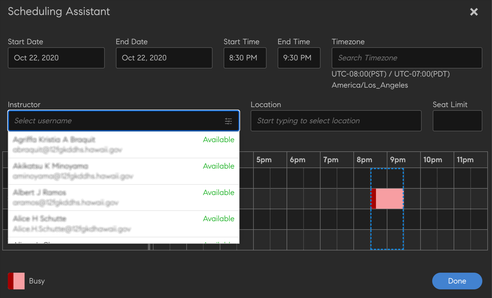
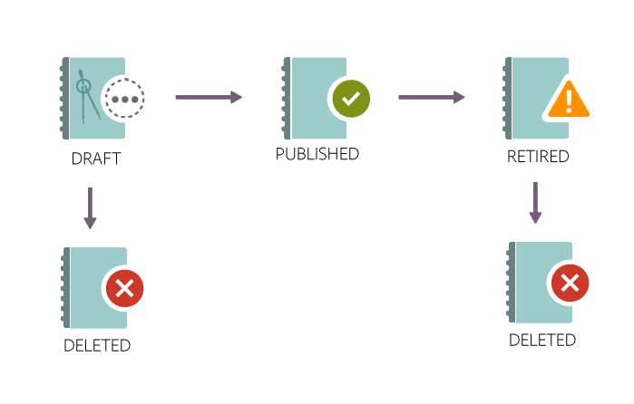
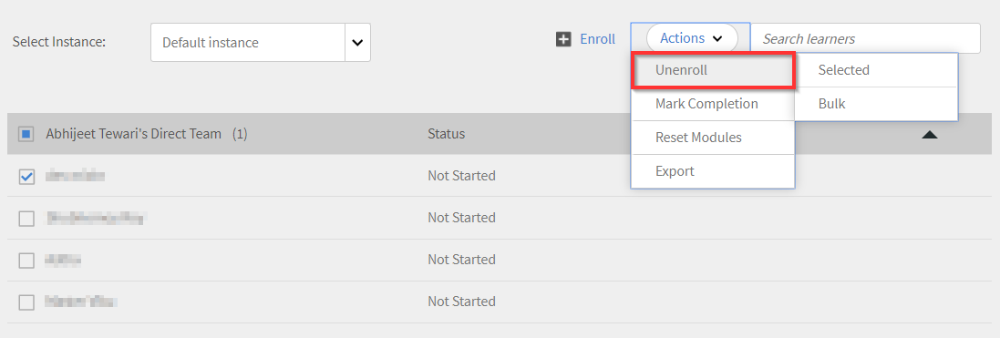

# Creazione, modifica e pubblicazione di corsi

Leggi questo articolo per scoprire come creare corsi, certificazioni e programmi di apprendimento in Learning Manager.

Gli Autori possono creare oggetti di apprendimento quali corsi, certificazioni e piani di apprendimento. Gli allievi possono usufruire di questi oggetti di apprendimento, mentre gli Amministratori possono monitorare l’avanzamento degli allievi.

## Corsi in Learning Manager {#coursesincaptivateprime}

Adobe Learning Manager consente agli Autori di creare corsi utilizzando uno o più moduli relativi ad attività, formazione virtuale, a ritmo personalizzato e in classe. Gli Amministratori possono inoltre utilizzare questi corsi per creare istanze del corso, iscrivere gli allievi, assegnare distintivi e abilitare il feedback per i corsi. Possono anche creare programmi di apprendimento, piani di apprendimento e certificazioni utilizzando questi corsi.

Gli Autori possono utilizzare contenuti di e-learning creati con qualsiasi strumento di eLearning. Altri formati di corso supportati includono file video, PDF, doc, docx, PPT e PPTX.

## Creazione di un corso - Flusso di lavoro di base {#createacoursebasicworkflow}

Per creare un corso, procedi nel seguente modo:

1. Accedi ad Adobe Learning Manager come Autore, poiché solo gli Autori hanno i diritti per creare corsi. Nella pagina della Guida introduttiva, fai clic su **[!UICONTROL Crea corsi]**.
1. Nella pagina **Panoramica corso**, inserisci il nome del corso. Inserisci una breve descrizione, che verrà visualizzata sulla scheda del corso. La descrizione non deve superare i 140 caratteri. Quindi inserisci la panoramica dettagliata del corso, che verrà visualizzata nella pagina dei dettagli del corso. Questa descrizione non deve superare i 1500 caratteri.

   In qualità di Autore, puoi visualizzare la descrizione dei moduli mentre li aggiungi a un corso.

1. Per rendere il tuo corso disponibile in altre lingue, fai clic su Aggiungi nuova lingua nell’angolo in alto a sinistra della pagina. Seleziona la lingua o le lingue in cui desideri rendere disponibile il tuo corso. Fai clic su **[!UICONTROL Salva]**. Per ulteriori informazioni, consulta [Aggiunta di contenuto per lingue diverse](/help/migrated/authors/feature-summary/content-library.md).
1. **Modifica delle impostazioni corsi**-

   1. Nella pagina Impostazioni corso, scegli un’abilità per il corso. Dall’elenco a discesa Abilità, scegli l’abilità richiesta. Dall’elenco a discesa Livello, scegli il livello richiesto.
   1. Scegli le abilità e il livello del corso e imposta i crediti per l’abilità. Aggiungi più abilità, se necessario.
   1. Dall’elenco a discesa **Tipo di iscrizione**, scegli il tipo di iscrizione.

   I tipi di iscrizioni sono descritti di seguito:

   * **Nominato dal Manager:** solo i Manager possono nominare questi corsi. Un Allievo non può effettuare l’iscrizione a questo tipo di corsi.
   * **Approvato dal Manager:** corsi approvati dai Manager. Gli Allievi possono registrarsi a questi corsi, ma non vengono iscritti direttamente senza l’approvazione del Manager. Una richiesta di notifica viene inviata ai Manager quando gli allievi si iscrivono a questo tipo di corsi. In seguito all’approvazione del Manager, gli allievi risultano iscritti ai corsi.
   * **Iscrizione autonoma:** gli allievi possono iscriversi direttamente a questo tipo di corsi.

1. Per salvare le modifiche, fai clic su **[!UICONTROL Salva]**. Per pubblicare il corso, fai clic su **[!UICONTROL Publish]**.

## Creazione di un corso - Flusso di lavoro avanzato {#createacourseadvancedworkflow}

1. Accedi ad Adobe Learning Manager come Autore, poiché solo gli Autori hanno i diritti per creare corsi. Nella pagina della Guida introduttiva, fai clic su **[!UICONTROL Crea corsi]**.
1. Nella pagina **Panoramica corso**, inserisci il nome del corso. Inserisci una breve descrizione, che verrà visualizzata sulla scheda del corso. La descrizione non deve superare i 140 caratteri. Quindi inserisci la panoramica dettagliata del corso, che verrà visualizzata nella pagina dei dettagli del corso. Questa descrizione non deve superare i 1500 caratteri.
1. Per rendere il tuo corso disponibile in altre lingue, fai clic su Aggiungi nuova lingua nell’angolo in alto a sinistra della pagina. Seleziona la lingua o le lingue in cui desideri rendere disponibile il tuo corso. Fai clic su **[!UICONTROL Salva]**. Per ulteriori informazioni, consulta [Aggiunta di contenuto per lingue diverse](/help/migrated/authors/feature-summary/content-library.md).
1. **Modifica delle impostazioni corsi**-

   1. Nella pagina Impostazioni corso, scegli un’abilità per il corso. Dall’elenco a discesa Abilità, scegli l’abilità richiesta. Dall’elenco a discesa Livello, scegli il livello richiesto.
   1. Scegli le abilità e il livello del corso e imposta i crediti per l’abilità. Aggiungi più abilità, se necessario.
   1. Se necessario, aggiungi le etichette di conformità personalizzate al corso. Consulta [Aggiungere etichette di conformità a corso/percorso di apprendimento/certificazione](/help/migrated/authors/feature-summary/courses.md#add-compliance-labels-to-courselearning-pathcertification).
   1. Dall’elenco a discesa **Tipo di iscrizione**, scegli il tipo di iscrizione.

   I tipi di iscrizioni sono descritti di seguito:

   * **Nominato dal Manager:** solo i Manager possono nominare questi corsi. Un Allievo non può effettuare l’iscrizione a questo tipo di corsi.
   * **Approvato dal Manager:** corsi approvati dai Manager. Gli Allievi possono registrarsi a questi corsi, ma non vengono iscritti direttamente senza l’approvazione del Manager. Una richiesta di notifica viene inviata ai Manager quando gli allievi si iscrivono a questo tipo di corsi. In seguito all’approvazione del Manager, gli allievi risultano iscritti ai corsi.
   * **Iscrizione autonoma:** gli allievi possono iscriversi direttamente a questo tipo di corsi.

1. Scegli se impostare un prezzo per il corso o se renderlo gratuito. Se desideri rendere il corso a pagamento, seleziona l’opzione **[!UICONTROL A pagamento]** e specifica il prezzo. Il prezzo viene quindi visualizzato nella scheda del corso e nella pagina con la panoramica del corso di un Allievo.

   NOTA: questa opzione viene attivata solo quando viene configurato il connettore Adobe Commerce.

1. Se desideri offrire agli allievi la possibilità di annullare la propria iscrizione al corso, attiva la casella di controllo **Gli allievi possono annullare l’iscrizione**.

1. **Configurazione istanza**

   Se attivi questa opzione, gli Allievi che si trovano nello stato In corso possono visitare altre istanze ed iscriversi. Un Allievo può quindi mantenere l’avanzamento dell’istanza precedente.

   Dopo la pubblicazione del corso, se torni alla pagina Impostazioni, l’opzione non è più modificabile.

   Puoi attivare l’opzione per i seguenti tipi di corso:

   * Autonomo
   * Aula
   * Activity
   * Misto

   Nota: durante la duplicazione di un corso, se hai abilitato l’opzione Configurazione istanza nel corso di origine, l’opzione rimane disabilitata nel corso di destinazione.

   **L&#39;opzione di istanza non è supportata per**:

   * Corsi a pagamento
   * Corsi con tipo di iscrizione nominato dal Manager.

   La configurazione della commutazione di istanza non verrà propagata agli account condivisi tra pari se condivisa tramite il catalogo; l’opzione rimane disattivata nel corso di destinazione.

1. **Più iscrizioni**

   In questo modo, è possibile iscrivere gli allievi a più istanze del corso in uno o più periodi.

   Abilita l’opzione **Iscrizione multipla** per passare da un’iscrizione a un altro corso di un Allievo. Se è stata abilitata la commutazione istanza, non è possibile utilizzare l’iscrizione multipla.

1. Seleziona i corsi propedeutici che devono essere completati prima di iniziare il corso. Fai clic sul campo Corsi e scegli dall’elenco dei corsi.
1. Abilita la casella di controllo **Abilita** **Prerequisiti** se desideri che i corsi propedeutici siano resi obbligatori.
1. Aggiungi parole chiave come tag relativi al tuo corso. Questi tag aiutano gli allievi a individuare facilmente il tuo corso durante la ricerca. Tutti questi tag vengono aggiunti automaticamente in base ai moduli aggiunti. Se desideri aggiungere altri tag a questo corso, puoi inserirli.
1. Aggiungi parole chiave come tag relativi al tuo corso. Questi tag aiutano gli allievi a individuare facilmente il tuo corso durante la ricerca. Tutti questi tag vengono aggiunti automaticamente in base ai moduli aggiunti. Se desideri aggiungere altri tag a questo corso, puoi inserirli.
1. Nel campo Ritiro automatico, seleziona una data in cui il corso viene ritirato. L’Amministratore deve prima abilitare l’opzione Ritiro automatico.
1. Per salvare le modifiche, fai clic su **[!UICONTROL Salva]**. Per pubblicare il corso, fai clic su **[!UICONTROL Publish]**.

### Aggiungi etichette di conformità a corso/percorso di apprendimento/certificazione {#add-custom-compliance-label}

Per aggiungere le etichette di conformità ai corsi, segui questi passaggi:

1. Nell&#39;app Autore, accedete a **[!UICONTROL Corsi]**/**[!UICONTROL Percorsi di apprendimento]**/**[!UICONTROL Certificazioni]** e selezionate **[!UICONTROL Aggiungi]**.
1. Digita il nome e altri dettagli quali descrizione e abilità.
1. Nella casella di testo **[!UICONTROL Conformità personalizzata]**, digitare e selezionare l&#39;etichetta di conformità.

   
   _Aggiungi conformità personalizzata_

   >[!IMPORTANT]
   >
   >Assicurati di impostare una scadenza per il corso quando aggiungi la conformità personalizzata.

   >[!NOTE]
   >
   >Un massimo di 50 corsi, percorsi di apprendimento o certificazioni può avere lo stesso valore per un’etichetta di tipo di conformità personalizzata.

1. Salva e pubblica il corso, il percorso di apprendimento e la certificazione.
Ora il corso/percorso di apprendimento/certificazione è considerato un tipo di conformità. Gli Amministratori possono aggiungere questo corso al dashboard di conformità e condividerlo con i Manager per monitorare l’avanzamento

>[!NOTE]
>
>Gli Autori possono anche aggiungere etichette di conformità a un corso, percorso di apprendimento o certificazione esistente modificandoli.

## Punti di gamification

Puoi assegnare i punti di gamification a livello di corso e di istanza del corso. In questo modo, puoi assegnare punti a diversi corsi o istanze. Gli Allievi sono incentivati a seguire corsi specifici o a preferire un’istanza particolare rispetto ad altre.

1. A livello di istanza del corso, seleziona **[!UICONTROL Punti di gamification]**.


*Impostare punti per la gamification*

1. Seleziona **[!UICONTROL Modifica]**.
1. Se selezioni Usa impostazioni a livello di corso, vengono visualizzate le seguenti opzioni:

   * **[!UICONTROL Al completamento]**: seleziona questo pulsante se desideri che l’Allievo ottenga 100 punti quando completa un corso.
   * **Altre regole**

      * **[!UICONTROL Completamento anticipato]**: se selezioni questa opzione, i primi 30 Allievi ottengono 100 punti quando completano un corso.
      * **[!UICONTROL Completamento tempestivo]**: se selezioni questa opzione, gli Allievi ottengono 100 punti se completano un corso entro 999 giorni.

1. Se selezioni **[!UICONTROL Usa impostazioni personalizzate]**, vengono mostrate le seguenti opzioni:

   * **[!UICONTROL Al completamento]**: seleziona questo pulsante se desideri che l’Allievo ottenga 100 punti quando completa un corso.
   * **Altre regole**

      * **[!UICONTROL Completamento anticipato]**: se selezioni questa opzione, puoi determinare quanti Allievi riceveranno i punti specificati.
      * **[!UICONTROL Completamento tempestivo]**: se selezioni questa opzione, puoi determinare il numero di punti che gli Allievi otterranno se completano un corso entro un periodo di tempo specificato.

   

   *Impostare il completamento anticipato e puntuale*

1. Seleziona **[!UICONTROL Salva]**.

## Risorse formative aggregate

Un autore può decidere se aggregare le risorse di apprendimento a livello di piano di apprendimento o lasciarle a livello di singolo corso.

In qualità di Autore, seleziona **[!UICONTROL Percorso di apprendimento]** > **[!UICONTROL Impostazioni]**. Fai clic su **[!UICONTROL Modifica]**.

Nella sezione **[!UICONTROL Risorse]**, la casella di controllo Mostra le risorse del corso costitutive aggregate a livello di percorso di apprendimento, se attivata, indica se le risorse presenti a livello di corso verranno visualizzate a livello di percorso di apprendimento.

>[!NOTE]
>
>Nella pagina Impostazioni di un percorso di apprendimento, un Amministratore può anche abilitare questa opzione, che visualizza le risorse presenti al livello del corso che verrebbero mostrate al livello del percorso di apprendimento.

## Assistente pianificazione

Gestisci i conflitti nella prenotazione di Istruttori e aule. Se desideri sapere in quale data e ora è disponibile un istruttore prima di assegnarlo al corso, utilizza l’Assistente alla pianificazione.

Durante la creazione di un corso VC o CR, fai clic su Assistente alla pianificazione.


*Avvia assistente pianificazione*

Viene visualizzata la finestra Assistente pianificazione.


*Finestra di dialogo dell&#39;Assistente alla pianificazione*

Nella schermata Assistente pianificazione, puoi:

* Cercare gli Istruttori in base ai loro nomi.
* Cercare gli Istruttori in base alle loro abilità.

### Cercare gli Istruttori in base ai loro nomi

Nel campo Istruttore, digita il nome dell’Istruttore o Inserisci parte del nome di un Istruttore. Viene visualizzato un elenco di Istruttori tra cui scegliere.


*Ricerca di istruttori*

È possibile selezionare più Istruttori, ma può esserne assegnato solo uno alla volta. L’ora selezionata verrà evidenziata nella finestra del conflitto degli orari. Accanto all’istruttore, compare un’icona a forma di croce, sulla quale fate clic per rimuovere l’istruttore.



*Ricerca di più istruttori*

### Cercare gli Istruttori per abilità

Cerca un Istruttore con una o più abilità. La ricerca utilizza l’operatore AND.

La ricerca delle abilità può essere effettuata solo per nome di abilità parziale o completo, non per livello di abilità.

Nell’Assistente, inserisci il nome dell’Istruttore, la posizione e il limite di posti.

Puoi anche cercare le abilità, che verrebbero visualizzate dopo aver fatto clic sull’icona del filtro presente sul lato destro della casella di ricerca dell’Istruttore. La schermata seguente mostra il pulsante.


*Ricerca di istruttori in base alle abilità*

### Filtro per gruppi di utenti

Seleziona il filtro nel campo Istruttore. C’è un filtro **[!UICONTROL Gruppo utenti]**; un Autore o un Autore personalizzato può trovare l’istruttore giusto utilizzando i valori nel gruppo di utenti.

Se vengono applicati entrambi i filtri, viene visualizzato un elenco di istruttori che appartengono al gruppo di utenti e che hanno le abilità selezionate.

Questo vale per l&#39;Assistente alla pianificazione nella pagina Corsi o Istanze.


*Filtra per gruppi di utenti*

### Pagina dell’istanza

Puoi inoltre accedere all’Assistente pianificazione dalla pagina Istanza, come illustrato di seguito.

L&#39;Assistente alla pianificazione è disponibile anche nella pagina Istanza per gli amministratori e per gli amministratori/autori personalizzati.


*Pianificare gli istruttori dalla pagina Istanze*

### Ricerca di una posizione

È possibile cercare un&#39;aula specificando sia il nome dell&#39;aula sia il nome dell&#39;area aula sia nelle pagine del modulo e dell&#39;Assistente alla pianificazione.

## Formattazione testo RTF

Durante la creazione di un corso, un programma di apprendimento, una certificazione o una risorsa formativa, gli autori possono inserire diversi tipi di contenuti, come testi o immagini, oppure applicare varie opzioni di formattazione del testo.

Quando si crea un corso, è possibile visualizzare Editor di testo RTF nel campo Panoramica del corso. Potete formattare il contenuto, aggiungere immagini, collegamenti ipertestuali e così via.


*Avvia l&#39;editor RTF*

Analogamente, è possibile utilizzare Editor di testo RTF per modificare la descrizione durante la creazione di:

**Programma di apprendimento**


*Usa editor di testo RTF per un programma di apprendimento*

**Certificazione**


*Utilizzare Editor di testo RTF per una certificazione*

**Risorsa formativa**


*Usa editor di testo RTF per una risorsa formativa*

Inoltre, è possibile utilizzare l’Editor di testo RTF per altre lingue.

## Supporto per descrizione RTF per interfaccia utente headless

### Perché è necessario CSS?

Il testo RTF è composto da markup HTML. Senza CSS, il rendering del markup causerebbe l’applicazione di uno stile predefinito da parte del browser. Questo spesso non è adatto alle linee guida di stile dell’azienda. Per rispettare le linee guida è necessario un CSS.

### Stile predefinito

Il foglio di stile CSS allegato contiene lo stile applicato da Learning Manager. Lo stile è adattato in base alla maggioranza dei casi d’uso. Scarica il file CSS allegato e importalo nell’app web in base alle tue convenzioni e al tuo sistema di compilazione. Le classi CSS definite hanno lo spazio dei nomi ql-editor e non interferiscono con gli stili esistenti.

### Personalizzare gli stili

Lo stile predefinito potrebbe non soddisfare le esigenze di tutti. Le personalizzazioni possono essere eseguite sovrascrivendo il CSS fornito. Tutti i parametri di stile sono contenuti all’interno di ql-editor come selettori di discendenti. Vengono utilizzate le seguenti classi:

* Rientro: **li.ql-indent-$number**. $number varia da 1 a 9
* Dimensione: **ql-size-small**, **ql-size-large**, **ql-size-huge**

* Allineamento: **ql-align-center**, **ql-align-justify**, **ql-align-right**

* Colore: **ql-color-$color**. $color = white, red, orange, yellow, green, blue, purple
* Sfondo: **ql-bg-$color**. $color = black, red, orange, yellow, green, blue, purple
* Tag HTML: p, ol, ul, pre, blockquote, h1, h2, h3, h4, h5, h6

[File CSS da utilizzare per la personalizzazione.](assets/ql-headless.css)

### MODIFICHE ALLE API PER CONSENTIRE IL RENDERING DELLE PANORAMICHE DEL TESTO RTF

Durante lo sviluppo di un’interfaccia utente senza intestazione, i clienti hanno la necessità di visualizzare gli oggetti di apprendimento presenti in tale interfaccia. A tale scopo, in genere viene utilizzata l’API esposta [GET /learningObjects](https://learningmanagereu.adobe.com/docs/primeapi/v2/#!/learning_object/get_learningObjects). Ora che Learning Manager supporta l’acquisizione del testo RTF per il campo della panoramica, anche il modello di dati degli oggetti di apprendimento nelle risposte API espone la stessa. Consulta il campo denominato &quot;richTextOverview&quot; nel frammento del modello nella risposta API riportata di seguito. Tieni inoltre presente che il campo esposto in precedenza (&quot;overview&quot;) rimane invariato per la compatibilità con le versioni precedenti.

```
{ 
 "data": [ 
 { 
 "id": "string", 
 "type": "string", 
 "attributes": { 
 … 
 "localizedMetadata": [ 
 { 
 "description": "string", 
 "locale": "string", 
 "name": "string", 
 "overview": "string", 
 "richTextOverview": "string" 
 } 
 ], 
 … 
 }, 
 "relationships": { 
 … 
 } 
 } 
 } 
 ] 
} 
```

Le interfacce utente dei clienti che utilizzano già il campo della panoramica non subiranno alcuna modifica e visualizzeranno solo il testo normale come prima. Per sfruttare la panoramica del testo RTF, i clienti dovranno creare panoramiche in RTF per i propri oggetti di apprendimento nell’interfaccia utente per Autori. Successivamente, Learning Manager inizierà a restituire anche la panoramica in RTF in aggiunta al testo normale (come prima) nel modello di risposta API.

Tuttavia, per eseguire il rendering di tale testo RTF nell’interfaccia utente, i clienti dovranno includere un CSS. Ciò è spiegato in dettaglio nelle sezioni seguenti.

## Consenti più tentativi {#allowmultipleattempts}

Una volta che l’Amministratore ha abilitato i tentativi multipli, come Autore è possibile configurare più tentativi per un modulo di e-learning interattivo a livello di corso o modulo.


*Configurare più tentativi per un modulo di e-learning interattivo*

<table>
 <tbody>
  <tr>
   <td>
    <p><b>Opzione</b></p></td>
   <td>
    <p><b>Descrizione</b></p></td>
  </tr>
  <tr>
   <td>
    <p>Imposta tentativi su</p></td>
   <td>
    <p>È possibile impostare il numero di tentativi per un modulo su infiniti o specificare un limite preciso.<span style="font-size: 0.8125rem;">Le informazioni sui tentativi verranno mostrate all’Allievo una volta abilitate. L'Allievo può scegliere di ritentare il modulo facendo clic sul pulsante 'Ritenta'.</span></p></td>
  </tr>
  <tr>
   <td>
    <p>Interrompi nuovo tentativo quando il modulo è completo o superato</p></td>
   <td>
    <p>Per configurare quando impedire agli Allievi di selezionare l’opzione Nuovo tentativo, attiva la casella di controllo "Interrompi nuovo tentativo una volta completato o superato il modulo". L’opzione "Ritenta" verrà rimossa dalla visualizzazione dell’Allievo una volta completato correttamente il modulo.</p></td>
  </tr>
  <tr>
   <td>
    <p>Blocca il modulo tra i tentativi 0:0:1 Formato: Giorni/Ore/Minuti</p></td>
   <td>
    <p>È possibile bloccare i moduli per un periodo di tempo specifico tra un tentativo e l'altro selezionando la casella di controllo "<b>Blocca modulo tra i tentativi 0:0:1 Formato: Giorni/Ore/Minuti</b>". Quando un modulo è bloccato, l’Allievo non può visitarlo fino a quando il periodo di blocco previsto non è trascorso. </p>
    <p>È possibile definire i criteri di fine di un tentativo selezionando le caselle di controllo '<b>Chiusura lettore</b>' o '<b>Completamento</b>'.</p></td>
  </tr>
  <tr>
   <td>
    <p>Chiusura lettore</p></td>
   <td>
    <p>Ogni avvio del modulo viene considerato come un nuovo tentativo se il criterio è selezionato come “<b>Chiusura lettore</b>”. All’Allievo vengono richiesti i dettagli di blocco del modulo e i dettagli del tentativo al momento della chiusura del lettore.</p></td>
  </tr>
  <tr>
   <td>
    <p>Completamento</p></td>
   <td>
    <p>Se la fine di un tentativo viene impostata in base al <b>Completamento</b>, essa verrà determinata sulla base dei criteri di successo del contenuto. Gli Allievi non possono ritentare il modulo finché il contenuto non invierà le informazioni di completamento. I dettagli relativi a blocco del modulo e al tentativo sono comunicati all’Allievo una volta completato il tentativo.</p></td>
  </tr>
  <tr>
   <td>
    <p>Imposta tempo limite per completare il modulo</p></td>
   <td>
    <p>Gli autori possono impostare un limite di tempo per il completamento del modulo selezionando la casella di controllo "<b>Imposta tempo limite per completare il modulo</b>".</p>
    <p>Ogni avvio del lettore è considerato come un nuovo tentativo e all’Allievo viene comunicata la durata durante l’avvio.</p>
    <p><b>Nota:</b><span style="font-size: 0.8125rem;">il tentativo terminerà automaticamente una volta trascorso il tempo. Anche la chiusura del lettore determinerà la conclusione del tentativo corrente.</span></p></td>
  </tr>
  <tr>
   <td>
    <p>Tentativi multipli a livello di modulo</p></td>
   <td>
    <p>Selezionando un tentativo a “Livello di modulo” dall’elenco a discesa “Imposta tentativo su”, è possibile configurare le opzioni a livello del singolo modulo.</p></td>
  </tr>
 </tbody>
</table>

## Moduli del corso {#coursemodules}

### Aggiungi moduli {#addmodules}

Ora puoi aggiungere i moduli Contenuto, Preparazione e Verifica. I moduli **Contenuto** sono i moduli principali che costituiscono il corso. I moduli **Preparazione** includono alcune informazioni di base che possono aiutare gli allievi a prepararsi per il corso. Il completamento di questi moduli non è obbligatorio per gli allievi. I moduli **Verifica** consentono agli allievi di saltare il contenuto e passare alla fase di verifica se sono già a conoscenza del contenuto e desiderano fare il test per soddisfare i requisiti di conformità.

Per aggiungere un modulo di contenuto, procedi come descritto di seguito:

1. Fai clic su **[!UICONTROL Aggiungi moduli]**. Vengono mostrate quattro opzioni per aggiungere moduli. La prima opzione consiste nell’aggiungere moduli a ritmo personalizzato. Si tratta di moduli creati e aggiunti da te alla libreria di moduli in Adobe Learning Manager. La seconda opzione consiste nell’impostare la Classe virtuale. La terza consiste nell’impostare un Modulo classe, mentre la quarta prevede il Modulo attività.

   

   *Aggiungere un modulo per un corso*

   **Modulo a ritmo personalizzato:** in questa modalità è possibile avviare e completare un modulo del corso secondo i propri ritmi. Puoi gestire il tuo ritmo.

   Dopo aver fatto clic sull’opzione vedrai l’elenco dei moduli a ritmo personalizzato già aggiunti alla tua libreria di moduli. Qui puoi scorrere l’elenco e selezionare quelli che desideri aggiungere, oppure puoi cercare i moduli inserendo il nome del modulo o i tag del modulo nel campo di ricerca.

   Dopo aver aggiunto i moduli, fai clic su **[!UICONTROL Aggiungi]**. Questi moduli vengono ora visualizzati nella sezione Contenuto.

   È possibile riordinare i moduli. Trascina un modulo spostandolo verso l’alto o verso il basso e disponi i moduli in sequenza corretta.

   **Modulo classe virtuale:** in questa modalità, gli allievi possono frequentare lezioni online in diretta, assistiti da un Istruttore qualificato. Inserisci il titolo e la descrizione della sessione e impostane la durata. Puoi anche specificare l’URL della conferenza e gli Istruttori che condurranno la sessione. Per salvare le modifiche, fai clic su **[!UICONTROL Fine]**.

   

   *Aggiungi un modulo aula virtuale*

   Quando crei un corso utilizzando la finestra di dialogo di configurazione Aula virtuale, imposta il **sistema di conferenza** sulla connessione Teams che hai creato. Seleziona se desideri avere un organizzatore della riunione per l’evento.

   Se selezioni **Sì** per un organizzatore della riunione, devi immettere il nome dell&#39;organizzatore. Digita il nome e seleziona l’organizzatore.

   **Esclusione della sala d&#39;attesa**

   * Se selezioni **Sì**, qualsiasi Allievo può partecipare alla riunione.
   * Se selezioni **No**, viene inviata una richiesta all’organizzatore per consentire o impedire all’Allievo di partecipare alla riunione.

   **Nota:** un Allievo deve essere disponibile in Microsoft Teams, ma può iscriversi a Learning Manager come ospite.

   **Modulo classe:** gli allievi partecipano di persona alle lezioni, assistiti da un Istruttore qualificato. Inserisci il titolo e la descrizione della sessione e impostane la durata. Puoi anche specificare la posizione della classe e gli Istruttori che condurranno la sessione. Per salvare le modifiche, fai clic su **[!UICONTROL Fine]**.

   

   *Aggiungere un modulo classe*

   Durante la creazione di un corso, nella finestra di dialogo di configurazione Aula virtuale, imposta il sistema di conferenza sulla connessione di Microsoft Teams creata. Seleziona se desideri avere un organizzatore della riunione per l’evento.

   Se selezioni Sì, inserisci il nome dell’organizzatore. Digita il nome e seleziona l’organizzatore.

   **Esclusione della sala d&#39;attesa**

   * Se selezioni Sì, qualsiasi Allievo può partecipare alla riunione.
   * Se selezioni No, viene inviata una richiesta all’organizzatore per consentire o impedire all’Allievo di partecipare alla riunione.

   **Nota:** se un Allievo desidera unirsi ai Microsoft Teams come ospite, deve inserire l’e-mail. L’e-mail deve essere presente in Learning Manager.

   **Modulo attività:** in questa modalità gli allievi devono completare una serie di attività, ad esempio laboratori, esercitazioni, questionari e altre attività di apprendimento. Inserisci il titolo, la descrizione e l’URL esterno come riferimento. Per salvare le modifiche, fai clic su **[!UICONTROL Fine]**.

   

   *Aggiungere un modulo attività*

   Puoi specificare la durata durante l’aggiunta di un modulo di attività in un corso per il tipo di attività Invio file e moduli basati su xAPI.

1. Allo stesso modo, aggiungi moduli per le modalità Preparazione e Verifica.
1. Scegli il tipo di ordinamento dei moduli fra Ordinati o Non ordinati in base alle tue preferenze.

   Se selezioni **Ordinati**, i moduli vengono visualizzati nell’ordine in cui sono stati creati. Se scegli **Non ordinati**, i moduli non vengono messi in sequenza. Gli allievi possono completare i moduli in qualsiasi ordine.

1. Dall’elenco a discesa Moduli obbligatori, seleziona il numero di moduli che l’Allievo deve obbligatoriamente seguire per completare il corso.
1. Aggiungi un’immagine di copertina e l’immagine del banner per il corso. I cataloghi sono creati dall’Amministratore. Per ulteriori informazioni, consulta [Cataloghi](/help/migrated/administrators/feature-summary/catalogs.md).

   **Nota:** le dimensioni consigliate sono:

   * **Immagine di copertina:** 300 px x 300 px
   * **Immagine del banner:** 1600 px x 140 px

1. Nell’angolo in alto a destra della pagina, fai clic su **[!UICONTROL Salva]**.

#### Collegamento Aggiungi HTML nel modulo attività

Gli autori possono aggiungere collegamenti HTML nel modulo di attività e impostare i criteri di completamento. Per aggiungere un collegamento HTML e impostare i criteri di completamento, effettua le seguenti operazioni:

1. Nell’app Autore, seleziona **[!UICONTROL Crea corsi]** nella home page.
1. Seleziona **[!UICONTROL Aggiungi]** dalla schermata **[!UICONTROL Catalogo corsi]**
1. Digita il nome e la descrizione del corso.
1. Nell&#39;opzione **[!UICONTROL Modulo]**, selezionare **[!UICONTROL Aggiungi modulo]** > **[!UICONTROL Modulo attività]**.
1. Nella finestra di dialogo **[!UICONTROL Modulo attività]**, digitare il nome e la descrizione.
1. Seleziona **[!UICONTROL Tipo]** come **[!UICONTROL URL esterno]**.
1. Selezionare una delle opzioni seguenti dall&#39;opzione **[!UICONTROL Criteri di completamento]**.
   * **[!UICONTROL L’Allievo segna il completamento]**: può contrassegnare il corso come completato nel lettore Fluidic.
   * **[!UICONTROL All’avvio dei contenuti]**: il corso verrà contrassegnato automaticamente come completato al momento dell’avvio da parte dell’Allievo.

   
   _Criteri di completamento_

1. Seleziona **[!UICONTROL Aggiungi]** e pubblica il corso.

## Elenco di controllo {#create-checklist}

La valutazione è un aspetto importante di qualsiasi LMS. Le valutazioni online sono uno dei metodi principali per valutare la comprensione di un argomento da parte di un Allievo. Ma spesso, è necessario valutare la comprensione di una persona mentre è sul lavoro osservandola / la sua esecuzione dei compiti necessari.

Pensa ai dipendenti di un negozio o agli addetti al magazzino sottoposti a valutazione per le attività che dovrebbero svolgere quotidianamente. Potrebbe trattarsi dei passaggi da seguire per riparare una macchina da caffè o delle attività che riguardano l’imballaggio di un materiale. Gli Istruttori possono valutare i dipendenti per tali attività sulla base di un elenco di controllo e indicare se hanno superato o meno la valutazione.

### Creazione di un elenco di controllo {#createachecklist}

Solo un Autore può creare un elenco di controllo. Un elenco di controllo è un tipo di modulo di attività. Durante l’impostazione di un modulo di attività, l’Autore può selezionare un’attività come **Elenco di controllo**, come illustrato di seguito:


*Creare un elenco di controllo*

Dopo aver scelto l’opzione **Elenco di controllo**, visualizzerai alcune opzioni aggiuntive.

**Tipo elenco di controllo:** scegli un’opzione, **Sì/No** oppure **1-5**. Se scegli Sì/No, l’elenco di controllo conterrà domande a cui è possibile rispondere solo con sì o no. Se scegli 1-5, puoi visualizzare un elenco di controllo Likert, in cui puoi valutare una domanda su una scala di cinque punti.

**Criteri di superamento:**

<table>
 <tbody>
  <tr>
   <td>
    <p>Se hai scelto <b>Sì/No</b>, allora...</p></td>
   <td>
    <p>Se hai scelto <b>1-5</b>, allora...</p></td>
  </tr>
  <tr>
   <td>
    <p>Imposta i criteri di superamento come numero di risposte su Sì. Ad esempio, se immetti 3, l’Allievo supera il corso se riceve almeno tre risposte <b>Sì </b>quando viene valutato da un Istruttore.</p></td>
   <td>
    <p>Imposta i criteri di superamento come soglia di qualsiasi numero compreso tra 1-5. Ad esempio, se immetti 2 e 4, l’Allievo supera il corso se raggiunge almeno <b>due </b>valutazioni che hanno un punteggio maggiore o uguale a <b>quattro</b>.</p></td>
  </tr>
 </tbody>
</table>

Scegli almeno un Istruttore che valuterà l’Allievo.

Inoltre, se devi aggiungere un commento o una nota, puoi farlo nel campo di testo **Nota per l’Istruttore**.

Ora aggiungi le domande dell’elenco di controllo. Fai clic su **[!UICONTROL Aggiungi]**. Puoi aggiungere solo fino a 150 domande.


*Aggiungi domande all&#39;elenco di controllo*

Per aggiungere altre domande, fai clic su **[!UICONTROL Aggiungi altro]**.

Salva le modifiche, aggiungi il modulo e pubblica il corso.

### Aggiungi abilità {#addskills}

Inserisci i seguenti dettagli su questa pagina:

1. Scegli le abilità e il livello del corso e imposta i crediti per l’abilità. Aggiungi più abilità, se necessario.

   

   *Aggiungere abilità per un corso*

1. Scegli il tipo di iscrizione. Le opzioni sono le seguenti:

   * **Nominato dal Manager:** solo i Manager possono nominare questi corsi. Un Allievo non può effettuare l’iscrizione a questo tipo di corsi.
   * **Approvato dal Manager:** corsi approvati dai Manager. Gli Allievi possono registrarsi a questi corsi, ma non vengono iscritti direttamente senza l’approvazione del Manager. Una richiesta di notifica viene inviata ai Manager quando gli allievi si iscrivono a questo tipo di corsi. In seguito all’approvazione del Manager, gli allievi risultano iscritti ai corsi.
   * **Iscrizione autonoma:** gli allievi possono iscriversi direttamente a questo tipo di corsi.

1. Se desideri offrire agli allievi la possibilità di annullare la propria iscrizione al corso, attiva la casella di controllo **Gli allievi possono annullare l’iscrizione**.
1. Seleziona i corsi propedeutici che devono essere completati prima di iniziare il corso. Fai clic sul campo Corsi e scegli dall’elenco dei corsi.

   

   *Aggiungi corsi propedeutici*

1. Abilita la casella di controllo **Prerequisiti** se desideri che i corsi propedeutici siano resi obbligatori.
1. Aggiungi parole chiave come tag relativi al tuo corso. Questi tag aiutano gli allievi a individuare facilmente il tuo corso durante la ricerca. Tutti questi tag vengono aggiunti automaticamente in base ai moduli aggiunti. Se desideri aggiungere altri tag a questo corso, puoi inserirli.
1. Aggiungi i profili dei destinatari ideali del corso facendo clic sull’area di testo e scegliendo i profili dai suggerimenti.
1. Aggiungi file di risorse per il corso come materiale aggiuntivo. Trascina i tuoi materiali, quali testi, video o file audio.
1. Ora questo corso sarà disponibile come corso consigliato per gli allievi con questi profili. In questa sezione puoi anche allegare risorse aggiuntive per i tuoi allievi. Gli allievi potranno scaricare questi file per riferimento futuro. Una volta terminate tutte queste modifiche, fai clic su **[!UICONTROL Salva]** nell’angolo in alto a destra. Il corso viene salvato come bozza. Il corso viene salvato come bozza per impostazione predefinita.

## Assegnazione di Istruttori ai moduli {#assigninstructorsformodules}

1. Dopo aver creato i moduli per il tuo corso, puoi assegnare Istruttori ai moduli. Nel dashboard Autore, fai clic su **[!UICONTROL Catalogo corsi]**.
1. Fai clic sul corso contenente il modulo a cui desideri assegnare gli Istruttori.
1. Nella sezione **Aggiungi moduli**, fai clic sul modulo a cui desideri assegnare un Istruttore.
1. Nel campo **Istruttore**, specifica il nome dell’utente a cui desideri assegnare il ruolo di Istruttore.

   

   *Assegnare un ruolo di istruttore a un utente*

1. Per ripubblicare il corso con gli aggiornamenti, fai clic su **[!UICONTROL Ripubblica]**.

### Consenti agli istruttori di contrassegnare l’esito positivo

Adobe Learning Manager consente agli istruttori di contrassegnare lo stato di successo degli Allievi in un’aula o in un modulo aula virtuale. Gli Autori possono concedere agli Istruttori l’autorizzazione a contrassegnare lo stato di successo degli Allievi durante la creazione di moduli aula o aula virtuale. Gli istruttori possono contrassegnare l’esito positivo di un Allievo come Superato o Non riuscito, assicurandosi che i progressi vengano aggiornati di conseguenza.

Per consentire agli istruttori di contrassegnare l’esito positivo dell’Allievo:

1. Accedi ad Adobe Learning Manager come autore.
2. Seleziona **[!UICONTROL Crea corsi]** nella pagina principale.
3. Seleziona **[!UICONTROL Aggiungi]**.
4. Digitare i dettagli necessari e selezionare **[!UICONTROL Aggiungi moduli]**.
5. Seleziona **[!UICONTROL Modulo classe virtuale]** o **[!UICONTROL Modulo classe]**.
6. Digitare i dettagli necessari e selezionare le date.
7. Seleziona l&#39;opzione **[!UICONTROL Consenti all&#39;istruttore di contrassegnare l&#39;esito positivo]**.

   
   _Schermata Dettagli della sessione con l’opzione Consenti all’Istruttore di contrassegnare l’esito positivo evidenziata per i moduli Classe o Classe virtuale_

8. Seleziona **[!UICONTROL Fine]**.


## Elenco di controllo di osservazione

I manager, oltre agli Istruttori, ora possono rivedere un modulo Elenco di controllo. I manager del personale, così come i manager non gerarchici, ad esempio quelli dei punti vendita o delle posizioni, possono rivedere e completare l’elenco di controllo.

Gli Autori del corso possono aggiungere come revisori i manager delle persone e i manager non gerarchici (se applicabile) selezionando queste opzioni di ruolo nella sezione &quot;Revisori&quot; durante l’impostazione di un modulo Elenco di controllo. Questa operazione può essere fatta a livello di istanza del corso.


*Aggiungere revisori in un modulo attività*

Se si seleziona l’opzione &quot;**[!UICONTROL +Manager]**&quot;, il manager di un Allievo nella gerarchia dell’organizzazione potrà automaticamente esaminare l’elenco di controllo. Non è necessario cercare e aggiungere i nomi dei manager singolarmente.

Se l’amministratore dell’account ha impostato ruoli di manager non gerarchici (come manager delle posizioni o delle sedi) utilizzando l’opzione Campi attivi, tali ruoli di manager saranno disponibili per la selezione e consentiranno loro di rivedere l’elenco di controllo.

Non è necessario cercare e aggiungere i nomi dei manager singolarmente. Quando gli Allievi si iscrivono al corso dell’elenco di controllo, invieranno automaticamente una notifica ai loro Manager/Manager dei punti vendita per la revisione insieme a eventuali Istruttori selezionati. Questo flusso di lavoro consente agli autori di non citare i nomi dei singoli manager.

Nella schermata di esempio fornita sopra, la selezione dell’opzione &quot;**[!UICONTROL +Store Manager]**&quot; consentirà automaticamente al manager non gerarchico allineato all’Allievo di rivedere l’elenco di controllo. Si noti che &quot;store&quot; qui verrà sostituito dal campo attivo definito dall&#39;amministratore.

Gli aggiornamenti al modulo dell’elenco di controllo includono anche le notifiche a Istruttori e manager quando un Allievo è iscritto a un corso che contiene un modulo Elenco di controllo. Il revisore riceve una notifica nel centro notifiche di Learning Manager e nella dashboard dell’Istruttore/del manager che indica che è necessario eseguire un’azione nell’elenco di controllo.

<!---->

Il revisore potrà visualizzare le informazioni su tutti gli elementi di revisione dell’elenco di controllo in attesa dal menu Elenchi di controllo e dal menu Notifiche quando accede come Istruttore/manager.


*Approvazioni per la certificazione*

Dopo aver fatto clic su Revisiona elenco di controllo, il revisore può completare la valutazione.


*Verifica elementi dell&#39;elenco di controllo in sospeso*

È possibile scaricare report sugli elenchi di controllo, che includono informazioni dettagliate sulla valutazione dell’Allievo, il nome, il ruolo e l’e-mail del revisore.

Il file CSV del report Elenco di controllo contiene i campi nuovi e aggiornati:

* Nome revisore anziché Nome istruttore
* E-mail del revisore anziché e-mail dell’istruttore
* Ruolo del revisore: i valori possibili sono Manager, Manager del punto vendita/della posizione, Istruttore

## Anteprima del corso {#previewacourse}

Una volta creato e salvato il corso come bozza, è possibile visualizzare l’anteprima del corso come Allievo, quindi pubblicarlo per renderlo disponibile nel catalogo dei corsi.

Per visualizzare un’anteprima del corso, fai clic su **[!UICONTROL Anteprima come Allievo]**.


*Anteprima di un corso come Allievo*

Viene aperta la pagina della **Panoramica** del corso, dove puoi vedere i moduli, il loro ordine e altri dettagli relativi al corso.


*Visualizza moduli e altri dettagli correlati*

Per avere un’idea di come gli allievi interagiscono con questo corso, fai clic su ciascuno dei moduli per iniziare a utilizzarli. La riproduzione dei contenuti del corso viene avviata nel lettore Fluidic.

## Pubblicazione di un corso {#publishacourse}

Dopo aver visualizzato l’anteprima del corso come Allievo, puoi pubblicare il corso rendendolo disponibile agli allievi. Nota: il corso è ancora in modalità bozza.

Il ciclo di vita tipico di un corso è il seguente:

* **Bozza** - Quando un Autore completa la creazione di un corso e lo salva. A questo punto, il corso non è ancora disponibile per gli allievi.
* **Pubblicato** - Quando un Autore completa la pubblicazione di un corso. A questo punto, il corso è disponibile per l’iscrizione da parte degli allievi. A questo punto, è anche possibile modificare un corso.
* **Ritirato** - Dopo aver pubblicato un corso, un Autore può attribuirgli lo stato Ritirato se desidera che il corso non venga più visualizzato nel catalogo per gli allievi.
* **Eliminato** - A un corso viene attribuito lo stato Eliminato quando viene rimosso completamente dall’applicazione Adobe Learning Manager. Solo gli Autori possono eliminare i corsi che si trovano nello stato Bozza o Ritirato.



*Flusso di lavoro di un ciclo di vita del corso*

Per pubblicare il corso creato, fai clic su **[!UICONTROL Pubblica]** nell’angolo in alto a destra della pagina.


*Publish per un corso*

Fai clic su **[!UICONTROL OK]** nel messaggio di conferma della finestra a comparsa visualizzata.

Il corso è ora disponibile nel catalogo dei corsi.

## Visualizzazione di un corso {#viewacourse}

Puoi visualizzare un elenco di tutti i corsi disponibili come Autore. Per visualizzare tutti i corsi disponibili nell’account Learning Manager, fai clic su Catalogo corsi. Per visualizzare tutti i corsi che hai creato in Learning Manager, fai clic su **[!UICONTROL I miei corsi]**.

Nella scheda del corso, passa con il cursore del mouse sulle opzioni e fai clic su **[!UICONTROL Visualizza corso]**.


*Visualizza un corso*

Viene visualizzata la finestra delle informazioni del corso. Il corso è in modalità di sola lettura. Per modificare il corso, fai clic su **[!UICONTROL Modifica]**.

## Ritiro di un corso {#retireacourse}

Se un corso viene ritirato, verrà nascosto agli Allievi, anche se sono iscritti o hanno già completato il corso. Se ritiri un corso, non puoi iscrivervi nuovi allievi. Gli allievi già iscritti possono seguire il corso.

Per ritirare un corso, vai alla scheda del corso, passa con il cursore del mouse sulle opzioni e fai clic su Ritira corso.


*Ritiro di un corso*

Fai clic su **[!UICONTROL Sì]** nella finestra a comparsa di conferma visualizzata.

## Duplicazione di un corso {#duplicateacourse}

È possibile creare una copia del corso e quindi modificare il corso. Se desideri eseguire il backup del corso, è possibile duplicarlo.

## Ricerca di corsi {#searchforcourses}

Adobe Learning Manager consente di individuare i corsi che cerchi rapidamente e con facilità. Puoi eseguire una ricerca tra i corsi nei modi seguenti:

**Campo di ricerca:** Fai clic sulla barra di ricerca nell’angolo in alto a destra della pagina **Catalogo corsi**. Digita il nome del corso o le parole chiave associate ai tuoi corsi. Puoi anche effettuare la ricerca usando i tag aggiunti durante la creazione del corso. I tag sono ricercabili all’interno del campo di ricerca dei corsi, il che significa che vengono visualizzati nel campo di ricerca durante la digitazione.


*Cerca corsi*

**Filtra elenco dei corsi:** puoi filtrare i corsi per stato, come Tutti, Pubblicati, Bozza e Ritirati. A seconda della scelta, puoi visualizzare l’elenco filtrato di corsi e selezionare quelli desiderati.

Come Autore, puoi anche ordinare i corsi per meglio individuare il corso richiesto. Fai clic su **[!UICONTROL Ordina per]** e scegli l’ordine alfabetico crescente o decrescente, la data di creazione o di aggiornamento del corso o l’efficacia dei corsi.


*Filtra elenco corsi*

## Iscrizione degli allievi a un corso {#enrolllearnersinacourse}

Per iscrivere gli allievi ai corsi o consentire ai Manager di assegnare gli allievi ai corsi è necessario passare alla modalità Amministratore, poiché solo gli Amministratori hanno il diritto di iscrivere gli allievi ai corsi.

Per passare alla modalità Amministratore

1. Fai clic sull’immagine del tuo profilo, quindi seleziona Amministratore.
1. Nella modalità Amministratore, fai clic su **[!UICONTROL Corsi]** nel riquadro a sinistra. In questa pagina puoi visualizzare tutti i corsi creati da tutti gli Autori nel tuo account Learning Manager.
1. Per iscrivere gli allievi, passa con il cursore del mouse sulla scheda del corso: viene visualizzata l’opzione **Iscrivi allievi**. Fai clic su questa opzione.

   

   *Iscrizione degli allievi a un corso*

1. Nell’angolo in alto a destra della finestra di dialogo Iscrivi allievi puoi vedere che l’opzione **Istanza predefinita** è selezionata. Non appena un corso viene creato da un Autore, viene creata un’istanza predefinita del corso.

   

   *Visualizza istanza predefinita di un corso*

1. Inizia a digitare il nome di un Allievo nel campo Includi allievi e seleziona l’Allievo. Qui puoi anche aggiungere gruppi di utenti. Se desideri iscrivere tutti gli Allievi nell’account Learning Manager, inizia a digitare tutti. Puoi inoltre iscrivere gli allievi in un team.

   

   *Aggiungere Allievi a un corso*

1. Se desideri escludere un Allievo dal corso, inserisci il nome dell’Allievo nel campo **Escludi allievi**.
1. Dopo aver iscritto gli allievi, fai clic su **[!UICONTROL Procedi]**. Nella finestra di dialogo Iscrivi allievi è possibile visualizzare il riepilogo dell’iscrizione.

   

   *Visualizza riepilogo iscrizione corso*

1. Per iscrivere tutti gli allievi al corso, fai clic su **[!UICONTROL Iscrivi]**. Questi allievi sono ora iscritti correttamente a questo corso. Gli allievi ricevono una notifica che li invita a seguire il corso. Per iscrivere altri allievi, ripeti la procedura di iscrizione.

## Modifiche alla pagina Istanza del corso per i moduli classe virtuale di Connect {#connect-vc}

Durante il recupero di un corso Connect puoi creare due tipi di sale:

* Dinamica
* Persistente

Un URL persistente è sempre fisso. Tuttavia gli utenti che non dispongono di Connect e di una sala riunioni propria devono utilizzare una sala riunioni dinamica in fase di esecuzione. Questo consente ad altri utenti di partecipare alla loro riunione.


*Opzioni per sale riunioni dinamiche*

Ora è possibile modificare l’URL della sala permanente ella pagina **Istanza del corso**.

<!--|  |  |
|---|---|-->

## Annullamento dell’iscrizione degli allievi a un corso {#unenrolllearnersfromacourse}

Durante la creazione di un corso, un Autore può abilitare l’opzione **Gli allievi possono annullare l’iscrizione** per consentire agli allievi che seguono il corso di annullare la propria iscrizione.

Anche un Amministratore può annullare l’iscrizione degli allievi al corso.



*Annullamento dell’iscrizione degli allievi a un corso*

Per ulteriori informazioni, consulta [Annullamento dell’iscrizione degli allievi](/help/migrated/administrators/feature-summary/courses.md).

## Aggiunta di moduli dei corsi per Captivate e Presenter {#addcoursemodulesforcaptivateandpresenter}

È possibile pubblicare i moduli dei corsi su Learning Manager anche da Adobe Captivate e Adobe Presenter utilizzando il menu Pubblica.

1. In Captivate, fai clic su **[!UICONTROL Publish]** > **[!UICONTROL Publish in Learning Manager]**.
1. Inserisci il nome di dominio secondario o l’ID e-mail e fai clic su **[!UICONTROL Invia]**. Se disponi di più account, ti viene richiesto di scegliere l’account.
1. Accedi con le credenziali Adobe. Se non disponi di un Adobe ID, fai clic su **[!UICONTROL Crea account]**. In seguito all’autorizzazione verrai indirizzato alla pagina di pubblicazione del modulo.
1. Fornisci tutte le informazioni di base sul modulo e fai clic su Pubblica.

Il modulo pubblicato viene visualizzato sulla pagina dei moduli Learning Manager. Per ulteriori informazioni, consulta [Pubblicare progetti in Adobe Learning Manager](https://helpx.adobe.com/captivate/classic/publish-project-to-captivate-prime.html).

## Efficacia del corso {#courseeffectiveness}

Il punteggio dell’efficacia dei corsi aiuta gli Autori a valutare i corsi che si rivelano inadeguati a rispondere alle esigenze degli Allievi e a modificarli di conseguenza. L’efficacia dei corsi viene valutata per comprendere l’utilità di un corso per gli allievi. È una combinazione di risultati dei feedback degli allievi sul contenuto del corso, I risultati del quiz sul corso per un Allievo e il feedback del Manager che valuta un Allievo in base a ciò che ha appreso nel corso.

In **I miei corsi**, l’Autore può vedere la valutazione dell’efficacia del corso nelle miniature, come mostrato nell’immagine seguente. In questo caso, la valutazione del corso è 100.

<!---->

Il valore di valutazione di efficacia del corso è ottenuto tenendo in considerazione i valori di feedback L1, L2 e L3. Per visualizzare il dettaglio di ogni feedback, fai clic sul valore di efficacia del corso. Viene visualizzato un menu a comparsa come illustrato di seguito.


*Calcolo dell’efficacia del corso*

In questa immagine di esempio, 1 utente su 1 ha ricevuto tutti e tre i tipi di feedback, pertanto il punteggio è 100/100. Da questa tabella è possibile comprendere il feedback mancante per migliorare l’efficacia globale. Fai clic sulla freccia rivolta verso il basso nell’angolo in basso a destra del menu a comparsa per vedere come vengono effettuati i calcoli dell’efficacia dei corsi.

<!---->

Come per il grafico a torta mostrato sopra, viene dato un maggiore peso al feedback L3 dal Manager.

## Certificazioni e programmi di apprendimento {#certificationsandlearningprograms}

Sia l’Autore che l’Amministratore possono creare certificazioni e programmi di apprendimento per gli allievi dall’app Autore. Nella home page, fai clic su Certificazioni o Programmi di apprendimento per creare i rispettivi oggetti di apprendimento.

Per sapere come creare e gestire certificazioni e programmi di apprendimento, consulta [Certificazioni](/help/migrated/administrators/feature-summary/certifications.md) e [Programmi di apprendimento](/help/migrated/administrators/feature-summary/learning-programs.md).

## Corsi obbligatori per la certificazione esterna {#mandatorycoursesforexternalcertification}

Nelle versioni precedenti di Learning Manager, il completamento del corso da parte di un Allievo in una certificazione esterna non era obbligatorio per completare un certificato.

Ora puoi rendere obbligatori i corsi attivando l’opzione **Imposta i corsi richiesti come obbligatori per il completamento del certificato** nella scheda Curriculum.


*Impostare corsi obbligatori per il completamento di un certificato*

Quando i corsi sono impostati come obbligatori:

* La pagina di invio del manager elenca gli allievi solo dopo che gli allievi hanno completato i corsi.
* L’utente può caricare un file solo dopo aver completato il corso.

## Domande frequenti {#frequentlyaskedquestions}

+++Come rimuovere “cerca nomina Manager” per un corso?

Segui i passaggi riportati di seguito:

1. Accedi a Learning Manager come Autore.
1. Apri il corso.
1. Nel riquadro a sinistra, fai clic su **[!UICONTROL Impostazioni]** > **[!UICONTROL Modifica]**.
1. Nell’elenco a discesa **Tipo di iscrizione**, modifica il tipo di iscrizione da **Nominato dal Manager** ad **Approvato dal Manager** o **Iscrizione autonoma**.

1. Dopo aver modificato il tipo di iscrizione, ripubblica il corso.

+++

+++Come si combinano i corsi?

È possibile combinare i corsi tramite un programma di apprendimento.

1. Accedi a Learning Manager come Amministratore.
1. Nel riquadro a sinistra, fai clic su **[!UICONTROL Programmi di apprendimento]**.
1. Per aggiungere un programma di apprendimento, fai clic su **[!UICONTROL Aggiungi]**.
1. Immetti i dettagli del programma di apprendimento e, per salvarlo, fai clic su **[!UICONTROL Salva]**.
1. Dopo avere creato il programma di apprendimento, fai clic su **[!UICONTROL Catalogo]**.
1. In una scheda del corso, fai clic su **[!UICONTROL Aggiungi]**, come illustrato di seguito. Ripeti la procedura per tutti i corsi che desideri aggiungere al programma di apprendimento.


Dopo avere aggiunto tutti i corsi richiesti nel programma di apprendimento, fai clic su **[!UICONTROL Pubblica]**.

In un programma di apprendimento, è possibile solo aggiungere corsi a cui ti sei iscritto autonomamente e non corsi Nominati dal Manager o Approvati dal Manager. Questo è un comportamento predefinito in Learning Manager.

+++

+++Come accertarsi che tutti gli Allievi non possano visualizzare tutti i corsi?

È possibile ottenere questo risultato per mezzo dei cataloghi. Per impostazione predefinita, un catalogo predefinito contiene tutti i corsi aggiunti a Learning Manager.

Devi disabilitare il catalogo predefinito e creare cataloghi personalizzati.

1. Accedi a Learning Manager come Amministratore.
1. Nel riquadro a sinistra, fai clic su **[!UICONTROL Cataloghi]**.
1. Crea un catalogo facendo clic su **[!UICONTROL Crea]**. Immetti i dettagli e fai clic su **[!UICONTROL Salva]**.

1. Nelle opzioni del catalogo appena creato, puoi selezionare diversi tipi di apprendimento da aggiungere, ad esempio programma di apprendimento, certificazione o corso.
1. Nella sezione Programma di apprendimento fai clic su **[!UICONTROL Aggiungi contenuto]**.
1. Nel riquadro a sinistra, fai clic su **[!UICONTROL Condividi internamente]** o **[!UICONTROL Condividi esternamente]** a seconda del pubblico di destinazione.

1. Per aggiungere un gruppo di utenti interni, fai clic su **[!UICONTROL Aggiungi gruppi utenti]**.
1. Nella pagina Cataloghi, disabilita il **D[!UICONTROL catalogo predefinito]** e abilita il catalogo creato.


+++

+++Come iscriversi nuovamente a un corso completato?

È impossibile annullare il completamento di un corso. Un Allievo **non può essere iscritto nuovamente** a un corso completato.

+++

+++Come possono gli Allievi visualizzare il corso anche dopo averlo completato?

Un Allievo può visualizzare un corso completato facendo clic sul pulsante Rivedi nel corso.

Procedi come descritto di seguito:

1. Accedi come Allievo.
1. Apri il corso che hai completato.
1. Fai clic su **[!UICONTROL Rivedi]**.

+++

+++Come aggiungere file di risorse nel corso?

Durante la creazione di un corso, puoi aggiungere al corso file video, audio, PDF o di testo pertinenti per consentire all’Allievo di accedere a materiale didattico aggiuntivo.


+++

+++Come si impostano più tentativi sul modulo?

**Prerequisito:** L&#39;amministratore deve abilitare l&#39;opzione **Tentativi multipli** in **Impostazioni > Generale** nell&#39;app di amministrazione.

In qualità di Autore, nella pagina della panoramica del corso, abilita l’opzione **Consenti più tentativi**.

Per ulteriori informazioni, consulta la [sezione sui tentativi multipli](courses.md#Allowmultipleattempts).

+++

+++È possibile scaricare il contenuto caricato su Adobe Learning Manager per modificarne il contenuto?

No, il contenuto caricato su Learning Manager è un file zip pubblicato e non è il file di origine. Pertanto, anche se il contenuto è stato scaricato non può essere modificato in uno strumento di creazione. Per modificare il contenuto è necessario un file di origine.

+++
