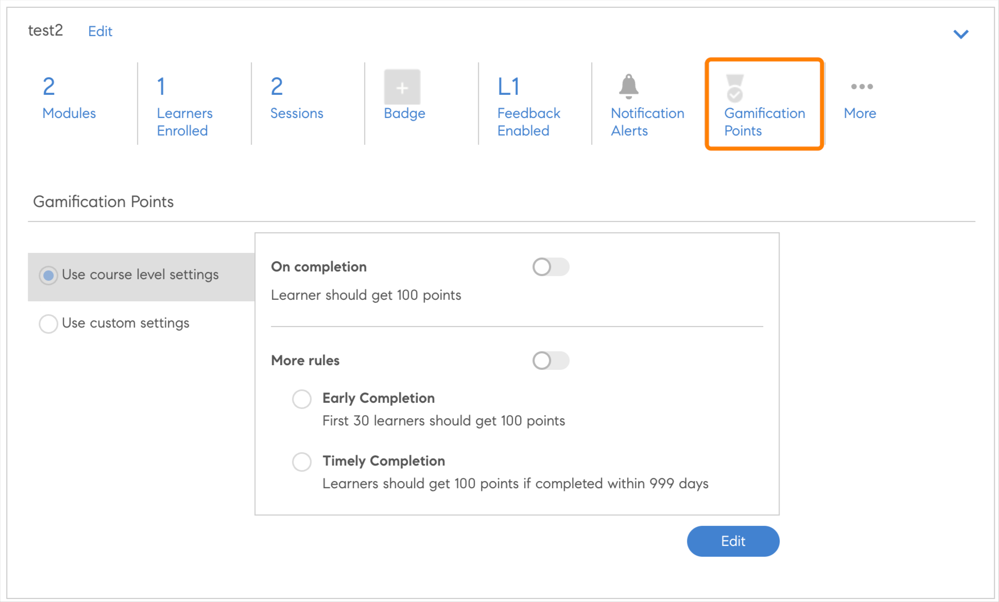
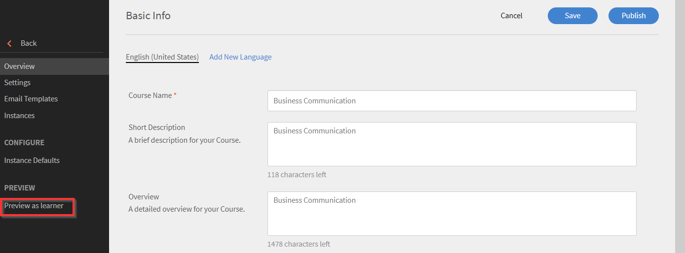
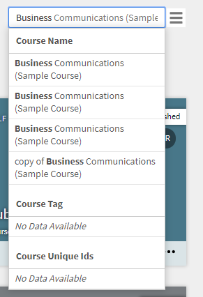
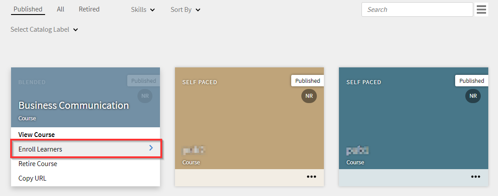

# Creazione, modifica e pubblicazione di corsi

Leggi questo articolo per scoprire come creare corsi, certificazioni e programmi di apprendimento in Learning Manager.

Gli Autori possono creare oggetti di apprendimento quali corsi, certificazioni e piani di apprendimento. Gli Allievi possono utilizzare questi oggetti di apprendimento, mentre gli Amministratori possono monitorare l’avanzamento degli Allievi.

## Corsi in Learning Manager {#coursesincaptivateprime}

Adobe Learning Manager consente agli Autori di creare corsi utilizzando uno o più moduli relativi a formazione virtuale, formazione a ritmo personalizzato, formazione in aula e attività. Gli Amministratori possono inoltre utilizzare questi corsi per creare istanze del corso, iscrivere gli Allievi, assegnare distintivi e abilitare il feedback per questi corsi. Possono anche creare programmi di apprendimento, piani di apprendimento e certificazioni utilizzando questi corsi.

Gli Autori possono utilizzare contenuti di e-learning creati con qualsiasi strumento di eLearning. Altri formati di corso supportati includono file video, PDF, doc, docx, PPT e PPTX.

## Creazione di un corso - Flusso di lavoro di base {#createacoursebasicworkflow}

Per creare un corso, segui i passaggi riportati di seguito:

1. Accedi ad Adobe Learning Manager come Autore, poiché solo gli Autori hanno i diritti per creare corsi. Nella pagina della Guida introduttiva fare clic su **[!UICONTROL Creazione di corsi]**.
1. Nella **Panoramica del corso** , inserisci il nome del corso. Immetti una breve descrizione del corso, che verrà visualizzata nella scheda del corso. La descrizione non può contenere più di 140 caratteri. Quindi inserisci la panoramica dettagliata del corso, che viene visualizzata nella pagina Dettagli corso. La descrizione non deve superare i 1500 caratteri.

   In qualità di Autore, puoi visualizzare la descrizione dei moduli mentre li aggiungi a un corso.

1. Per rendere il tuo corso disponibile in altre lingue, fai clic su Aggiungi nuova lingua nell’angolo in alto a sinistra della pagina. Seleziona la lingua o le lingue in cui desideri rendere disponibile il tuo corso. Fai clic **[!UICONTROL Salva]**. Per ulteriori informazioni, consulta [Aggiungere contenuti per lingue diverse](/help/migrated/authors/feature-summary/content-library.md).
1. **Modificare le impostazioni del corso**-

   1. Nella pagina Impostazioni corso, scegli un’abilità per il corso. Dall’elenco a discesa Abilità, scegli l’abilità richiesta. Quindi, dall’elenco a discesa Livello, scegli il livello richiesto.
   1. Scegli le abilità e il livello del corso e imposta i crediti per l’abilità. Aggiungi altre abilità, se necessario.
   1. Dal menu **Tipo di iscrizione** scegliere il tipo di iscrizione.

   Di seguito sono riportati i tipi di iscrizione:

   * **Nominato dal Manager:** Questi corsi possono essere assegnati solo dai Manager. Un Allievo non può effettuare l’iscrizione a questo tipo di corsi.
   * **Approvato dal Manager:** I Manager approvano questi corsi. Gli Allievi possono registrarsi a questi corsi, ma non vengono iscritti direttamente senza l’approvazione del Manager. Una richiesta di notifica viene inviata ai Manager quando gli Allievi si iscrivono a questo tipo di corsi. In seguito all’approvazione del Manager, gli Allievi risultano iscritti ai corsi.
   * **Iscrizione autonoma:** Gli Allievi possono iscriversi direttamente a questo tipo di corsi.

1. Per salvare le modifiche, fai clic su **[!UICONTROL Salva]**. Per pubblicare il corso, fai clic su **[!UICONTROL Pubblica]**.

## Creazione di un corso - Flusso di lavoro avanzato {#createacourseadvancedworkflow}

1. Accedi ad Adobe Learning Manager come Autore, poiché solo gli Autori hanno i diritti per creare corsi. Nella pagina della Guida introduttiva fare clic su **[!UICONTROL Creazione di corsi]**.
1. Nella **Panoramica del corso** , inserisci il nome del corso. Immetti una breve descrizione del corso, che verrà visualizzata nella scheda del corso. La descrizione non può contenere più di 140 caratteri. Quindi inserisci la panoramica dettagliata del corso, che viene visualizzata nella pagina Dettagli corso. La descrizione non deve superare i 1500 caratteri.
1. Per rendere il tuo corso disponibile in altre lingue, fai clic su Aggiungi nuova lingua nell’angolo in alto a sinistra della pagina. Seleziona la lingua o le lingue in cui desideri rendere disponibile il tuo corso. Fai clic **[!UICONTROL Salva]**. Per ulteriori informazioni, consulta [Aggiungere contenuti per lingue diverse](/help/migrated/authors/feature-summary/content-library.md).
1. **Modificare le impostazioni del corso**-

   1. Nella pagina Impostazioni corso, scegli un’abilità per il corso. Dall’elenco a discesa Abilità, scegli l’abilità richiesta. Quindi, dall’elenco a discesa Livello, scegli il livello richiesto.
   1. Scegli le abilità e il livello del corso e imposta i crediti per l’abilità. Aggiungi altre abilità, se necessario.
   1. Dal menu **Tipo di iscrizione** scegliere il tipo di iscrizione.

   Di seguito sono riportati i tipi di iscrizione:

   * **Nominato dal Manager:** Questi corsi possono essere assegnati solo dai Manager. Un Allievo non può effettuare l’iscrizione a questo tipo di corsi.
   * **Approvato dal Manager:** I Manager approvano questi corsi. Gli Allievi possono registrarsi a questi corsi, ma non vengono iscritti direttamente senza l’approvazione del Manager. Una richiesta di notifica viene inviata ai Manager quando gli Allievi si iscrivono a questo tipo di corsi. In seguito all’approvazione del Manager, gli Allievi risultano iscritti ai corsi.
   * **Iscrizione autonoma:** Gli Allievi possono iscriversi direttamente a questo tipo di corsi.

1. Scegli se impostare un prezzo per il corso o se renderlo gratuito. Se desideri rendere il corso a pagamento, scegli l’opzione **[!UICONTROL A pagamento]** e specificare un prezzo. Il prezzo viene quindi visualizzato nella scheda del corso e nella pagina con la panoramica del corso di un Allievo.

   NOTA: questa opzione viene attivata solo quando viene configurato il connettore Adobe Commerce.

1. Se desideri offrire agli Allievi la possibilità di annullare la propria iscrizione al corso, attiva la casella di controllo **Gli Allievi possono annullare l’iscrizione**.
1. **Configurazione dell&#39;istanza**

   Se attivi questa opzione, gli Allievi che si trovano nello stato In corso possono visitare altre istanze ed iscriversi. L’Allievo può quindi mantenere l’avanzamento dell’istanza precedente.

   Dopo aver pubblicato il corso, se torni alla pagina Impostazioni, l’opzione non è più modificabile.

   Puoi abilitare questa opzione per i seguenti tipi di corso:

   * Autonomo
   * Aula
   * Attività
   * Fusione

   Nota: durante la duplicazione di un corso, se hai abilitato l’opzione Configurazione istanza nel corso di origine, l’opzione rimane disabilitata nel corso di destinazione.

   **L&#39;opzione di istanza non è supportata per**:

   * Corsi a pagamento
   * Corsi di tipo iscrizione assegnati dal Manager.

   La configurazione del cambio di istanza non verrà propagata agli account condivisi tra pari se condivisa tramite il catalogo; l’opzione rimane disabilitata nel corso di destinazione.

1. **Iscrizioni multiple**

   In questo modo, è possibile iscrivere gli allievi a più istanze del corso in uno o più periodi.

   Attivare l’interruttore **Iscrizione multipla** per passare da una registrazione di corso a un’altra di un allievo. Se è stato abilitato il parametro di istanza, non è possibile utilizzare la registrazione multipla.

1. Seleziona i corsi propedeutici che devono essere completati prima di iniziare il corso. Fai clic sul campo Corsi e scegli dall’elenco dei corsi.
1. Abilita **Abilita** **Prerequisiti** casella di controllo se desideri che i corsi propedeutici siano resi obbligatori.
1. Aggiungi le parole chiave come tag relativi al tuo corso. Questi tag aiutano gli allievi a individuare facilmente il corso durante la ricerca. Tutti questi tag vengono aggiunti automaticamente in base ai moduli aggiunti. Se desideri aggiungere altri tag a questo corso, puoi inserirli.
1. Aggiungi le parole chiave come tag relativi al tuo corso. Questi tag aiutano gli allievi a individuare facilmente il corso durante la ricerca. Tutti questi tag vengono aggiunti automaticamente in base ai moduli aggiunti. Se desideri aggiungere altri tag a questo corso, puoi inserirli.
1. Nel campo Ritiro automatico, seleziona una data in cui il corso viene ritirato. L’Amministratore deve prima abilitare l’opzione Disattivazione automatica.
1. Per salvare le modifiche, fai clic su **[!UICONTROL Salva]**. Per pubblicare il corso, fai clic su **[!UICONTROL Pubblica]**.

## Punti di gamification

Puoi allocare i punti di gamification a livello di corso e di istanza del corso. In questo modo, puoi assegnare punti a diversi corsi o istanze. Gli Allievi sono incentivati a seguire corsi specifici o a preferire un’istanza particolare rispetto ad altre.

1. A livello di istanza del corso, seleziona **[!UICONTROL Punti di gamification]**.



*Impostare i punti per la gamification*

1. Seleziona **[!UICONTROL Modifica]**.
1. Se selezioni Usa impostazioni a livello di corso, vengono visualizzate le seguenti opzioni:

   * **[!UICONTROL Al completamento]**: seleziona questo pulsante se desideri che l’Allievo ottenga 100 punti quando completa un corso.
   * **Altre regole**

      * **[!UICONTROL Completamento anticipato]**: se selezioni questa opzione, i primi 30 Allievi ottengono 100 punti quando completano un corso.
      * **[!UICONTROL Completamento tempestivo]**: Selezionando questa opzione, gli Allievi ottengono 100 punti se completano un corso entro 999 giorni.

1. Se si seleziona **[!UICONTROL Usa impostazioni personalizzate]**, vengono visualizzate le seguenti opzioni:

   * **[!UICONTROL Al completamento]**: seleziona questo pulsante se desideri che l’Allievo ottenga 100 punti quando completa un corso.
   * **Altre regole**

      * **[!UICONTROL Completamento anticipato]**: se selezioni questa opzione, puoi determinare quanti allievi riceveranno i punti specificati.
      * **[!UICONTROL Completamento tempestivo]**: Selezionando questa opzione, è possibile determinare il numero di punti che gli Allievi otterranno se completano un corso entro un periodo di tempo specificato.

   

   *Impostare il completamento in modo tempestivo*

1. Seleziona **[!UICONTROL Salva]**.

## Aggregare le risorse di apprendimento

L’Autore può decidere se desidera aggregare le risorse di apprendimento a livello di piano di apprendimento o lasciarle rimanere a livello di singolo corso.

In qualità di autore, seleziona **[!UICONTROL Percorso di apprendimento]** > **[!UICONTROL Impostazioni]**. Fai clic **[!UICONTROL Modifica]**.

Nella **[!UICONTROL Risorse]** , la casella di controllo Mostra le risorse del corso costitutive aggregate a livello di percorso di apprendimento, se abilitata indica se le risorse presenti a livello di corso verranno visualizzate a livello di percorso di apprendimento.

>[!NOTE]
>
>Nella pagina Impostazioni di un percorso di apprendimento, un Amministratore può anche abilitare questa opzione, che visualizza le risorse presenti al livello del corso che verrebbero mostrate al livello del percorso di apprendimento.

## Assistente alla pianificazione

Gestire i conflitti nella prenotazione di istruttori e classi. Se desideri sapere in quale data e ora è disponibile un istruttore prima di assegnarlo al corso, utilizza l’Assistente alla pianificazione.

Durante la creazione di un corso VC o CR, fai clic su Assistente alla pianificazione.


*Avvia assistente pianificazione*

Viene visualizzata la finestra Assistente pianificazione.


*Finestra di dialogo Assistente alla pianificazione*

Nell&#39;Assistente alla pianificazione è possibile:

* Cerca gli istruttori in base al loro nome.
* Cerca gli istruttori in base alle loro abilità.

### Cerca gli istruttori in base al loro nome

Nel campo Istruttore, digita il nome dell’istruttore o cerca un nome di istruttore parziale. Viene visualizzato un elenco di istruttori, da cui è possibile scegliere un istruttore.


*Cerca Istruttori*

È possibile selezionare più istruttori, ma è possibile assegnare un solo istruttore alla volta. L&#39;ora selezionata verrà evidenziata nella finestra di conflitto temporale. Accanto all’istruttore, compare un’icona a forma di croce, sulla quale fate clic per rimuovere l’istruttore.


*Cerca più istruttori*

### Ricerca di istruttori in base alle abilità

Cerca un Istruttore con una o più abilità. La ricerca utilizza l&#39;operatore AND.

La ricerca delle abilità può essere effettuata solo per nome di abilità parziale o completo, non per livello di abilità.

Nell’Assistente, immetti il nome dell’istruttore, la sua posizione e il limite di posti.

Puoi anche cercare le abilità, che verrebbero visualizzate dopo aver fatto clic sull’icona del filtro presente sul lato destro della casella di ricerca dell’Istruttore. La schermata seguente mostra il pulsante.


*Ricerca di istruttori in base alle abilità*

### Filtro gruppo di utenti

Seleziona il filtro nel campo Istruttore. È presente un **[!UICONTROL Gruppo di utenti]** filtrare un Autore o un Autore personalizzato può trovare l’istruttore giusto utilizzando i valori nel Gruppo utenti.

Se vengono applicati entrambi i filtri, viene visualizzato un elenco di istruttori che appartengono al gruppo di utenti e hanno le abilità selezionate.

Questo vale per l&#39;Assistente alla pianificazione nella pagina Corsi o Istanze.


*Filtra per gruppi di utenti*

### Pagina Istanza

È inoltre possibile accedere all&#39;Assistente alla pianificazione dalla pagina Istanza, come illustrato di seguito.

L&#39;Assistente alla pianificazione è disponibile anche nella pagina Istanza per gli amministratori e per gli amministratori/autori personalizzati.


*Pagina Pianifica istruttori da istanze*

### Cercare un percorso

È possibile cercare un&#39;aula specificando sia il nome dell&#39;aula sia il nome dell&#39;area aula sia nelle pagine del modulo e dell&#39;Assistente alla pianificazione.

## Formattazione testo RTF

Durante la creazione di un corso, un programma di apprendimento, una certificazione o una risorsa formativa, gli autori possono inserire diversi tipi di contenuti, come testi o immagini, oppure applicare varie opzioni di formattazione del testo.

Quando si crea un corso, è possibile visualizzare Editor di testo RTF nel campo Panoramica del corso. Potete formattare il contenuto, aggiungere immagini, collegamenti ipertestuali e così via.


*Avvia l’editor Rich Text*

Analogamente, è possibile utilizzare Editor di testo RTF per modificare la descrizione durante la creazione di:

**Programma di apprendimento**


*Utilizzo dell’editor di testo RTF per un programma di apprendimento*

**Certificazione**


*Utilizzare Editor di testo RTF per una certificazione*

**Risorsa formativa**


*Utilizzare l’editor RTF per una risorsa formativa*

È inoltre possibile utilizzare Editor di testo RTF per altre lingue.

## Supporto per descrizione RTF per interfaccia utente headless

### Perché è necessario CSS?

Il testo RTF è composto da markup HTML. Il rendering del markup così com&#39;è comporta l&#39;applicazione di uno stile predefinito da parte del browser. Questo spesso non è adatto alle linee guida di stile dell&#39;azienda. Per rispettare le linee guida è necessario un CSS.

### Stile predefinito

Il foglio di stile CSS allegato contiene lo stile applicato da Learning Manager. Lo stile è adattato considerando la maggior parte dei casi d’uso. Scarica il file CSS allegato e importalo nell’app Web in base alle tue convenzioni e al tuo sistema di compilazione. Le classi CSS definite hanno lo spazio dei nomi ql-editor e non interferiscono con gli stili esistenti.

### Personalizzare gli stili

Lo stile predefinito potrebbe non soddisfare le esigenze di tutti. Le personalizzazioni possono essere eseguite sovrascrivendo il CSS fornito. Tutti gli stili sono racchiusi in ql-editor come selettori di discendenti. Vengono utilizzate le seguenti classi:

* Rientro: **li.ql-indent-$number**. $number varia da 1 a 9
* dimensioni: **ql-size-small**, **ql-size-large**, **ql-size-large**

* allineamento: **ql-align-center**, **ql-align-justify**, **ql-align-right**

* colore: **ql-color-$color**. $color = bianco, rosso, arancione, giallo, verde, blu, viola
* sfondo: **ql-bg-$color**. $color = nero, rosso, arancione, giallo, verde, blu, viola
* tag html: p, ol, ul, pre, blockquote, h1, h2, h3, h4, h5, h6

[File CSS da utilizzare per la personalizzazione.](assets/ql-headless.css)

### MODIFICHE ALLE API PER ABILITARE IL RENDERING DELLE PANORAMICHE DEL TESTO RTF

Quando i clienti creano un’interfaccia headless, hanno la necessità di visualizzare gli oggetti di apprendimento nell’interfaccia utente personalizzata che stanno sviluppando. Per fare ciò, in genere si utilizza il [GET /learningObjects](https://learningmanagereu.adobe.com/docs/primeapi/v2/#!/learning_object/get_learningObjects) API esposta. Ora che Learning Manager supporta l’acquisizione del testo RTF per il campo della panoramica, anche il modello di dati degli oggetti di apprendimento nelle risposte API espone la stessa. Consulta il campo denominato &quot;richTextOverview&quot; nel frammento del modello nella risposta API riportata di seguito. Tieni inoltre presente che il campo esposto in precedenza (&quot;overview&quot;) rimane invariato per la compatibilità con le versioni precedenti.

```
{ 
 "data": [ 
 { 
 "id": "string", 
 "type": "string", 
 "attributes": { 
 … 
 "localizedMetadata": [ 
 { 
 "description": "string", 
 "locale": "string", 
 "name": "string", 
 "overview": "string", 
 "richTextOverview": "string" 
 } 
 ], 
 … 
 }, 
 "relationships": { 
 … 
 } 
 } 
 } 
 ] 
} 
```

I clienti che stanno già utilizzando il campo della panoramica non subiranno alcuna modifica nell’interfaccia headless, visualizzeranno solo il testo normale come prima. Per sfruttare la panoramica del testo RTF, i clienti dovranno creare panoramiche in RTF per i propri oggetti di apprendimento nell’interfaccia utente per Autori. Successivamente, Learning Manager inizierà a restituire anche la panoramica in RTF, in aggiunta al testo normale (come prima) nel modello di risposta API.

Tuttavia, per eseguire il rendering di questo testo RTF nell’interfaccia utente, il cliente dovrà includere un CSS. Questo aspetto è spiegato in dettaglio nelle sezioni seguenti.

## Consenti più tentativi {#allowmultipleattempts}

Una volta che l’Amministratore ha abilitato i tentativi multipli, come Autore puoi configurare più tentativi per un modulo di e-learning interattivo a livello di corso o modulo.


*Configurare più tentativi per un modulo di e-learning interattivo*

<table>
 <tbody>
  <tr>
   <td>
    <p><b>Opzione</b></p></td>
   <td>
    <p><b>Descrizione</b></p></td>
  </tr>
  <tr>
   <td>
    <p>Imposta tentativi su</p></td>
   <td>
    <p>È possibile impostare il numero di tentativi per un modulo su infinito o specificare un limite definito.<span style="font-size: 0.8125rem;">Le informazioni sui tentativi verranno mostrate all’Allievo una volta abilitate. L’Allievo può decidere di ritentare il modulo facendo clic sul pulsante "Ritenta".</span></p></td>
  </tr>
  <tr>
   <td>
    <p>Interrompi nuovo tentativo una volta completato o superato il modulo</p></td>
   <td>
    <p>Per configurare quando impedire agli Allievi di selezionare l’opzione Nuovo tentativo, attiva la casella di controllo "Interrompi nuovo tentativo una volta completato o superato il modulo". L’opzione "Ritenta" verrà rimossa dalla visualizzazione dell’Allievo una volta completato correttamente il modulo.</p></td>
  </tr>
  <tr>
   <td>
    <p>Blocca modulo tra i tentativi 0:0:1 Formato: Giorni/Ore/Minuti</p></td>
   <td>
    <p>È possibile bloccare i moduli per un periodo di tempo specifico tra un tentativo e l’altro selezionando la casella di controllo "<b>Blocca modulo tra i tentativi 0:0:1 Formato: Giorni/Ore/Minuti</b>". Quando un modulo è bloccato, l’Allievo non può visitarlo fino a quando il periodo di blocco previsto non è trascorso. </p>
    <p>È possibile definire i criteri di fine di un tentativo selezionando "<b>Chiusura lettore</b>' o '<b>Completamento</b>'.</p></td>
  </tr>
  <tr>
   <td>
    <p>Chiusura lettore</p></td>
   <td>
    <p>Ogni avvio del modulo viene considerato come un nuovo tentativo se il criterio è selezionato come '<b>Chiusura lettore</b>". All’Allievo vengono richiesti i dettagli di blocco del modulo e i dettagli del tentativo alla chiusura del lettore.</p></td>
  </tr>
  <tr>
   <td>
    <p>Completamento</p></td>
   <td>
    <p>Se la fine di un tentativo è basata su <b>Completamento</b>, quindi verrà calcolato in base ai criteri di successo del contenuto. Gli Allievi non possono ritentare il modulo finché il contenuto non invia le informazioni di completamento. I dettagli relativi al blocco del modulo e ai tentativi vengono comunicati all’Allievo al termine di un tentativo.</p></td>
  </tr>
  <tr>
   <td>
    <p>Imposta il limite di tempo per completare il modulo</p></td>
   <td>
    <p>Gli Autori possono impostare il limite di tempo per il completamento del modulo selezionando la casella di controllo, "<b>Imposta il limite di tempo per completare il modulo</b>".</p>
    <p>Ogni avvio del lettore viene considerato come un nuovo tentativo e all’Allievo vengono richiesti i dettagli temporali durante l’avvio.</p>
    <p><b>Nota:</b><span style="font-size: 0.8125rem;">Il tentativo terminerà automaticamente una volta trascorso il tempo. Anche la chiusura del lettore determinerà la fine del tentativo corrente.</span></p></td>
  </tr>
  <tr>
   <td>
    <p>Tentativi multipli a livello di modulo</p></td>
   <td>
    <p>Selezionando un tentativo a "Livello di modulo" dall’elenco a discesa "Imposta tentativo su", è possibile configurare le opzioni a livello di singolo modulo.</p></td>
  </tr>
 </tbody>
</table>

## Moduli del corso {#coursemodules}

### Aggiungi moduli {#addmodules}

Ora potete aggiungere i moduli Contenuto, Preparazione e Verifica. **Contenuto** I moduli sono i moduli principali che costituiscono il corso. **Preparazione** i moduli includono alcune informazioni di base che possono aiutare gli allievi a prepararsi per il corso. Questi moduli non sono obbligatori per il completamento da parte degli Allievi. **Testout** i moduli aiutano gli allievi a saltare il contenuto e passare alla fase di verifica se sono già a conoscenza del contenuto e desiderano fare il test per soddisfare i requisiti di conformità.

Per aggiungere un modulo di contenuto, effettua le operazioni riportate di seguito:

1. Fai clic **[!UICONTROL Aggiungi moduli]**. Sono disponibili quattro opzioni per aggiungere moduli. La prima opzione consiste nell’aggiungere moduli a ritmo personalizzato. Questi sono i moduli che crei e aggiungi alla libreria di moduli in Adobe Learning Manager. La seconda opzione consiste nell’impostare l’aula virtuale. La terza consiste nell’impostare un Modulo classe, mentre la quarta prevede il Modulo attività.

   

   *Aggiungere un modulo per un corso*

   **Modulo a ritmo personalizzato:** In questa modalità è possibile avviare e completare un modulo del corso secondo i propri ritmi. Puoi impostare la tua pianificazione.

   Dopo aver fatto clic sull’opzione, viene visualizzato l’elenco dei moduli a ritmo personalizzato già aggiunti alla libreria di moduli. Qui puoi scorrere l’elenco e selezionare quelli che desideri aggiungere, oppure puoi cercare i moduli digitando il nome del modulo nel campo di ricerca o i tag del modulo.

   Dopo aver selezionato i moduli, fai clic su **[!UICONTROL Aggiungi]**. Questi moduli vengono ora visualizzati nella sezione Contenuto.

   Puoi anche riorganizzare i moduli. Trascina un modulo spostandolo verso l’alto o verso il basso e disponi i moduli in sequenza corretta.

   **Modulo classe virtuale:** In questa modalità, gli Allievi possono frequentare lezioni online in diretta, assistiti da un Istruttore qualificato. Immetti il titolo e la descrizione della sessione e impostane la durata. Puoi anche specificare l’URL della conferenza e gli istruttori che condurranno la sessione. Per salvare le modifiche, fai clic su **[!UICONTROL Fine]**.

   

   *Aggiungi un modulo aula virtuale*

   Quando crei un corso utilizzando la finestra di dialogo di configurazione Aula virtuale, imposta il **Sistema di conferenza** alla connessione Teams creata. Seleziona se desideri avere un organizzatore della riunione per l&#39;evento.

   Se si seleziona **Sì** per un organizzatore della riunione, è necessario immettere il suo nome. Digita il nome e seleziona l’organizzatore.

   **Esclusione della sala d’attesa**

   * Se si seleziona **Sì**, qualsiasi Allievo può partecipare alla riunione.
   * Se si seleziona **No**, viene inviata una richiesta all&#39;organizzatore per consentire o impedire all&#39;Allievo di partecipare alla riunione.

   **Nota:** Un Allievo deve essere disponibile nei Microsoft Teams. Tuttavia, l’Allievo può iscriversi a Learning Manager come ospite.

   **Modulo classe:** In questa modalità, gli Allievi partecipano di persona alle lezioni, assistiti da un Istruttore qualificato. Immetti il titolo e la descrizione della sessione e impostane la durata. Puoi anche specificare la posizione della classe e gli istruttori che condurranno la sessione. Per salvare le modifiche, fai clic su **[!UICONTROL Fine]**.

   

   *Aggiungere un modulo classe*

   Durante la creazione di un corso, nella finestra di dialogo di configurazione Aula virtuale, imposta il sistema di conferenza sulla connessione di Microsoft Teams creata. Seleziona se desideri avere un organizzatore della riunione per l&#39;evento.

   Se selezioni Sì, inserisci il nome dell’organizzatore. Digita il nome dell’organizzatore e selezionalo.

   **Esclusione della sala d’attesa**

   * Se selezioni Sì, qualsiasi Allievo può partecipare alla riunione.
   * Se selezioni No, viene inviata una richiesta all’organizzatore per consentire o impedire all’Allievo di partecipare alla riunione.

   **Nota:** Se un Allievo desidera unirsi ai Microsoft Teams come ospite, deve inserire l’e-mail. L’e-mail deve essere presente in Learning Manager.

   **Modulo attività:** In questa modalità, gli Allievi devono completare una serie di attività, ad esempio laboratori, esercitazioni, questionari e altre attività di apprendimento. Immetti il titolo, la descrizione e l’URL esterno come riferimento. Per salvare le modifiche, fai clic su **[!UICONTROL Fine]**.

   

   *Aggiungere un modulo attività*

   Puoi specificare la durata durante l’aggiunta di un modulo di attività in un corso per il tipo di attività Invio file e moduli basati su xAPI.

1. Allo stesso modo, aggiungi moduli per le modalità Preparazione e Verifica.
1. Scegli il tipo di ordinamento dei moduli tra Ordinati o Non ordinati in base alle tue preferenze.

   Se si sceglie **Ordinato**, i moduli vengono visualizzati nella stessa sequenza in cui sono stati creati. Se si sceglie **Non ordinato**, i moduli non vengono messi in sequenza. Gli Allievi possono completare i moduli in qualsiasi ordine.

1. Dall’elenco a discesa Moduli obbligatori, scegli il numero di moduli che l’Allievo deve seguire per completare il corso.
1. Aggiungi un’immagine di copertina e l’immagine del banner per il corso. I cataloghi vengono creati dall’amministratore. Per ulteriori informazioni, consulta [Cataloghi](/help/migrated/administrators/feature-summary/catalogs.md).

   **Nota:** Le dimensioni consigliate sono:

   * **Immagine di copertina:** 300 px x 300 px
   * **Immagine banner:** 1600 px x 140 px

1. Nell’angolo superiore destro della pagina, fai clic su **[!UICONTROL Salva]**.

## Checklist {#create-checklist}

La valutazione è un aspetto importante di qualsiasi LMS. Le valutazioni online sono uno dei metodi principali per valutare la comprensione di un argomento da parte di un Allievo. Ma spesso, è necessario valutare la comprensione di una persona mentre è sul lavoro osservandola / la sua esecuzione dei compiti necessari.

Si considerino i dipendenti di un negozio o gli addetti al magazzino sottoposti a valutazione per le attività che dovrebbero svolgere quotidianamente. Potrebbero essere le fasi eseguite per riparare una macchina da caffè o le fasi coinvolte nell&#39;imballaggio di un materiale. Gli istruttori possono valutare i dipendenti per tali attività sulla base di un elenco di controllo e indicare se hanno superato o meno la valutazione.

### Creare un elenco di controllo {#createachecklist}

Solo un Autore può creare un elenco di controllo. Un elenco di controllo è un tipo di modulo di attività. Durante l’impostazione di un modulo di attività, l’Autore può selezionare un’attività come **Checklist**, come illustrato di seguito:


*Creare un elenco di controllo*

Dopo aver scelto l’opzione **Checklist**, verranno visualizzate alcune opzioni aggiuntive.

**Tipo elenco di controllo:** Scegli un’opzione, **Sì/No** oppure **1-5**. Se scegli Sì/No, l’elenco di controllo conterrà domande a cui è possibile rispondere solo con Sì o No. Se scegli 1-5, puoi visualizzare un elenco di controllo Likert, in cui puoi valutare una domanda su una scala di cinque punti.

**Criteri di superamento:**

<table>
 <tbody>
  <tr>
   <td>
    <p>Se hai scelto <b>Sì/No</b>, quindi...</p></td>
   <td>
    <p>Se hai scelto <b>1-5</b>, quindi...</p></td>
  </tr>
  <tr>
   <td>
    <p>Imposta i criteri di superamento come numero di risposte su Sì. Ad esempio, se immetti 3, l’Allievo supera il corso se ne riceve almeno tre <b>Sì </b>quando valutate da un Istruttore.</p></td>
   <td>
    <p>Imposta i criteri di superamento come soglia di qualsiasi numero compreso tra 1 e 5. Ad esempio, se immetti 2 e 4, l’Allievo supera il corso se raggiunge almeno <b>due </b>valutazioni con punteggio maggiore o uguale a <b>quattro</b>.</p></td>
  </tr>
 </tbody>
</table>

Scegli uno o più Istruttori che valuteranno l’Allievo.

Inoltre, se hai qualcosa da commentare o una nota, puoi aggiungerla nel **Nota per l’istruttore** campo di testo.

Ora aggiungi le domande dell’elenco di controllo. Fai clic **[!UICONTROL Aggiungi]**. Puoi aggiungere solo fino a 150 domande.


*Aggiungi domande elenco di controllo*

Per aggiungere altre domande, fai clic su **[!UICONTROL Aggiungi altro]**.

Salva le modifiche, aggiungi il modulo e pubblica il corso.

### Aggiungi abilità {#addskills}

In questa pagina, inserisci i seguenti dettagli:

1. Scegli le abilità e il livello del corso e imposta i crediti per l’abilità. Aggiungi altre abilità, se necessario.

   

   *Aggiungere abilità per un corso*

1. Scegli il tipo di iscrizione. Le opzioni disponibili sono le seguenti:

   * **Nominato dal Manager:** Questi corsi possono essere assegnati solo dai Manager. Un Allievo non può effettuare l’iscrizione a questo tipo di corsi.
   * **Approvato dal Manager:** I Manager approvano questi corsi. Gli Allievi possono registrarsi a questi corsi, ma non vengono iscritti direttamente senza l’approvazione del Manager. Una richiesta di notifica viene inviata ai Manager quando gli Allievi si iscrivono a questo tipo di corsi. In seguito all’approvazione del Manager, gli Allievi risultano iscritti ai corsi.
   * **Iscrizione autonoma:** Gli Allievi possono iscriversi direttamente a questo tipo di corsi.

1. Se desideri offrire agli Allievi la possibilità di annullare la propria iscrizione al corso, attiva la casella di controllo **Gli Allievi possono annullare l’iscrizione**.
1. Seleziona i corsi propedeutici che devono essere completati prima di iniziare il corso. Fai clic sul campo Corsi e scegli dall’elenco dei corsi.

   

   *Aggiunta di corsi propedeutici*

1. Abilita **Prerequisiti** casella di controllo se desideri che i corsi propedeutici siano resi obbligatori.
1. Aggiungi le parole chiave come tag relativi al tuo corso. Questi tag aiutano gli allievi a individuare facilmente il corso durante la ricerca. Tutti questi tag vengono aggiunti automaticamente in base ai moduli aggiunti. Se desideri aggiungere altri tag a questo corso, puoi inserirli.
1. Aggiungi i profili dei destinatari del corso facendo clic sull’area di testo e scegliendo i profili dai suggerimenti.
1. Aggiungi file di risorse per il corso come materiale aggiuntivo. Trascina i tuoi materiali, come file di testo, video o audio.
1. Ora questo corso sarà disponibile come corso consigliato per gli Allievi con questi profili. In questa sezione puoi anche allegare risorse aggiuntive per gli Allievi. Gli allievi potranno scaricare questi file per riferimento futuro. Una volta terminate tutte queste modifiche, fai clic su **[!UICONTROL Salva]** nell&#39;angolo in alto a destra. In questo modo il corso verrà salvato come bozza. Per impostazione predefinita, il corso viene salvato come bozza.

## Assegnare gli Istruttori ai moduli {#assigninstructorsformodules}

1. Dopo aver creato i moduli per il tuo corso, puoi assegnare Istruttori ai moduli. Nel dashboard Autore, fai clic su **[!UICONTROL Catalogo del corso]**.
1. Fai clic sul corso al quale desideri assegnare gli Istruttori.
1. Dal menu **Aggiungi moduli** , fai clic sul modulo a cui desideri assegnare un Istruttore.
1. Nella **Istruttore** , specifica il nome dell’utente a cui desideri assegnare il ruolo di istruttore.

   

   *Assegnare un ruolo di istruttore a un utente*

1. Per ripubblicare il corso con gli aggiornamenti, fai clic su **[!UICONTROL Ripubblica]**.

## Checklist osservazione

Un modulo Elenco di controllo ora può essere rivisto dai Manager oltre che dagli Istruttori. I manager delle persone e i manager non gerarchici, ad esempio i manager dei punti vendita o i responsabili di ubicazione, possono esaminare e completare l&#39;elenco di controllo.

Gli Autori del corso possono aggiungere come revisori i manager delle persone e i manager non gerarchici (se applicabile) selezionando queste opzioni di ruolo nella sezione &quot;Revisori&quot; durante l’impostazione di un modulo Elenco di controllo. Questa operazione può essere eseguita a livello di istanza del corso.


*Aggiunta di revisori in un modulo attività*

Selezione di &quot;**[!UICONTROL +Manager]** l’opzione &quot; consentirà automaticamente al manager di un allievo nella gerarchia dell’organizzazione di rivedere l’elenco di controllo. Non è necessario cercare e aggiungere i nomi dei manager singolarmente.

Se l&#39;amministratore dell&#39;account ha impostato ruoli di manager non gerarchici, ad esempio responsabili di percorso o responsabili di sito, utilizzando l&#39;opzione Campi attivi, tali ruoli di manager saranno disponibili per la selezione e l&#39;abilitazione per la revisione dell&#39;elenco di controllo.

Non è necessario cercare e aggiungere i nomi dei manager singolarmente. Quando gli Allievi si iscrivono al corso con elenco di controllo, invierà automaticamente una notifica ai propri Manager/Manager del punto vendita per la revisione insieme a qualsiasi Istruttore selezionato. Questo flusso di lavoro consente agli autori di non citare i nomi dei singoli manager.

Nella schermata di esempio fornita sopra, selezionando la scheda &quot;**[!UICONTROL +Manager punto vendita]** l’opzione &quot; abilita automaticamente il manager non gerarchico allineato all’allievo a rivedere l’elenco di controllo. Si noti che &quot;store&quot; qui verrà sostituito dal campo attivo definito dall&#39;amministratore.

Gli aggiornamenti al modulo dell’elenco di controllo includono anche le notifiche a istruttori e manager quando un Allievo è iscritto a un corso che include un modulo dell’elenco di controllo. Il revisore riceve una notifica nel centro notifiche di Learning Manager e nel dashboard di Istruttore/Manager che indica che è prevista un’azione dell’elenco di controllo.

<!---->

Il revisore sarà in grado di visualizzare le informazioni su tutte le voci di revisione dell’elenco di controllo in sospeso dal menu Elenchi di controllo e dal menu Notifiche quando accede come istruttore/manager.


*Approvazioni per la certificazione*

Dopo aver fatto clic su Verifica elenco di controllo, il revisore può completare la valutazione.


*Esamina elementi elenco di controllo in sospeso*

I report possono essere scaricati negli elenchi di controllo, che includono informazioni dettagliate sulla valutazione degli allievi, sul nome del revisore, sul ruolo e sull’indirizzo e-mail.

Il file CSV del report Elenco di controllo contiene i campi nuovi e aggiornati:

* Nome del revisore anziché del nome dell’istruttore
* E-mail revisore invece di Istruttore
* Ruolo revisore: i valori possibili sono Manager, Store/Location Manager, Instructor

## Anteprima di un corso {#previewacourse}

Una volta creato e salvato il corso come bozza, puoi visualizzare in anteprima il corso come Allievo e quindi pubblicarlo per renderlo disponibile nel catalogo dei corsi.

Per visualizzare l’anteprima del corso, fai clic su **[!UICONTROL Anteprima come Allievo]**.



*Anteprima di un corso come Allievo*

Viene aperto il corso **Panoramica** pagina per te in cui puoi visualizzare i moduli, il loro ordine e altri dettagli relativi al corso.


*Visualizzare i moduli e altri dettagli correlati*

Per vedere come gli Allievi possono utilizzare questo corso, fai clic su ciascuno di questi moduli per iniziare a riprodurlo. Viene avviata la riproduzione del corso nel lettore Fluidic.

## Pubblicazione di un corso {#publishacourse}

Dopo aver visualizzato l’anteprima del corso come Allievo, puoi pubblicare il corso rendendolo disponibile agli allievi. Nota: il corso è ancora in modalità bozza.

Il ciclo di vita tipico di un corso è il seguente:

* **Bozza** - Quando un Autore completa la creazione di un corso e lo salva. A questo punto, il corso non è ancora disponibile per gli Allievi.
* **Pubblicato** - Quando un Autore completa la pubblicazione di un corso. A questo punto, il corso è disponibile per l’iscrizione da parte degli Allievi. A questo punto puoi anche modificare un corso.
* **Ritirato** - Dopo aver pubblicato un corso, un Autore può attribuirgli lo stato Ritirato se desidera che il corso non venga più visualizzato nel catalogo per gli allievi.
* **Eliminato** - A un corso viene attribuito lo stato Eliminato quando viene rimosso completamente dall’applicazione di Learning Manager per Adobi. Solo gli Autori possono eliminare i corsi che si trovano nello stato Bozza o Ritirato.


*Flusso di lavoro del ciclo di vita di un corso*

Per pubblicare il corso creato, fai clic su **[!UICONTROL Pubblica]** nell&#39;angolo superiore destro della pagina.


*Pubblicazione di un corso*

Nel messaggio di conferma a comparsa visualizzato, fai clic su **[!UICONTROL OK]**.

Il corso è ora disponibile nel catalogo dei corsi.

## Visualizzare un corso {#viewacourse}

Puoi visualizzare un elenco di tutti i corsi disponibili come Autore. Per visualizzare tutti i corsi disponibili nell’account Learning Manager, fai clic su Catalogo corsi. Per visualizzare tutti i corsi che hai creato in Learning Manager, fai clic su **[!UICONTROL I miei corsi]**.

Nella scheda del corso, passa con il mouse sulle opzioni e fai clic su **[!UICONTROL Visualizza corso]**.


*Visualizzare un corso*

Viene visualizzata la finestra delle informazioni sul corso. Il corso è in modalità di sola lettura. Per modificare il corso, fai clic su **[!UICONTROL Modifica]**.

## Ritiro di un corso {#retireacourse}

Se ritiri un corso, non puoi iscrivervi nuovi allievi. Gli Allievi già iscritti possono seguire il corso.

Per ritirare un corso, vai alla scheda del corso, passa con il cursore del mouse sulle opzioni e fai clic su Ritira corso.


*Ritiro di un corso*

Nella finestra a comparsa di conferma visualizzata, fai clic su **[!UICONTROL Sì]**.

## Duplicare un corso {#duplicateacourse}

Puoi creare una copia del corso e quindi modificarla. Se desideri eseguire il backup del corso, puoi duplicarlo.

## Cerca corsi {#searchforcourses}

Adobe Learning Manager consente di individuare i corsi che cerchi rapidamente e con facilità. Puoi cercare i corsi nei seguenti modi:

**Campo di ricerca:** Fai clic sulla barra di ricerca nell’angolo superiore destro della finestra di dialogo **Catalogo del corso** pagina. Digita il nome del corso o le parole chiave associate ai tuoi corsi. Puoi anche eseguire ricerche utilizzando i tag aggiunti durante la creazione del corso. I tag sono ricercabili all’interno del campo Cerca corsi, il che significa che vengono visualizzati nel campo di ricerca durante la digitazione.



*Cerca corsi*

**Filtra elenco dei corsi:** Puoi filtrare i corsi per stato come Tutti, Pubblicati, Bozza e Ritirati. A seconda della scelta, puoi visualizzare l’elenco filtrato di corsi e selezionare i corsi richiesti.

In qualità di Autore, puoi anche ordinare i corsi per individuare meglio il corso richiesto. Fai clic **[!UICONTROL Ordina per]** e scegli l’ordine alfabetico crescente o decrescente, la data di creazione o di aggiornamento del corso o l’efficacia dei corsi.


*Filtrare l’elenco dei corsi*

## Iscrizione degli Allievi a un corso {#enrolllearnersinacourse}

Per iscrivere gli allievi ai corsi o consentire ai Manager di nominare gli allievi per i corsi, è necessario passare alla modalità Amministratore, poiché solo gli Amministratori hanno il diritto di iscrivere gli allievi ai corsi.

Per passare alla modalità Amministratore:

1. Fai clic sull’immagine del tuo profilo, quindi seleziona Amministratore.
1. In modalità Amministratore, fai clic su **[!UICONTROL Corsi]** nel riquadro sinistro. In questa pagina puoi visualizzare tutti i corsi creati da tutti gli Autori nel tuo account Learning Manager.
1. Per iscrivere gli allievi, passa con il cursore del mouse sulla scheda del corso: viene visualizzata l’opzione **Iscrizione degli Allievi**. Fare clic su questa opzione.

   

   *Iscrizione degli Allievi a un corso*

1. Nell’angolo in alto a destra della finestra di dialogo Iscrivi Allievi puoi vedere che l’opzione **Istanza predefinita** selezionato. Non appena un corso viene creato da un Autore, viene creata un’istanza predefinita del corso.

   

   *Visualizzare l’istanza predefinita di un corso*

1. Inizia a digitare il nome di un Allievo nel campo Includi allievi e scegli un Allievo. Qui puoi anche aggiungere gruppi di utenti. Se desideri iscrivere tutti gli Allievi nell’account Learning Manager, inizia a digitare tutti. Puoi anche iscrivere gli Allievi in un team.

   

   *Aggiungere Allievi a un corso*

1. Se desideri escludere un Allievo dal corso, inserisci il nome dell’Allievo nel **Escludi Allievi** campo.
1. Dopo aver iscritto gli allievi, fai clic su **[!UICONTROL Procedi]**. Nella finestra di dialogo Iscrivi Allievi è possibile visualizzare il riepilogo dell’iscrizione.

   

   *Visualizzare il riepilogo dell’iscrizione al corso*

1. Per iscrivere tutti gli allievi al corso, fai clic su **[!UICONTROL Iscrizione]**. Questi Allievi sono ora iscritti correttamente a questo corso. Gli Allievi ricevono una notifica che li invita a seguire il corso. Per iscrivere altri allievi, ripeti la procedura di iscrizione.

## Modifiche alla pagina Istanza del corso per i moduli classe virtuale di Connect {#connect-vc}

Durante il recupero di un corso Connect, puoi creare due tipi di sale:

* Dinamico
* Persistente

Un URL persistente è sempre fisso. Tuttavia, gli utenti che non dispongono di Connect e di una sala riunioni propria devono utilizzare una sala riunioni dinamica in fase di esecuzione. Le persone possono quindi partecipare alla riunione.


*Opzioni sala riunioni dinamica*

Ora è possibile modificare l&#39;URL della sala permanente sul **Istanza del corso** pagina.

<!--|  |  |
|---|---|-->

## Annullamento dell’iscrizione degli allievi a un corso {#unenrolllearnersfromacourse}

Durante la creazione di un corso, un Autore può abilitare l’opzione **Gli Allievi possono annullare l’iscrizione**, in modo che gli allievi che seguono il corso possano annullare l’iscrizione al corso.

Un Amministratore può inoltre annullare l’iscrizione degli allievi al corso.


*Annullamento dell’iscrizione degli allievi a un corso*

Per ulteriori informazioni, vedere [Annullamento dell’iscrizione degli Allievi](/help/migrated/administrators/feature-summary/courses.md).

## Aggiunta di moduli del corso per Captivate e Presenter {#addcoursemodulesforcaptivateandpresenter}

È anche possibile pubblicare i moduli dei corsi su Learning Manager da Adobe Captivate e Adobe Presenter utilizzando il menu Pubblica.

1. In Captivate, fare clic su **[!UICONTROL Pubblica]** > **[!UICONTROL Pubblica su Learning Manager]**.
1. Inserisci il nome di dominio secondario o l’ID e-mail e fai clic su **[!UICONTROL Invia]**. Se disponi di più account, ti verrà richiesto di scegliere l’account.
1. Accedi con credenziali di Adobe. Se non si dispone di un ID Adobe, fare clic su **[!UICONTROL Crea account]**. Dopo l’autorizzazione, verrai indirizzato alla pagina di pubblicazione del modulo.
1. Fornisci tutte le informazioni di base sul modulo e fai clic su Pubblica.

Il modulo pubblicato viene visualizzato sulla pagina dei moduli Learning Manager. Per ulteriori informazioni, consulta [Pubblica progetto su Adobe Learning Manager](https://helpx.adobe.com/captivate/classic/publish-project-to-captivate-prime.html).

## Efficacia dei corsi {#courseeffectiveness}

Il punteggio dell’efficacia dei corsi aiuta gli Autori a valutare i corsi che non funzionano in base alle esigenze degli Allievi e a modificarli di conseguenza. L’efficacia dei corsi viene valutata per comprendere l’utilità di un corso per gli allievi. È una combinazione di risultati dei feedback degli Allievi sul contenuto del corso. I risultati del quiz sul corso per un Allievo e il feedback del Manager che valuta un Allievo in base a ciò che ha appreso nel corso.

Ingresso **I miei corsi**, l’Autore può visualizzare la valutazione dell’efficacia del corso sulle miniature, come mostrato nell’immagine seguente. Puoi visualizzare la valutazione di questo corso su 100.

<!---->

Il valore di valutazione dell’efficacia del corso viene ottenuto tenendo conto dei valori di feedback L1, L2 e L3. Per visualizzare la suddivisione di ogni feedback, fai clic sul valore di efficacia del corso. Viene visualizzato un menu a comparsa come illustrato di seguito.


*Calcolo dell’efficacia del corso*

In questa immagine di esempio, 1 utente su 1 ha ricevuto tutti e tre i tipi di feedback, pertanto il punteggio è 100/100. Da questa tabella, puoi capire i feedback mancanti per migliorare l’efficacia complessiva. Per vedere come viene calcolata l’efficacia dei corsi, fai clic sulla freccia rivolta verso il basso nell’angolo in basso a destra del menu a comparsa.

<!---->

Come per il grafico a torta mostrato sopra, viene dato un maggiore peso al feedback L3 dal manager.

## Certificazioni e programmi di apprendimento {#certificationsandlearningprograms}

Sia l’Autore che l’Amministratore possono creare certificazioni e programmi di apprendimento per gli Allievi dall’app Autore. Dalla home page, fai clic su Certificazioni o Programmi di apprendimento per creare i rispettivi oggetti di apprendimento.

Per sapere come creare e gestire certificazioni e programmi di apprendimento, consulta  [Certificazioni](/help/migrated/administrators/feature-summary/certifications.md) e  [Programmi di apprendimento](/help/migrated/administrators/feature-summary/learning-programs.md).

## Corsi obbligatori per la certificazione esterna {#mandatorycoursesforexternalcertification}

Nelle versioni precedenti di Learning Manager, il completamento del corso da parte di un Allievo in una certificazione esterna non era obbligatorio per completare un certificato.

Ora puoi rendere obbligatori i corsi attivando l’opzione **Imposta i corsi richiesti come obbligatori per il completamento del certificato** nella scheda Curriculum.


*Impostazione di corsi obbligatori per il completamento di un certificato*

Quando i corsi sono impostati come obbligatori:

* La pagina di invio del Manager elenca gli Allievi solo dopo che gli Allievi hanno completato i corsi.
* L’Allievo può caricare un file solo dopo aver completato il corso.

## Domande frequenti {#frequentlyaskedquestions}

+++Come rimuovere &quot;Cerca nomina Manager&quot; per un corso?

Effettuate le seguenti operazioni:

1. Accedi a Learning Manager come Autore.
1. Apri il corso.
1. Nel riquadro a sinistra, fai clic su **[!UICONTROL Impostazioni]** > **[!UICONTROL Modifica]**.
1. Nella **Tipo di iscrizione** elenco a discesa, modifica il tipo di iscrizione da **Nominato dal Manager** a **Approvato dal Manager** oppure **Iscrizione autonoma**.

1. Una volta modificato il tipo di iscrizione, ripubblica il corso.

+++

+++Come si combinano i corsi?

Puoi combinare i corsi tramite un programma di apprendimento.

1. Accedi a Learning Manager come Amministratore.
1. Nel riquadro a sinistra, fai clic su **[!UICONTROL Programmi di apprendimento]**.
1. Per aggiungere un programma di apprendimento, fai clic su **[!UICONTROL Aggiungi]**.
1. Immetti i dettagli del programma di apprendimento e per salvarlo fai clic su **[!UICONTROL Salva]**.
1. Dopo aver creato il programma di apprendimento, fai clic su **[!UICONTROL Catalogo]**.
1. In una scheda del corso, fai clic su **[!UICONTROL Aggiungi]**, come illustrato di seguito. Ripeti la procedura per tutti i corsi da aggiungere al programma di apprendimento.


Dopo aver aggiunto tutti i corsi richiesti nel programma di apprendimento, fai clic su **[!UICONTROL Pubblica]**.

In un programma di apprendimento, è possibile solo aggiungere corsi a cui ti sei iscritto autonomamente e non corsi Nominati dal Manager o Approvati dal Manager. Questo è un comportamento predefinito in Learning Manager.

+++

+++Come accertarsi che tutti gli Allievi non possano visualizzare tutti i corsi?

Puoi farlo tramite i cataloghi. Per impostazione predefinita, un catalogo predefinito contiene tutti i corsi aggiunti a Learning Manager.

È necessario disabilitare il catalogo predefinito e creare cataloghi personalizzati.

1. Accedi a Learning Manager come Amministratore.
1. Nel riquadro a sinistra, fai clic su **[!UICONTROL Cataloghi]**.
1. Creare un catalogo facendo clic su **[!UICONTROL Crea]**. Immetti i dettagli e fai clic su **[!UICONTROL Salva]**.

1. Nelle opzioni del catalogo appena creato, puoi selezionare diversi tipi di apprendimento da aggiungere, ad esempio programma di apprendimento, certificazione o corso.
1. Nella sezione Programma di apprendimento fai clic su **[!UICONTROL Aggiungi contenuto]**.
1. Nel riquadro a sinistra, fai clic su **[!UICONTROL Condividi internamente]** oppure **[!UICONTROL Condividi esternamente]** a seconda del pubblico di destinazione.

1. Per aggiungere un gruppo di utenti, fai clic su **[!UICONTROL Aggiungi gruppi di utenti]**.
1. Nella pagina Cataloghi, disattiva la proprietà **D[!UICONTROL catalogo predefinito]** e abilitare il catalogo creato.


+++

+++Come iscriverti nuovamente a un corso completato?

Impossibile ripristinare il completamento di un corso. Allievo **non può essere ri-registrato** a un corso completato.

+++

+++In che modo gli Allievi possono visualizzare il corso anche dopo averlo completato?

Un Allievo può visualizzare un corso completato facendo clic sul pulsante Rivedi nel corso.

Effettua le operazioni riportate di seguito:

1. Accedi come Allievo.
1. Apri il corso completato.
1. Fai clic **[!UICONTROL Rivedi]**.

+++

+++Come aggiungere un file di risorse nel corso?

Durante la creazione di un corso, puoi aggiungere al corso file video, audio, PDF o di testo pertinenti per consentire all’Allievo di accedere a materiale didattico aggiuntivo.


+++

+++Come si impostano più tentativi nel modulo?

**Prerequisito:** L’amministratore deve abilitare l’opzione **Tentativi multipli** nel **Impostazioni > Generale** nell’app di amministrazione.

In qualità di Autore, nella pagina della panoramica del corso, abilita l’opzione **Consenti più tentativi**.

Per ulteriori informazioni, consultate [sezione sui tentativi multipli](courses.md#Allowmultipleattempts).

+++

+++È possibile scaricare il contenuto caricato su Adobe Learning Manager per modificarlo?

No, il contenuto caricato su Learning Manager è un file zip pubblicato e non è il file di origine. Pertanto, anche se il contenuto viene scaricato, non può essere modificato in uno strumento di creazione. Per modificare il contenuto è necessario un file di origine.

+++

