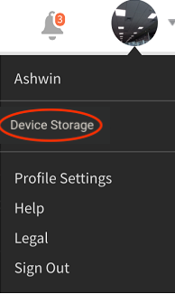

# Utenti di iPad e tablet Android

Nell’app Learning Manager per iPad o tablet Android, dopo aver effettuato l’accesso come Allievo, puoi visualizzare la schermata iniziale seguente:

Per accedere alle funzionalità di apprendimento e del catalogo, tocca il **Menu** e scegli l’opzione appropriata.

È possibile accedere all’app di Learning Manager offline nei tablet iPad e Android. Scarica e segui i corsi in modalità offline e sincronizza il contenuto con l’app online quando ti connetti alla rete.

1. Tocca Menu a discesa in alto e tocca Opzione di apprendimento. Un elenco di tutti i corsi disponibili viene visualizzato nei riquadri.
1. Tocca l’icona di download nella parte inferiore di ogni riquadro degli oggetti di apprendimento per scaricare i contenuti di apprendimento.

1. Quando sei online, viene visualizzato un messaggio in una barra nella parte superiore dell’app per verificare se desideri sincronizzare i contenuti online. Se la risposta è sì, tocca la barra rossa. Una barra verde colorata indica che il contenuto è sincronizzato con l&#39;app online.

## Tenere traccia dello spazio di archiviazione del dispositivo {#trackdevicestorage}

È possibile monitorare periodicamente lo spazio di archiviazione del dispositivo.

Tocca l’icona profilo nell’angolo superiore destro dell’app, quindi tocca **Archiviazione dispositivo** menu.

Viene visualizzata una finestra di dialogo di informazioni sull’archiviazione dell’app come illustrato di seguito.

Utilizzando le informazioni di archiviazione dell&#39;app, puoi controllare lo spazio totale di dispositivo, app e i corsi scaricati. Queste informazioni consentono di scaricare i corsi di conseguenza. Per eliminare i corsi scaricati nel dispositivo, tocca l’icona X accanto al nome di ciascun corso.
