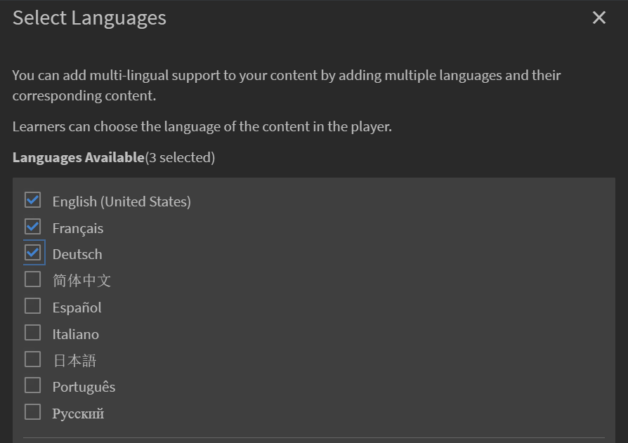
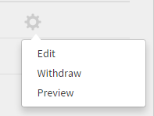
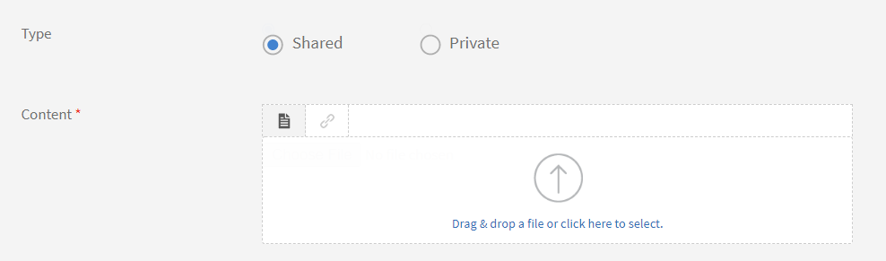

# Risorse formative

**Risorse formative** è un archivio dei contenuti di formazione accessibile agli Allievi senza alcun requisito di completamento o di iscrizione. Gli Allievi possono fare riferimento a queste risorse formative per ottenere assistenza relativa all’esecuzione di qualsiasi attività o attività in un’organizzazione.

Le risorse formative possono essere utilizzate in modo indipendente o mentre segui un corso in Learning Manager.

Gli Autori possono creare risorse formative per gli Allievi. Utilizza Risorse formative per fornire agli Allievi materiale di riferimento, come suggerimenti, elenchi di controllo e guide, da usare in modo continuativo per completare le proprie attività.

## Creazione di risorse formative {#createjobaid}

1. Nel login dell’autore, seleziona **[!UICONTROL Risorse formative]** nel riquadro a sinistra.
1. Seleziona **[!UICONTROL Crea]** nell&#39;angolo superiore destro della pagina visualizzata.
1. Digitate il nome, la descrizione e i tag. Scegli le abilità e i livelli associati. Seleziona l’opzione per contenuto privato se non vuoi che altri utenti possano accedere alla risorsa formativa per assegnarla ai propri corsi.

   Per le risorse formative possono essere utilizzate solo abilità esistenti. Le abilità non sono obbligatorie.

1. Carica il contenuto della risorsa formativa nella sezione Contenuto.

   I formati di file supportati per il caricamento sono video, pdf, pptx e docx. File zip di un progetto, o altro contenuto interattivo, non sono supportati per il caricamento.

1. Inserisci la durata in minuti per la risorsa formativa.
1. Fai clic su **[!UICONTROL Salva]**.

   La risorsa formativa viene pubblicata.

## Aggiungi risorsa formativa in diverse lingue {#addcontentfordifferentlanguages}

1. Per aggiungere la risorsa formativa in lingue diverse, seleziona la scheda **Aggiungi nuova lingua** e scegli le lingue richieste. Utilizzando questo approccio, puoi aggiungere il supporto multilingue per il tuo contenuto.

   

   *Aggiungi nuova lingua per un contenuto*

1. Ripeti il processo di caricamento della risorsa formativa per le nuove lingue.
1. Per rimuovere una lingua, selezionare la scheda **[!UICONTROL Aggiungi nuova lingua]** e deselezionare la lingua desiderata.

   Dopo aver apportato le modifiche, seleziona Salva.

## Tipi di risorse formative supportate {#typesofsupportedjobaids}

I formati di file seguenti sono supportati per le risorse formative.

* PDF
* PPT
* PPTX
* XLS
* XLSX
* DOC
* DOCX
* Tutti i formati di file video

>[!NOTE]
>
>I file ZIP e i file di immagine non sono supportati.

## Risorse formative multilingue

Le risorse formative multilingue in Adobe Learning Manager (ALM) consentono agli autori e agli amministratori di fornire documenti di supporto, guide o risorse in più lingue all&#39;interno di una singola voce della risorsa formativa. Gli Allievi di diverse aree geografiche possono accedere ai materiali pertinenti nella lingua preferita, migliorando la comprensione, la conformità e l’esperienza dell’utente.

**Casi di utilizzo**

* Abilitazione della forza lavoro globale: fornisce manuali di sicurezza, guide di processo o documenti di riferimento in più lingue a una forza lavoro diversificata.
* Conformità alle normative: assicurati che tutti i dipendenti ricevano la stessa documentazione di conformità nella loro lingua madre.
* Onboarding coerente: fornisci checklist di onboarding o domande frequenti nelle lingue locali per i nuovi assunti in tutto il mondo.
* Duplicazione ridotta: consente di gestire tutte le versioni linguistiche di una risorsa formativa in un’unica voce, semplificando gli aggiornamenti e la creazione di report.

### Funzioni principali

* Supporto di più lingue: allega un file o un URL univoco per ogni lingua supportata all&#39;interno di una singola risorsa formativa.
* Nome e descrizione localizzati: immettere il nome e la descrizione della risorsa formativa in ogni lingua.
* Gestione unificata: modifica, aggiorna e crea report su tutte le versioni linguistiche da un&#39;unica posizione.
* Compatibilità con versioni precedenti: le risorse formative monolingua esistenti vengono replicate automaticamente in tutte le lingue aggiunte fino al caricamento di nuovi file.

### Creare una risorsa formativa multilingue

1. Accedi al ruolo Autore e seleziona Risorse formative.
2. Seleziona Crea risorsa formativa.
3. Immetti il nome e la descrizione della risorsa formativa nella lingua predefinita.
4. Aggiungi il file di contenuto principale o l’URL per la lingua predefinita.
5. Salva la risorsa formativa.

### Aggiungere altre lingue

1. Nell’editor della risorsa formativa, seleziona Aggiungi lingua.
2. Selezionare la lingua o le lingue desiderate dall&#39;elenco.
3. Per ogni lingua aggiunta:
   * Immetti il nome e la descrizione localizzati.
   * Carica il file di contenuto corrispondente o fornisci un URL specifico per la lingua.
4. Ripetete questa operazione per tutte le lingue richieste.

### Modificare e gestire le lingue

1. Per aggiornare un file o una descrizione per una lingua specifica, selezionare la scheda Lingua e apportare le modifiche necessarie.
2. Se dopo la pubblicazione della risorsa formativa viene aggiunta una lingua, il file originale viene assegnato automaticamente alla nuova lingua fino a quando non viene caricato un file univoco.
3. Rimuovi o sostituisci i file per qualsiasi lingua in base alle esigenze.

### Publish e l’esperienza degli allievi

1. Dopo aver aggiunto tutte le lingue e tutti i file, pubblica la risorsa formativa.
2. Gli Allievi visualizzano la risorsa formativa nella lingua dei contenuti selezionati, con il file o l’URL appropriato.
3. Se la lingua di un Allievo non è disponibile, viene visualizzato il file della lingua predefinita.

### Report

* Scarica i report delle risorse formative per visualizzare i dettagli di tutti i file e le lingue associati a ciascuna risorsa formativa.
* I report includono la lingua, il nome file e i dati di utilizzo per il tracciamento.

### Procedure ottimali

* Traduzione accurata di nomi, descrizioni e file di contenuto.
* Rivedi e aggiorna regolarmente i file per garantire coerenza tra le lingue.
* Utilizzare chiare convenzioni di denominazione per distinguere i file in base alla lingua.
* Prova l’esperienza dell’Allievo cambiando le lingue dei contenuti per verificare la corretta distribuzione dei file.

Le risorse formative multilingue consentono di fornire risorse di supporto a un pubblico globale in una singola voce, ridurre la duplicazione e garantire che ogni Allievo riceva le informazioni corrette nella lingua preferita. Questa funzione migliora l’accessibilità, la conformità e l’efficienza amministrativa in Adobe Learning Manager.

## Ritiro/ripubblicazione di risorse formative {#withdrawrepublishjobaids}

Puoi ritirare la risorsa formativa pubblicata facendo clic sull’icona delle impostazioni accanto alla risorsa formativa desiderata e scegliendo Ritira.

*Modificare, ritirare o visualizzare in anteprima una risorsa formativa pubblicata*

Visualizza le risorse formative ritirate facendo clic sulla scheda Ritirate. Puoi ripubblicare risorse ritirate facendo clic sull’icona delle impostazioni e scegliendo Pubblica.

## Supporto per pacchetti HTML nelle risorse formative

Le risorse formative ora supportano i pacchetti HTML standard come nuovo tipo di contenuto. Grazie a tale funzionalità, gli studenti possono aprire la visualizzazione e scaricare il pacchetto HTML dal lettore delle risorse formative.

Quando si crea una risorsa formativa, un autore può caricare un pacchetto HTML standard insieme ad altri formati di file supportati.

*Supporto per pacchetti HTML*

Un pacchetto HTML deve avere le seguenti caratteristiche:

* un file Index.html;
* questo file Index.html contenuto nella cartella principale di un file zip.

Specifica il contenuto da caricare come file zip in cui si trova il file Index.html.

È necessario fare riferimento a tutto il contenuto, le risorse e gli asset all’interno del pacchetto HTML e questi devono essere accessibili tramite Index.html.

## Domande frequenti {#frequentlyaskedquestions}

+++Come si crea una risorsa formativa?

Accedi come Autore e nella pagina Risorsa formativa fai clic su **[!UICONTROL Crea]**. Aggiungi i dettagli richiesti e salva la risorsa formativa.

Dopo aver creato la risorsa formativa, puoi aggiungerla a un corso durante la creazione del corso.

+++

### Altri contenuti simili

* [Risorse formative per gli Amministratori](../../administrators/feature-summary/job-aids.md)
* [Risorse formative per gli Allievi](../../learners/feature-summary/job-aids.md)
