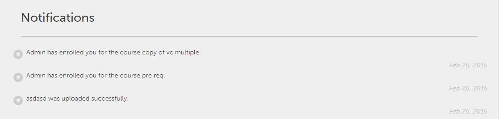

# Notifiche per l’utente

La funzionalità Notifiche è applicabile a tutti gli utenti di Adobe Learning Manager. Tuttavia, ogni utente ottiene diversi tipi di notifiche a seconda degli scenari e dei ruoli. Tutti gli avvisi e le notifiche agli utenti vengono visualizzati tramite la finestra a comparsa delle notifiche.

## Notifiche di accesso {#accessnotifications}

Gli utenti possono visualizzare le notifiche facendo clic sull’icona di notifica nell’angolo superiore destro della finestra.

Una finestra di notifica di esempio per il ruolo Autore è visualizzata nella schermata riportata di seguito:

Questa finestra a comparsa mostra un riepilogo di tutte le notifiche, insieme all’ora in cui sono state inviate e a una barra di scorrimento.

Puoi scoprire il numero delle notifiche più recenti in base al numero evidenziato sopra l’icona delle notifiche. Ad esempio, se dall’ultimo accesso hai ricevuto cinque notifiche, sopra l’icona delle notifiche verrà visualizzato il numero cinque. Questi numeri scompaiono quando visualizzi tutte le notifiche più recenti.

Fai clic sul collegamento°**[!UICONTROL Mostra tutte le notifiche]** nella parte inferiore della finestra a comparsa delle notifiche per visualizzare tutte le notifiche in una nuova pagina.

## Tipi di notifiche per Autori {#typesofnotificationsforauthors}

Gli Autori ricevono notifiche ogni volta che si verificano i seguenti eventi:

* Quando il caricamento del modulo va a buon fine
* Quando viene modificata una versione del modulo
