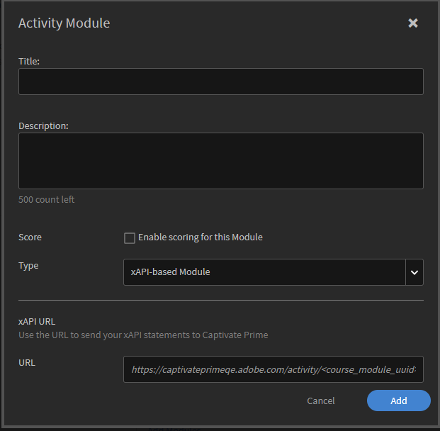

# xAPI in Learning Manager

## Che cos’è xAPI? {#whatisxapi}

L’API Experience (xAPI) è una specifica del software di e-learning che consente ai contenuti di apprendimento e ai sistemi di apprendimento di comunicare tra loro in modo da registrare e tenere traccia di tutti i tipi di esperienze di apprendimento. Le esperienze di apprendimento vengono registrate in un Learning Record Store (LRS). Gli LRS possono esistere all’interno dei tradizionali sistemi di gestione dell’apprendimento (LMS) o da soli.

Per ulteriori informazioni su xAPI, consulta:  [https://github.com/adlnet/xAPI-Spec](https://github.com/adlnet/xAPI-Spec).

## In che modo Learning Manager supporta xAPI? {#howdoescaptivateprimesupportxapi}

Learning Manager dispone di un Learning Record Store integrato. Questo LRS è perfettamente compatibile con le istruzioni xAPI provenienti da contenuti ospitati in Learning Manager. Accetta anche istruzioni xAPI generate da terze parti. Queste istruzioni xAPI vengono memorizzate in Learning Manager e possono quindi essere esportate al di fuori di Learning Manager per essere visualizzate in qualsiasi sistema di data warehouse di terze parti.

## Quando si utilizza xAPI? {#whendoyouusexapi}

È sempre più diffusa la necessità di acquisire le esperienze di apprendimento dell&#39;utente finale che si svolgono su più sistemi.  È inoltre necessario tenere traccia dell’esatto coinvolgimento dell’Allievo nei contenuti di formazione. Non si tratta solo di Inizio, In corso e Completamento (gli unici attributi acquisiti da SCORM).

## Utilizzo di xAPI in Learning Manager {#usingxapiinprime}

## Configurare l’applicazione {#setupyourapplication}

1. Accedi come Amministratore dell’integrazione. Seleziona **[!UICONTROL Applicazioni]** > **[!UICONTROL Registrati]**.

   

1. Registra una nuova applicazione.

   

1. Definire l&#39;ambito dell&#39;applicazione.

   * Se **[!UICONTROL Accesso in lettura e scrittura xAPI del ruolo di amministratore]** , l’Amministratore può pubblicare e ottenere documenti e istruzioni xAPI.
   * Se **[!UICONTROL Accesso in lettura e scrittura xAPI del ruolo Allievo]** , l’Amministratore può pubblicare e ottenere documenti e istruzioni xAPI.

1. Salva le modifiche. Ottieni l&#39;ID e il segreto dello sviluppatore.

**Punti finali**:

Fai clic sul collegamento seguente per visualizzare il documento swagger xAPI:

[https://learningmanagereu.adobe.com/docs/primeapi/xapi/](https://learningmanagereu.adobe.com/docs/primeapi/xapi/)

Nota: la versione xAPI supportata in Learning Manager è 1.0.3.

## Autenticazione API {#apiauthentication}

Le xAPI di Learning Manager utilizzano il framework OAuth 2.0 per autenticare e autorizzare le applicazioni client. Una volta registrata l’applicazione, puoi ottenere clientId e clientSecret. Get URL viene utilizzato nel browser in quanto autentica gli utenti di Learning Manager che utilizzano i loro account preconfigurati, ad esempio SSO, Adobe ID.

```
GET https://learningmanager.adobe.com/oauth/o/authorize?client_id=<Enter your clientId>&redirect_uri=<Enter a url to redirect to>&state=<Any String data>&scope=<admin:xapi or learner:xapi>&response_type=CODE.
```

## Tracciamento delle istruzioni xAPI come oggetto di apprendimento Learning Manager {#trackingxapistatementsasprimelo}

Come Autore, ora puoi scegliere il modulo xAPI durante la creazione di corsi per monitorare l’esperienza utente al di fuori di Learning Manager. Ad esempio, è possibile utilizzare questa funzione per valutare le attività degli utenti su una piattaforma di terze parti utilizzata per seguire un corso.

1. Durante la creazione di **[!UICONTROL Modulo attività]**, nel **[!UICONTROL Tipo]**opzione, utilizzare il menu a comparsa per selezionare  **[!UICONTROL Modulo xAPI.]**

   

1. È necessario fornire un IRI. Se non viene fornito, Learning Manager ne genera uno automaticamente.

   L’IRI per un’attività è univoco in un account. Ciò significa che due moduli in Learning Manager non possono avere lo stesso IRI. Viene generato un nuovo IRI nei seguenti casi:

   * Quando un corso con modulo xAPI viene condiviso tra account.
   * Quando una certificazione con modulo xAPI si ripete


   Qualsiasi istruzione xAPI con l’IRI menzionato viene monitorata nel modulo precedente e riflessa nei report di Learning Manager.

1. Per copiare l’IRI generato automaticamente, rivedi la pagina Modulo attività.
1. Pubblica il modulo.

**Punti da notare:**

* Learning Manager attualmente supporta solo mbox come identificatore. Gli altri identificatori inclusi mboz_sha1, openid e account non sono supportati.

* L’ID stato e l’ID profilo sono UUID se utilizzati con Learning Manager.
* La richiesta PUT non sovrascrive il documento per agenti/profilo, attività/profilo e attività/stato di xAPI
* Il gruppo non identificato non è supportato in Actor.
* Il parametro &quot;related_activities&quot; non è supportato nell&#39;istruzione GET.
* I parametri &#39;format=ids&#39; &amp; &#39;format=canonical&#39; non sono supportati nelle istruzioni GET.
* L’annullamento dell’istruzione xAPI non annulla le azioni che si sono verificate in Learning Manager quando l’istruzione è stata pubblicata.

## Genera report {#generatereports}

I report xAPI possono essere generati come report Excel. Come amministratore, apri **[!UICONTROL Report]** > **[!UICONTROL Report Excel]** > **[!UICONTROL Report di attività xAPI]**.

Il report scaricato recupera tutte le informazioni pubblicate dall’Allievo e dall’Amministratore per qualsiasi istruzione.

Gli stessi report possono essere generati/pianificati utilizzando connettori FTP e Box per qualsiasi integrazione di terze parti. Effettua le seguenti operazioni:

Accedi come Amministratore dell’integrazione > Apri il connettore FTP/Box > Seleziona il report di attività xAPI dal riquadro a sinistra > Scegli di pianificare/generare un report.


* Quando viene inviato solo il punteggio raw nell’istruzione xAPI senza il punteggio massimo, il punteggio del quiz non viene visualizzato in LT.

* Per ottenere il punteggio percentuale in Learning Manager, i punteggi ridimensionati vengono inviati tramite xAPI.

## Report di esempio {#samplereport}

[Report xAPI di esempio.](assets/xapireport8842560559890766717csv.zip)
