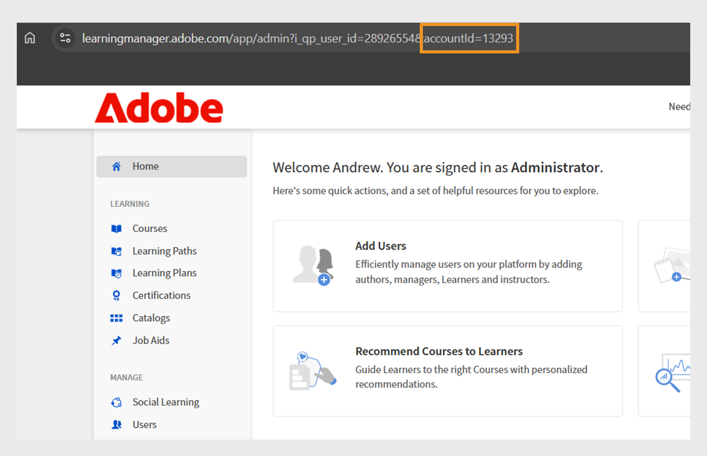

# Creazione di un account di prova in Adobe Learning Manager

Puoi facilmente configurare un account di prova gratuito di 30 giorni in Adobe Learning Manager per esplorare le funzionalità e testare i flussi di lavoro di apprendimento. Questa guida spiega da dove iniziare, come registrarti e come trovare i dettagli del tuo account dopo aver completato la configurazione.

Per creare un account di prova:

1. Passa a [Adobe Learning Manager](https://business.adobe.com/products/learning-manager/adobe-learning-manager.html).
2. Seleziona **[!UICONTROL Versione di prova gratuita di 30 giorni]**.

   

3. Selezionare **[!UICONTROL Crea un account]** nella pagina di accesso.

   

4. Digita **[!UICONTROL Indirizzo e-mail]** e **[!UICONTROL Password]**.

   

5. Digita i seguenti dettagli e seleziona **[!UICONTROL Crea account]**:
   * Nome
   * Cognome
   * Data di nascita

   

6. Digita e completa il modulo con i dettagli necessari per configurare il tuo account di prova.
7. Dopo la configurazione, trova l’ID del tuo account nell’URL del tuo Adobe Learning Manager.

   
