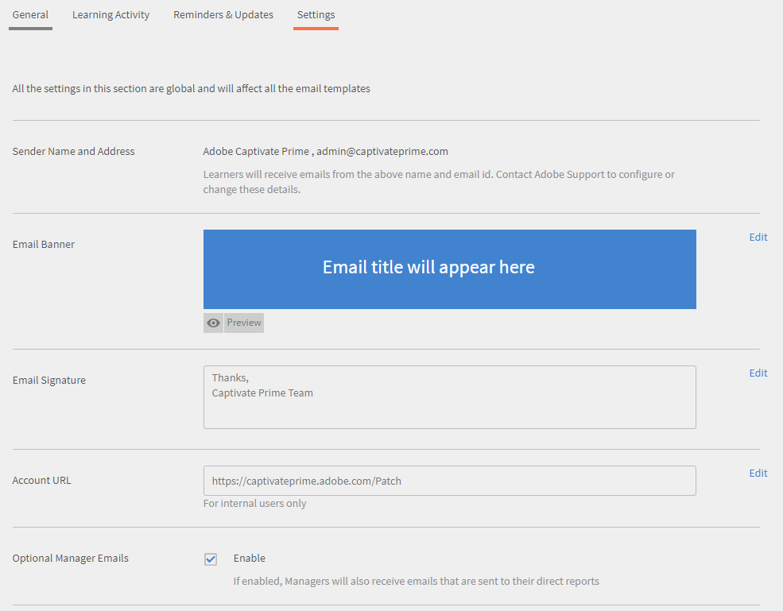

# Guida alla distribuzione di Learning Manager

## Introduzione {#introduction}

Learning Manager è un sistema di gestione dell’apprendimento (LMS) che consente ai professionisti della formazione di distribuire materiali didattici coinvolgenti e tracciabili in grado di contribuire alle esigenze o agli obiettivi di un’organizzazione. Learning Manager consente ai formatori o ai manager di assegnare agli Allievi corsi e altri oggetti di apprendimento in un ordine specifico. Questo strumento offre anche diverse potenti funzionalità, tra cui un lettore Fluidic multiformato, gamification, distintivi, dashboard per allievi di facile utilizzo. Tuttavia, per sfruttare tutte queste funzionalità, è essenziale configurare prima Learning Manager.

Questa guida fornisce istruzioni dettagliate su come iniziare a utilizzare Learning Manager. In questo documento vengono inoltre fornite informazioni dettagliate sulla configurazione. Continua a leggere per scoprire come iniziare a utilizzare Learning Manager.

## A chi è destinata questa guida? {#whoisthisguideintendedfor}

Come utente Learning Manager, puoi assumere il ruolo di Amministratore, Autore, Istruttore, Manager o Allievo. Questa guida è destinata agli utenti che potrebbero essere coinvolti nella configurazione di un LMS per un&#39;organizzazione o un cliente:

* **Amministratore IT** - In qualità di Amministratore IT, puoi attivare o integrare Learning Manager nella tua organizzazione. Un Amministratore IT può inoltre aggiungere uno o più utenti e può svolgere il ruolo di Amministratore di integrazione o di Amministratore che integra Learning Manager con applicazioni di terze parti.
* **Autore** - In qualità di autore di Learning Manager, puoi creare i contenuti di apprendimento necessari affinché un’organizzazione possa raggiungere i propri obiettivi di apprendimento. L’Autore si occupa di creare il contenuto di base che viene caricato in Learning Manager.

* **Amministratore Learning Manager** - Un Amministratore Learning Manager esegue le attività di configurazione relative all’applicazione. In alcune aziende, un Amministratore IT può anche svolgere il ruolo di Amministratore Learning Manager.

## Introduzione alla distribuzione di Learning Manager {#getstartedwithcaptivateprimedeployment}

Dopo aver acquistato Learning Manager, attiva l’account Learning Manager utilizzando il codice di licenza ricevuto. Procedere con le seguenti configurazioni, come indicato nell&#39;immagine seguente:

## Configurazione del sito in Learning Manager {#configureyoursiteincaptivateprime}

Prima di aggiungere e implementare oggetti di apprendimento in Learning Manager, è necessario configurare alcuni elementi. Per iniziare, configura il sito in base alle esigenze dell&#39;organizzazione. La configurazione del sito comprende i seguenti passaggi:

* Impostazione del branding e del logo per l’organizzazione
* Configurazione dei modelli e-mail
* Configurazione delle impostazioni di base dell’account
* Configurazione delle impostazioni sul feedback
* Configurazione delle impostazioni della Dashboard Allievo

### Imposta branding e logo {#setupbrandingandlogo}

In qualità di amministratore, puoi impostare il branding e i temi in base alle esigenze dell’organizzazione. Per impostare il branding e i temi del sito, effettua le seguenti operazioni:

### Impostazione del logo e del banner {#settingthelogoandbanner}

Utilizza le impostazioni del logo e del banner per visualizzare il logo della tua azienda in Learning Manager. Configura le opzioni di branding per impostare il dominio dell’azienda nell’URL, visualizzare il nome dell’organizzazione e le combinazioni di colori che corrispondono al marchio dell’organizzazione. Per configurare le impostazioni di branding:

* Accedi al tuo account Learning Manager come Amministratore.
* Nel riquadro a sinistra, fai clic su **Branding**.
* Nella pagina Branding, puoi configurare le seguenti opzioni facendo clic su **Modifica** rispetto all&#39;opzione che si desidera modificare:

   * **Nome organizzazione** : il valore specificato in questa casella determina il nome visualizzato sul banner in ogni pagina del sito.
   * **Sottodominio**: questo valore determina l&#39;URL del sito.
   * **Stile del logo**: l&#39;immagine in questo campo viene visualizzata come logo nell&#39;angolo superiore destro di ogni pagina. Qui puoi scegliere di mostrare solo il logo, solo il nome della tua organizzazione o sia il logo che il nome dell’organizzazione.

>[!NOTE]
>
>Puoi configurare il nome e il logo solo utilizzando il Branding. Non è possibile modificare la posizione del logo o dell&#39;immagine.

***Learning Manager supporta i seguenti formati di file per le immagini del logo: .png, .jpeg, .jpg, .gif, .bmp***

### Impostazione dei temi del sito {#settingthethemesforyoursite}

Learning Manager consente di modificare l’aspetto del sito utilizzando i Temi. L’applicazione offre i seguenti temi di colore tra cui scegliere:

* Predefinito Prime
* Ciottoli
* Carnevale
* Autunno
* Cielo invernale

Puoi scegliere una delle combinazioni di colori da allineare al tuo marchio aziendale.

1. Dal riquadro di navigazione a sinistra di Learning Manager, fai clic su **[!UICONTROL Branding]**.
1. Nella **Temi** , fare clic su **[!UICONTROL Modifica]**. L’applicazione consente di scegliere un nuovo tema. Quando selezioni un tema, vedrai immediatamente le combinazioni di colori utilizzate per gli elementi principali dell’interfaccia.

   

1. Inoltre, è possibile modificare **Colore barra superiore**, **Colore principale** e **Luminosità barra laterale**.  Per questi elementi chiave dell’interfaccia, puoi utilizzare i colori del tuo brand.
1. Per ripristinare i valori alla combinazione di colori predefinita per il tema, fare clic su **[!UICONTROL Reimposta tema]**. I colori degli elementi principali dell’interfaccia utente vengono impostati sulle opzioni predefinite per il tema scelto.
1. Dopo aver scelto il tema, fai clic su **[!UICONTROL Mostra suggerimenti]** per visualizzare le etichette o i suggerimenti nell&#39;anteprima.

   

   Notate una presentazione con diverse immagini nella **Temi** sezione. Questa presentazione consente di visualizzare in anteprima il tema o la combinazione di colori. Puoi visualizzare istantaneamente in anteprima le pagine selezionate, ad esempio la pagina Home, la dashboard Allievo e così via.

1. Per visualizzare l&#39;anteprima delle modifiche in un browser, fare clic su **[!UICONTROL Anteprima Live]**. Viene visualizzata una finestra a comparsa con l’anteprima live del tema, in cui puoi modificare la combinazione di colori o continuare con le opzioni predefinite. Per visualizzare l’anteprima delle opzioni su un browser, fate clic su **[!UICONTROL Anteprima]** in questa finestra a comparsa.

   

1. Le opzioni selezionate vengono temporaneamente applicate al sito. Per salvare le impostazioni selezionate per il tema e i colori, fare clic su **[!UICONTROL Applica]**.
1. Dopo aver selezionato e applicato un tema, fai clic su ****[!UICONTROL Salva]**** per salvare la scelta.

## Configurare i modelli e-mail {#configureemailtemplates}

In qualità di amministratore, il passaggio successivo consiste nella configurazione dei modelli e-mail per vari eventi. Puoi abilitare, disabilitare e modificare i modelli e-mail da inviare agli utenti. Esistono tre categorie principali di modelli e-mail:

* Modelli e-mail generali: queste e-mail vengono inviate per eventi generici. Ad esempio, una notifica di benvenuto quando un utente accede per la prima volta.
* Modelli e-mail associati a un oggetto di apprendimento o a un’attività: queste e-mail vengono inviate ad Allievi, Autori o Manager ogni volta che è presente un’attività di apprendimento. Ad esempio, le e-mail che vengono inviate dopo l’iscrizione a un corso, la partecipazione a una lezione, il completamento di un corso e così via.
* Promemoria e aggiornamenti: queste e-mail vengono inviate quando gli utenti necessitano di aggiornamenti o promemoria per qualsiasi evento. Ad esempio, un Allievo che riceve un promemoria per un corso imminente o un Amministratore che riceve una notifica e-mail per un report condiviso.

Puoi abilitare e configurare queste notifiche e-mail dal dashboard Amministratore. Per scoprire come impostare i modelli e-mail, procedi come segue:

1. Nel riquadro di navigazione sinistro fare clic su **[!UICONTROL ** Modelli e-mail **.]**
1. Fare clic su una delle schede seguenti:**[!UICONTROL ** Generale **/** Attività di apprendimento **/** Promemoria e aggiornamenti **.]** Ad esempio, supponiamo di aver fatto clic su **[!UICONTROL ** Attività di apprendimento **.]**
1. Fai clic sul pulsante di attivazione per qualsiasi attività per cui desideri attivare un’e-mail. In questo esempio, supponiamo di aver fatto clic su **[!UICONTROL ** Programma di apprendimento - Iscritto da Amministratore/Manager **.]**

   

   Il sistema visualizza il messaggio a comparsa &quot;Abilitato correttamente&quot;. Ora, ogni volta che un Manager o un Amministratore iscrive un Allievo a un corso, l’Allievo riceve un’e-mail da questo account Learning Manager.

1. Puoi modificare il modello e-mail predefinito. Per farlo, fai clic sull&#39;evento. In questo esempio, fare clic su **[!UICONTROL Programma di apprendimento: iscritto da Amministratore/Manager.]**
1. Nella **[!UICONTROL Anteprima modello]** nella finestra di dialogo a comparsa, sono presenti due schede: [!UICONTROL Allievo] e [!UICONTROL Manager].

   

   Per ognuna di queste schede, fai clic sul corpo dell’e-mail per modificarne il contenuto. Per salvare le modifiche apportate al modello e-mail, fai clic su **[!UICONTROL Salva]**.

   Ora, ogni volta che un Allievo viene iscritto a un corso dal Manager o dall’Amministratore, l’Allievo e il suo Manager ricevono una notifica e-mail.

   ***Nota: le modifiche sono applicabili solo per il modello e-mail associato all’evento selezionato.***

1. Come puoi notare, non è possibile modificare l’URL account o la firma nel modello e-mail. Per modificare il **[!UICONTROL URL account]** oppure **[!UICONTROL Firma]**, fare clic sul pulsante **[!UICONTROL Impostazioni]** scheda. In questa scheda è possibile modificare il banner dell’e-mail, la firma e l’URL dell’account.

   Il collegamento all’URL dell’account viene visualizzato in tutte le e-mail, subito prima della firma. Inserisci l’URL che desideri e fai clic su **[!UICONTROL Salva]**. Questo URL è visibile solo agli utenti interni.

   Per il banner e-mail, puoi cambiarne il colore selezionando  **[!UICONTROL ** Sfondo banner **.]** Puoi anche utilizzare un’immagine personalizzata come banner selezionando la **[!UICONTROL Immagine personalizzata]** opzione. Fai clic  **[!UICONTROL Salva]** dopo aver apportato le modifiche.

   ***Nota: le dimensioni dell’immagine personalizzata per il banner e-mail devono essere 1240x200 px. Le immagini più grandi rispetto alle dimensioni consigliate vengono ritagliate.***

   ***Learning Manager supporta solo i tipi di file .jpg, .jpeg e .png per i banner dell’e-mail.***

   

1. Puoi anche scegliere di abilitare le e-mail opzionali di Manager. Se si seleziona **[!UICONTROL Abilita]** , ogni volta che un report diretto riceve un’e-mail da questo account Prime, il manager è incluso nell’elenco dei destinatari.

   ***Nota: le impostazioni in questa scheda sono applicabili a tutti i modelli, a livello globale.***

### Configurare i modelli e-mail per un oggetto di apprendimento {#configureemailtemplatesforalearningobject}

Oltre a impostare i modelli e-mail a livello globale, in qualità di amministratore, puoi anche configurare i modelli e-mail per un oggetto di apprendimento specifico. In questo caso, le modifiche apportate al modello e-mail si applicano solo a quell’oggetto di apprendimento.

Questa opzione è disponibile anche per gli Autori, quando questi configurano un oggetto di apprendimento.

Per configurare i modelli e-mail per un oggetto di apprendimento:

1. Fai clic sul corso, sul programma di apprendimento o sulla certificazione per cui desideri configurare il modello e-mail.
1. Nel riquadro a sinistra, fai clic su **[!UICONTROL ** Modelli e-mail **.]** Il sistema visualizza un ****[!UICONTROL Anteprima modello]**** finestra a comparsa.
1. Modifica l’oggetto o il contenuto del modello e-mail e fai clic su **[!UICONTROL **Salva**]**per applicare le modifiche.
1. Per annullare le modifiche, fai clic su **[!UICONTROL ** Ripristina originale **.]**

### Impedisci agli utenti di ricevere e-mail {#restrictusersfromreceivingemails}

In qualità di Amministratore, puoi selezionare chi riceverà e-mail da Learning Manager e chi no. È possibile ottenere questo risultato utilizzando il ****[!UICONTROL Utente con restrizioni]**** opzione sotto il ****[!UICONTROL Impostazioni]** **scheda. Gli utenti possono essere aggiunti a questo elenco utilizzando il nome, l’ID e-mail o l’ID utente univoco. Gli utenti elencati in questa opzione non riceveranno comunicazioni e-mail da Learning Manager.

## Configurare le impostazioni dell’account {#configureyouraccountsettings}

Learning Manager consente di configurare alcune impostazioni dell’account, come quelle di base, sul feedback, generali e relative alla dashboard Allievo. Le procedure seguenti indicano come configurare ognuna di queste impostazioni:

### Configurare le impostazioni di base {#configurebasicsettings}

1. Nella home page di Learning Manager, fai clic su ****[!UICONTROL Impostazioni]****. Per impostazione predefinita, il sistema visualizza la pagina Informazioni di base, con i campi della lingua e della posizione predefiniti.
1. Fai clic ****[!UICONTROL Modifica]**** nell&#39;angolo superiore destro della pagina per modificare le informazioni di base.
1. Configura le seguenti opzioni:

   * **Paese**: seleziona il paese da questo menu a discesa.
   * **Fuso orario**: imposta il fuso orario appropriato per la tua posizione.
   * **Impostazioni internazionali**: selezionare la lingua desiderata. Se si modifica la lingua in questo campo, la modifica verrà applicata a tutti gli utenti che utilizzano questa applicazione. Tuttavia, ogni utente può modificare singolarmente la lingua preferita.
   * **L&#39;esercizio finanziario inizia a**: seleziona il mese in cui inizia l&#39;anno finanziario per la tua organizzazione.

   

## Configurare le impostazioni sul feedback {#configurefeedbacksettings}

Learning Manager ti consente di raccogliere feedback per un corso da parte degli Allievi. È anche possibile raccogliere feedback sugli Allievi utilizzando Learning Manager. Per richiedere un feedback, è necessario prima configurare i tipi di feedback L1 e L3.

Il feedback L3 è il feedback che un manager fornisce su un Allievo. Puoi utilizzare questo tipo di feedback per tenere traccia delle prestazioni degli Allievi nel tempo. Il feedback L1 è il feedback che un Allievo fornisce su un corso. Questo tipo di feedback consente a un Amministratore di raccogliere feedback diretto su un corso.

In qualità di amministratore, puoi configurare le impostazioni sul feedback in modo globale. A tale scopo, attenersi alla procedura descritta di seguito.

1. Nella home page di Learning Manager, fai clic su **[!UICONTROL Impostazioni]**.
1. Nel riquadro sinistro fare clic su **[!UICONTROL Generale]**.
1. Per configurare il feedback L1, fai clic sul pulsante **[!UICONTROL Feedback L1]** scheda. Sono disponibili le opzioni per configurare una domanda obbligatoria e diverse domande facoltative. Queste sono le domande visualizzate dagli Allievi durante il feedback al termine di un corso. Le domande sono formulate come affermazioni e agli allievi è richiesto di selezionare un numero da 1 a 5 per la risposta.

   La prima parte del feedback L1 è una domanda obbligatoria relativa alla possibilità, per un Allievo, di consigliare questo corso a un amico o collega.

   ***Nota: non è possibile modificare la domanda obbligatoria.***

   

1. Per configurare le altre domande del questionario di feedback, fai clic sulle domande nella ****[!UICONTROL Corsi di autoapprendimento]**** o ****[!UICONTROL Corsi in classe]****. Quando fai clic su una domanda, il sistema ti consente di modificare le domande predefinite.

   

1. Puoi abilitare o disabilitare le domande predefinite o modificare completamente le domande predefinite in base alle tue esigenze. Ad esempio, puoi rimuovere la domanda predefinita &quot;L’argomento della formazione era a mio avviso rilevante&quot; e aggiungere sostituisci la domanda con &quot;Ho trovato la formazione utile e pertinente&quot;.
1. Dopo aver finalizzato le domande per gli Allievi, è possibile configurare le impostazioni dei promemoria. Per impostazione predefinita, esiste un promemoria in cui l’applicazione invia promemoria automatici agli allievi al completamento di un corso. Questo promemoria ricorre ogni due settimane fino alla ricezione delle risposte da parte dell’Allievo. Puoi modificare il promemoria esistente facendo clic sul promemoria o aggiungerne uno nuovo.

   

1. Configura le impostazioni del promemoria completando le seguenti opzioni:

   * **Quando inviare**: specifica se desideri inviare la richiesta di feedback nel momento in cui il corso viene completato o in seguito.
   * **Giorni dopo il completamento**: specificare il numero di giorni dopo cui si desidera inviare la richiesta di feedback. Questo campo è visibile solo se selezionato ****[!UICONTROL Dopo il completamento del corso]****.

   * **Ricorrenza**: specifica se desideri inviare il promemoria di feedback ogni giorno, ogni settimana o ogni mese. Puoi anche specificare per quante settimane desideri che venga inviato il promemoria.

1. Fai clic sul segno di spunta per salvare le impostazioni del promemoria.
1. Dopo aver finalizzato tutte le impostazioni sul feedback, fai clic su **[!UICONTROL **Salva**]**nell’angolo in alto a destra della pagina.

## Configura feedback L3: {#configurel3feedback}

Il Feedback L3 contiene le domande inviate al manager di un Allievo dopo il completamento di un corso. Il feedback L3 consente a un amministratore di tenere traccia dei cambiamenti nel comportamento o nelle competenze di un allievo nel tempo. Per configurarlo, nella pagina Feedback fai clic sul pulsante ****[!UICONTROL Feedback L3]**** scheda. Viene visualizzata una domanda predefinita. Il manager deve rispondere a questa domanda utilizzando una scala di valutazione a cinque punti.

Come per il feedback L1, è possibile configurare i promemoria per il feedback L3. Puoi modificare il promemoria esistente o aggiungerne uno nuovo.

Dopo aver finalizzato le domande sul feedback e le impostazioni sui promemoria, fai clic su ****[!UICONTROL Salva]**** per applicare le impostazioni.

## Configurare il feedback a livello di istanza {#configurefeedbackataninstancelevel}

Nella procedura precedente sono stati descritti i passaggi necessari per configurare le impostazioni sul feedback a livello globale. In altre parole, le impostazioni vengono applicate a tutti i corsi. Oltre a queste domande globali, in qualità di amministratore o autore, puoi configurare domande aggiuntive di feedback L1 e L3 a livello di istanza.

Per configurare le impostazioni sul feedback a livello di istanza:

1. Nella home page di Learning Manager, fai clic su **[!UICONTROL Corsi]**.
1. Passa con il mouse sul corso per cui vuoi configurare le impostazioni sul feedback. Fai clic [!UICONTROL **Visualizza corso**.]

   

1. Nella pagina dei dettagli del corso, fai clic su **[!UICONTROL Valori predefiniti istanza]** nella sezione Configura.
1. Nella [!UICONTROL **Lingua**] selezionare la lingua in cui si desidera visualizzare il questionario di feedback.
1. Se desideri richiedere il feedback agli Allievi, abilita il Feedback reazione L1. In questa sezione è possibile aggiungere fino a due domande. Gli allievi possono fornire risposte descrittive a queste domande.
1. Selezionare il **[!UICONTROL Rendi obbligatorio]** casella di controllo se si desidera rendere una o entrambe le domande obbligatorie.
1. Selezionare il **[!UICONTROL Mostra questionario immediatamente dopo il completamento del corso]** se desideri che gli allievi visualizzino il questionario di feedback subito dopo aver completato il corso.

   

1. Per configurare il feedback modifica comportamento L3 a livello di istanza: ****[!UICONTROL Abilita]**** Feedback L3. L&#39;applicazione visualizza una domanda obbligatoria predefinita e una domanda vuota in cui è possibile immettere una domanda desiderata.
1. Per la domanda predefinita sui miglioramenti dell’Allievo dopo il completamento del corso, la risposta è in formato Scala Likert. In altre parole, i manager devono scegliere un’opzione su una scala da Decisamente d’accordo a Molto in disaccordo.
1. Specifica la seconda domanda per il Manager. I Manager possono fornire una risposta descrittiva a questa domanda.
1. Selezionare il ****[!UICONTROL Rendi obbligatorio]**** se si desidera rendere obbligatoria la seconda domanda.

   

1. Facoltativamente, configura le impostazioni sui promemoria a livello di istanza. Se non configuri le impostazioni sui promemoria qui, verranno assegnate automaticamente le impostazioni sui promemoria globali.
1. Dopo aver finalizzato le domande sul feedback e le impostazioni sui promemoria, fai clic su **[!UICONTROL **Salva**]**per applicare le impostazioni.

   ***Nota: le impostazioni sul feedback non si applicano alle certificazioni.***

## Configurare le impostazioni generali {#configuregeneralsettings}

Le impostazioni generali di Learning Manager consentono agli Amministratori di configurare le impostazioni generiche che influiscono sulle altre funzionalità dell’applicazione. Ad esempio, è possibile utilizzare le impostazioni generali per specificare se rendere l’efficacia del corso visibile agli allievi o meno. Per configurare le impostazioni generali:

1. Nella home page di Learning Manager, fai clic su ****[!UICONTROL Impostazioni]****.
1. Nel riquadro sinistro fare clic su ****[!UICONTROL Generale]****.
1. Nella pagina Impostazioni generali è possibile configurare le opzioni seguenti:

   Per tutte queste opzioni, la feature interessata da ciascuna opzione è variabile. Se necessario, possiamo fornire link a ognuna delle funzionalità.

   * **Mostra efficacia del corso**: abilita questa opzione se vuoi che gli allievi vedano l’efficacia di un corso nel titolo.
   * **Opzione di ripristino modulo**: abilita questa opzione se vuoi che gli allievi abbiano la possibilità di ripristinare un modulo. Gli Allievi possono quindi ripristinare i moduli che non hanno superato o che hanno completato parzialmente il modulo e desiderano ricominciare da capo.
   * **Moderazione del corso**: abilita questa opzione se desideri che le modifiche a un corso debbano essere approvate da un amministratore prima che diventino visibili agli allievi.
   * **Forum di discussione**: abilita questa opzione se vuoi che gli allievi possano visualizzare e partecipare a discussioni nei forum di discussione dei corsi. Se si abilita la **Forum di discussione** , gli allievi e gli istruttori possono pubblicare commenti sui corsi. Tuttavia, se le impostazioni a livello del corso indicano che questa funzione non è selezionata, le impostazioni a livello del corso hanno la precedenza sulle impostazioni dell’Amministratore.

   * **Esplora opzione abilità**: abilita questa opzione se vuoi che gli allievi possano esplorare le abilità per pari e leadership.
   * **ID univoci per gli oggetti di apprendimento**: abilita questa opzione se vuoi che gli autori abbiano la possibilità di aggiungere ID univoci agli oggetti di apprendimento.
   * **Mostra elenco cataloghi**: abilita questa opzione se vuoi che gli allievi vedano tutti i cataloghi disponibili. Questa opzione consente agli Allievi di migliorare il proprio elenco di oggetti di apprendimento.

   

## Configurazione delle impostazioni della Dashboard Allievo {#configurelearnerdashboardsettings}

La Dashboard Allievo in Learning Manager consente agli Allievi di visualizzare i corsi obbligatori e consigliati, i risultati raggiunti, le abilità e gli annunci. Gli Amministratori possono decidere come visualizzare la Dashboard Allievo configurandone le impostazioni. Queste impostazioni consentono agli amministratori di impostare i widget nella pagina dell’Allievo. Queste impostazioni specificano inoltre come e dove i widget vengono posizionati nella Dashboard Allievo. In qualità di Amministratore, puoi visualizzare in anteprima il layout della Dashboard Allievo prima di applicare le impostazioni.

1. Nella home page di Learning Manager, fai clic su **[!UICONTROL Impostazioni]**.
1. Nel riquadro di navigazione sinistro fare clic su **[!UICONTROL ** Dashboard Allievo **.]**
1. Seleziona i widget che desideri abilitare. Se deselezionate un widget, questo viene immediatamente rimosso dall’anteprima. Gli allievi non possono visualizzare questo widget nella dashboard.
1. Fai clic ****[!UICONTROL Salva]**** per applicare le impostazioni.

   

1. Per applicare le impostazioni predefinite, fare clic su **[!UICONTROL Ripristina predefiniti.]** In questo caso, tutti i widget tranne **[!UICONTROL Annunci di benvenuto e Sticky]** sono visibili.

   ***Anche dopo aver abilitato le impostazioni della Dashboard Allievo, gli allievi possono modificare e spostare i widget nelle rispettive dashboard.***

