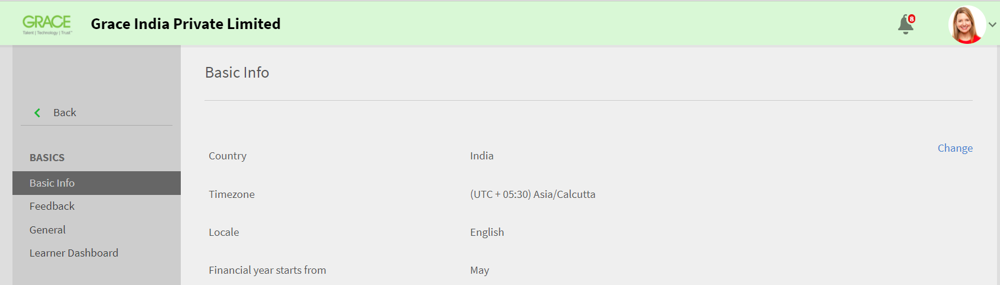

# Guida all’implementazione di Learning Manager

## Introduzione {#introduction}

Learning Manager è un sistema di gestione dell’apprendimento (LMS) che consente ai professionisti della formazione di distribuire materiali didattici coinvolgenti e tracciabili in grado di contribuire alle esigenze o agli obiettivi di un’organizzazione. Learning Manager consente ai formatori o ai manager di assegnare agli allievi corsi e altri oggetti di apprendimento in un ordine specifico. Offre anche molte altre funzionalità interessanti, come il lettore Fluidic multiformato, Gamification, Badge e una dashboard facile da utilizzare per gli allievi. Tuttavia, per sfruttare tutte queste funzionalità, è essenziale innanzitutto configurare Learning Manager.

Questa guida descrive i passaggi da seguire per iniziare a usare Learning Manager. Contiene anche informazioni dettagliate per procedere alla configurazione. Continua a leggere per scoprire come iniziare a usare Learning Manager.

## A chi è destinata questa guida? {#whoisthisguideintendedfor}

Come utente di Learning Manager, puoi assumere il ruolo di amministratore, autore, istruttore, manager o allievo. Questa guida è destinata agli utenti che si dovranno occupare di configurare un LMS per un’organizzazione o un cliente.

* **Amministratore IT** - In qualità di amministratore IT, è possibile attivare o integrare Learning Manager nella propria organizzazione. Un amministratore IT può inoltre aggiungere utenti singoli o multipli e può svolgere il ruolo di amministratore dell’integrazione o di amministratore che integra Learning Manager con applicazioni di terze parti.
* **Autore** - In qualità di Autore di Learning Manager, puoi creare i contenuti di apprendimento necessari affinché un’organizzazione possa raggiungere i propri obiettivi di apprendimento. L’Autore si occupa di creare il contenuto di base che viene caricato in Learning Manager.

* **Amministratore Learning Manager** - Un Amministratore Learning Manager esegue le attività di configurazione relative all’applicazione. In alcune aziende, un amministratore IT può anche rivestire il ruolo di Amministratore Learning Manager.

## Introduzione all’implementazione di Learning Manager {#getstartedwithcaptivateprimedeployment}

Dopo l’acquisto di Learning Manager, attiva il tuo account Learning Manager con il codice di licenza che hai ricevuto. Procedi con le configurazioni indicate nell’immagine seguente:

## Configurazione del sito in Learning Manager {#configureyoursiteincaptivateprime}

Prima di aggiungere e implementare oggetti di apprendimento in Learning Manager, è necessario configurare alcuni elementi. Inizia a configurare il sito per renderlo adatto alla tua organizzazione. La configurazione del sito comprende le seguenti fasi:

* configurazione del brand e del logo della tua organizzazione
* configurazione dei modelli e-mail
* configurazione delle impostazioni di base dell’account
* configurazione delle impostazioni relative al feedback
* configurazione delle impostazioni della Dashboard Allievo

### Brand e logo {#setupbrandingandlogo}

In qualità di amministratore, puoi impostare il branding e i temi in base alle esigenze dell’organizzazione. Per adattare il branding e i temi del tuo sito, segui questi passaggi:

### Logo e banner: {#settingthelogoandbanner}

Utilizza le impostazioni del logo e del banner per visualizzare il logo della tua azienda in Learning Manager. Configura le opzioni di branding per impostare il dominio dell’azienda nell’URL, visualizzare il nome dell’organizzazione e le combinazioni di colori che corrispondono al marchio dell’organizzazione. Ecco come configurare le impostazioni di branding:

* Accedi al tuo account Learning Manager come amministratore.
* sul pannello di sinistra, fai clic su **Branding**;
* Nella pagina dedicata al Branding, puoi configurare le seguenti opzioni cliccando **Modifica** accanto a ciò che desideri modificare.

   * **Nome organizzazione**: il nome visualizzato nel banner in ogni pagina del sito dipende dal valore specificato.
   * **Sottodominio**: questo valore determina l&#39;URL del sito.
   * **Stile logo**: l&#39;immagine in questo campo viene visualizzata come logo nell&#39;angolo superiore destro di ogni pagina. Qui puoi scegliere di mostrare solo il logo, solo il nome della tua organizzazione o sia il logo che il nome dell’organizzazione.

>[!NOTE]
>
>Puoi configurare il nome e il logo solo utilizzando il Branding. Non è possibile modificare la posizione del logo o dell’immagine.

***Learning Manager supporta i seguenti formati di file per le immagini del logo: .png, .jpeg, .jpg, .gif, .bmp***

### Temi del sito {#settingthethemesforyoursite}

Learning Manager consente di modificare l’aspetto del sito utilizzando i Temi. L’applicazione offre i seguenti temi e colori fra cui scegliere:

* Predefinito principale
* Ciottoli
* Luna park
* Autunno
* Cielo invernale

Puoi anche scegliere una delle combinazioni di colori seguenti per adattare il sito al branding della tua azienda.

1. Dal riquadro di navigazione a sinistra di Learning Manager, fai clic su **[!UICONTROL Branding]**.
1. Nella sezione **Temi** , fai clic su **[!UICONTROL Modifica]**. L’applicazione ti consente di scegliere un nuovo tema. Quando selezioni un tema, vedrai immediatamente le combinazioni di colori utilizzate per gli elementi principali dell’interfaccia.

   

1. Potete inoltre modificare **il colore della barra superiore**, **il colore principale** e la **luminosità della barra laterale**.  Per questi elementi chiave dell’interfaccia, puoi utilizzare i colori del tuo brand.
1. Per reimpostare i valori alla combinazione di colori predefinita del tema che hai scelto, fai clic su **[!UICONTROL Ripristina tema]**. I colori degli elementi principali dell’interfaccia utente sono impostati sulle opzioni predefinite del tema scelto.
1. Dopo aver scelto il tema, fai clic su **[!UICONTROL Mostra suggerimenti]** per visualizzare le etichette o i suggerimenti nell’anteprima.

   

   Nella sezione **Temi** è disponibile una presentazione con diverse immagini. Questa presentazione ti permette di vedere in anteprima il tema o la combinazione di colori. Puoi vedere in anteprima le pagine selezionate, come la pagina Home, la Dashboard Allievo e così via.

1. Se vuoi vedere in anteprima le modifiche su un browser, fai clic su **[!UICONTROL Anteprima Live]**. Apparirà una finestra a comparsa con l’anteprima live del tema, dove potrai modificare la combinazione di colori o continuare con le opzioni predefinite. Per un’anteprima delle tue opzioni su un browser, fai clic su **[!UICONTROL Anteprima]** in questa finestra a comparsa.

   

1. Le opzioni scelte vengono temporaneamente applicate al sito. Per salvare le impostazioni selezionate per il tema e i colori, fai clic su **[!UICONTROL Applica]**.
1. Dopo aver selezionato e applicato un tema, fai clic su **&#x200B;**&#x200B;[!UICONTROL Salva]&#x200B;**&#x200B;** per salvare la scelta.

## Configurazione dei modelli e-mail {#configureemailtemplates}

In qualità di amministratore, il passaggio successivo consiste nella configurazione dei modelli e-mail per vari eventi. È possibile attivare, disattivare e modificare i modelli e-mail che vengono inviati agli utenti. Esistono tre categorie principali di modelli e-mail:

* Modelli e-mail generali: queste e-mail vengono inviate per eventi generici. Ad esempio, per inviare un messaggio di benvenuto a un utente che accede per la prima volta al sito.
* Modelli e-mail associati a un oggetto di apprendimento o a un’attività: queste e-mail vengono inviate ad allievi, autori o manager e riguardano l’attività di apprendimento. Si tratta ad esempio di e-mail che vengono inviate dopo l’iscrizione a un corso, la partecipazione a una lezione, il completamento di un corso e così via.
* Promemoria e aggiornamenti: queste e-mail vengono inviate quando ci sono aggiornamenti o promemoria per gli utenti riguardo a particolari eventi. Ad esempio, un allievo potrebbe ricevere un promemoria per un corso che sta per essere attivato, o un amministratore potrebbe ricevere una notifica di condivisione di un report.

Queste e-mail possono essere abilitate e configurate dalla Dashboard Amministratore. Per scoprire come configurare i modelli e-mail, segui i passaggi seguenti:

1. Nel riquadro di navigazione a sinistra, fai clic su **[!UICONTROL **&#x200B; Modelli e-mail &#x200B;**.]**
1. Fai clic su una delle schede seguenti:**[!UICONTROL ** Generale **/** Attività di apprendimento **/** Promemoria e aggiornamenti **.]** Ad esempio, supponiamo di aver fatto clic su **[!UICONTROL **&#x200B; Attività di apprendimento &#x200B;**.]**
1. Fai clic sul pulsante di attivazione accanto alle attività per le quali desideri far partire un’e-mail. In questo esempio, supponiamo di aver fatto clic su **[!UICONTROL **&#x200B; Programma di apprendimento - Iscritto da Amministratore/Manager &#x200B;**.]**

   

   Il sistema visualizza il messaggio a comparsa &quot;Abilitato correttamente&quot;. Ora, ogni volta che un manager o un amministratore iscriverà un allievo a un corso, l’allievo riceverà un’e-mail dal suo account Learning Manager.

1. Il modello e-mail predefinito può essere modificato. Per modificarlo, clicca sull’evento. In questo esempio, fai clic su Programma di apprendimento **[!UICONTROL - Iscritto da Amministratore/Manager.]**
1. Nella finestra di dialogo a comparsa **[!UICONTROL Anteprima modello]**, sono presenti due schede: [!UICONTROL Allievo] e [!UICONTROL Manager].

   

   Per ognuna di queste schede, fai clic sul corpo dell’e-mail per modificarne il contenuto. Per salvare le modifiche apportate al modello e-mail, fai clic su **[!UICONTROL Salva]**.

   Ora, ogni volta che un allievo viene iscritto a un corso dal manager o dall’amministratore, sia l’allievo che il suo manager riceveranno una notifica e-mail.

   ***Nota: le modifiche sono applicabili solo per il modello e-mail associato all&#39;evento selezionato.***

1. Come hai notato, non è possibile modificare l’URL account o la firma nel modello e-mail. Per modificare l’ **[!UICONTROL URL account]** o la **[!UICONTROL firma]**, fai clic sulla scheda **[!UICONTROL Impostazioni]**. In questa scheda è possibile modificare il banner dell’e-mail, la firma e l’URL account.

   Il collegamento all’URL dell’account viene visualizzato in tutte le e-mail, subito prima della firma. Immetti l&#39;URL preferito e fai clic su **[!UICONTROL Salva]**. Questo URL è visibile solo agli utenti interni.

   Per il banner e-mail, puoi cambiarne il colore selezionando **[!UICONTROL **&#x200B; Sfondo banner &#x200B;**.] **&#x200B; Puoi anche utilizzare un&#39;immagine personalizzata come banner selezionando l&#39;opzione &#x200B;** [!UICONTROL Immagine personalizzata]&#x200B;**. Dopo aver apportato le modifiche, fai clic su &#x200B;** [!UICONTROL Salva]**.

   ***Nota: le dimensioni dell&#39;immagine personalizzata per il banner e-mail devono essere 1240x200 px. Le immagini di dimensioni superiori a quelle consigliate vengono ritagliate.***

   ***Learning Manager supporta solo i tipi di file .jpg, .jpeg e .png per i banner e-mail.***

   

1. Puoi anche scegliere di abilitare le e-mail opzionali manager. Se selezioni la casella di controllo **[!UICONTROL Abilita]**, ogni volta che un report diretto riceve un’e-mail da questo account Prime, il manager è incluso nell’elenco dei destinatari.

   ***Nota: le impostazioni in questa scheda sono applicabili a tutti i modelli, a livello globale.***

### Configura modelli e-mail per un oggetto di apprendimento {#configureemailtemplatesforalearningobject}

Oltre a impostare i modelli e-mail globalmente, in qualità di amministratore, puoi anche configurare i modelli e-mail per un oggetto di apprendimento specifico. In questo caso, tutte le modifiche apportate al modello e-mail, valgono solo per quel determinato oggetto di apprendimento.

Quando gli autori configurano un oggetto di apprendimento, questa opzione è disponibile anche a loro.

Per configurare i modelli e-mail per un oggetto di apprendimento:

1. Fai clic sul corso, programma di apprendimento o certificazione per cui vuoi configurare il modello e-mail.
1. Nel riquadro a sinistra, fai clic su **[!UICONTROL **&#x200B; Modelli e-mail &#x200B;**.] **&#x200B; Il sistema ti mostrerà un’ &#x200B;**&#x200B;**[!UICONTROL Anteprima del modello]**&#x200B;** in una finestra di dialogo a comparsa.
1. Modifica l&#39;oggetto o il contenuto del modello e-mail e fai clic su **[!UICONTROL **Salva**]**&#x200B;per applicare le modifiche.
1. Per annullare le modifiche, fai clic su **[!UICONTROL **&#x200B; Ripristina originale &#x200B;**.]**

### Escludi utenti dalla ricezione di e-mail {#restrictusersfromreceivingemails}

In qualità di amministratore, puoi scegliere chi riceverà e-mail da Learning Manager e chi non le riceverà. A tale scopo, puoi utilizzare l&#39;opzione **&#x200B;**[!UICONTROL Utente con restrizioni]**&#x200B;** nella scheda **Impostazioni **[!UICONTROL **]**. Gli utenti possono essere aggiunti a questo elenco utilizzando il nome, l’ID e-mail o l’ID utente univoco. Gli utenti elencati qui non riceveranno comunicazioni e-mail da Learning Manager.

## Configurazione delle impostazioni dell’account {#configureyouraccountsettings}

Learning Manager consente di configurare alcune impostazioni dell’account, come quelle di base, sul feedback, generali e relative alla Dashboard Allievo. Tutte queste impostazioni possono essere configurate seguendo i passaggi riportati di seguito:

### Configurazione delle impostazioni di base {#configurebasicsettings}

1. Nella pagina Home di Learning Manager, fai clic su **&#x200B;**&#x200B;[!UICONTROL Impostazioni]&#x200B;**&#x200B;**. Per impostazione predefinita, il sistema mostra la pagina delle informazioni di base, con i campi della lingua e della posizione predefinite.
1. Per modificare le impostazioni di base, fai clic su **&#x200B;**&#x200B;[!UICONTROL Cambia]&#x200B;**&#x200B;** nell’angolo in alto a destra della pagina.
1. Configura le opzioni seguenti:

   * **Paese**: seleziona il paese da questo menu a discesa.
   * **Fuso orario**: imposta il fuso orario appropriato per la tua posizione.
   * **Locale**: seleziona la lingua desiderata. Se cambi la lingua qui, la modifica sarà valida per tutti gli utenti che utilizzeranno quest’applicazione. Tuttavia, ogni utente può modificare singolarmente la lingua preferita.
   * **L’anno fiscale inizia a**: seleziona il mese in cui inizia l’anno fiscale per la tua organizzazione.

   

## Configura impostazioni sul feedback {#configurefeedbacksettings}

Learning Manager ti consente di raccogliere le opinioni degli allievi sui corsi. Con Learning Manager è inoltre possibile raccogliere feedback sugli allievi. Per richiedere il feedback, è necessario configurare i tipi di feedback L1 e L3.

Il feedback L3 è il feedback sugli allievi fornito dai manager. Puoi utilizzare questo tipo di feedback per tenere traccia delle prestazioni degli Allievi nel tempo. Il feedback L1 è il feedback fornito dagli allievi sui corsi. Con questo tipo di feedback, gli amministratori possono ottenere un feedback diretto su un corso.

Gli amministratori possono configurare le impostazioni sul feedback globalmente. Per farlo, è necessario seguire i passaggi seguenti:

1. Nella pagina Home di Learning Manager, fai clic su **[!UICONTROL Impostazioni]**.
1. Nel riquadro a sinistra, clicca su **[!UICONTROL Generale]**.
1. Per configurare il feedback L1, fai clic sulla scheda **[!UICONTROL Feedback L1]**. È possibile creare una domanda obbligatoria e diverse domande facoltative. Ecco le domande visualizzate dagli allievi nel modulo di feedback alla fine di un corso. Le domande sono formulate come affermazioni e agli allievi è richiesto di selezionare un numero da 1 a 5 per la risposta.

   La prima parte del feedback L1 è una domanda obbligatoria relativa alla possibilità, per un Allievo, di consigliare questo corso a un amico o collega.

   ***Nota: non è possibile modificare la domanda obbligatoria.***

   

1. Per configurare le altre domande del questionario di feedback, fai clic sulle domande nella sezione **&#x200B;**&#x200B;[!UICONTROL Corsi autonomi]&#x200B;**&#x200B;** o **&#x200B;**&#x200B;[!UICONTROL Corsi in aula]&#x200B;**&#x200B;**. Quando fai clic su una domanda, il sistema ti consente di modificare le domande predefinite.

   

1. Le domande predefinite possono essere abilitate, disabilitate o modificate completamente in base alle tue esigenze. Ad esempio, puoi rimuovere la domanda predefinita &quot;L’argomento della formazione era a mio avviso rilevante&quot; e aggiungere sostituisci la domanda con &quot;Ho trovato la formazione utile e pertinente&quot;.
1. Dopo aver completato le domande per gli allievi, è possibile configurare le impostazioni di promemoria. Per impostazione predefinita, l’applicazione invia automaticamente promemoria agli allievi dopo il completamento di un corso. Questo promemoria ricorre ogni due settimane fino alla ricezione delle risposte da parte dell’Allievo. Puoi modificare il promemoria esistente cliccandovi sopra, o aggiungerne uno nuovo.

   

1. Configura le impostazioni del promemoria scegliendo le opzioni seguenti:

   * **Quando inviare**: specifica se inviare la richiesta di feedback nel momento in cui il corso viene completato o in seguito.
   * **Giorni dopo il completamento**: specifica il numero di giorni dopo cui vuoi inviare la richiesta di feedback. Questo campo è visibile solo se hai selezionato **&#x200B;**&#x200B;[!UICONTROL l’opzione per inviare la richiesta di feedback dopo il completamento del corso]&#x200B;**&#x200B;**.

   * **Frequenza**: specifica se desideri inviare il promemoria di feedback ogni giorno, ogni settimana o ogni base. Puoi anche definire il numero di settimane in cui vuoi che il promemoria venga inviato.

1. Fai clic sul simbolo di spunta per salvare le impostazioni del promemoria.
1. Dopo aver finalizzato tutte le impostazioni sul feedback, fai clic su **[!UICONTROL **Salva**]**&#x200B;nell&#39;angolo in alto a destra della pagina.

## Configura feedback L3: {#configurel3feedback}

Il Feedback L3 contiene le domande inviate al manager di un Allievo dopo il completamento di un corso. Il feedback L3 consente a un amministratore di tenere traccia dei cambiamenti nel comportamento o nelle competenze di un allievo nel tempo. Per configurarlo, vai sulla pagina del feedback e clicca sulla scheda **&#x200B;**&#x200B;[!UICONTROL Feedback L3]&#x200B;**&#x200B;**. È presente una domanda predefinita. Il manager deve rispondere a questa domanda utilizzando una scala di valutazione a cinque punti.

Come per il feedback L1, è possibile configurare i promemoria del feedback L3. Puoi modificare il promemoria esistente o aggiungerne uno nuovo.

Dopo aver finalizzato le domande sul feedback e le impostazioni sui promemoria, clicca **&#x200B;**&#x200B;[!UICONTROL Salva]&#x200B;**&#x200B;** per applicare le modifiche.

## Configura il feedback a livello di istanza {#configurefeedbackataninstancelevel}

La procedura precedente ha descritto i passaggi necessari per configurare le impostazioni sul feedback a livello globale. Questo significa che le impostazioni vengono applicate a tutti i corsi. Oltre a queste domande globali, gli amministratori o gli autori possono configurare domande aggiuntive di feedback L1 e L3 a livello di istanza.

Per configurare le impostazioni sul feedback a livello di istanza:

1. Nella pagina Home di Learning Manager fai clic su **[!UICONTROL Corsi]**.
1. Passa con il mouse sul corso per cui vuoi configurare le impostazioni sul feedback. Fai clic su [!UICONTROL **Visualizza corso**.]

   

1. Nella pagina dei dettagli del corso, fai clic su **[!UICONTROL Impostazioni predefinite istanza]** nella sezione Configura.
1. Nell&#39;elenco a discesa [!UICONTROL **Lingua**], seleziona la lingua in cui desideri che il questionario di feedback venga visualizzato.
1. Se vuoi richiedere il feedback agli allievi, abilita il Feedback reazione L1. In questa sezione è possibile aggiungere fino a due domande. Gli allievi possono fornire risposte di tipo descrittivo a queste domande.
1. Spunta la casella **[!UICONTROL Rendi obbligatorio]** se vuoi rendere una o entrambe le domande obbligatorie.
1. Seleziona **[!UICONTROL Mostra questionario immediatamente dopo il completamento del corso]** se vuoi che gli allievi vedano il questionario di feedback nel momento in cui completano il corso.

   

1. Per configurare il feedback modifica comportamento L3 a livello di istanza, **&#x200B;**&#x200B;[!UICONTROL Abilitare]&#x200B;**&#x200B;** il feedback L3. L’applicazione mostra una domanda obbligatoria predefinita e una domanda vuota in cui puoi inserire una domanda personalizzata.
1. Per la domanda predefinita sui miglioramenti dell’Allievo dopo il completamento del corso, la risposta è in formato Scala Likert. In altre parole, i manager devono scegliere un’opzione su una scala che va da Decisamente d’accordo a Molto in disaccordo.
1. Specifica la seconda domanda per il manager. I manager possono fornire una risposta di tipo descrittivo a questa domanda.
1. Spunta la casella **&#x200B;**&#x200B;[!UICONTROL Rendi obbligatorio]&#x200B;**&#x200B;** se vuoi che la seconda domanda sia obbligatoria.

   

1. È possibile configurare le impostazioni sui promemoria a livello di istanza. Se non configuri le impostazioni sui promemoria qui, verranno adottate automaticamente le impostazioni sui promemoria globali.
1. Dopo aver finalizzato le domande sul feedback e le impostazioni sui promemoria, fai clic su **[!UICONTROL **Salva**]**&#x200B;per applicare le modifiche.

   ***Nota: le impostazioni sul feedback non sono applicabili alle certificazioni.***

## Configura impostazioni generali {#configuregeneralsettings}

Le impostazioni generali di Learning Manager consentono agli amministratori di configurare le impostazioni generiche che influiscono sulle altre funzionalità dell’applicazione. Ad esempio, dalle impostazioni generali è possibile specificare se rendere l’efficacia del corso visibile agli allievi o meno. Per configurare le impostazioni generali:

1. Nella pagina Home di Learning Manager, fai clic su **&#x200B;**&#x200B;[!UICONTROL Impostazioni]&#x200B;**&#x200B;**.
1. Nel riquadro a sinistra, clicca su **&#x200B;**&#x200B;[!UICONTROL Generale]&#x200B;**&#x200B;**.
1. Nella pagina Impostazioni generali è possibile configurare le seguenti opzioni:

   Ciascuna di queste opzioni ha effetto su una specifica funzionalità. Se necessario, possiamo fornire link a ognuna delle funzionalità.

   * **Mostra efficacia del corso**: abilita questa opzione se vuoi che gli allievi vedano l’efficacia del corso nel titolo.
   * **Opzione reimpostazione modulo**: abilita questa opzione se vuoi che gli allievi abbiano la facoltà di ripristinare un modulo. Gli allievi possono ripristinare i moduli che non hanno passato o quelli che non hanno completato e che desiderano ricominciare da capo.
   * **Moderazione del corso**: abilita questa opzione se vuoi che le modifiche a un corso debbano essere approvate da un amministratore prima che diventino visibili agli allievi.
   * **Forum di discussione**: abilita questa opzione se vuoi che gli allievi possano visualizzare e partecipare a discussioni nei forum di discussione dei corsi. Se spunti la casella **Forum di discussione**, gli allievi e gli istruttori possono pubblicare commenti sui corsi. Tuttavia, se le impostazioni a livello del corso indicano che questa funzione non è selezionata, le impostazioni a livello del corso hanno la precedenza sulle impostazioni dell’Amministratore.

   * **Esplora opzione abilità**: abilita questa opzione se vuoi che gli allievi possano esplorare le abilità per pari e leadership.
   * **ID univoci per gli oggetti di apprendimento**: abilita questa opzione se vuoi che gli autori abbiano la possibilità di aggiungere ID unici agli oggetti di apprendimento.
   * **Mostra elenchi cataloghi**: abilita questa opzione se vuoi che gli allievi vedano tutti i cataloghi disponibili. Questa opzione aiuta gli allievi a definire il proprio elenco di oggetti di apprendimento.

   

## Configura impostazioni Dashboard Allievo {#configurelearnerdashboardsettings}

La Dashboard Allievo in Learning Manager consente agli allievi di visualizzare i corsi obbligatori e consigliati, i risultati raggiunti, le abilità e gli annunci. Gli amministratori possono decidere che aspetto avrà la Dashboard Allievo configurandone le impostazioni. Queste impostazioni consentono agli amministratori di impostare i widget nella pagina dell’Allievo. Impostano anche la posizione e l’aspetto del widget sulla Dashboard Allievo. In qualità di amministratore, puoi vedere in anteprima il layout della Dashboard Allievo prima di applicare le impostazioni.

1. Nella pagina Home di Learning Manager, fai clic su **[!UICONTROL Impostazioni]**.
1. Nel riquadro di navigazione a sinistra, fai clic su **[!UICONTROL **&#x200B; Dashboard Allievo &#x200B;**.]**
1. Seleziona i widget che vuoi abilitare. Se deselezioni un widget, questo verrà rimosso immediatamente dall’anteprima. Gli allievi non potranno vedere il widget sulla dashboard.
1. Fai clic su **&#x200B;**&#x200B;[!UICONTROL Salva]&#x200B;**&#x200B;** per applicare le impostazioni.

   

1. Per applicare le impostazioni predefinite, fare clic su **[!UICONTROL Ripristina predefiniti.]** In questo caso, tutti i widget saranno visibili, a eccezione di **[!UICONTROL Benvenuto e Annunci Sticky]**.

   ***Anche dopo aver abilitato le impostazioni della Dashboard Allievo, gli allievi possono modificare e spostare i widget nelle rispettive dashboard.***

