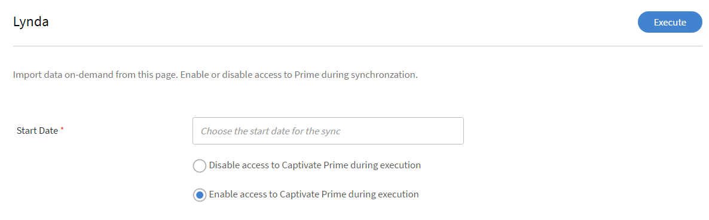
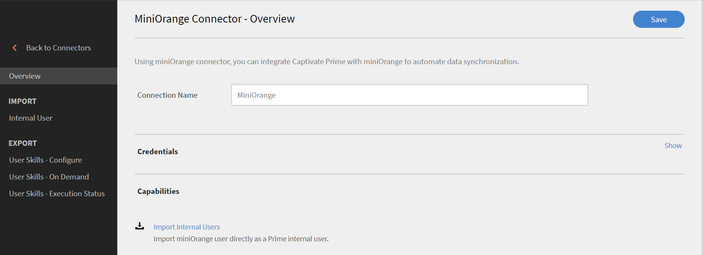

# Connettori Learning Manager

Scopri come integrare Salesforce con Learning Manager utilizzando i connettori e come integrare FTP con Learning Manager e caricare automaticamente CSV utilizzando il connettore FTP.

Le aziende usano altre applicazioni e altri sistemi che potrebbero dover essere integrati con Learning Manager. I connettori sono utilità di supporto all’implementazione di integrazioni basate sui dati, come l’importazione di dati in Learning Manager da sistemi esterni o l’esportazione di dati in sistemi esterni da Learning Manager. Nella versione di luglio 2016, i connettori consentono solo di importare in blocco da sistemi esterni gli utenti per Learning Manager.

Learning Manager fornisce connettori Salesforce e FTP. Tramite il connettore Salesforce, gli Amministratori di integrazione di un’organizzazione possono integrare l’applicazione Salesforce con Learning Manager. Come integratore, puoi utilizzare il connettore FTP per importare automaticamente un set di utenti nell’applicazione aziendale.

Learning Manager fornisce anche i connettori Lynda, getAbstract e Harvard Management System che consentono agli Allievi di accedere e seguire i corsi da Lynda.com, getAbstract e Harvard ManageMentor.

Continua a leggere per scoprire come configurare e utilizzare ciascuno di questi connettori in Learning Manager.

## Connettore Salesforce {#sfconnector}

Il connettore Salesforce collega gli account Learning Manager e Salesforce per automatizzare la sincronizzazione dei dati. Il connettore Salesforce offre le seguenti funzionalità:

### Mapping attributi

L’Amministratore di integrazione può scegliere le colonne Salesforce e mapparle agli attributi raggruppabili di Learning Manager corrispondenti. Si tratta di un lavoro unico. Una volta completata, la mappatura viene utilizzata nelle successive importazioni di utenti. Può essere riconfigurata qualora l’Amministratore desiderasse una mappatura diversa per l’importazione degli utenti.

### Importazione automatica degli utenti

Il processo di importazione degli utenti consente all’Amministratore di Learning Manager di recuperare i dettagli dei dipendenti da Salesforce e importarli automaticamente in Learning Manager. Grazie all’automatizzazione, le operazioni di creazione di CSV e caricamento in Learning Manager non richiedono alcun intervento manuale.

### Pianificazione automatica

L’utilizzo della funzione di pianificazione automatica insieme alla funzione di importazione automatica degli utenti può rivelarsi efficace. L’Amministratore Learning Manager può impostare la pianificazione in base alle esigenze dell’organizzazione. Gli utenti nell’applicazione Learning Manager possono essere aggiornati in base alla pianificazione.  La sincronizzazione può essere eseguita su base giornaliera nell’applicazione Learning Manager.

### Filtraggio degli utenti

L’Amministratore Learning Manager può applicare filtri agli utenti prima di importarli. Ad esempio, può scegliere di importare tutti gli utenti della gerarchia sotto uno o più Manager specifici.

## Configurazione del connettore Salesforce {#configuresalesforceconnector}

Scopri il processo per integrare Learning Manager con Salesforce.

### Prerequisiti {#prerequisites}

Assicurati di avere a portata di mano l’URL dell’organizzazione Salesforce. Ad esempio, se il nome della tua organizzazione è **myorg**, l’URL di Salesforce potrebbe essere [https://myorg.salesforce.com](https://myorg.salesforce.com/). È l’unica informazione richiesta per connettere l’account Salesforce a Learning Manager.

Accertati inoltre di disporre delle credenziali appropriate per effettuare l’accesso all’account.

## Creazione di una connessione {#createaconnection}

1. Nella home page di Learning Manager, passa il mouse sulla scheda/sull’anteprima di Salesforce. Viene visualizzato un menu. Fai clic sulla voce **[!UICONTROL Connetti]** nel menu.

   

1. Viene visualizzata una finestra di dialogo che richiede di inserire l’URL dell’organizzazione. Dopo aver fornito l&#39;URL, fai clic su **[!UICONTROL Connetti]**.
1. Una volta effettuata la connessione, viene visualizzata la pagina di panoramica.

## Mapping attributi {#mapattributes}

Una volta stabilita la connessione, è possibile mappare le colonne di Salesforce agli attributi corrispondenti di Learning Manager. Questo passaggio è obbligatorio.

1. Le colonne di Learning Manager sono visualizzate nella parte sinistra della pagina di mappatura, quelle di Salesforce nella parte destra. Seleziona un nome appropriato per la colonna, mappato al nome della colonna di Learning Manager.

   

   I dati della colonna di Learning Manager mostrati sul lato sinistro vengono recuperati dai campi attivi. Il campo **manager** deve essere necessariamente mappato a un campo di tipo indirizzo e-mail. Prima di poter utilizzare il connettore è necessario mappare tutte le colonne.

1. Dopo aver completato il mapping, fai clic su **[!UICONTROL Salva]**.
1. Il connettore è ora pronto per l’uso. L’account ora configurato viene visualizzato come origine dati nell’app Amministratore per consentire all’amministratore di pianificare l’importazione o per la sincronizzazione su richiesta.

## Utilizzo del connettore Salesforce {#usingsalesforceconnector}

Il connettore Salesforce si collega a Salesforce.com per recuperare gli utenti in base alla configurazione e aggiungerli a Learning Manager.

## Connettore FTP Learning Manager {#ftpconnector}

Usando il connettore FTP, puoi integrare Learning Manager con sistemi esterni arbitrari per l’automazione della sincronizzazione dei dati. I sistemi esterni dovrebbero esportare i dati in formato CSV e inserirli nella cartella appropriata dell’account FTP di Learning Manager. Il connettore FTP offre le funzioni indicate di seguito.

Puoi anche utilizzare il connettore Box per la migrazione dei dati, l’importazione degli utenti e l’esportazione dei dati. Per ulteriori informazioni, consulta [Connettore Box.](third-party-connectors.md#main-pars_header_302653946)

## Importazione di dati {#dataimport}

Il processo di importazione degli utenti consente all’Amministratore Learning Manager di recuperare i dettagli dei dipendenti dal servizio FTP di Learning Manager e importarli automaticamente in Learning Manager. Utilizzando questa funzione, è possibile integrare più sistemi inserendo il file CSV generato da tali sistemi nelle apposite cartelle degli account FTP. Learning Manager preleva i file CSV, li unisce e importa i dati in base alla pianificazione Fai riferimento alla funzione di pianificazione per ulteriori informazioni.

**Mapping attributi**

L’Amministratore di integrazione può scegliere le colonne di CSV e mapparle agli attributi raggruppabili di Learning Manager. L’operazione di mappatura viene eseguita una sola volta. Una volta effettuata la mappatura, la stessa mappatura viene utilizzata nelle importazioni utente successive. La mappatura può essere riconfigurata se l’Amministratore desidera avere una mappatura diversa per gli utenti importatori.

## Esportazione di dati {#exportdata}

La funzione di esportazione dei dati consente di esportare le abilità degli utenti e le trascrizioni degli allievi in un percorso FTP per l’integrazione con qualsiasi sistema di terze parti.

## Pianificazione {#scheduling}

L’Amministratore può impostare le attività di pianificazione secondo i requisiti dell’organizzazione e gli utenti nell’applicazione Learning Manager vengono aggiornati in base alla pianificazione. Allo stesso modo, l’Amministratore di integrazione può pianificare l’esportazione delle abilità in modo tempestivo per consentire l’integrazione con un sistema esterno.  La sincronizzazione può essere eseguita su base giornaliera nell’applicazione Learning Manager.

## Configurazione del connettore FTP Learning Manager {#configurecaptivateprimeftpconnector}

Scopri il processo per integrare Learning Manager con il connettore FTP.

### Creazione di una connessione {#Createaconnection-1}

1. Nella home page di Learning Manager, passa il mouse sopra la scheda/l’anteprima FTP. Viene visualizzato un menu. Fai clic sulla voce **[!UICONTROL Connetti]** nel menu.

   

1. Viene visualizzata una finestra di dialogo che richiede di inserire l’id e-mail. Fornisci l’ID e-mail del responsabile della gestione dell’account FTP Learning Manager per l’organizzazione. Fai clic su **[!UICONTROL Connetti]** dopo aver fornito l&#39;ID e-mail.
1. Learning Manager invia all’utente un’e-mail con la richiesta di reimpostare la password prima di accedere all’FTP per la prima volta. L’utente deve reimpostare la password e utilizzarla per accedere all’account FTP Learning Manager.

   È possibile creare un solo account FTP Learning Manager per un determinato account Learning Manager.

   Nella pagina di panoramica, è possibile specificare il nome della connessione per l’integrazione. Scegli l’azione da eseguire tra le seguenti opzioni:

   * Importazione di utenti interni
   * Esporta abilità utente - Configura una pianificazione
   * Esporta abilità utente - Su richiesta

   

## Importa

+++Utente interno

L’opzione di importazione utente interno consente di pianificare automaticamente la generazione del report relativo all’importazione dell’utente. I report generati vengono inviati come file .CSV.

+++

+++Mappa attributi

Una volta stabilita la connessione, puoi mappare le colonne dei file CSV che saranno nella cartella FTP agli attributi corrispondenti di Learning Manager. Questo passaggio è obbligatorio.

1. Nella pagina Mapping attributi, le colonne previste di Learning Manager sono visualizzate a sinistra, i nomi delle colonne CSV destra. Inizialmente, sul lato destro viene visualizzata una casella di selezione vuota. Importa un qualsiasi modello CSV facendo clic su **Scegli file**.
1. Il passaggio precedente consente di compilare l’elenco a discesa di selezione sulla destra con tutti i nomi delle colonne CSV. Seleziona un nome appropriato per la colonna, mappato al nome della colonna di Learning Manager.

   *Il campo Manager deve essere necessariamente mappato a un campo di tipo indirizzo e-mail. Prima di poter utilizzare il connettore è necessario mappare tutte le colonne.*

1. Dopo aver completato il mapping, fai clic su **[!UICONTROL Salva]**.

   Il connettore è ora pronto per l’uso. L’account appena configurato verrà ora visualizzato come origine dati nell’app Amministratore per consentire all’Amministratore di pianificare l’importazione o per la sincronizzazione su richiesta.

+++

+++Utilizzo del connettore FTP Learning Manager

1. I file CSV provenienti da sistemi esterni devono essere posizionati nel seguente percorso:

   `code $OPERATION$/$OBJECT_TYPE$/$SUB_OBJECT_TYPE$/data.csv`

   **Nota:** nella versione di luglio 2016, è consentita solo l&#39;importazione degli utenti. Pertanto, per utilizzare il connettore FTP è necessario assicurarsi che i file CSV si trovino nella seguente cartella:

   `code Home/import/user/internal/*.csv`

1. Il connettore FTP prende tutte le righe dai file CSV, quindi è importante che la riga corrispondente a un utente in un file CSV non venga visualizzata in nessun altro file CSV.
1. Tutti i file CSV devono contenere le colonne specificate nella mappatura.
1. Tutti i file CSV richiesti devono essere presenti nella cartella prima dell’inizio del processo.

Durante l’importazione degli utenti in Learning Manager, l’Amministratore deve sapere anche in che modo gli utenti vengono gestiti in Learning Manager. Per ulteriori informazioni, fai riferimento alla [Guida alla gestione utenti](../integration-admin/feature-summary/migration-manual.md#usermanagement).

+++

## Esporta

+++Abilità

Sono disponibili due opzioni per esportare i report sulle abilità degli utenti.

**[!UICONTROL Abilità utente - Su richiesta]**: puoi specificare la data di inizio ed esportare il report utilizzando l’opzione. Il report verrà estratto dalla data inserita fino a oggi.

**[!UICONTROL Abilità utente - Configura]**: questa opzione consente di pianificare l’estrazione del report. Seleziona la casella di controllo Abilita pianificazione e specifica la data e l’ora di inizio. Puoi anche specificare l’intervallo desiderato per la generazione e l’invio del report.

+++

Per aprire la cartella di esportazione in cui verranno inseriti i file esportati nella posizione FTP, apri il collegamento alla cartella FTP fornito nella pagina delle abilità utente, come mostrato di seguito.

I file esportati automaticamente si troveranno nel percorso **Home/export/&#42;FTP_location&#42;**

I file esportati automaticamente saranno disponibili con il titolo **skill_achievements_&#42;date from &#42;_to_&#42;date to&#42;.csv**

## Connettore Lynda {#lyndaconnector}

Il connettore Lynda è utilizzabile dai clienti enterprise di Lynda.com che desiderano far seguire i corsi Lynda ai loro allievi da Learning Manager. È possibile configurare il connettore per recuperare periodicamente corsi da Lynda.com con la tua chiave API. Quando un corso viene creato in Learning Manager, gli utenti possono ricercarlo e seguirlo. Sarà quindi possibile seguire i progressi dell’Allievo in Learning Manager.

### Configurazione del connettore Lynda {#configurethelyndaconnector}

1. Nel dashboard di amministrazione integrato, fai clic su Lynda.

   Verrà visualizzato il riquadro con tre opzioni: Guida introduttiva, Connetti e Gestione connessioni.

1. Se devi configurare il connettore Lynda per la prima volta, fai clic su Connetti.

   Devi configurare l’account FTP Exavault prima di configurare il connettore.

1. Nella pagina di connessione, specifica un nome per il connettore. Inserisci appkey e chiave privata per la connessione.

   Devi contattare il tuo fornitore per ricevere l’appkey e la chiave privata.

1. Fai clic su Salva.

   La configurazione viene salvata e viene aggiunta la connessione Lynda per l’account. Ora puoi fare clic su Gestione connessioni dalla pagina Home e modificare la configurazione in qualsiasi momento.

1. Se disponi già di una connessione configurata, fai clic su Gestione connessioni per visualizzare tutte le connessioni.

   Prima di configurare il connettore è necessario abilitare la funzione di migrazione per l’account.

1. Fai clic sulla connessione da modificare.
1. Nel riquadro a sinistra, fai clic su Configura. Effettua una delle seguenti operazioni:

   * Visualizza o modifica i dettagli del tuo account e la pianificazione della sincronizzazione da questa finestra. Per abilitare questo account, devi selezionare la casella di controllo Abilita connessione.
   * Fai clic su Modifica e modifica le tue credenziali. Fai clic su Ripristina per annullare gli aggiornamenti apportati al campo.
   * Fai clic su Abilita pianificazione per pianificare la sincronizzazione. Inserisci l’ora e la data di inizio e specifica la frequenza della pianificazione di sincronizzazione in giorni. Ad esempio, puoi abilitare la sincronizzazione ogni 3 giorni.

   Fai clic su Salva per salvare le modifiche.

   

1. Nel riquadro a sinistra, fai clic su Esecuzione su richiesta. Questa opzione consente di importare i feed degli utenti e altri dati rilevanti da Lynda. Immetti la data di inizio per l’esecuzione su richiesta e fai clic su Esegui per eseguire la sincronizzazione. Vengono importati tutti i dati dalla data di inizio fino a oggi.

   * È possibile fare clic su Disabilita accesso a Learning Manager durante un’esecuzione in cui l’applicazione avrà un periodo di inattività durante la sincronizzazione.
   * Se fai clic su Abilita accesso a Learning Manager durante l’esecuzione, non si verificano interruzioni del servizio durante la sincronizzazione.

   

1. È anche possibile fare clic su Stato esecuzione nel riquadro sinistro in qualsiasi momento per visualizzare il riepilogo di tutte le esecuzioni per questo connettore, in ordine cronologico. Puoi visualizzare la data di inizio e la durata della sincronizzazione, il tipo di sincronizzazione (se si tratta di una sincronizzazione su richiesta) e lo stato della sincronizzazione (se la sincronizzazione è in corso o è completa).

   Quando elimini e ricrei una connessione, le precedenti esecuzioni del connettore vengono visualizzate nuovamente. È possibile visualizzare tutte le esecuzioni effettuate prima di eliminare la connessione.

   Solo la sincronizzazione più recente può essere eseguita di nuovo.

   

## Connettore getAbstract {#getabstractconnector}

Il connettore getAbstract può essere utilizzato dai clienti enterprise di getAbstract.com, che desiderano che i loro Allievi utilizzino i riepiloghi di getAbstract. È possibile configurare il connettore in modo da ricavare periodicamente dei dati di utilizzo, in base ai quali i record di completamento dello studente vengono creati all’interno di Learning Manager. Continua a leggere per scoprire come configurare il connettore in Learning Manager.

### Configurazione del connettore getAbstract {#configurethegetabstractconnector}

1. Nel dashboard di amministrazione integrato, fai clic su getAbstract.

   Nel riquadro saranno disponibili tre opzioni: Guida introduttiva, Connetti e Gestione connessioni.

1. Se devi configurare il connettore getAbstract per la prima volta, fai clic su Connetti.

   Devi configurare l’account FTP Exavault prima di configurare il connettore.

   Assicurati di condividere le credenziali FTP con il tuo fornitore di contenuti per accedere ai feed.

1. Immetti un nome per la connessione nel campo Nome connessione.

   Immetti le chiavi appropriate nei campi id client e chiave privata client. Potrebbe essere necessario contattare il fornitore per ottenere le chiavi appropriate per questo connettore.

   Le chiavi sono necessarie per ottenere i metadati relativi ai corsi seguiti dal client.

1. Se disponi già di una connessione configurata, nella Home page fai clic su getAbstract > Gestione connessioni per visualizzare e modificare la configurazione esistente.

   Prima di configurare il connettore è necessario abilitare la funzione di migrazione per l’account.

1. Fai clic sulla connessione di cui desideri visualizzare o modificare la configurazione.

   

1. Nel riquadro a sinistra, fai clic su Configura. Effettua una delle seguenti operazioni:

   * Visualizza o modifica i dettagli del tuo account e la pianificazione della sincronizzazione da questa finestra. Per abilitare questo account, devi selezionare la casella di controllo Abilita connessione.
   * Fai clic su Modifica e modifica le tue credenziali. Fai clic su Ripristina per annullare gli aggiornamenti apportati al campo.
   * Fai clic su Abilita pianificazione per pianificare la sincronizzazione. Inserisci l’ora e la data di inizio e specifica la frequenza della pianificazione di sincronizzazione in giorni. Ad esempio, puoi abilitare la sincronizzazione ogni 3 giorni.

1. Fai clic su Salva.

   La configurazione viene salvata e viene aggiunta la connessione getAbstract per l’account.

1. Nel riquadro a sinistra, fai clic su Esecuzione su richiesta. Questa opzione consente di importare i feed degli utenti e altri dati rilevanti da getAbstract. Immetti la data di inizio per l’esecuzione su richiesta e fai clic su Esegui per eseguire la sincronizzazione. Vengono importati tutti i dati dalla data di inizio fino a oggi.

   * È possibile fare clic su Disabilita accesso a Learning Manager durante un’esecuzione in cui l’applicazione avrà un periodo di inattività durante la sincronizzazione.
   * Se fai clic su Abilita accesso a Learning Manager durante l’esecuzione, non si verificano interruzioni del servizio durante la sincronizzazione.

1. È anche possibile fare clic su Stato esecuzione nel riquadro sinistro in qualsiasi momento per visualizzare il riepilogo di tutte le esecuzioni per questo connettore, in ordine cronologico. Puoi visualizzare la data di inizio e la durata della sincronizzazione, il tipo di sincronizzazione (se si tratta di una sincronizzazione su richiesta) e lo stato della sincronizzazione (se la sincronizzazione è in corso o è completa).

   Quando elimini e ricrei una connessione, le precedenti esecuzioni del connettore vengono visualizzate nuovamente. È possibile visualizzare tutte le esecuzioni effettuate prima di eliminare la connessione.

   Solo la sincronizzazione più recente può essere eseguita di nuovo.

   Per consentire la corretta esecuzione di qualsiasi tipo di sincronizzazione, devi assicurarti che nella cartella FTP getAbstract sia presente il feed dell’utente per le date specificate nella sincronizzazione.

   Consulta il foglio di calcolo Excel riportato di seguito, che è un file di esempio di un feed utente di getAbstract. Il nome del file deve seguire il formato:**&#x200B; report_export_yyyy_MM_dd_HHmmss.xlsx** o **report_export_yyyy_MM_dd.xlsx**.
   [foglio Excel di esempio del feed utente getAbstract](assets/report-export-20170401175342.xlsx)

## Connettore Harvard ManageMentor {#hmmconnector}

Il connettore Harvard ManageMentor può essere utilizzato dai clienti enterprise di Harvard ManageMentor che desiderano che i loro Allievi utilizzino i corsi Harvard ManageMentor. Il connettore consente di creare corsi all’interno di Learning Manager e può essere configurato in modo da recuperare periodicamente dati sull’avanzamento dell’Allievo. Per configurare il connettore, segui la seguente procedura:

### Configurazione del connettore Harvard ManagerMentor {#configuretheharvardmanagermentorconnector}

1. Nel dashboard di amministrazione integrato, fai clic su Harvard ManageMentor.

   Nel riquadro saranno disponibili tre opzioni: Guida introduttiva, Connetti e Gestione connessioni.

1. Se devi configurare il connettore Harvard ManageMentor per la prima volta, fai clic su Connetti.

   Devi anche configurare l’account FTP Exavault prima di configurare il connettore.

   Assicurati di condividere le credenziali FTP con il tuo fornitore di contenuti per accedere ai feed.

1. Immetti un nome per la connessione nel campo Nome connessione. Fai clic su Connetti per salvare la connessione.
1. Se disponi già di una connessione configurata, nella Home page fai clic su Harvard ManageMentor > Gestione connessioni. Fai clic sulla connessione di cui desideri modificare la connessione esistente.

   Prima di configurare il connettore è necessario abilitare la funzione di migrazione per l’account.

   

1. Nel riquadro a sinistra, fai clic su Configura. Effettua una delle seguenti operazioni:

   * Visualizza o modifica i dettagli del tuo account e la pianificazione della sincronizzazione da questa finestra. Per abilitare questo account, devi selezionare la casella di controllo Abilita connessione.
   * Fai clic su Abilita pianificazione per pianificare la sincronizzazione. Inserisci l’ora e la data di inizio e specifica la frequenza della pianificazione di sincronizzazione in giorni. Ad esempio, puoi abilitare la sincronizzazione ogni 3 giorni.

1. Nel riquadro a sinistra, fai clic su Esecuzione su richiesta. Questa opzione consente di importare i feed degli utenti e altri dati rilevanti da Harvard ManageMentor. Immetti la data di inizio per l’esecuzione su richiesta e fai clic su Esegui per eseguire la sincronizzazione. Per questa connessione vengono importati tutti i dati dalla data di inizio fino a oggi.

   * È possibile fare clic su Disabilita accesso a Learning Manager durante un’esecuzione in cui l’applicazione avrà un periodo di inattività durante la sincronizzazione.
   * Se fai clic su Abilita accesso a Learning Manager durante l’esecuzione, non si verificano interruzioni del servizio durante la sincronizzazione.

   Per automatizzare la sincronizzazione in modo che venga eseguita a intervalli di alcuni giorni, specifica il numero di giorni nel campo Ripeti n. giorni. La sincronizzazione assicura l’aggiornamento dell’account con la versione più recente dei resoconti e dei riepiloghi di Harvard ManageMentor.

1. È anche possibile fare clic su Stato esecuzione nel riquadro sinistro in qualsiasi momento per visualizzare il riepilogo di tutte le esecuzioni per questo connettore, in ordine cronologico. Puoi visualizzare la data di inizio e la durata della sincronizzazione, il tipo di sincronizzazione (se si tratta di una sincronizzazione su richiesta) e lo stato della sincronizzazione (se la sincronizzazione è in corso o è completa).

   Quando elimini e ricrei una connessione, le precedenti esecuzioni del connettore vengono visualizzate nuovamente. È possibile visualizzare tutte le esecuzioni effettuate prima di eliminare la connessione.

   Solo la sincronizzazione più recente può essere eseguita di nuovo.

   Affinché la sincronizzazione abbia esito positivo, devi assicurati che almeno uno dei seguenti file sia presente nella cartella FTP di Harvard ManageMentor:

   hmm12_metadata.xlsx: questo file fornisce i metadati del corso per il connettore Harvard ManageMentor. Attieniti alla convenzione di denominazione quando carichi il file.

   client_hmm12_20150125.xlsx: questo è il feed utente per il connettore Harvard ManageMentor. La convenzione di denominazione dei file che devi seguire è **client_hmm12_yyyyMMdd.xlsx.**

   Consulta i due file di esempio feed utente e feed del corso per questo connettore:
   [File dei metadati del corso per il connettore Harvard ManageMentor](assets/hmm12-metadata.xlsx) [Feed utente per il connettore Harvard ManageMentor](assets/client-hmm12-20170304.xlsx)

## Connettore Workday {#workdayconnector}

Utilizzando il connettore Workday, è possibile integrare Learning Manager con il tenant Workday per automatizzare la sincronizzazione dei dati.

### Importa

#### Mapping attributi

L’Amministratore di integrazione può scegliere le colonne Workday e mapparle agli attributi raggruppabili di Learning Manager corrispondenti. Dopo questa volta, non ti verrà più richiesto di farlo. Una volta completata, la mappatura viene utilizzata nelle successive importazioni di utenti. Può essere riconfigurata qualora l’Amministratore desiderasse una mappatura diversa per l’importazione degli utenti.

#### Importazione automatica degli utenti

Il processo di importazione degli utenti consente all’Amministratore Learning Manager di recuperare i dettagli dei dipendenti da Workday e importarli automaticamente in Learning Manager.

#### Filtraggio degli utenti

L’Amministratore Learning Manager può applicare filtri agli utenti prima di importarli. Ad esempio, può scegliere di importare tutti gli utenti della gerarchia sotto uno o più Manager specifici.

## Esporta

La funzione di esportazione delle abilità degli utenti consente di esportare automaticamente le abilità degli utenti in workday.

Non è possibile esportare le abilità di più account Learning Manager contemporaneamente utilizzando lo stesso account Workday.

## Pianificazione {#Scheduling-1}

L’Amministratore può impostare le attività di pianificazione secondo i requisiti dell’organizzazione e gli utenti nell’applicazione Learning Manager vengono aggiornati in base alla pianificazione. Allo stesso modo, l’Amministratore di integrazione può pianificare l’esportazione delle abilità in modo tempestivo per consentire l’integrazione con un sistema esterno.  La sincronizzazione può essere eseguita su base giornaliera nell’applicazione Learning Manager.

## Configurazione del connettore Workday {#configureworkdayconnector}

**Prerequisito**: richiedi all’Amministratore Workday della tua organizzazione di creare un utente del sistema di integrazione (ISU) con le autorizzazioni definite nel documento ISU_Permissions. Scarica una copia dal collegamento riportato di seguito.
[Scarica una copia della protezione dell&#39;utente del sistema di integrazione (ISU).](assets/isu-permissions-v1.pdf) Scopri il processo di integrazione di Learning Manager con il connettore Workday.

1. Nella home page di Learning Manager, passa il mouse sul riquadro Workday. Viene visualizzato un menu. Fai clic sulla voce **[!UICONTROL Connetti]** nel menu.

   

1. Viene visualizzata una finestra di dialogo che richiede di inserire le credenziali per la nuova connessione. Di seguito sono riportati i campi da inserire prima di effettuare la connessione.

   * Nome connessione: assegna un nome alla connessione in base alle tue preferenze.
   * URL dell’host: l’Amministratore di integrazione può ottenere i dettagli relativi all’URL dell’host dall’Amministratore Workday corrispondente.
   * Tenant: il tenant è interno all’azienda. L’Amministratore Workday fornirà i dettagli del tenant.
   * Nome utente e password: l’amministratore di Workday crea un utente di sistema integrato (ISU) con i privilegi di sicurezza richiesti e lo condivide con l’amministratore di integrazione.

   Nota: Learning Manager utilizza la versione 28.1 dell’API Workday.

   

1. Fai clic su Connetti dopo avere inserito le informazioni in tutti i campi pertinenti.

   Puoi anche sincronizzare più connessioni Workday con il tuo account Learning Manager.

Nella pagina di panoramica, è possibile specificare il nome della connessione per l’integrazione. Scegli l’azione da eseguire tra le seguenti opzioni:

* Importazione di utenti interni
* Esporta abilità utente - Configura una pianificazione
* Esporta abilità utente - Su richiesta

## Importa

### Mapping attributi {#MapAttributes-1}

È possibile utilizzare il connettore Workday per integrare Learning Manager e Workday e automatizzare la sincronizzazione dei dati. Puoi importare tutti gli utenti attivi di Workday in Learning Manager. Gli utenti possono essere importati da varie origini dati, tra cui FTP e Salesforce.

L’utente di Learning Manager e Workday deve essere mappato prima di importare gli utenti. Nella pagina di panoramica, utilizza l’opzione Utenti interni in Importa per fornire il mapping degli attributi.

Inserisci le credenziali di Adobe Learning Manager nella colonna Adobe Learning Manager. Utilizza i menu a discesa per selezionare le credenziali corrette per le colonne in Workday.

Attualmente, Learning Manager supporta l’importazione di 44 attributi utente da Workday. Aggiungi altri attributi usando i campi attivi in Learning Manager.

Workday presenta quattro livelli di gerarchia, mentre Learning Manager ne ha due. I quattro livelli in Workday sono categoria profilo abilità, profilo abilità, categoria voce abilità e voce abilità. Il nome della tua abilità e il livello di Learning Manager insieme verranno mappati in Workday nella voce abilità.

+++Elenco degli attributi Workday supportati

wd:ID_utente\
wd:ID_lavoratore\
wd:Dati_personali.wd:Nome_Dati.wd:Nome_preferito_Dati.wd:Nome_Dettagli_Dati.@wd:Nome_Formattato\
wd:Personal_Data.wd:Name_Data.wd:Legal_Name_Data.wd:Name_Detail_Data.@wd:Nome_Formattato\
wd:Dati_personali.wd:Nome_Dati.wd:Nome_legale_Dati.wd:Nome_Dettagli_Dati.wd:Dati_prefisso.wd:Descrittore_titolo\
wd:Dati_personali.wd:Nome_Dati.wd:Nome_preferito_Dati.wd:Nome_Dettagli_Dati.wd:Dati_prefisso.wd:Descrittore_titolo\
wd:Dati_personali.wd:Nome_Dati.wd:Nome_preferito_Dati.wd:Nome_Dettagli_Dati.wd:Nome_Nome\
wd:Dati_personali.wd:Nome_Dati.wd:Nome_preferito_Dati.wd:Nome_Dettagli_Dati.wd:Cognome\
wd:Personal_Data.wd:Name_Data.wd:Legal_Name_Data.wd:Name_Detail_Data.wd:First_Name\
wd:Personal_Data.wd:Name_Data.wd:Legal_Name_Data.wd:Name_Detail_Data.wd:Last_Name\
wd:Dati_personali.wd:Dati_contatto.wd:Indirizzo_Dati.0.@wd:Indirizzo_Formattato\
wd:Personal_Data.wd:Contact_Data.wd:Address_Data.0.wd:Postal_Code\
wd:Personal_Data.wd:Contact_Data.wd:Address_Data.0.wd:Country_Region_Descriptor\
wd:Dati_personali.wd:Dati_contatto.wd:Dati_telefono.0.@wd:Formatted_Phone\
wd:Personal_Data.wd:Contact_Data.wd:Phone_Data.0.wd:Country_ISO_Code\
wd:Personal_Data.wd:Contact_Data.wd:Phone_Data.0.wd:International_Phone_Code\
wd:Dati_personali.wd:Dati_contatto.wd:Dati_telefono.0.wd:Numero_telefono\
wd:Personal_Data.wd:Primary_Nationality_Reference.wd:ID.1.$\
wd:Personal_Data.wd:Gender_Reference.wd:ID.1.$\
wd:Personal_Data.wd:Identification_Data.wd:National_ID.0.wd:National_ID_Data.wd:ID\
wd:Personal_Data.wd:Identification_Data.wd:Custom_ID.0.wd:Custom_ID_Data.wd:ID\
wd:Account_Utente_Dati.wd:Default_Display_Language_Reference.wd:ID.1.$\
wd:Role_Data.wd:Organization_Role_Data.wd:Organization_Role.0.wd:Organization_Role_Reference.wd:ID.1.$\
wd:Employment_Data.wd:Worker_Job_Data.0.wd:Position_Data.wd:Position_Title\
wd:Employment_Data.wd:Worker_Job_Data.0.wd:Position_Data.wd:Business_Title\
wd:Employment_Data.wd:Worker_Job_Data.0.wd:Position_Data.wd:Business_Site_Summary_Data.wd:Name\
wd:Employment_Data.wd:Worker_Job_Data.0.wd:Position_Data.wd:Business_Site_Summary_Data.wd:Address_Data.@wd:Indirizzo_Formattato\
wd:Employment_Data.wd:Worker_Job_Data.0.wd:Position_Data.wd:Job_Classification_Summary_Data.0.wd:Job_Classification_Reference.wd:ID.1.$\
wd:Employment_Data.wd:Worker_Job_Data.0.wd:Position_Data.wd:Job_Classification_Summary_Data.0.wd:Job_Group_Reference.wd:ID.1.$\
wd:Employment_Data.wd:Worker_Job_Data.0.wd:Position_Data.wd:Work_Space__Reference.wd:ID.1.$\
wd:Employment_Data.wd:Worker_Status_Data.wd:Active\
wd:Employment_Data.wd:Worker_Status_Data.wd:Active_Status_Date\
wd:Employment_Data.wd:Worker_Status_Data.wd:Hire_Date\
wd:Employment_Data.wd:Worker_Status_Data.wd:Original_Hire_Date\
wd:Employment_Data.wd:Worker_Status_Data.wd:Ritirato\
wd:Employment_Data.wd:Worker_Status_Data.wd:Retirement_Date\
wd:Employment_Data.wd:Worker_Status_Data.wd:Terminated\
wd:Employment_Data.wd:Worker_Status_Data.wd:Termination_Date\
wd:Employment_Data.wd:Worker_Status_Data.wd:Termination_Last_Day_of_Work\
wd:Organization_Data.wd:Worker_Organization_Data.0.wd:Organization_Data.wd:Organization_Code\
wd:Organization_Data.wd:Worker_Organization_Data.0.wd:Organization_Data.wd:Organization_Name\
wd:Organization_Data.wd:Worker_Organization_Data.0.wd:Organization_Data.wd:Organization_Type_Reference.wd:ID.1.$\
wd:Organization_Data.wd:Worker_Organization_Data.0.wd:Organization_Data.wd:Organization_Subtype_Reference.wd:ID.1.$\
wd:Qualification_Data.wd:Education.0.wd:School_Name\
wd:Qualification_Data.wd:External_Job_History.0.wd:Job_History_Data.wd:Job_Title\
wd:Qualification_Data.wd:External_Job_History.0.wd:Job_History_Data.wd:Company\
wd:Management_Chain_Data.wd:Worker_Supervisory_Management_Chain_Data.wd:Management_Chain_Data.0.wd:Manager.Employee_ID

+++

## Esporta

Puoi esportare tutte le abilità utilizzate da un utente da Learning Manager in Workday. Nota che vengono esportate solo tutte le abilità utente attive e Learning Manager non esporta le abilità ritirate. Puoi anche connettere più account Learning Manager allo stesso connettore Workday. Se i nomi delle abilità sono gli stessi in due account Learning Manager, vengono mappati alla stessa abilità in Workday. È consigliabile aggiornare i nomi delle abilità in tutti gli account Learning Manager prima di aggiornare l’abilità in Workday nel caso in cui due account Learning Manager utilizzino lo stesso account Workday.

+++Abilità utente - Configura

Questa opzione consente di pianificare l’estrazione del report. Assicurati che la casella di controllo Esporta abilità utente usando questa connessione sia attiva. Seleziona la casella di controllo Abilita pianificazione e specifica la data e l’ora di inizio. Puoi anche specificare l’intervallo desiderato per la generazione e l’invio del report. Seleziona la casella di controllo Abilita pianificazione e inserisci Data di inizio, Ora e Ripeti dopo “n” numero di giorni. Una volta completata l’operazione, fai clic su Salva.

+++

+++Abilità utente - Su richiesta

È possibile specificare la data di inizio ed esportare il report utilizzando questa opzione. Il rapporto sarà estratto dalla data inserita fino alla presente. Immetti la data da cui desideri iniziare a generare il report e fai clic su Esegui.

+++

+++Abilità utente - Stato di esecuzione

Qui puoi visualizzare il riepilogo di tutte le attività e ottenere il report sullo stato. puoi scaricare i report degli errori facendo clic sul collegamento al report degli errori.

+++

## Connettore miniOrange {#miniorangeconnector}

Utilizzando il connettore miniOrange, è possibile integrare Learning Manager con il tenant miniOrange per automatizzare la sincronizzazione dei dati.

### Importa

#### Mapping attributi

L’Amministratore di integrazione può scegliere gli attributi miniOrange e mapparli agli attributi raggruppabili di Learning Manager corrispondenti. Dopo questa volta, non ti verrà più richiesto di farlo. Una volta completata, la mappatura viene utilizzata nelle successive importazioni di utenti. Può essere riconfigurata qualora l’Amministratore desiderasse una mappatura diversa per l’importazione degli utenti.

#### Importazione automatica degli utenti

Il processo di importazione degli utenti consente all’Amministratore Learning Manager di recuperare i dettagli dei dipendenti da miniOrange e importarli automaticamente in Learning Manager.

#### Filtraggio degli utenti

L’Amministratore Learning Manager può applicare filtri agli utenti prima di importarli. Ad esempio, può scegliere di importare tutti gli utenti della gerarchia sotto uno o più Manager specifici.

Per configurare   miniOrange   contatta il team CSM di Learning Manager.

## Configurazione del connettore miniOrange {#configureminiorangeconnector}

1. Nella home page di Learning Manager, passa il mouse sopra la scheda/l’anteprima miniOrange. Viene visualizzato un menu. Fai clic sull&#39;opzione **[!UICONTROL Connetti]** nel menu.

   

1. Fai clic su Connetti per stabilire una nuova connessione. Viene visualizzata la pagina del connettore miniOrange. Inserisci i dettagli dell’account che desideri mappare.

   

1. Per importare l’utente miniOrange direttamente come utente interno Learning Manager, utilizza l’opzione **[!UICONTROL Importa utenti interni]**.

   

1. Nella pagina di mappatura, a sinistra   sono visualizzate le colonne di Learning Manager, mentre a destra   sono visualizzate le colonne miniOrange. Seleziona un nome appropriato per la colonna, mappato al nome della colonna di Learning Manager.

   

1. Per visualizzare e modificare l’origine Dati, fai clic, come Amministratore, su **[!UICONTROL Impostazioni > Origine dati]**.

   La fonte miniOrange stabilita sarebbe elencata. Per modificare il filtro, fai clic su **[!UICONTROL Modifica]**.

   

1. Riceverai una notifica al completamento dell’importazione. Per visualizzare o modificare il registro di importazione, fai clic su **[!UICONTROL Utenti > Registro importazione.]**

### Eliminare una connessione {#deleteaconnection}

Seguire questi passaggi per eliminare una connessione miniOrange stabilita.

## Connettore BlueJeans {#bluejeansconnector}

Ora puoi integrare Learning Manager con il connettore BlueJeans e utilizzare BlueJeans per tenere corsi. BlueJeans consente di avviare chiamate audio e video per conferenze, chat video e webinar.

Segui questi passaggi per configurare e utilizzare il connettore.

1. Nella home page di Learning Manager, passa il mouse sulla scheda/sull’anteprima di BlueJeans. Viene visualizzato un menu. Fai clic sull&#39;opzione **[!UICONTROL Connetti]** dal menu.

   

1. Si apre la pagina del connettore BlueJeans. Immetti i dettagli del tuo account nei rispettivi campi per integrare Learning Manager e BlueJeans per la sincronizzazione del feed utente. Per i dettagli, rivolgiti all’Amministratore dell’connettore BlueJeans.

   

   Come studente, mentre abiliti il connettore, utilizza lo stesso id e-mail utilizzato per l’account Learning Manager per abilitare i feed utente in Learning Manager.

1. Una volta stabilita la connessione crea, come Autore, un corso VC con BlueJeans come sistema di conferenza.

   

1. Amministratori, manager e allievi possono iscrivere gli allievi al corso creato. Al momento dell’iscrizione, l’Allievo riceve un’e-mail. L’Allievo può accedere al proprio account Learning Manager per visualizzare i dettagli del programma e seguire il corso.
1. Al termine del corso, il rapporto sul completamento viene inviato a Learning Manager. L’Amministratore può visualizzare il report sul completamento per controllare la partecipazione e il punteggio degli Allievi.

   

## Connettore Box {#boxconnector}

Usando il connettore BOX, è possibile integrare Learning Manager con sistemi esterni arbitrari per l’automazione della sincronizzazione dei dati. I sistemi esterni dovrebbero esportare i dati in formato CSV e inserirli nella cartella appropriata dell’account Box di Learning Manager. Il connettore Box offre le seguenti funzionalità:

Puoi anche utilizzare il connettore FTP per la migrazione dei dati, l’importazione degli utenti e l’esportazione dei dati. Per ulteriori informazioni, consulta [Connettore FTP Learning Manager.](third-party-connectors.md#main-pars_header_1427405935)

## Importazione di dati {#DataImport-1}

Il processo di importazione degli utenti consente all’Amministratore Learning Manager di recuperare i dettagli dei dipendenti dal servizio Box di Learning Manager e importarli automaticamente in Learning Manager. Utilizzando questa funzione, è possibile integrare più sistemi inserendo il file CSV generato da tali sistemi nelle apposite cartelle degli account Box. Learning Manager preleva i file CSV, li unisce e importa i dati in base alla pianificazione Fai riferimento alla funzione di pianificazione per ulteriori informazioni.

**Mapping attributi**

L’Amministratore di integrazione può scegliere le colonne di CSV e mapparle agli attributi raggruppabili di Learning Manager. Questa mappatura è una tantum. Una volta effettuata la mappatura, la stessa mappatura viene utilizzata nelle importazioni utente successive. La mappatura può essere riconfigurata se l’Amministratore desidera avere una mappatura diversa per gli utenti importatori.

## Esportazione dati {#dataexport}

L’esportazione dei dati consente agli utenti di esportare le competenze degli utenti in una posizione Box da integrare con qualsiasi sistema di terze parti.

## Report di pianificazione {#schedulereports}

L’Amministratore può impostare le attività di pianificazione secondo i requisiti dell’organizzazione e gli utenti nell’applicazione Learning Manager vengono aggiornati in base alla pianificazione. Allo stesso modo, l’Amministratore di integrazione può pianificare l’esportazione delle abilità in modo tempestivo per consentire l’integrazione con un sistema esterno.  La sincronizzazione può essere eseguita su base giornaliera nell’applicazione Learning Manager.

## Configurazione del connettore Box {#configureboxconnector}

Scopri il processo per integrare Learning Manager con il connettore Box.

1. Nella home page di Learning Manager, passa il mouse sopra la scheda/l’anteprima di Box. Viene visualizzato un menu. Fai clic sulla voce Connetti nel menu.

   

1. Viene visualizzata una finestra di dialogo che richiede di inserire l’id e-mail. Fornisci l’ID e-mail del responsabile della gestione dell’account Box Learning Manager per l’organizzazione. Specifica l’ID e-mail e fai clic su Connetti.

1. Learning Manager invia all’utente un’e-mail con la richiesta di reimpostare la password prima di accedere a Box per la prima volta. L’utente deve reimpostare la password e utilizzarla per accedere all’account Box Learning Manager.

   È possibile creare un solo account Box Learning Manager per un determinato account Learning Manager.

   Nella pagina di panoramica, è possibile specificare il nome della connessione per l’integrazione. Scegli l’azione da eseguire tra le seguenti opzioni:

   * Importazione di utenti interni
   * Esporta abilità utente - Configura una pianificazione
   * Esporta abilità utente - Su richiesta

## Importa

+++Utente interno

L’opzione di importazione utente interno consente di pianificare automaticamente la generazione del report relativo all’importazione dell’utente. I report generati vengono inviati come file .CSV.

+++

+++Mappa attributi

Una volta stabilita la connessione, puoi mappare le colonne dei file CSV che verranno inseriti nella cartella Box agli attributi corrispondenti di Learning Manager. Questo passaggio è obbligatorio.

1. Nella pagina Mappa attributi, a sinistra   sono visualizzate le colonne previste di Learning Manager, mentre sul lato destro   sono visualizzati i nomi delle colonne CSV. Inizialmente, sul lato destro viene visualizzata una casella di selezione vuota. Importa un qualsiasi modello CSV facendo clic su Scegli file.

1. Il passaggio precedente consente di compilare l’elenco a discesa di selezione sulla destra con tutti i nomi delle colonne CSV. Seleziona un nome appropriato per la colonna, mappato al nome della colonna di Learning Manager.

   *Il campo Manager deve essere necessariamente mappato a un campo di tipo indirizzo e-mail. Prima di poter utilizzare il connettore è necessario mappare tutte le colonne.*

1. Una volta completata la mappatura, fai clic su Salva.

   Il connettore è ora pronto per l’uso. L’account appena configurato verrà ora visualizzato come origine dati nell’app Amministratore per consentire all’Amministratore di pianificare l’importazione o per la sincronizzazione su richiesta.

+++

+++Utilizzo del connettore Box Learning Manager

1. I file CSV provenienti da sistemi esterni devono essere posizionati nel seguente percorso:

   `code $OPERATION$/$OBJECT_TYPE$/$SUB_OBJECT_TYPE$/data.csv`

   **Nota:** nella versione di luglio 2016, è consentita solo l&#39;importazione degli utenti. Pertanto, per utilizzare il connettore Box, è necessario assicurarsi che i file CSV si trovino nella seguente cartella:\
   `code Home/import/user/internal/*.csv`

1. Poiché il connettore Box prende tutte le righe dai file CSV, è importante che la riga corrispondente a un utente in un file CSV non appaia in nessun altro file CSV.
1. Tutti i file CSV devono contenere le colonne specificate nella mappatura.
1. Tutti i file CSV richiesti devono essere presenti nella cartella prima dell’inizio del processo.

Durante l’importazione degli utenti in Learning Manager, l’Amministratore deve sapere anche in che modo gli utenti vengono gestiti in Learning Manager. Per ulteriori informazioni, fai riferimento alla [Guida alla gestione utenti](../integration-admin/feature-summary/migration-manual.md#usermanagement).

+++

## Esporta

+++Abilità

Sono disponibili due opzioni per esportare i report sulle abilità degli utenti.

Abilità utente - Su richiesta: questa opzione consente di specificare la data di inizio ed esportare il report.Il report verrà estratto dalla data inserita fino a oggi

**[!UICONTROL Abilità utente - Configura]**: questa opzione consente di pianificare l’estrazione del report. Seleziona la casella di controllo Abilita pianificazione e specifica la data e l’ora di inizio. Puoi anche specificare l’intervallo desiderato per la generazione e l’invio del report.

+++

Per aprire la cartella di esportazione in cui verranno inseriti i file esportati nel percorso di Box, apri il collegamento alla cartella di Box fornito nella pagina delle abilità utente, come mostrato di seguito.

I file esportati automaticamente saranno presenti nel percorso **Home/export/&#42;Box_location&#42;**

I file esportati automaticamente saranno disponibili con il titolo **skill_achievements_&#42;date from &#42;_to_&#42;date to&#42;.csv**

Le autorizzazioni di accesso e il contenuto nella cartella Box condivisa dal team Learning Manager devono essere gestiti dal cliente.  Si noti inoltre che il contenuto della cartella viene fisicamente archiviato nell&#39;area di Francoforte.

## Connettore LinkedInLearning {#linkedinlearningconnector}

Il connettore LinkedInLearning può essere utilizzato dai clienti enterprise di LinkedIn.com che desiderano far seguire i corsi Lynda ai loro allievi da Learning Manager. È possibile configurare il connettore per recuperare periodicamente corsi con la tua chiave API. Quando un corso viene creato in Learning Manager, gli utenti possono ricercarlo e seguirlo. Sarà quindi possibile seguire i progressi dell’Allievo in Learning Manager.

### Configurazione del connettore LinkedIn {#configurelinkedinconnector}

1. Nel dashboard di amministrazione integrato, fai clic su LinkedInLearning.

   Verrà visualizzato il riquadro con tre opzioni: Guida introduttiva, Connetti e Gestione connessioni.

1. Se devi configurare il connettore LinkedInLearning per la prima volta, fai clic su Connetti.

   Devi configurare l’account FTP Exavault prima di configurare il connettore.

1. Nella pagina di connessione, specifica un nome per il connettore. Inserisci appkey e chiave privata per la connessione.

   Contatta il tuo fornitore per ottenere Appkey e chiave privata.

1. Fai clic su Salva.

   La configurazione viene salvata e viene aggiunta la connessione LinkedInLearning per l’account. Ora puoi fare clic su Gestione connessioni dalla pagina Home e modificare la configurazione in qualsiasi momento.

1. Se disponi già di una connessione configurata, fai clic su Gestione connessioni per visualizzare tutte le connessioni.

   Prima di configurare il connettore è necessario abilitare la funzione di migrazione per l’account.

1. Fai clic sulla connessione da modificare.
1. Nel riquadro a sinistra, fai clic su Configura. Effettua una delle seguenti operazioni:

   * Visualizza o modifica i dettagli del tuo account e la pianificazione della sincronizzazione da questa finestra. Per abilitare questo account, devi selezionare la casella di controllo Abilita connessione.
   * Fai clic su Modifica e modifica le tue credenziali. Fai clic su Ripristina per annullare gli aggiornamenti apportati al campo.
   * Fai clic su Abilita pianificazione per pianificare la sincronizzazione. Inserisci l’ora e la data di inizio e specifica la frequenza della pianificazione di sincronizzazione in giorni. Ad esempio, puoi abilitare la sincronizzazione ogni 3 giorni.

   Fai clic su Salva per salvare le modifiche.

1. Nel riquadro a sinistra, fai clic su Esecuzione su richiesta. Questa opzione consente di importare i feed degli utenti e altri dati rilevanti da LinkedIn. Immetti la data di inizio per l’esecuzione su richiesta e fai clic su Esegui per eseguire la sincronizzazione. Vengono importati tutti i dati dalla data di inizio fino a oggi.

   * È possibile fare clic su Disabilita accesso a Learning Manager durante un’esecuzione in cui l’applicazione avrà un periodo di inattività durante la sincronizzazione.
   * Se fai clic su Abilita accesso a Learning Manager durante l’esecuzione, non si verificano interruzioni del servizio durante la sincronizzazione.

1. È anche possibile fare clic su Stato esecuzione nel riquadro sinistro in qualsiasi momento per visualizzare il riepilogo di tutte le esecuzioni per questo connettore, in ordine cronologico. Puoi visualizzare la data di inizio e la durata della sincronizzazione, il tipo di sincronizzazione (se si tratta di una sincronizzazione su richiesta) e lo stato della sincronizzazione (se la sincronizzazione è in corso o è completa).

   Quando elimini e ricrei una connessione, le precedenti esecuzioni del connettore vengono visualizzate nuovamente. È possibile visualizzare tutte le esecuzioni effettuate prima di eliminare la connessione.

   Solo la sincronizzazione più recente può essere eseguita di nuovo.

