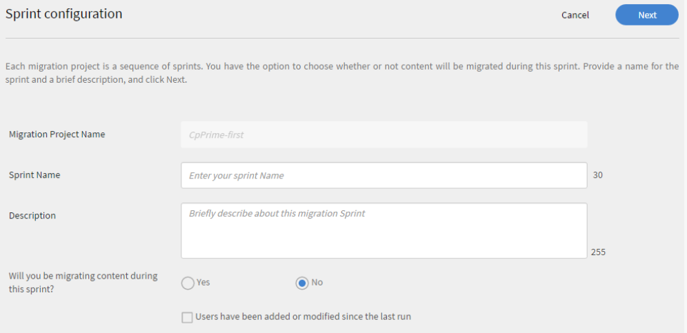

# Guida alla distribuzione di Learning Manager - Sezione 2

## Configurazione tecnica {#technicalsetup}

La configurazione tecnica dell’account Learning Manager è richiesta principalmente per gli utenti aziendali. In questo documento viene illustrata la configurazione dell’accesso Single Sign On per l’organizzazione e l’integrazione di Learning Manager con connettori di terze parti.

### Configurazione Single Sign-On {#configuresinglesignon}

In qualità di Amministratore di sistema nella console di amministrazione, una delle prime attività è definire e impostare un sistema di identità in base al quale gli utenti finali verranno autenticati. Poiché l’organizzazione acquista licenze per Learning Manager, dovrai fornire tali licenze agli utenti finali. Per questo, servirà un modo per autenticare questi utenti finali. Per configurare l’accesso SSO per gli utenti, segui la seguente procedura.

1. Dalla home page di Learning Manager, fai clic su **[!UICONTROL ** Impostazioni **>** Metodi di accesso **.]**

   

1. A seconda del tipo di utente, seleziona **[!UICONTROL ** Utenti interni **o** Utenti esterni **.]**

1. Dal campo a discesa **[!UICONTROL **Accesso**]**, seleziona **[!UICONTROL ** Single Sign-On **.]**

   

1. Per configurare le impostazioni Single Sign-On, fare clic su **[!UICONTROL ** Modifica **.]**

   

1. Nel campo ****[!UICONTROL URL di autenticazione avviata da IDP]**** immetti l’URL di autenticazione fornito dal provider di servizi.

   

1. Fai clic su **[!UICONTROL **Carica **]**accanto al **campo**[!UICONTROL  del **file XML dei metadati IDP **]****e carica il file XML.
1. Fai clic su **[!UICONTROL ** Salva **.]**
1. L’autenticazione SSO è stata configurata correttamente per l’account. Dovresti essere in grado di accedere al tuo account Learning Manager utilizzando l’SSO.

   ***L’SSO configurato in Learning Manager deve supportare SAML 2.0.***

## Migrazione dei dati utente {#migrationofuserdata}

In qualità di amministratore, quando l’azienda acquista Learning Manager, uno dei passaggi fondamentali da eseguire è la migrazione. È fondamentale spostare i contenuti di formazione esistenti e i dati degli utenti in Learning Manager. Il flusso di lavoro di migrazione seguente consente di sfruttare i vantaggi di un sistema LMS moderno e intuitivo senza perdere i dati preesistenti dell’organizzazione.

Learning Manager consente di eseguire la migrazione dal sistema LMS esistente tramite una procedura guidata dettagliata, in sprint iterativi. Ottieni una visibilità completa sullo stato di ogni sprint per garantire che gli Allievi non subiscano tempi di inattività durante la migrazione dei dati legacy in Adobe Learning Manager.

Per eseguire il flusso di lavoro di migrazione, è necessario disporre dei privilegi di Amministratore dell’integrazione. In qualità di Amministratore, puoi assumere il ruolo di Amministratore dell’integrazione oppure assegnare questo ruolo a un altro utente.

**È possibile utilizzare la Guida di Shaleen per creare un&#39;immagine.**

1. Prerequisiti
1. Valutazione dei contenuti esistenti e dei dati degli utenti
1. Esportazione e mappatura dei dati dal sistema LMS esistente
1. Configurazione delle cartelle FTP e BOX per la migrazione
1. Trasferimento degli Allievi in Learning Manager
1. Trasferimento dei contenuti di apprendimento in Learning Manager
1. Trasferimento dei dati rimanenti in Learning Manager

### Prerequisiti {#prerequisite}

Prima di avviare il processo di migrazione, è necessario eseguire i seguenti prerequisiti:

* Estrazione di dati e contenuti dall’LMS in uso e trasformazione dei dati nei formati di file definiti da Learning Manager.
* Importazione di utenti che utilizzano connettori FTP e BOX. L’Amministratore dell’integrazione deve assicurarsi che i connettori siano configurati prima del processo di migrazione.

***Si consiglia che gli Amministratori eseguano una prova del processo di migrazione in un account di prova prima di migrare dati e contenuti nell’ambiente di produzione di Learning Manager. ***

### Valutazione ed esportazione dei dati {#evaluatingandexportingdata}

L’Amministratore dell’integrazione deve innanzitutto esaminare i dati disponibili nel sistema LMS corrente. Come Amministratore dell’integrazione, puoi eseguire la migrazione solo dei seguenti oggetti di apprendimento:

* Modulo
* Corso
* Versione modulo
* Istanza del corso
* Modulo del corso
* Abilità
* Livello di abilità
* Corso abilità
* Certificazione
* Corso per la certificazione
* Commit certificazione
* Programma di apprendimento
* Corso del programma di apprendimento
* Istanza del programma di apprendimento
* Istanza del corso del programma di apprendimento
* Iscrizioni
* Iscrizione certificazione
* Iscrizione programma di apprendimento
* Valutazioni dei corsi degli utenti

Dopo aver valutato i dati esistenti, devi mappare questi dati con le specifiche CSV standard in Learning Manager. Scarica il seguente file di esempio ***csv-specific.zip*** contenente sette fogli Excel necessari per la migrazione. Questi fogli Excel contengono specifiche con descrizioni che consentono di capire come mappare i dati esistenti con i campi nei file .csv.

<!--
<Download link to the zip file>
-->

Verifica che ogni file .csv contenga i dati per ogni campo nel formato prescritto:

<table> 
 <tbody> 
  <tr> 
   <th width="7%" valign="top">
<strong>N.</strong>
</th> 
   <th width="29%" valign="top">
<strong>Nome foglio Excel</strong>
</th> 
   <th width="31%" valign="top">
<strong>Descrizione del contenuto</strong>
</th> 
   <th width="31%" valign="top">
<strong>Note</strong>
</th> 
  </tr> 
  <tr> 
   <td>
1
</td> 
   <td>
module.xlsx
</td> 
   <td>
Metadati per module.csv
</td> 
   <td>
 
</td> 
  </tr> 
  <tr> 
   <td>
2
</td> 
   <td>
course.xlsx
</td> 
   <td>
Metadati per course.csv
</td> 
   <td>
Indica il nome di un Autore per un determinato corso poiché a volte i nomi di più Autori non vengono visualizzati correttamente nell’applicazione in seguito alla migrazione. 
</td> 
  </tr> 
  <tr> 
   <td>
3
</td> 
   <td>
module_version.xlsx 
</td> 
   <td>
Metadati per module_version.csv
</td> 
   <td>
Assicurati di specificare il percorso URL della cartella dell’account Box in cui hai caricato il contenuto. 
</td> 
  </tr> 
  <tr> 
   <td>
4
</td> 
   <td>
course_instance.xlsx
</td> 
   <td>
metadati per course_instance.csv; 
</td> 
   <td> </td> 
  </tr> 
  <tr> 
   <td>
5
</td> 
   <td>
course_module.xlsx
</td> 
   <td>
Metadati per course_module.csv
</td> 
   <td> </td> 
  </tr> 
  <tr> 
   <td>
6
</td> 
   <td>
skill.xlsx
</td> 
   <td>
Metadati per skill.csv
</td> 
   <td> </td> 
  </tr> 
  <tr> 
   <td>
7
</td> 
   <td>
skill_level.xlsx
</td> 
   <td>
Metadati per skill_level.csv
</td> 
   <td> </td> 
  </tr> 
  <tr> 
   <td>
8
</td> 
   <td>
skill_course.xlsx
</td> 
   <td>
metadati per skill_course.csv
</td> 
   <td> </td> 
  </tr> 
  <tr> 
   <td>
9
</td> 
   <td>
Certification.xlsx
</td> 
   <td>
Metadati per Certification.csv
</td> 
   <td> </td> 
  </tr> 
  <tr> 
   <td>
10
</td> 
   <td>
certification_course.xlsx
</td> 
   <td>
Metadati per certification_course.csv
</td> 
   <td> </td> 
  </tr> 
  <tr> 
   <td>
11
</td> 
   <td>
certification_commit.xlsx
</td> 
   <td>
Metadati per certification_commit.csv
</td> 
   <td> </td> 
  </tr> 
  <tr> 
   <td>
12
</td> 
   <td>
learning_program.xlsx
</td> 
   <td>
Metadati per learning_program.csv
</td> 
   <td> </td> 
  </tr> 
  <tr> 
   <td>
13
</td> 
   <td>
learning_program_course.xls 
</td> 
   <td>
Metadati per learning_program_course.csv 
</td> 
   <td> </td> 
  </tr> 
  <tr> 
   <td>
14
</td> 
   <td>
learning_program_instance.xlsx 
</td> 
   <td>
Metadati per learning_program_instance.csv
</td> 
   <td> </td> 
  </tr> 
  <tr> 
   <td>
15
</td> 
   <td>
learning_program_instance_course_instance.xlsx 
</td> 
   <td>
Metadati per learning_program_instance_course_instance.csv
</td> 
   <td> </td> 
  </tr> 
  <tr> 
   <td>
16
</td> 
   <td>
iscrizioni
</td> 
   <td>
Metadati per enrollments.csv
</td> 
   <td> </td> 
  </tr> 
  <tr> 
   <td>
17
</td> 
   <td>
certification_enrollment.xlsx
</td> 
   <td>
Metadati per certification_enrollment.csv
</td> 
   <td> </td> 
  </tr> 
  <tr> 
   <td>
18
</td> 
   <td>
learning_program_enrollment.xlsx
</td> 
   <td>
Metadati per learning_program_enrollment.csv
</td> 
   <td> </td> 
  </tr> 
  <tr> 
   <td>
19
</td> 
   <td>
User_course_grade.xlsx
</td> 
   <td>
Metadati for User_course_grade.csv
</td> 
   <td>
Specifica i dati dei record Allievi richiesti nel file .csv anche se non sono obbligatori. Senza queste informazioni, anche se il file .csv viene elaborato per la migrazione, l’applicazione Learning Manager potrebbe non riflettere alcun dato. 
</td> 
  </tr> 
 </tbody> 
</table>

***Learning Manager supporta solo i valori di data e ora in formato UTF a 8 e 32 bit. È possibile che si verifichino errori durante la migrazione se nei file CSV si specifica una data fuori intervallo come 2038-07-17T08:53:21.000Z o 1980-04-17T08:13:25.322Z.***

### Dipendenze durante l’importazione di dati in file csv {#dependencieswhileimportingdatatocsvfiles}

Durante l’importazione dei dati esistenti nel formato csv standard, tieni presente le seguenti dipendenze:

* module_version.csv dipende da module.csv
* course_instance.csv dipende da course.csv
* course_module.csv dipende da course.csv, module.csv e module_version.csv
* course_instance.csv dipende da course.csv
* enrollment.csv dipende da course.csv
* user_course_grade.csv dipende da course.csv e module.csv
* skill_course.csv dipende da course.csv
* skill_level.csv dipende da skill.csv
* learning_program_instance.csv dipende dal programma di apprendimento e learning_program_course.csv
* learning_program_course.csv dipende da learning_program.csv
* learning_program_enrollment.csv dipende dal programma di apprendimento e learning_program_instance.csv
* learning_program_instance_course_instance.csv dipende da learning_program.csv, learning_program_instance.csv e course_instance.csv
* certification_course.csv dipende da certification.csv e course.csv
* certification_commit.csv dipende da certification.csv e certification_course.csv
* certification_enrollment.csv dipende da certification.csv, certification_course.csv e certification_enrollment.csv

Dopo aver esportato i dati, salva i file .csv nel computer locale. I file sono ora pronti per essere rilasciati nelle cartelle FTP o BOX.

## Configurazione delle cartelle FTP e BOX per la migrazione {#setupftpandboxfoldersforthemigration}

Prima di pianificare e avviare la migrazione effettiva di tutto il contenuto, è necessario configurare prima le cartelle FTP e BOX. Per rilasciare i file .csv in queste cartelle è necessario disporre di queste cartelle. Una volta che il contenuto legacy, sotto forma di file .csv, è disponibile nelle cartelle FTP e BOX, Learning Manager può utilizzare i dati.

### Creazione di un account FTP {#setupanftpaccount}

Nella home page dell’Amministratore dell’integrazione, fai clic su **[!UICONTROL ** Richiedi cartella FTP CSV **.]** Nella finestra di dialogo a comparsa visualizzata, immetti l’ID e-mail. Segui la procedura guidata online per creare l’account FTP Exavault. Una volta creato l’account, puoi visualizzare le cartelle del progetto di migrazione e del progetto di sprint in FTP Exavault.

Come riferimento, ecco un’istantanea della cartella e dei file di progetto di ExaVault:

Una volta configurata correttamente la cartella FTP, il sistema visualizza il messaggio &quot;Impostazione cartella FTP completata&quot;.

## Configurazione di un account Box {#setupaboxaccount}

Per creare un account BOX e creare una cartella BOX, segui i passaggi riportati di seguito:

Nella home page dell’Amministratore dell’integrazione, seleziona Migrazione.

Nella sezione Configurazione, fai clic sulla casella Richiedi cartella.

Nel campo ****[!UICONTROL Immetti e-mail]****, immetti l’ID e-mail in cui desideri ricevere le istruzioni di accesso per la connessione a Box.

Fai clic su **[!UICONTROL ** Connetti **.]**

Riceverai un’e-mail da Box con il collegamento alla cartella condivisa. Se non disponi di un account Box, fai clic su Iscrizione e creane uno. Le istruzioni di accesso vengono poi inviate all’ID e-mail dell’Amministratore dell’integrazione.

Dopo aver salvato la connessione, nella pagina di migrazione viene visualizzato il messaggio: &quot;Impostazione cartella Box completata&quot;.

## Migrazione del contenuto a Learning Manager {#migratingthecontenttocaptivateprime}

Prima di avviare la migrazione, è importante tenere presente quanto segue:

* Solo un progetto di migrazione può essere attivo in un account in qualsiasi momento. All’interno di un progetto, solo uno sprint può essere attivo in un dato momento.
* Non puoi annullare un’esecuzione già in corso. Tuttavia, è possibile utilizzare l’opzione di eliminazione esistente all’interno di ciascuna funzionalità di Learning Manager per annullare qualsiasi migrazione di dati o contenuti.

Non appena viene avviato il progetto di migrazione, lo stato del progetto cambia in &quot;Migrazione in corso&quot;. In questo stato, nessun altro utente oltre all’Amministratore dell’integrazione può accedere a Learning Manager.

Caricamento dei contenuti di formazione nelle cartelle di contenuto:

Nella home page dell’Amministratore dell’integrazione, seleziona **[!UICONTROL Migrazione.]**

Nella home page della migrazione, vengono visualizzati i progetti di migrazione già creati nell’organizzazione.

Fai clic su **[!UICONTROL **Nuovo**]**in alto a destra nella pagina, per creare un progetto di migrazione.

***Se non hai già creato una cartella FTP, ti verrà chiesto di creare un account Exavault della cartella FTP. Si tratta di un passaggio obbligatorio prima di iniziare a creare un progetto di migrazione. ***

Nella pagina ****[!UICONTROL Crea un nuovo progetto di migrazione]**** specifica il nome del progetto.

Specifica un tag per il progetto, il catalogo del corso e fornisci una descrizione del progetto di migrazione. Gli elementi dei dati di migrazione vengono identificati utilizzando il tag del progetto di migrazione. Se non disponi di un catalogo dei corsi specifico, seleziona il catalogo predefinito dal menu a discesa, tutti i corsi che vengono migrati utilizzando un progetto di migrazione saranno inclusi nel catalogo selezionato in questa fase. Se non viene selezionato nessun catalogo, tutti i corsi migrati faranno parte del catalogo predefinito.

Fai clic su **[!UICONTROL Crea.]**

Nella pagina Configurazione sprint, crea uno sprint per il progetto di migrazione. Nel processo di migrazione di Learning Manager, uno sprint definisce un set di elementi di migrazione che si desidera migrare dall’LMS esistente.

Specifica un nome per lo sprint e fornisci una descrizione dello sprint.

Seleziona la casella di controllo ****[!UICONTROL Gli utenti sono stati aggiunti o modificati dall’ultima esecuzione]****, per sincronizzare l’elenco di utenti con l’applicazione Learning Manager. Se stai eseguendo la migrazione di contenuti e dati all’applicazione Learning Manager, questa operazione potrebbe non essere richiesta. Tuttavia, qualora sia trascorso un certo intervallo di tempo tra la precedente migrazione sprint e l’ultima, è consigliabile effettuare la sincronizzazione dell’elenco degli utenti. Questo passaggio consente la sincronizzazione del database Learning Manager con gli utenti dell’LMS.

***La sincronizzazione è consigliata durante la migrazione di enrollment.csv e user_course_grade.csv. Questo passaggio consente la sincronizzazione del database Learning Manager con il database di migrazione e garantisce che tutti gli utenti i cui record devono essere migrati nello sprint siano disponibili nel database di migrazione.***

Fai clic su **[!UICONTROL ** Avanti **.]**

Fai clic su **[!UICONTROL **Avvia**]**per avviare la migrazione sprint con i dati e i contenuti caricati. Fai clic su ****[!UICONTROL Aggiorna]**** prima di avviare l’esecuzione dello sprint per sincronizzare le cartelle FTP e dei contenuti con Learning Manager.

Puoi fare clic su ****[!UICONTROL Arresta]****in qualsiasi momento durante il processo di migrazione sprint per interrompere la migrazione.

Lo stato della migrazione viene visualizzato per ciascuno dei contenuti e degli elementi dati dello sprint. Verifica il numero di elementi riusciti e non riusciti nell’ambito dell’esecuzione di uno sprint di migrazione.

Se stai caricando il contenuto di un modulo, assicurati che il percorso della cartella del contenuto sia specificato nel file *module_version.csv *. Se dimentichi questo passaggio, potrebbero verificarsi errori durante la migrazione. Ad esempio, per caricare i contenuti di un modulo di autoformazione, come video, è necessario specificare il relativo percorso URL Box nel file *module_version.csv *.

Come riferimento, viene di seguito fornita un’istantanea dello stato di avanzamento della migrazione. Come mostrato nell’istantanea, è possibile visualizzare il numero dei record elaborati per ciascun elemento dati di migrazione insieme allo stato degli elementi riusciti e non riusciti. Fai clic su Scarica record degli errori confrontandoli con gli elementi non riusciti per scaricare e visualizzare i registri degli errori. È possibile correggere i problemi in CSV e ricaricare su FTP.

Per visualizzare l&#39;elenco di tutti gli sprint di un progetto di migrazione, fai clic su **[!UICONTROL **Sprint**]**nel riquadro di navigazione a sinistra. È possibile visualizzare un elenco di tutti gli sprint, il numero di esecuzioni per ciascuno sprint, la data di inizio, la durata e lo stato di completamento, come mostrato nell’istantanea di esempio riportata di seguito.

Per visualizzare l&#39;elenco di tutti gli sprint di un progetto di migrazione, fai clic su **[!UICONTROL **Sprint**]**nel riquadro di navigazione a sinistra. È possibile visualizzare un elenco di tutti gli sprint, il numero di esecuzioni per ciascuno sprint, la data di inizio, la durata e lo stato di completamento, come mostrato nell’istantanea di esempio riportata di seguito.

Per visualizzare l&#39;elenco di tutti gli sprint di un progetto di migrazione, fai clic su **[!UICONTROL **Sprint**]**nel riquadro di navigazione a sinistra. È possibile visualizzare un elenco di tutti gli sprint, il numero di esecuzioni per ciascuno sprint, la data di inizio, la durata e lo stato di completamento, come mostrato nell’istantanea di esempio riportata di seguito.

***Prima di contrassegnare il progetto di migrazione come completato, assicurati che tutti gli sprint nel progetto siano stati completati. Dopo aver contrassegnato il progetto di migrazione come completato, non è possibile tornare indietro e creare eventuali sprint in tale progetto né apportare modifiche al progetto stesso. Puoi solo creare un altro progetto di migrazione e aggiungervi sprint.***

Dopo aver eseguito la migrazione dei dati e dei contenuti di formazione dall’LMS legacy della tua organizzazione, verifica che i dati e i contenuti siano stati importati correttamente. Puoi effettuare la verifica accedendo come Amministratore e verificando la disponibilità dei dati e contenuti dei moduli e corsi importati

Per informazioni utili sulla migrazione, fai riferimento ai seguenti contenuti:

* Risoluzione dei problemi di migrazione
* Domande frequenti sul caricamento di CSV

