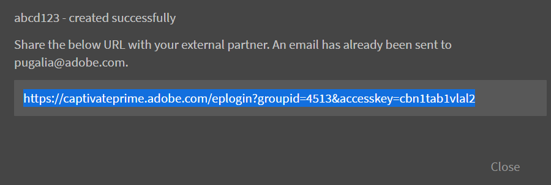
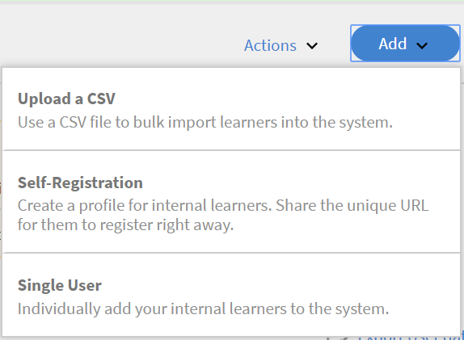
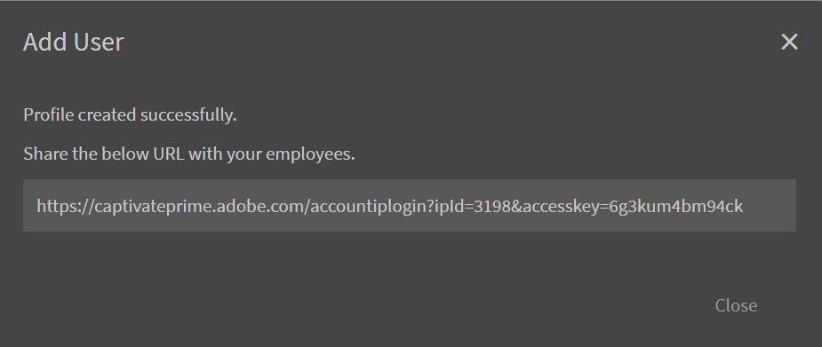

# Configurazione degli utenti in Learning Manager

## Utenti interni ed esterni {#internalandexternalusers}

In qualsiasi LMS, incluso Learning Manager, la gestione degli utenti è un aspetto importante. Learning Manager consente di classificare gli utenti come interni ed esterni. Gli utenti interni sono gli utenti che appartengono a un&#39;organizzazione specifica o a un gruppo. In genere, gli utenti di un&#39;azienda sono utenti interni. Questi utenti dispongono di oggetti di apprendimento specifici con scadenze specifiche, assegnati dai loro manager o dall’amministratore.

Al contrario, gli utenti esterni sono in genere utenti temporanei di uno specifico account Learning Manager. Questi utenti possono accedere a oggetti di apprendimento specifici facendo clic su un collegamento esterno temporaneo ricevuto tramite e-mail. I profili utente esterni hanno in genere una data di scadenza. Ad esempio, un’organizzazione che conduce certificazioni per Java può avere qualsiasi utente che accede temporaneamente ai corsi pertinenti e quindi tenta la certificazione. Di solito, anche i corsi di formazione in aula e i corsi destinati a utenti esterni hanno una capacità limitata.

Continua a leggere per scoprire come aggiungere utenti interni ed esterni in Learning Manager.

## Configurare gli utenti esterni {#setupexternalusers}

In qualità di Amministratore, puoi aggiungere utenti esterni, ad esempio dipendenti di organizzazioni partner, all’account Learning Manager. Per aggiungere utenti esterni:

1. Dal **[!UICONTROL **Amministratore**]**pagina di accesso, fai clic su **[!UICONTROL **Utenti**]**nel riquadro di navigazione a sinistra.
1. Nel **[!UICONTROL **Utenti**]**pagina, fare clic su **[!UICONTROL **Esterno**]**nel riquadro di navigazione a sinistra. Il sistema visualizza la pagina Utenti esterni con un elenco di utenti esterni (se applicabile).
1. Fai clic su **[!UICONTROL **Aggiungi**]**in alto a destra nella pagina.

   

1. Nel **[!UICONTROL **Aggiungi utente**]**finestra di dialogo a comparsa, i seguenti campi sono obbligatori:

   * **[!UICONTROL **Nome profilo**:]**Specificare il nome del profilo esterno che si sta creando.
   * **[!UICONTROL ** E-mail del manager **:]** Specifica l’indirizzo e-mail del manager per l’utente esterno.
   * **[!UICONTROL ** Posti assegnati **:]** Specifica il numero di Allievi che possono iscriversi al corso.
   * **[!UICONTROL ** Scadenza **:]** Specifica la data di scadenza dopo la quale un utente esterno non può registrare o utilizzare il corso.

1. Fai clic **[!UICONTROL ** Impostazioni avanzate **.]**
1. Facoltativamente, imposta le seguenti opzioni quando crei un profilo esterno:

   * **[!UICONTROL ** Aggiungi immagine **:]** Trascinare l&#39;immagine desiderata. Questa immagine viene visualizzata agli utenti nella pagina Allievo.
   * **[!UICONTROL ** Requisiti di accesso **:]** Specifica il numero di giorni entro cui l&#39;utente deve accedere. Se l’utente esterno supera questo periodo di accesso, l’Allievo non può accedere né utilizzare l’oggetto di apprendimento.
   * **[!UICONTROL ** Domini consentiti **:]** Specifica i domini separati da una virgola. Solo gli utenti con i domini specificati possono registrarsi all&#39;account.
   * **[!UICONTROL ** Verifica e-mail richiesta **:]** Seleziona questa casella di controllo se desideri inviare un’e-mail di verifica agli utenti

1. Fai clic su **[!UICONTROL Salva.]**

   

   Viene visualizzata una finestra a comparsa con l’URL. Puoi copiare questo URL e inviarlo agli utenti esterni. Per impostazione predefinita, all’utente viene inviato un messaggio e-mail con questo URL.

1. Quando si aggiungono profili esterni, questi vengono visualizzati nel **[!UICONTROL ** Pagina Utenti esterni **(** Amministratore **>** Utenti **>** Esterno **).]** Per questi utenti vengono visualizzati anche il limite di partecipanti, la data di scadenza e il requisito di accesso.
1. Per modificare le impostazioni di un utente esterno in qualsiasi momento, fai clic sul nome dell’utente. Viene visualizzata la finestra di dialogo **[!UICONTROL Modifica iscrizione esterna]**. Modificate le impostazioni e fate clic su **[!UICONTROL ** Salva **.]**
1. Puoi anche inviare nuovamente l’e-mail di benvenuto o copiare l’URL in qualsiasi momento facendo clic sulle icone dell’URL di copia/e-mail accanto al profilo esterno.

   

## Mettere in pausa il profilo utente esterno {#pausetheexternaluserprofile}

Dopo l’aggiunta di un gruppo utenti esterni a Learning Manager, puoi inoltre mettere in pausa la procedura di registrazione degli utenti esterni. Quando la metti in pausa, la procedura di registrazione degli utenti esterni viene bloccata. Tuttavia, questo processo funziona solo quando gli utenti non sono ancora stati registrati accettando l’invito.

Per sospendere i gruppi di utenti esterni, fai clic su **[!UICONTROL **Azioni**]**dall’angolo superiore destro della pagina, quindi scegli **[!UICONTROL Pausa]**.

## Riprendere il profilo utente esterno {#resumeexternaluserprofile}

Puoi sempre revocare il blocco (pausa) in qualsiasi momento scegliendo l’opzione Riprendi. Fai clic su **[!UICONTROL **Azioni**]**nell’angolo in alto a destra della pagina, quindi scegli **[!UICONTROL Riprendi]**.

**[!UICONTROL Stati utente esterno]**

In Learning Manager, i seguenti stati sono applicabili agli utenti esterni:

* **Stato inattivo** - In questo stato, la registrazione degli utenti esterni è scaduta. Gli Amministratori impostano la data di scadenza per gli utenti esterni durante l’aggiunta mediante il flusso di lavoro dell’utente.
* **Stato attivo** - In questo stato, gli utenti esterni possono registrarsi all’applicazione Learning Manager ed effettuare l’accesso.
* **Pausa**: in questo stato, il processo di registrazione per gli utenti esterni viene bloccato. Tuttavia, gli utenti esistenti possono continuare ad accedere.

## Configurare gli utenti interni {#setupinternalusers}

In qualità di amministratore, potresti voler configurare gli utenti per la tua azienda o organizzazione. Questi utenti sono anche chiamati utenti interni. Gli utenti interni possono accedere all’applicazione utilizzando il Single Sign-On o l’ID Adobe. Questi utenti possono quindi accedere e utilizzare gli oggetti di apprendimento in base alle loro esigenze. Per configurare utenti interni per un&#39;organizzazione, sono disponibili tre metodi:

* Aggiunta di utenti in blocco mediante un file CSV
* Aggiunta di utenti tramite registrazione autonoma
* Aggiunta di un singolo utente interno

## Aggiunta di utenti tramite un file CSV {#addingusersusingacsvfile}

Puoi scegliere questo metodo per aggiungere utenti interni se il numero di utenti è elevato. Quando utilizzi un file CSV per aggiungere utenti per la prima volta, devi mappare il contenuto dei dati CSV alle etichette dell’applicazione. Successivamente, quando si aggiungono nuovi utenti o si aggiornano i dati utente, viene mantenuta la stessa mappatura. Per aggiungere utenti interni in blocco:

1. Nella **[!UICONTROL Home page Amministratore]** , fare clic su **[!UICONTROL **Utenti**]**nel riquadro di navigazione a sinistra.
1. Fai clic **[!UICONTROL ** Aggiungi **>** Caricare un file CSV **.]**
1. Nella finestra a comparsa, fai clic su **[!UICONTROL ** Importa **.]**
1. Trova il percorso in cui hai salvato il file CSV. Fai clic su **[!UICONTROL Apri]**.
1. Importa il file CSV e mappa il contenuto del file CSV alle etichette dell’applicazione. Questo passaggio deve essere eseguito solo quando carichi il file CSV per la prima volta.
1. Fai clic su **[!UICONTROL **Salva**]**per salvare la mappatura.
1. Fai clic su **[!UICONTROL **Aggiungi**]**per caricare il file CSV già mappato ai dati dell’applicazione.

### Considerazioni da fare durante la creazione del file CSV da caricare: {#considerationswhencreatingthecsvfileforupload}

Quando crei il file CSV per caricare gli utenti interni, i seguenti sono alcuni dei campi obbligatori per i quali devi inserire i dati: Nome del dipendente, E-mail del dipendente, Profilo o designazione del dipendente e Gerarchia dei manager.

Il nome e l’indirizzo e-mail di ciascun dipendente possono essere mappati direttamente ai dati dell’applicazione. Tieni presente che è necessario specificare un indirizzo e-mail specificato nel file CSV come E-mail del Manager. Puoi definire l’ID Manager al momento della creazione del file CSV o specificare l’ID e-mail che corrisponde all’ID Manager al momento del caricamento del file CSV.

***Prima di aggiungere un ID come ID Manager di un dipendente, assicurati che il Manager sia aggiunto come dipendente nel file CSV.***

***Verifica che non vi siano spazi aggiuntivi tra le voci per caricare correttamente il file CSV.***

Per un’istantanea di un file CSV consulta questa pagina:

Per scaricare un file CSV di esempio `<give link to zip file>`.

<!--Zip file reference, no source file-->

### Configurazione dell&#39;utente root {#settinguprootuser}

Automazione dell’importazione in blocco degli utenti.

## Aggiunta di utenti tramite registrazione autonoma {#addingusersthroughselfregistration}

Oltre ad aggiungere utenti interni in blocco, puoi anche aggiungere utenti tramite registrazione autonoma. Puoi utilizzare la registrazione autonoma per consentire ai dipendenti di registrarsi come Allievi all’account Learning Manager. Quando crei un profilo di registrazione autonoma, viene creato un URL univoco. Condividi questo URL con il dipendente per consentirgli la registrazione in Learning Manager.

1. Nella **[!UICONTROL Home page Amministratore]** pagina, fare clic su **[!UICONTROL Utenti]** nel riquadro di navigazione sinistro.
1. Fai clic **[!UICONTROL ** Aggiungi **>** Registrazione autonoma **.]**

   

1. Nella finestra di dialogo a comparsa **[!UICONTROL Aggiungi utente]**, specifica il nome del dipendente nel campo **[!UICONTROL Nome profilo]**.
1. Nella **[!UICONTROL Nome del manager]** immettere il nome del responsabile del dipendente.
1. Facoltativamente, è possibile aggiungere l&#39;immagine del profilo del dipendente utilizzando il campo **[!UICONTROL Aggiungi immagine]**.
1. Fai clic su **[!UICONTROL Salva]**.

   

   Il sistema visualizza un&#39;altra finestra a comparsa contenente il messaggio che il profilo è stato creato correttamente. In questa finestra di dialogo viene generato anche un URL univoco.

1. Condividi questo URL con il dipendente per consentire al dipendente di registrarsi autonomamente come Allievo.

   

## Aggiungere i singoli utenti in Learning Manager {#addsingleusersincaptivateprime}

L’aggiunta di utenti singoli è il terzo metodo che consente di aggiungere utenti interni all’account. Se desideri aggiungere non molti utenti, questa procedura è ideale. Per aggiungere un singolo utente:

1. Dalla pagina Home dell’**[!UICONTROL Amministratore]**, fai clic su **[!UICONTROL Utenti]** nel riquadro di navigazione sinistro.
1. Fai clic **[!UICONTROL ** Aggiungi **>** Utente singolo **.]**

1. Nella finestra di dialogo a comparsa Aggiungi utente, specifica i seguenti dettagli per gli utenti:

   * **[!UICONTROL Nome]** **[!UICONTROL :]** Specificare il nome del dipendente o dell&#39;utente interno. Questo campo è obbligatorio.

   * **[!UICONTROL E-mail]** **[!UICONTROL :]** Specifica l&#39;ID e-mail del dipendente. Questo campo è obbligatorio.

   * **[!UICONTROL Profilo]** **[!UICONTROL :]** Specificare la qualifica o il titolo professionale del dipendente.

   * **[!UICONTROL ** Nome del manager **:]** Specifica il nome del Manager. Il manager deve essere già stato aggiunto al database da specificare qui.
   * **[!UICONTROL ** DOJ **:]** Specificare la data di unione del dipendente.
   * **[!UICONTROL **Posizione**:]**Specificare l&#39;ubicazione del dipendente. Ad esempio, se l&#39;organizzazione è ubicata in diverse località geografiche, specifica la località in cui si trova il dipendente.

   

1. Fai clic su **[!UICONTROL Aggiungi]**.
1. Il sistema visualizza un messaggio che indica che l&#39;utente è stato aggiunto correttamente. L’utente riceve un link di verifica nell’ID e-mail specificato. L’utente può fare clic su questo link per attivare il suo account e iniziare ad accedere a Learning Manager.

   

## Gestione dei gruppi di utenti in Learning Manager {#managingusergroupsincaptivateprime}

Il gruppo di utenti non è altro che un insieme di utenti appartenenti a una categoria definita. In qualità di Amministratore, puoi utilizzare i gruppi di utenti per selezionare rapidamente gli Allievi in base ai loro attributi. Inoltre, puoi assegnare rapidamente loghi o cataloghi al gruppo di utenti e generare report personalizzati sull’avanzamento.

In Learning Manager sono disponibili due tipi di gruppi di utenti: personalizzati e generati automaticamente. Quando aggiungi gli Allievi all’account, vengono creati automaticamente alcuni gruppi predefiniti in base ai ruoli e alle proprietà degli utenti dell’account. Questi gruppi vengono generati automaticamente. Ad esempio, un gruppo con tutti gli Allievi o tutti gli Autori.

***Non è possibile modificare il nome e la descrizione dei gruppi generati automaticamente.***

Per visualizzare i gruppi di utenti generati automaticamente in Learning Manager, fai clic su **[!UICONTROL Generato automaticamente]**. L’applicazione visualizza un elenco di tutti i gruppi di utenti generati automaticamente disponibili per il tuo account.

Puoi anche creare gruppi personalizzati con un elenco selezionato di utenti in Learning Manager. I gruppi personalizzati consentono di specificare un nome, una descrizione e gli attributi per il gruppo di utenti. I gruppi personalizzati creati in Learning Manager sono di natura dinamica. Questo significa che se i nuovi utenti vengono aggiunti con attributi simili, vengono aggiunti automaticamente a questi gruppi di utenti.

## Creare gruppi di utenti personalizzati {#createcustomusergroups}

1. Nella pagina Home dell’Amministratore di Learning Manager, fai clic su **[!UICONTROL Utenti]**.
1. Nella pagina Gruppi di utenti personalizzati fare clic su **[!UICONTROL **Aggiungi**]**dall’angolo in alto a destra della pagina.

   Il sistema visualizza la finestra di dialogo **[!UICONTROL Aggiungi gruppo di utenti]**.

   

1. Specifica il nome e la descrizione del gruppo di utenti. Ad esempio, Dev-Users che include utenti del team di sviluppo del prodotto.
1. Aggiungere utenti al gruppo di utenti personalizzato immettendo il nome utente o il profilo dell&#39;utente nel **[!UICONTROL ** Aggiungi utenti **campo.]**
1. Per aggiungere altri utenti al gruppo personalizzato, fare clic su **[!UICONTROL ** Aggiungi altri utenti **.]**
1. Dopo aver aggiunto tutti gli utenti, fai clic su **[!UICONTROL Salva]**per salvare il gruppo di utenti personalizzato.

