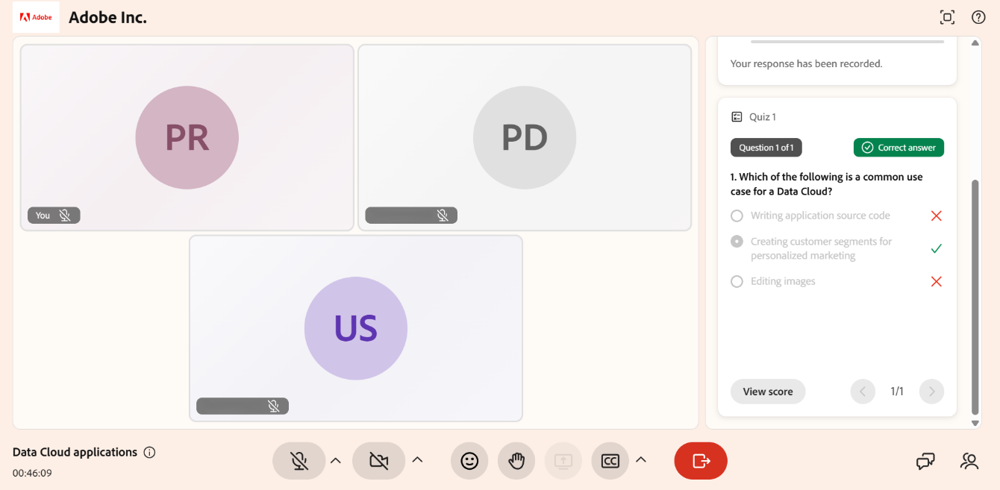

# Tentativo di quiz

I quiz consentono di valutare il contenuto della sessione. Quando un Istruttore avvia un quiz, questo viene visualizzato nell’interfaccia della sessione in cui è possibile rispondere alle domande e inviare le risposte.

Le risposte vengono salvate automaticamente durante l’avanzamento del quiz. Se l’Istruttore imposta un limite di tempo, il tempo rimanente viene visualizzato da un timer. Dopo aver inviato il quiz, potresti essere in grado di visualizzare il tuo punteggio e rivedere le risposte corrette e errate, a seconda delle impostazioni dell&#39;host.

Questo articolo spiega come rispondere a un quiz, inviare le risposte e rivedere i risultati.

## Partecipa al quiz

Potete avviare il quiz immediatamente e rispondere alle domande mentre la sessione è in corso.

Per provare a rispondere a un quiz:

1. Seleziona **Partecipa al quiz** quando viene visualizzato il quiz.

1. Seleziona la tua risposta.

1. Seleziona **Invia**. Le risposte vengono inviate per la valutazione.

Se è stato impostato un limite di tempo, il tempo rimanente viene visualizzato durante il tentativo di quiz. Puoi passare da una domanda all’altra in base alle esigenze prima di inviarla.

*Interfaccia della scheda del quiz che mostra le istruzioni prima di iniziare il quiz.*

## Verifica il tentativo di quiz

Dopo l&#39;invio, puoi rivedere un riepilogo del tentativo. Il riepilogo mostra il numero di domande che hai tentato e lo stato di completamento del quiz.

Se l’Istruttore l’ha abilitato, puoi anche rivedere le tue risposte dopo l’invio. Ciò consente di visualizzare il punteggio, le risposte selezionate e di identificare le risposte corrette e non corrette.

*Seleziona Visualizza punteggio per visualizzare le risposte corrette e non corrette.*
