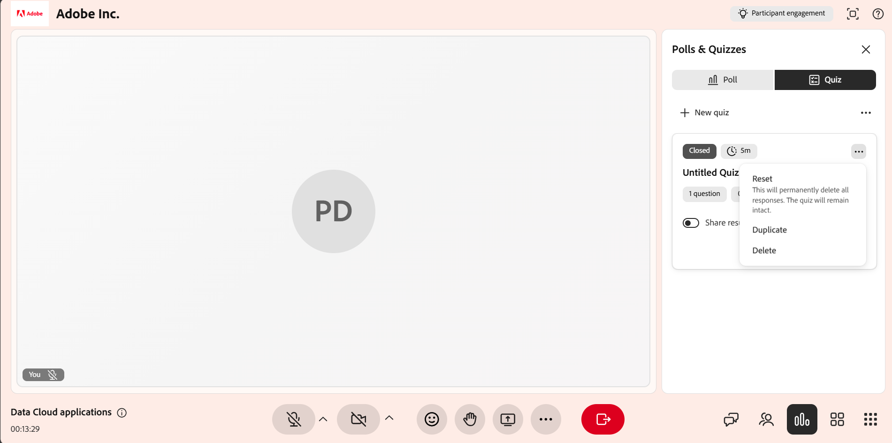

# Creare e gestire un quiz

In qualità di Istruttore, la funzione Quiz consente di misurare il grado di comprensione di un argomento da parte degli Allievi durante una sessione Hub dal vivo. A differenza di un rapido sondaggio condotto su una singola domanda, un quiz consente di creare una valutazione strutturata e multipla con domande a scelta multipla e risposte multiple, punteggi e impostazioni quali limiti di tempo e domande o ordini di opzioni casuali.

Questo articolo descrive tutte le azioni del quiz disponibili per gli Istruttori, dalla creazione di un quiz alla condivisione dei risultati.

## Crea un quiz

È possibile creare un quiz per valutare la comprensione dell’Allievo durante una sessione. I quiz possono includere diversi tipi di domande e punteggi di supporto per tenere traccia delle prestazioni. Se non sono disponibili quiz, puoi crearne uno nuovo dalla scheda **Quiz**.

Per creare un quiz:

1. Seleziona la scheda **Quiz** dal pannello **Sondaggi e quiz**.

   
   *Selezionare la scheda Quiz dal pannello Sondaggi e quiz.*

1. Seleziona **Crea nuovo quiz**. Viene aperto un nuovo quiz dal titolo **Quiz senza titolo 1**.

1. Nel campo domanda, inserisci la tua domanda.

1. Immettere le opzioni di risposta nei campi Opzione. Per impostazione predefinita sono disponibili tre opzioni. È possibile:

   1. Selezionare **+ Aggiungi opzione** per aggiungere un&#39;altra opzione.

   1. Seleziona **X** accanto a un&#39;opzione per rimuoverla.

   1. Trascina la maniglia accanto a un&#39;opzione per riordinarla.

1. Contrassegnare la risposta corretta:

   1. Per impostare una singola risposta corretta, selezionare il pulsante di opzione accanto all&#39;opzione corretta.

   1. Per consentire più di una risposta corretta, attivare l&#39;interruttore **Più risposte corrette**, quindi selezionare il pulsante di scelta per ogni opzione corretta.

1. Per aggiungere altre domande, seleziona **+ Aggiungi domanda**.

   
   *Interfaccia della scheda del quiz che mostra l’opzione per creare un quiz.*

1. Seleziona **Fine**.

1. Seleziona **Salva**. Il quiz è ora disponibile per l’avvio.

## Impostare un limite di tempo per il quiz

È possibile impostare un limite di tempo opzionale in modo che gli Allievi debbano completare il quiz entro una durata fissa. Il limite di tempo viene impostato dal timer nella parte superiore del quiz.

Per impostare un limite di tempo:

1. Seleziona l’icona Timer nella parte superiore del quiz.

1. Abilita **Imposta limite di tempo**.

1. Imposta la durata in minuti.

*Interfaccia della scheda del quiz che mostra l’opzione per impostare il limite di tempo del quiz.*

## Modificare un quiz

Aggiornate le domande, modificate le opzioni di risposta o riordinate le domande prima di avviare il quiz. Una volta avviato, il quiz non può essere modificato.

Per modificare un quiz:

1. Seleziona la scheda **Quiz**.

1. Seleziona il quiz da modificare.

1. Seleziona l’icona di modifica (matita).

1. Effettuate una delle seguenti operazioni:

   1. Modifica il testo della domanda.

   1. Aggiornare o rimuovere le opzioni di risposta.

   1. Selezionare le risposte corrette.

   1. Aggiungi una nuova domanda utilizzando **Aggiungi domanda**.

   1. Elimina una domanda se non è più necessaria.

   
   *Interfaccia della scheda del quiz che mostra l’opzione per modificare un quiz.*

1. Seleziona **Salva** per applicare le modifiche.

## Avvia un quiz

Dopo aver creato e salvato un quiz, questo viene visualizzato nella scheda **Quiz** con etichetta **Nuovo**. L’avvio rende il quiz visibile agli Allievi e consente loro di rispondere alle domande in tempo reale.

Per avviare un quiz:

1. Seleziona la scheda **Quiz**.

1. Dall’elenco dei quiz salvati, seleziona **Avvia quiz**.

Quando avvii un quiz, questo viene visualizzato nel pannello **Sondaggi e quiz** in cui gli Allievi possono rispondere. Se è stato impostato un limite di tempo, puoi anche estendere la durata del quiz selezionando **+1 min** durante il quiz dal vivo.

*Interfaccia della scheda del quiz che mostra il quiz avviato per i partecipanti.*

>[!NOTE]
>Se si verifica un errore durante la creazione o l&#39;avvio di un quiz, consulta la [Guida alla risoluzione dei problemi per Live Hub](../kb/troubleshooting-guide-for-live-hub.md#quiz-tab-issues) per un elenco dei messaggi di errore comuni e per informazioni su come risolverli.

## Visualizza i risultati del quiz

Visualizzare i risultati del quiz durante e dopo una sessione per monitorare le prestazioni e la partecipazione degli Allievi. I risultati vengono aggiornati in tempo reale mentre gli Allievi tentano di completare il quiz.

Per visualizzare i risultati del quiz:

1. Da , seleziona la scheda **Quiz**.

1. Passa al quiz attivo o completato.

1. Selezionare **Visualizza risultati**.

*L’interfaccia della scheda del quiz mostra l’opzione Visualizza dettagli per accedere e visualizzare i risultati del quiz.*

Il pannello **Quiz** mostra i risultati con i seguenti dettagli:

* Profili Allievo

* Numero di domande

* Punteggi

* Tempo impiegato per completare il quiz

## Visualizzare risposte dettagliate per un partecipante

Selezionare un singolo partecipante dall&#39;elenco dei risultati per visualizzare risposte dettagliate. Puoi vedere come l’Allievo ha risposto a ciascuna domanda.

*Finestra a comparsa delle risposte ai quiz che mostra i risultati dettagliati per un Allievo.*

## Chiudi un quiz

Utilizza questa opzione per terminare un quiz attivo quando gli Allievi hanno completato le risposte o quando desideri interrompere l’invio.

Per chiudere un quiz:

1. Seleziona **Chiudi quiz**. Il quiz si interrompe immediatamente per tutti gli Allievi.

1. Lo stato del quiz viene aggiornato a **Chiuso**.

*Interfaccia della scheda del quiz che mostra lo stato Chiuso del quiz.*

## Condivisione dei risultati dei quiz con i partecipanti

È possibile condividere i risultati del quiz con i partecipanti al termine o alla chiusura del quiz. Per rendere i risultati visibili a tutti, attiva l&#39;interruttore **Condividi risultati con i partecipanti**.

Quando la condivisione dei risultati è abilitata, il quiz è etichettato con un tag **Risultati in tempo reale**. Ciò significa che i risultati vengono visualizzati dagli Allievi.

*Abilita la condivisione dei risultati con i partecipanti per condividere i risultati con gli Allievi.*

## Gestire un quiz

Puoi gestire un quiz salvato o chiuso dalle relative opzioni (**...**) nel pannello **Sondaggi e quiz**. Queste opzioni consentono di cancellare le risposte, riutilizzare il quiz o rimuoverlo dalla sessione.

Per gestire un quiz:

1. Da , seleziona la scheda **Quiz**.

1. Passa al quiz e seleziona le opzioni (**...**) menu.

   
   *Interfaccia della scheda del quiz che mostra l’opzione per ripristinare, duplicare ed eliminare un quiz.*

1. Selezionate una delle seguenti opzioni:

| **Opzione** | **Descrizione** |
|----|----|
| **Ripristina** | Elimina definitivamente tutte le risposte al quiz mantenendo intatto il quiz stesso. Usa questa opzione per eseguire nuovamente lo stesso quiz e raccogliere un nuovo set di risposte. |
| **Duplicato** | Crea una copia del quiz, comprese le domande e le opzioni di risposta, in modo da poterlo riutilizzare o regolare senza doverlo creare nuovamente da zero. |
| **Elimina** | Rimuove definitivamente il quiz e tutte le sue risposte dalla sessione. Questa azione non può essere annullata. |
