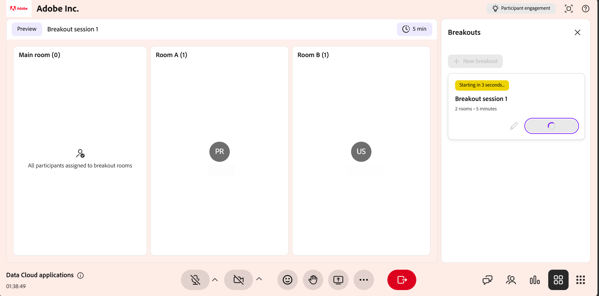
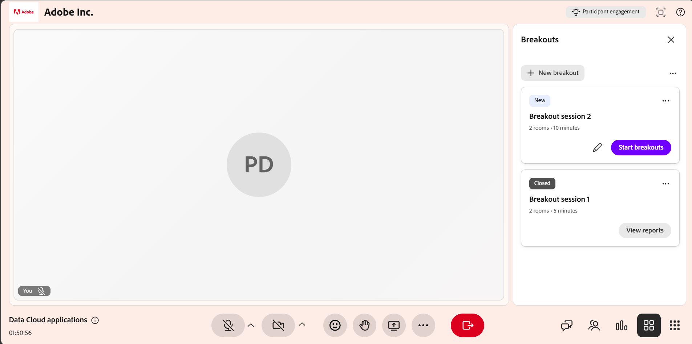

# Creare e gestire le sessioni di breakout

Gli istruttori possono dividere una sessione di Hub live in gruppi più piccoli e interattivi per attività e discussioni mirate. È possibile creare breakout room, assegnare automaticamente o manualmente gli Allievi, impostare le istruzioni sulle attività e controllare la durata della sessione. Quando è attiva una sessione di breakout, puoi monitorare le stanze con riepiloghi generati dall&#39;intelligenza artificiale, unirti a una stanza per condividere lo schermo o la chat ed estendere la sessione.

Questa guida descrive tutte le azioni disponibili per gli Istruttori, dalla creazione di una sala alla revisione del report della sessione.

## Creare una sessione di breakout

Le sessioni di analisi stratificata dividono una classe virtuale in gruppi interattivi più piccoli. Seguite questi passaggi per crearne uno.

Per creare una sessione di breakout:

1. Selezionare  dalla barra dei controlli.

   
   *Interfaccia Hub dal vivo che mostra il pannello Breakout.*

1. Selezionare **Imposta una sessione di breakout**.

Viene visualizzato il pannello Breakouts. Da qui, è possibile configurare le breakout room, assegnare gli Allievi e gestire le impostazioni delle sessioni breakout.

>[!NOTE]
>Se la sessione di breakout non viene avviata, consulta la [Guida alla risoluzione dei problemi per Live Hub](../kb/troubleshooting-guide-for-live-hub.md#breakout-session-issues) per un elenco di messaggi di errore comuni e come risolverli.

## Progettare una sessione di breakout

Prima di avviare una sessione di breakout, configurare le sale, assegnare gli Allievi e definire i dettagli dell’attività utilizzando il pannello **Breakouts**. Una configurazione corretta aiuta gli Allievi a posizionarsi correttamente e a comprendere l’obiettivo di ogni attività di breakout.

Per progettare una sessione di breakout:

1. Selezionare  dalla barra dei controlli.   Viene visualizzato il pannello Breakouts.

   
   *Pannello Breakouts che mostra le opzioni per la configurazione delle breakout room.*

1. Configurare le sale riunioni utilizzando le opzioni seguenti:

| **Opzione** | **Descrizione** |
|----|----|
| Icona Modifica | Selezionate l&#39;icona di modifica per rinominare la sessione di breakout. |
| **Camere** | Impostate il numero di stanze di breakout utilizzando i controlli per l&#39;aumento o la riduzione. Il massimo consentito è di **10** stanze. |
| **Durata** | Definire la durata di esecuzione della sessione di interruzione. La durata minima è **5 minuti** e la durata massima è **60 minuti**. |
| **Assegna partecipanti** | Selezionare **Assegnazione automatica** per assegnare automaticamente i partecipanti alle room. Puoi anche trascinare e rilasciare un Allievo per spostarlo in un’altra stanza. |
| **Impostato singolarmente per le stanze** | Personalizza le istruzioni separatamente per ogni sala stampa. |
| **Istruzioni** | Descrivi l&#39;attività e delinea il risultato previsto per la sessione di breakout. |
| **Visualizza allocazioni stanze** | Anteprima di come gli Allievi verranno distribuiti nelle sale stampa prima dell’inizio della sessione. |
| **Avvia interruzioni** | Avvia la sessione di breakout e sposta gli Allievi nelle stanze assegnate. |
| Icona Elimina | Ignorare la configurazione di interruzione corrente senza salvare le modifiche. |

1. Seleziona **Salva**.   La sessione di breakout viene visualizzata nel pannello **Breakouts** con un tag **New**.

## Avvia una sessione di breakout

Una volta configurata e salvata, la sessione di breakout viene visualizzata nel pannello **Breakouts**. Avvia la sessione per spostare gli Allievi nelle stanze assegnate.

Per avviare una sessione di breakout:

1. Apri il pannello **Breakouts**.

1. Passare alla sessione di breakout con il tag **New**.

1. Seleziona **Avvia interruzioni**.   Una notifica mostra **A partire da 5 secondi** e gli Allievi vengono quindi spostati nelle sale riunioni assegnate con l’impostazione configurata applicata.

   
   *Selezionare Avvia interruzioni per avviare la sessione di interruzione.*

## Gestisci sessioni di breakout

Dopo aver salvato una sessione di breakout, questa viene visualizzata nel pannello **Breakouts**. Ogni sessione salvata presenta lo stato (**Nuovo** o **Chiuso**), il numero di stanze e la durata. Da questo pannello, puoi modificare, duplicare o eliminare una sessione in base alle esigenze.

### Modificare una sessione di breakout

Utilizzare questa opzione per aggiornare una configurazione di suddivisione esistente. La modifica è disponibile per le sessioni con stato **Nuovo**.

Per modificare una sessione di interruzione:

1. Apri il pannello **Breakouts**.

1. Passare alla sessione di interruzione che si desidera modificare.

1. Seleziona l’icona di modifica (matita) sulla sessione.

   
   *Selezionare l&#39;icona Modifica (matita) per aggiornare la configurazione della sessione di interruzione.*

1. Aggiorna la configurazione in base alle esigenze, ad esempio il numero di stanze, la durata o le istruzioni.

1. Seleziona **Salva**.

### Duplicare una sessione di interruzione

Riutilizzare una configurazione di interruzione esistente duplicando una sessione creata in precedenza.

Per duplicare una sessione:

1. Apri il pannello **Breakouts**.

1. Passare alla sessione di interruzione che si desidera duplicare.

1. Seleziona altre opzioni (**...**) sulla sessione.

   
   *Il menu Altre opzioni mostra Azioni duplicate.*

1. Seleziona **Duplica**.

Viene creata una nuova sessione con la stessa configurazione della room, le stesse assegnazioni dei partecipanti, le stesse istruzioni e la stessa durata. La sala delle breakout copiata viene visualizzata nella parte superiore del pannello con lo stato **Nuovo** e un nome come **Sessione di breakout 1 (Copia)**.

### Eliminare una sessione di interruzione

Utilizzare questa opzione per rimuovere una sessione di interruzione che non è più necessaria.

Per eliminare una sessione di interruzione:

1. Apri il pannello **Breakouts**.

1. Passare alla sessione di interruzione salvata.

1. Seleziona altre opzioni (**...**) sulla sessione.

1. Seleziona **Elimina**.   Viene visualizzata una finestra di conferma a comparsa.

   
   *Selezionare Elimina dalla finestra di conferma a comparsa per eliminare una sessione di interruzione.*

1. Selezionare **Elimina**.

## Gestire le attività in una sessione di breakout attiva

Durante una sessione di breakout attiva, gli Istruttori possono monitorare le attività della sala, comunicare con gli Allievi e collaborare con i partecipanti unendosi a singole breakout room. La maggior parte degli strumenti di collaborazione disponibili nella sessione principale, come Chat, Condivisione schermo e Lavagna, è disponibile anche nelle sale conferenze e funziona allo stesso modo.

### Visualizza i riepiloghi generati dall&#39;intelligenza artificiale delle breakout room

Gli istruttori possono visualizzare i riepiloghi delle discussioni generati dall’intelligenza artificiale in ogni breakout room per monitorare le conversazioni dei partecipanti, valutare l’allineamento con l’attività e decidere quando unirsi a una room. I riepiloghi si aggiornano automaticamente durante la sessione mentre si svolgono le discussioni.

>[!NOTE]
>
>Prima di generare un riepilogo, è necessario che in una room siano necessari almeno 60 secondi di discussione. Le room con meno attività di questa non visualizzeranno un riepilogo nella finestra Check Room.

Per visualizzare i riepiloghi:

1. Passare alla room che si desidera esaminare.

1. Seleziona **Controlla stanza**.   Viene visualizzata una finestra a comparsa **Check Room** con il riepilogo della room.

   
   *Nella finestra a comparsa Controlla stanza viene visualizzato il riepilogo della stanza.*

1. (Facoltativo) Selezionare un&#39;altra stanza. Il riepilogo viene aggiornato per visualizzare i dettagli della room selezionata.

### Usare gli strumenti di collaborazione nelle sale riunioni

Dopo essere entrati in una breakout room, gli Istruttori possono utilizzare gli stessi strumenti di collaborazione disponibili nella sessione principale per guidare e interagire con gli Allievi. È possibile:

* Parla in chat con gli Allievi per rispondere alle domande e facilitare le discussioni. Per ulteriori informazioni, vedere [Informazioni sul pannello Chat](./about-the-chat-panel.md).

* Condividete lo schermo o le presentazioni per spiegare i concetti o dimostrare le attività. Per ulteriori informazioni, vedere [Informazioni sulla condivisione dello schermo](./about-the-screen-sharing.md).

* Collabora utilizzando la lavagna per brainstorming, annotazioni e attività interattive. Per ulteriori informazioni, vedere [Informazioni sulla lavagna](./about-the-whiteboard.md).

## Terminare una sessione di breakout

È possibile terminare la sessione di breakout in qualsiasi momento.

1. Passa al pannello **Breakouts**.

1. Selezionare **Termina interruzioni** nella sessione di interruzione attiva.   Tutti gli Allievi vengono spostati di nuovo nella stanza principale e la sessione di breakout termina per tutti i partecipanti.

   
   *Sessione di fine sessione 2 che mostra le opzioni di fine sessione per terminare la sessione di fine sessione.*

## Visualizzare un report di sessione di breakout

Al termine della sessione di breakout, è possibile accedere al report della sessione di breakout per esaminare l&#39;attività e la partecipazione della sessione. Il report include i dettagli dei partecipanti, riepiloghi specifici della sala delle discussioni di breakout, istruzioni condivise con i partecipanti e una panoramica sulla durata e sul coinvolgimento della sessione.

>[!NOTE]
>
>Nelle stanze con meno di 60 secondi di discussione non è incluso un riepilogo nel report.

Per visualizzare un report di sessione di breakout:

1. Passare alla sessione di breakout chiusa nel pannello **Breakouts**.

1. Seleziona **Visualizza report**.   Viene visualizzata la finestra a comparsa del rapporto Breakouts con il rapporto room.

   
   *Finestra popup dei report delle interruzioni che mostra il report delle interruzioni.*

Tutti gli approfondimenti sulle sessioni di breakout sono disponibili anche nel **dashboard sessione**, dove è possibile rivedere i riepiloghi, analizzare la partecipazione e tenere traccia degli esiti della sessione dopo la sessione. Per ulteriori informazioni, vedere [Componenti del dashboard di sessione](./components-of-the-session-dashboard.md).

## Estendere una sessione di breakout

Se è necessario più tempo, è possibile estendere la sessione di interruzione mentre è attiva selezionando **Estendi tempo di 2 minuti** dai controlli di interruzione per aumentare la durata della sessione. Puoi estendere la sessione fino a due volte durante ogni sessione di breakout. La durata aggiornata viene applicata immediatamente, consentendo agli Allievi di continuare le proprie attività senza interruzioni.
