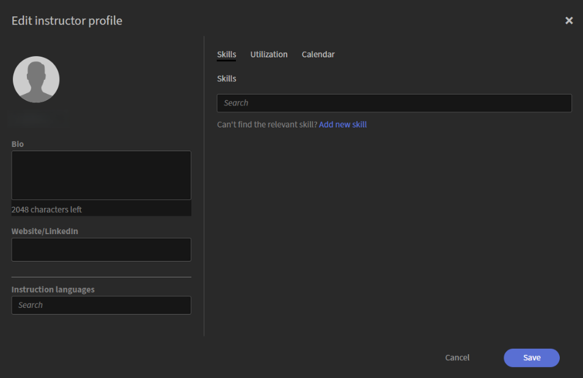

# Aggiungere e gestire gli Istruttori

Gli istruttori offrono sessioni dal vivo e coinvolgono gli Allievi nell’Hub dal vivo. Per supportare una pianificazione accurata e una distribuzione efficace dei corsi, gli Amministratori possono aggiungere Istruttori, creare i loro profili, definire competenze e lingue didattiche e configurare la disponibilità.

La scheda Istruttori consente di gestire queste informazioni in un&#39;unica posizione all&#39;interno dell&#39;organizzazione. Da qui, puoi aggiungere gli utenti Adobe Learning Manager esistenti come Istruttori, rivedere e aggiornare i loro profili e mantenere le loro competenze, lingue e disponibilità aggiornate con l&#39;evolversi delle esigenze didattiche.

## Accedere alla scheda Istruttori

Segui questi passaggi per visualizzare e gestire gli Istruttori:

1. Accedi ad Adobe Learning Manager.

1. Passa a **Amministratore** > **Utenti**.

1. Seleziona **Istruttori** in **Gruppi di utenti**.

   
   *Selezionare gli Istruttori nei gruppi di utenti per visualizzare e gestire gli Istruttori.*

## Aggiungere un Istruttore

Gli istruttori vengono creati da utenti Adobe Learning Manager esistenti. Se un utente non dispone ancora delle autorizzazioni di Istruttore, aggiungilo come Istruttore.

Per aggiungere un Istruttore:

1. Seleziona la scheda **Istruttori** dai **Gruppi di utenti**.

1. Seleziona **Aggiungi Istruttori**.   Viene visualizzata una finestra popup di **Aggiungi istruttori**.

   
   *Cercare un utente in base al nome e selezionarlo per assegnare il ruolo di Istruttore.*

1. Cerca l’utente per nome e seleziona l’utente dai risultati della ricerca per assegnare il ruolo di Istruttore.

1. Seleziona **Salva**.   All’utente viene ora assegnato il ruolo di Istruttore e viene visualizzato nell’elenco degli Istruttori.

## Configurare un profilo Istruttore

Un profilo Istruttore definisce le informazioni didattiche, le lingue, le abilità, l’utilizzo e la disponibilità dell’Istruttore. Il completamento del profilo garantisce una corrispondenza accurata degli Istruttori, una pianificazione efficiente e l’allineamento con i requisiti del corso.

Per configurare un profilo Istruttore:

1. Cerca il nome dell’Istruttore nella scheda Istruttori.

1. Seleziona **Aggiungi abilità e altri dettagli**.   Viene visualizzata la finestra a comparsa **Modifica profilo istruttore**.

   
   *La finestra Modifica profilo istruttore include schede per dettagli di base, abilità, utilizzo e disponibilità.*

### Aggiungi dettagli di base

I dettagli di base vengono visualizzati nel pannello sinistro della finestra di dialogo e sono sempre visibili, indipendentemente dalla scheda aperta.

Per aggiungere i dettagli di base:

1. Passare alla sezione del profilo.

1. Immetti i seguenti dettagli:

   | **Fields** | **Azione** |
   |----|----|
   | **Bio** | Immetti una breve descrizione dell’Istruttore (fino a 2.048 caratteri). |
   | **Sito Web/LinkedIn** | Immettere un profilo esterno o un collegamento di riferimento. |
   | **Lingue di istruzione** | Cerca le lingue insegnate dall’Istruttore. Le lingue selezionate vengono visualizzate come tag. |

## Aggiungere abilità di Istruttore nel profilo

Le abilità definiscono le aree tematiche e le competenze che un Istruttore può insegnare. Ciò gioca un ruolo chiave nell’associare gli Istruttori ai corsi pertinenti e nell’assicurare che l’Istruttore giusto sia assegnato in base ai requisiti del corso.

Per aggiungere le abilità dell’Istruttore:

1. Passa alla scheda **Abilità**.

1. Digita un nome di abilità nel campo **Ricerca**. In questo modo viene compilato un elenco con le abilità.

1. Seleziona le abilità dall’elenco.   Le abilità selezionate vengono visualizzate come tag.

1. Seleziona **Salva**.

### Creare una nuova abilità

Se l’abilità richiesta non è disponibile, puoi crearla direttamente dal profilo.

Per aggiungere una nuova abilità:

1. Seleziona **Aggiungi nuova abilità** dalla scheda **Abilità**. Viene aperto il pannello **Aggiungi abilità**.

    *Immetti un nome e una descrizione dell’abilità, quindi seleziona Fine per aggiungere la nuova abilità.*

1. Immetti i seguenti dettagli nel pannello **Aggiungi abilità**:

   1. Nome abilità

   1. Descrizione

1. Seleziona **Fine**.   La nuova abilità è stata aggiunta e viene visualizzata come tag.

1. Seleziona **Salva**.   Le abilità vengono aggiunte al profilo dell’Istruttore.

## Configurare l’utilizzo dell’Istruttore

Utilizzare la scheda **Utilizzo** per definire la capacità di insegnamento di un Istruttore e l&#39;orario di lavoro preferito. È possibile impostare vincoli di utilizzo per stabilire obiettivi e limiti di insegnamento e specificare gli orari di lavoro preferiti per indicare quando l’Istruttore è disponibile a condurre sessioni. Il fuso orario visualizzato viene ereditato dal profilo utente dell’Istruttore.

Per configurare l’utilizzo dell’Istruttore:

1. Passa alla scheda **Utilizzo**.

1. Immetti **Obiettivi minimi** e **Limiti massimi** (in ore) per il periodo **Mensile**.

1. Immetti l&#39;**ora di inizio** e l&#39;**ora di fine** per l&#39;intervallo di tempo preferito.

   
   *Immettere un&#39;ora di inizio e di fine per l&#39;orario di lavoro preferito dell&#39;istruttore.*

1. (Facoltativo) Selezionare **Aggiungi un&#39;altra fascia oraria** per aggiungere ulteriore disponibilità.

1. Seleziona **Salva**. I vincoli di utilizzo e gli orari di lavoro preferiti dell’Istruttore vengono aggiornati.

## Gestire la disponibilità dell’Istruttore

Utilizzare la scheda **Calendario** per aggiungere la pianificazione dell&#39;istruttore e contrassegnare i periodi in cui l&#39;istruttore non è disponibile. Il calendario utilizza la codifica a colori per identificare le date **Prenotate**, **Vacanze** e **Non disponibili**.

Le **festività** visualizzate in questo calendario sono configurate dalle impostazioni Festività. Per ulteriori informazioni, visualizzare [Gestione festività](./manage-holidays.md).

Per contrassegnare i giorni non disponibili:

1. Passare alla scheda **Calendario**.

1. Selezionare una data di inizio e una data di fine nella sezione **Aggiungi giorni non disponibili**.

   
   *Selezionare una data di inizio e una data di fine per contrassegnare un intervallo come non disponibile nel calendario dell&#39;Istruttore.*

1. Seleziona **Aggiungi**.   L&#39;intervallo di date selezionato è contrassegnato come non disponibile nel calendario.

1. Seleziona **Salva**. Le impostazioni di disponibilità dell’Istruttore vengono aggiornate.
