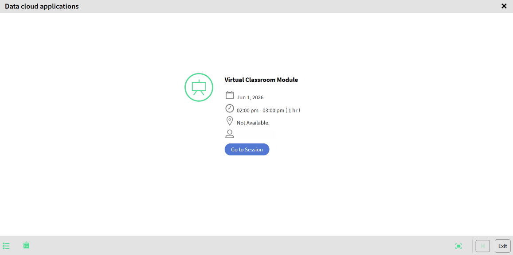

# Partecipa a una sessione di Hub live (Beta) come Allievo

Gli Allievi partecipano a una sessione Hub dal vivo direttamente dal corso a cui sono iscritti. Una volta unitevi, prendete parte al training dal vivo tramite chat, sondaggi, quiz, lavagne e breakout room.

## Partecipa alla sessione

1. Accedi ad Adobe Learning Manager.

1. Passa a **I miei insegnamenti**.

1. Seleziona il corso a cui ti sei iscritto.

   
   *Seleziona Vai alla sessione per aprire la schermata di pre-accesso di Hub live.*

1. Seleziona **Inizio** > **Vai alla sessione**. Si apre l’interfaccia di unione Hub live.

1. (Facoltativo) Prova il microfono e applica lo sfondo virtuale. Per ulteriori informazioni, consulta [Configurazione della schermata di pre-join nell&#39;hub live](./setup-pre-join-screen-in-live-hub.md).

1. Seleziona **Iscriviti**.
