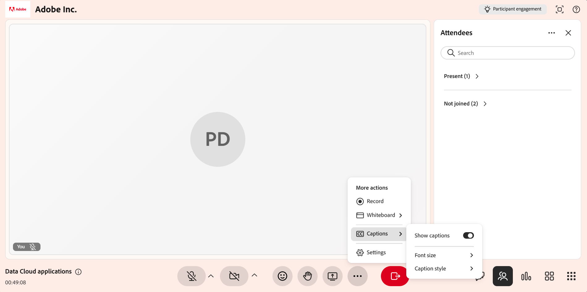
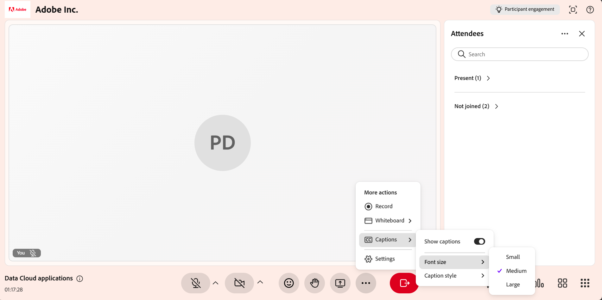

# Gestire i sottotitoli codificati come Istruttore

I sottotitoli codificati visualizzano il contenuto parlato come testo su schermo, rendendo più facile seguire una sessione dell’Hub dal vivo, ad esempio, durante le presentazioni, le risposte alle domande dei partecipanti o le attività in un ambiente rumoroso. In qualità di Istruttore, puoi gestire i tuoi sottotitoli codificati dal menu della room **Altre azioni**.

Questo articolo spiega come visualizzare, personalizzare e nascondere i sottotitoli codificati durante una sessione di Hub live.

## Visualizza sottotitoli codificati

Visualizza i sottotitoli codificati durante una sessione Hub dal vivo per visualizzare la trascrizione in tempo reale dei contenuti vocali.

Per abilitare i sottotitoli codificati:

1. Selezionare **Altre opzioni (⋯)** dalla barra dei controlli.

1. Seleziona **Sottotitoli**.

1. Abilita **Mostra sottotitoli**. I sottotitoli codificati vengono visualizzati nella parte inferiore dell’interfaccia.

    *Abilita Mostra sottotitoli per visualizzare i sottotitoli codificati nella sessione.*

## Modificare l’aspetto dei sottotitoli

Puoi personalizzare l’aspetto dei sottotitoli codificati durante una sessione per migliorarne la leggibilità in base alle esigenze di visualizzazione.

Per modificare l’aspetto dei sottotitoli:

1. Selezionare **Altre opzioni (⋯)**.

1. Seleziona **Sottotitoli**.

1. Selezionate una delle seguenti opzioni:

   1. **Dimensione font**: seleziona una dimensione per il testo dei sottotitoli codificati. Le opzioni disponibili sono **Small**, **Medium** e **Large**.

   1. **Stile sottotitoli**: seleziona una combinazione di colori. Le combinazioni disponibili sono **Nero su bianco**, **Giallo su nero**, **Bianco su nero**, **Scuro su giallo** e **Giallo su blu**.

   
   *Seleziona Dimensione font per modificare la dimensione del testo visualizzato nei sottotitoli.*
