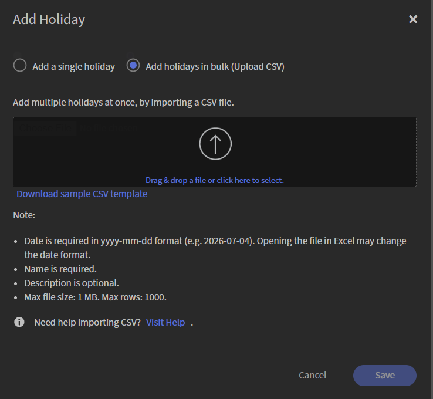

# Gestisci festività

Utilizza l&#39;impostazione **Vacanze** per definire le festività a livello di organizzazione in Adobe Learning Manager. Le festività vengono visualizzate nel calendario dell’Istruttore come giorni non lavorativi, influendo sulla disponibilità dell’Istruttore durante la pianificazione delle sessioni dell’Hub live.

Puoi aggiungere le festività singolarmente o importare più festività utilizzando un file CSV. Dopo aver aggiunto le festività, queste vengono visualizzate nella pagina **Vacanze**, in cui è possibile visualizzarle, cercarle e gestirle.

## Accedere alle impostazioni Festività

Per accedere alle impostazioni **Vacanze**:

1. Accedi ad Adobe Learning Manager.

1. Selezionare **Impostazioni** dal **Configura**.

1. Passa alla sezione **Avanzate** nel riquadro di navigazione a sinistra.

   
   *Passare alla sezione Avanzate nel riquadro di navigazione a sinistra per trovare le festività.*

1. Selezionare **Vacanze**. Viene visualizzata la pagina **Vacanze**.

## Aggiungi festività

Utilizza l&#39;opzione **Aggiungi festività** per creare una singola vacanza o importare più festività da un file CSV.

1. Seleziona **Aggiungi** nell&#39;angolo superiore destro della pagina **Vacanze**. Viene visualizzata la finestra a comparsa Aggiungi festività.

1. Selezionate una delle seguenti opzioni:

   1. Aggiungi una singola vacanza

   1. Aggiungi festività in blocco (Carica CSV)

### Aggiungi una singola vacanza

Per aggiungere manualmente una festività:

1. Selezionare **Aggiungi una singola vacanza**.

1. Selezionare **Data** e immettere il nome della festività.

1. (Facoltativo) Inserire una descrizione.

   
   *Selezionare una data, immettere il nome della festività e aggiungere facoltativamente una descrizione.*

1. Seleziona **Salva**. La festività viene aggiunta all&#39;elenco.

### Aggiungere festività in blocco

Usa un file CSV per aggiungere più festività contemporaneamente.

1. Seleziona **Aggiungi festività in blocco (Carica CSV)**.

1. Seleziona **Scarica il modello CSV di esempio** e aggiungi al file i dettagli della tua vacanza.

   
   *Scarica il modello CSV di esempio, quindi carica il file completato.*

1. Trascina il file CSV nell’area di caricamento oppure seleziona l’area di caricamento in cui sfogliare e selezionare il file.

1. Seleziona **Salva**. Le festività vengono importate e aggiunte all&#39;elenco.
