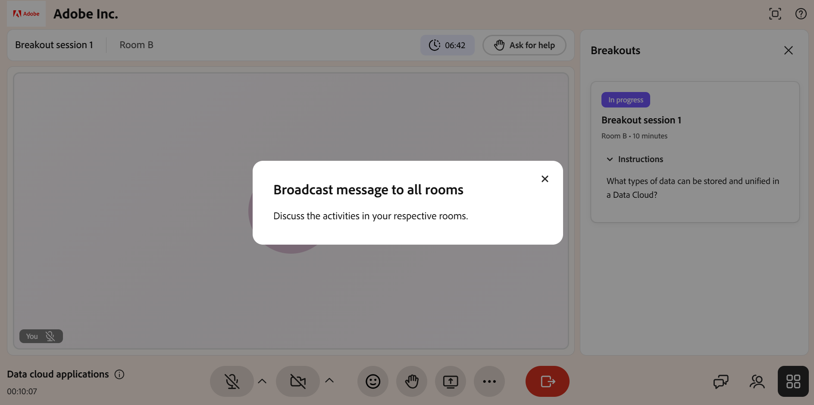
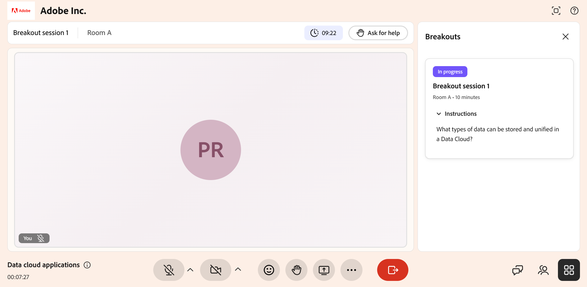

# Partecipare a una sessione di breakout

Durante una sessione Hub dal vivo, l’Istruttore può dividere la sessione in sale stampa più piccole per discussioni mirate e attività pratiche.

Quando inizia una sessione di breakout, vieni automaticamente spostato nella stanza assegnata, dove puoi collaborare con il tuo gruppo, seguire le istruzioni delle attività e chiedere aiuto quando ne hai bisogno. Al termine della sessione, puoi visualizzare un riepilogo generato dall&#39;intelligenza artificiale della discussione che si è svolta nella tua breakout room. Questa guida spiega nel dettaglio cosa aspettarti e cosa puoi fare come Allievo durante una sessione di breakout.

## Iscriviti alla tua sala stampa

Quando l’Istruttore avvia una sessione di breakout, vieni automaticamente spostato dalla stanza principale alla sala breakout assegnata. Non devi fare nulla per unirti. Nella parte superiore dello schermo vengono visualizzati il nome della sessione e la stanza, insieme a un timer del conto alla rovescia che indica la quantità di tempo rimanente nell&#39;attività.

>[!NOTE]
>
>Le conversazioni nelle breakout room vengono trascritte ed elaborate utilizzando l&#39;intelligenza artificiale per generare i riepiloghi. Gli istruttori possono rivedere questi riepiloghi per monitorare i progressi della sala e identificare le lacune nelle discussioni.

*Visualizzazione Allievo di una sala riunioni attiva, con nome della sala, timer del conto alla rovescia e strumenti sessione*

## Visualizza le istruzioni sulle attività

L’Istruttore imposta un’attività o una richiesta di discussione per la breakout. Il pannello **Breakouts** a destra mostra lo stato della sessione (**In corso**), la stanza e la durata della sessione.

Per visualizzare il prompt delle attività:

1. Se il pannello **Breakouts** è chiuso, seleziona l&#39;icona **Breakouts** (griglia) in basso a destra dello schermo.

2. Selezionare **Istruzioni** per espandere il prompt dell&#39;attività, ad esempio, &quot;Quali tipi di dati possono essere archiviati e unificati in un Data Cloud?&quot;

Fare riferimento a queste istruzioni per tutta la durata della suddivisione per mantenere
discussione allineata all&#39;attività.

## Collaborare con il gruppo

All’interno della stanza delle breakout, puoi lavorare con gli altri allievi nella stanza utilizzando gli strumenti disponibili sulla barra di controllo:

- **Microfono**: disattiva l&#39;audio o riattiva l&#39;audio per parlare con il gruppo.

- **Fotocamera**: attiva o disattiva il video.

- **Reazioni**: invia una rapida reazione emoji.

- **Alza la mano**: segnale che desideri parlare o attirare l&#39;attenzione.

- **Condividi schermo**: condividi lo schermo o una presentazione con la stanza.

- **Chat**: apre il pannello Chat per inviare un messaggio ad altri utenti nella tua stanza.

- **Partecipanti**: vedete chi si trova nella vostra sala conferenze.

Solo gli utenti nella tua stanza possono vederti e sentirti, così puoi discutere liberamente senza interrompere le altre sale.

## Ricevi messaggi dall’Istruttore

L’Istruttore può inviare un messaggio broadcast a ogni stanza contemporaneamente, ad esempio un promemoria dell’attività o un controllo dell’ora. Il messaggio viene visualizzato sullo schermo. Leggere il messaggio, quindi chiuderlo per tornare all&#39;attività.

*Trasmetti il messaggio dell’Istruttore che appare nella breakout room dell’Allievo*

## Richiedi assistenza

Se il tuo gruppo ha una domanda o ha bisogno che l&#39;Istruttore si unisca alla tua stanza, seleziona **Chiedi aiuto** nella parte superiore della sala conferenze stampa. In questo modo l’Istruttore riceve una notifica in merito, che può quindi unirsi alla stanza per prestare assistenza. Puoi continuare la discussione in attesa della risposta dell’Istruttore.

*L&#39;opzione Richiedi assistenza viene utilizzata per richiedere assistenza all&#39;Istruttore*

Dopo aver inviato una richiesta, il pulsante diventa **Annulla chiamata per assistenza**. Se non hai più bisogno di assistenza, ad esempio se il tuo gruppo ha risolto la domanda autonomamente, seleziona **Annulla chiamata per assistenza** per ritirare la richiesta.

*L&#39;opzione Annulla chiamata per assistenza utilizzata per ritirare una richiesta di assistenza*

## Torna alla stanza principale

La sessione di breakout viene eseguita per la durata indicata sul timer e l&#39;Istruttore può estenderla se necessario. Al termine della sessione, quando il timer si esaurisce o quando l’Istruttore la termina in anticipo, si ritorna automaticamente nella stanza principale per continuare la sessione con tutti.

## Visualizza il riepilogo della stanza

Al termine di una sessione di breakout, puoi visualizzare un riepilogo generato dall&#39;intelligenza artificiale della conversazione che si è svolta nella tua stanza. Il riepilogo include i punti chiave discussi dal tuo gruppo.

Viene generato un riepilogo solo se la breakout room dispone di almeno 60 secondi di conversazione. Se l&#39;attività della room è inferiore a 60 secondi, non è disponibile alcun riepilogo.

>[!NOTE]
>
>Puoi visualizzare il report solo per la stanza in cui ti trovavi. Le segnalazioni provenienti da altre sale stampa non sono visibili.

Se l’Istruttore si sposta in una stanza diversa durante la stessa sessione di breakout, ad esempio dalla stanza A alla stanza B, viene visualizzato solo il riepilogo della stanza più recente. I riepiloghi delle stanze in cui eri in precedenza non vengono mantenuti.

Per visualizzare il riepilogo della stanza:

1. Selezionare  dalla barra di controllo.   Viene visualizzato il pannello delle breakout.
1. Passare alla scheda della sessione di breakout per la quale si desidera visualizzare il riepilogo.
1. Selezionare la sessione di interruzione, quindi selezionare **Riepilogo**.  Viene visualizzato il riepilogo generato dall&#39;intelligenza artificiale per la stanza.

   
   *Selezionare Riepilogo per visualizzare il riepilogo della stanza.*