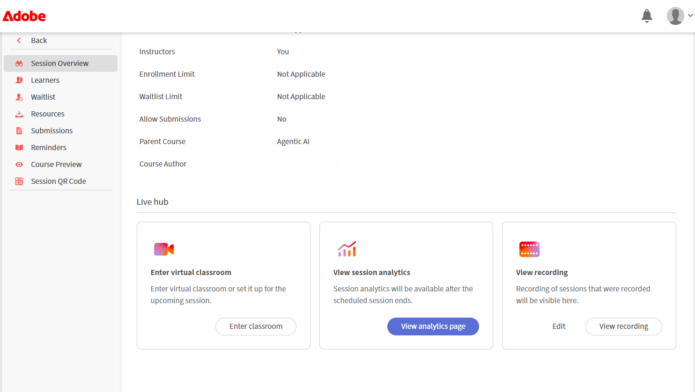

# Registrare una sessione

In qualità di Istruttore, hai il pieno controllo su come una sessione viene acquisita, perfezionata e condivisa. Puoi avviare una registrazione durante una sessione dal vivo, gestirla durante l’esecuzione e rivedere gli argomenti, il riepilogo e la trascrizione generati automaticamente al termine della sessione.

Oltre all’acquisizione della sessione, puoi modificare la registrazione per rimuovere sezioni non necessarie, abilitare i sottotitoli codificati e le trascrizioni. Nelle sezioni seguenti vengono descritte in dettaglio tutte queste azioni.

>[!NOTE]
>
>Quando si registra una sessione, nella registrazione viene inclusa solo la sessione principale. La registrazione si interrompe automaticamente quando i partecipanti si spostano in sale d&#39;attesa e riprende quando tutti tornano alla sessione principale. Di conseguenza, le attività della breakout room non vengono registrate.

## Registrare una sessione

1. Passa al menu **Altre azioni**.

1. Seleziona **Avvia registrazione**.   Viene visualizzata una finestra a comparsa di conferma che indica che &quot;**La sessione è in fase di registrazione**&quot;.

   
   *Selezionare Registra dal menu Altre azioni per iniziare l&#39;acquisizione della sessione.*

## Interrompi, Pausa e Riprendi registrazione

Quando si registra una sessione, nell&#39;angolo superiore dell&#39;aula virtuale viene visualizzato un indicatore di registrazione. È possibile avviare, interrompere e riprendere la registrazione.

### Interrompi registrazione

1. Selezionare l&#39;indicatore di registrazione.   Si apre una finestra a comparsa con le azioni di registrazione.

   
   *Durante la registrazione, utilizzare le opzioni Registrazione in corso per sospendere o interrompere la sessione.*

1. Selezionare **Interrompi registrazione**.   Viene visualizzato un messaggio di conferma che la sessione non è più in fase di registrazione.

### Sospendi registrazione

Per mettere in pausa la registrazione:

1. Selezionare l&#39;indicatore di registrazione.

1. Seleziona **Sospendi registrazione**.   Verrà visualizzato un messaggio di conferma che mostra **Registrazione e trascrizione in pausa**.

### Riprendi registrazione

Dopo aver messo in pausa la registrazione, viene visualizzata l&#39;opzione Riprendi registrazione. Selezionare **Riprendi registrazione** per continuare la registrazione in pausa.

*Quando è in pausa, le opzioni Registrazione in pausa consentono di riprendere o interrompere la registrazione.*

## Accedere a una registrazione

Le sessioni registrate sono disponibili nella pagina **Panoramica sessione** per ogni sessione. Da qui, puoi riprodurre una registrazione o aprirla in modalità di modifica per perfezionare la timeline e la trascrizione.

Per accedere a una registrazione:

1. Accedi al corso richiesto e apri la sessione.

1. Scorri fino alla sezione **Hub live** nella pagina **Panoramica della sessione**.

1. Nella scheda **Visualizza registrazione**, effettuare una delle seguenti operazioni:

   * Selezionare **Visualizza registrazione** per aprire la registrazione in modalità di riproduzione.

   * Seleziona **Modifica** per aprire la registrazione in modalità di modifica.

   
   *La scheda Visualizza registrazione nella sezione Hub dal vivo, in cui è possibile riprodurre o modificare una registrazione.*

## Riprodurre una registrazione

Selezionando Visualizza registrazione si apre la registrazione nel lettore di registrazione. Il lettore visualizza il video della sessione, le miniature dei partecipanti e la trascrizione.

Per riprodurre una registrazione:

1. Passare alla pagina **Panoramica sessione**.

1. Seleziona **Visualizza registrazione** dalla sezione **Hub dal vivo**.   La registrazione si apre in modalità di riproduzione.

   
   *Il lettore per la registrazione è in modalità di riproduzione e visualizza il video della sessione e il pannello Trascrizione.*

1. Utilizza i seguenti controlli di riproduzione per regolare l’esperienza di visualizzazione:

| **Controllo** | **Descrizione** |
|----|----|
| Riproduci o Pausa | Avvia o sospende la riproduzione. |
| Volume | Regola il livello audio. |
| Barra di avanzamento | Trascinare per spostarsi in un punto specifico della registrazione. Il tempo trascorso e il tempo totale vengono visualizzati accanto ai controlli. |
| Velocità di riproduzione | Rallenta o velocizza la riproduzione. Le opzioni disponibili sono **0.25x**, **0.5x**, **0.75x**, **1x**, **1.25x**, **1.5x** e **2x**. |
| CC (sottotitoli codificati) | Attiva o disattiva i sottotitoli codificati durante la riproduzione. Seleziona la freccia accanto al pulsante CC per personalizzare i sottotitoli. Scegliete una dimensione del font tra **Piccolo**, **Medio** o **Grande** e uno stile per sottotitoli tra **Nero su bianco**, **Giallo su nero**, **Bianco su nero**, **Scuro su giallo** o **Giallo su blu**. |
| Schermo intero | Espande il lettore di registrazione. |

## Genera argomenti nella registrazione

Gli argomenti suddividono automaticamente le registrazioni in sezioni significative in base al flusso della discussione della sessione. Consentono di organizzare registrazioni più lunghe e di migliorare la navigazione. Puoi anche cercare un argomento utilizzando le parole chiave per passare rapidamente alla sezione pertinente della registrazione.

## Visualizza argomenti nella registrazione

Una volta generati gli argomenti, potete sfogliarli e navigarli. Gli argomenti sono contrassegnati come **Generati tramite IA**. Esamina il contenuto, in quanto le risposte generate dall&#39;intelligenza artificiale devono essere sottoposte a doppio controllo.

Per visualizzare e navigare tra gli argomenti:

1. Nel pannello **Argomenti**, sfogliate l&#39;elenco degli argomenti o utilizzate la casella **Cerca** per trovare un argomento utilizzando le parole chiave.

1. Seleziona un argomento per espanderlo e visualizzarne il riepilogo, i dettagli e la durata totale.

1. Seleziona **Riproduci argomento**.   La registrazione inizia dalla sezione dell&#39;argomento selezionato.

   
   *Il pannello Argomenti, in cui gli argomenti generati dall&#39;intelligenza artificiale consentono di spostarsi all&#39;interno della registrazione.*

## Visualizza trascrizione

La trascrizione fornisce una versione di testo della sessione con data e ora che puoi leggere insieme alla registrazione. Ogni voce include il nome dell&#39;oratore e l&#39;ora in cui il testo è stato pronunciato.

Per visualizzare la trascrizione:

1. Seleziona l’icona **Trascrizione** dal pannello per passare al lato destro del lettore.   Viene aperto il pannello **Trascrizione** e viene visualizzata la trascrizione con data e ora.

1. (Facoltativo) Utilizza la casella **Cerca** per trovare parole o frasi specifiche all&#39;interno della trascrizione.

Per passare a una parte specifica della registrazione, seleziona una voce di trascrizione. La registrazione passa al timestamp corrispondente e inizia la riproduzione da quel punto.

*Il pannello Trascrizione, in cui ogni voce si collega al proprio punto nella registrazione.*

### Modifica la dimensione del testo della trascrizione

Puoi regolare le dimensioni del testo della trascrizione per semplificarne la lettura.

Per modificare le dimensioni del testo:

1. Nel pannello **Trascrizione**, seleziona l&#39;icona **dimensioni testo** accanto all&#39;intestazione **Trascrizione**.

1. Selezionate una dimensione di testo dall&#39;elenco. Le dimensioni disponibili sono 12, 14, 16, 18, 20, 24, 30 e 36. La dimensione predefinita è 14. Il testo della trascrizione si aggiorna alle dimensioni selezionate.

   
   *Per facilitare la lettura delle voci, scegli una dimensione del testo della trascrizione.*

## Modificare una registrazione

La modifica di una registrazione nell’Hub live ti consente di perfezionare il contenuto prima di condividerlo con gli Allievi. Potete tagliare la timeline per rimuovere le sezioni superflue e migliorare la chiarezza. Le modifiche non cambiano la registrazione originale finché non vengono salvate.

Per modificare una registrazione:

1. Passa a **Panoramica della sessione** > **Hub dal vivo** > **Visualizza registrazione** e seleziona **Modifica**.   La registrazione si apre in modalità di modifica.

1. (Facoltativo) Per rinominare la registrazione, seleziona l&#39;icona **modifica (matita)** accanto al titolo della registrazione e immetti un nuovo nome.

1. Seleziona **Modifica timeline** nella parte inferiore del lettore di registrazione.   Nella timeline di registrazione viene visualizzata una barra di avanzamento trascinabile.

1. Posizionate il marcatore sulla barra di avanzamento per selezionare il segmento da rimuovere.

1. Trascina il marcatore o usa i tasti freccia sinistra e destra per spostarlo con precisione. La miniatura di anteprima e la marca temporale consentono di trovare il punto esatto.

   
   *Posizionare il marcatore per selezionare il segmento della timeline che si desidera rimuovere.*

1. Selezionare **Taglia selezione**. La sezione selezionata della registrazione viene rimossa.

1. (Facoltativo) Utilizzare **Annulla** o **Ripeti** per annullare o riapplicare un&#39;azione oppure selezionare **Annulla** per annullare la selezione corrente.

1. Seleziona **Salva modifiche**.   Le modifiche vengono applicate alla registrazione.

   
   *Una volta tagliata una selezione, Salva modifiche diventano attive in modo da poter applicare la modifica.*

È inoltre possibile modificare una registrazione dal **dashboard della sessione**. Per ulteriori informazioni, vedere [Componenti del dashboard di sessione](../getting-started-with-live-hub/components-of-the-session-dashboard.md#recordings).

## Rigenera argomenti

Quando si modifica la sequenza temporale della registrazione, gli argomenti esistenti non corrispondono più alla registrazione aggiornata. Potete rigenerare gli argomenti per mantenerli sincronizzati con la nuova linea temporale.

Per rigenerare gli argomenti:

1. Seleziona l&#39;icona **Argomenti** dal pannello per attivare/disattivare il lettore.   Viene visualizzato il pannello Argomenti.

1. Seleziona **Rigenera**.   Durante l&#39;identificazione degli argomenti verrà visualizzato un messaggio di **generazione degli argomenti**. L&#39;identificazione degli argomenti potrebbe richiedere del tempo.

   
   *Dopo aver modificato la sequenza temporale, utilizza il prompt per rigenerare gli argomenti sincronizzati con la registrazione.*

## Ripristina originale

Per annullare tutte le modifiche e ripristinare lo stato originale della registrazione, usate l’opzione Ripristina originale.

Per ripristinare la registrazione originale:

1. Seleziona l&#39;icona **Ripristina originale** nella parte superiore del lettore.   Viene visualizzata la finestra a comparsa di conferma **Ripristina originale**.

   
   *La finestra a comparsa di conferma avvisa che il ripristino dell&#39;originale non può essere annullato.*

1. Selezionare **Ripristina**. Questa operazione annulla tutte le modifiche apportate alla registrazione e alla trascrizione. Si tratta di un&#39;azione irreversibile che non può essere annullata.

1. (Facoltativo) Selezionare **Annulla** se non si desidera annullare l&#39;operazione.

## Scaricare una registrazione

Puoi scaricare una registrazione per accedervi offline o condividerla al di fuori della piattaforma.

Il download di una registrazione è gestito dal dashboard della sessione. Per ulteriori informazioni, vedere [Componenti del dashboard di sessione](./components-of-the-session-dashboard.md).
