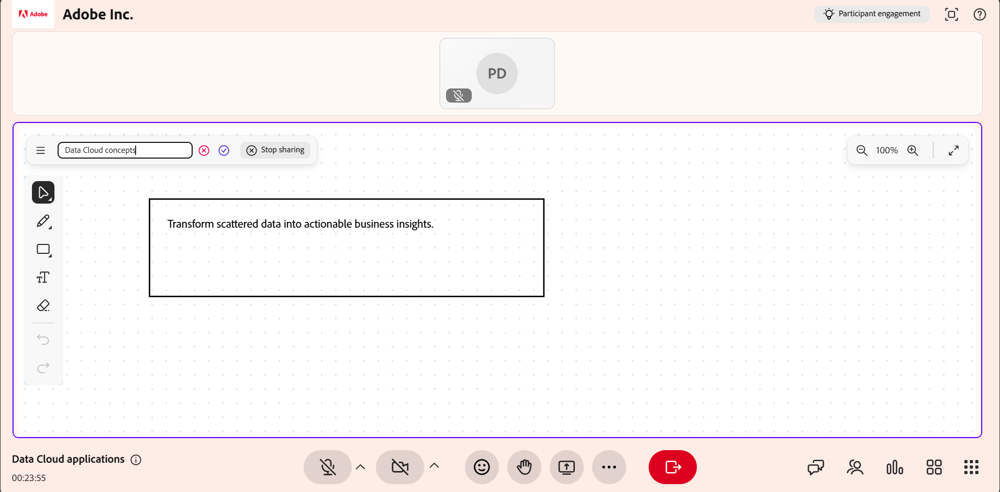
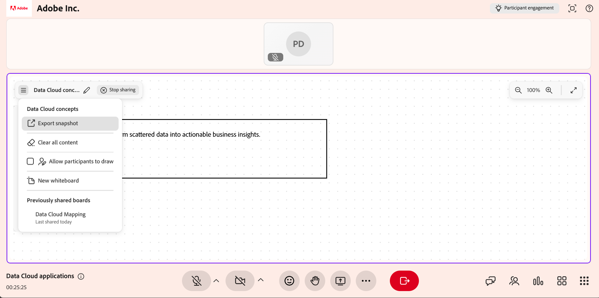
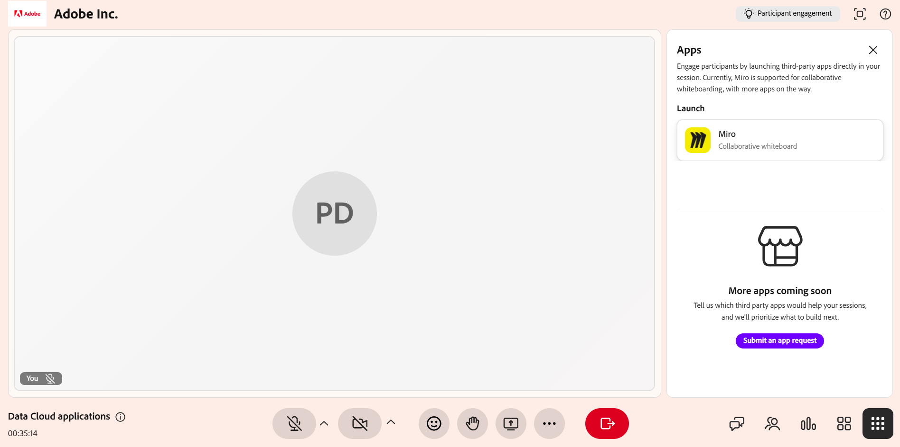

# Condividere una lavagna

Utilizza la lavagna in una sessione di Hub dal vivo per spiegare visivamente i concetti, annotare i contenuti e collaborare con gli Allievi in tempo reale. In qualità di Istruttore, puoi creare una nuova lavagna o riaprirne una esistente, aggiungere disegni, forme e testo e gestire più bacheche durante una sessione.

Puoi anche rinominare le bacheche, esportare una lavagna come immagine, consentire agli Allievi di collaborare sulla bacheca e aprire lavagne esterne come Miro.

Questo articolo spiega come creare, gestire, condividere ed esportare lavagne in una sessione Hub dal vivo.

## Condividere una nuova lavagna

Create una nuova lavagna quando desiderate che un&#39;area di lavoro nuova presenti idee, spiegazioni o diagrammi durante una sessione dal vivo.

Per condividere una nuova lavagna:

1. Nella barra di controllo della sessione, seleziona **Altre opzioni**.

1. Seleziona **Condividi lavagna**.

1. Seleziona **Nuova lavagna**. Viene aperta una nuova lavagna, visibile a tutti i partecipanti alla sessione.

   
   *Interfaccia Hub dal vivo che mostra le opzioni per condividere una lavagna.*

## Riaprire una lavagna

Puoi aprire una lavagna esistente per accedere al contenuto condiviso in precedenza durante la sessione. Ciò consente di continuare le discussioni o di basarsi su spiegazioni precedenti senza ricominciare da capo.

Per riaprire una lavagna:

1. Seleziona **Altre opzioni**.

1. Seleziona **Condividi lavagna**.

1. Selezionare la lavagna dall&#39;elenco delle lavagne disponibili. Si apre la lavagna selezionata, visibile a tutti gli allievi.

   
   *Opzioni di condivisione della lavagna che visualizzano l&#39;elenco delle lavagne esistenti disponibili.*

>[!NOTE]
>
> Puoi anche aprire le lavagne condivise in precedenza dal menu **Altro** all&#39;interno della lavagna.

## Usare gli strumenti della lavagna

Gli strumenti Lavagna consentono di creare spiegazioni visive, disegnare, aggiungere forme, inserire testo e annotare contenuti durante una sessione dal vivo.

*Interfaccia della lavagna con gli strumenti della lavagna.*

Utilizza i seguenti strumenti per creare e annotare contenuti durante la sessione:

| **Riferimento strumento** | **Descrizione** |
|----|----|
| **Seleziona** | Seleziona forme o testo sulla lavagna. Dopo aver selezionato un oggetto, potete spostarlo, ridimensionarlo, ruotarlo, duplicarlo o eliminarlo. |
| **Panning** | Trascinate sull’area di lavoro per navigare e visualizzare diverse aree della lavagna. |
| **Marcatore** | Disegna tratti a mano libera sull&#39;area di lavoro della lavagna. Utilizza il selettore colore e le opzioni del thickness di tratti per personalizzare il disegno. |
| **Forma** | Aggiungi forme geometriche come rettangoli, cerchi, frecce e linee. Trascina sull&#39;area di lavoro per disegnare una forma. Regolate il colore di riempimento, il bordo e il thickness. |
| **Testo** | Aggiungi etichette di testo, note o spiegazioni alla lavagna. Selezionate l&#39;area di lavoro per inserire il testo. Usate le opzioni di formattazione, come la dimensione del font, lo stile e il colore. |
| **Gomma** | Rimuovi tratti o oggetti dalla lavagna. Per i disegni, la gomma consente la rimozione parziale. Per le forme o il testo, viene rimosso l’intero oggetto. |
| **Annulla** | Ripristinate l’azione più recente eseguita sulla lavagna, ad esempio disegnare, aggiungere testo, inserire forme o eliminare oggetti. Seleziona **Annulla** più volte per annullare più azioni in sequenza. |
| **Ripeti** | Ripristina l&#39;azione più recente annullata sulla lavagna. Selezionare **Ripristina** per riapplicare le azioni precedentemente annullate utilizzando **Annulla**. |

## Cancella tutto il contenuto della lavagna

Cancella la lavagna per rimuovere tutti i disegni, le forme e il testo e inizia con un&#39;area di lavoro vuota.

Per cancellare la lavagna:

1. Spostati nell’angolo in alto a sinistra della lavagna.

1. Seleziona **Altre opzioni**.

1. Selezionare **Cancella tutto il contenuto**. Tutto il contenuto della lavagna viene rimosso.

   
   *Menu Altro che mostra le opzioni per cancellare tutto il contenuto della lavagna.*

Puoi utilizzare **Annulla** per ripristinare il contenuto cancellato.

## Gestione delle lavagne esistenti

Gli istruttori possono creare, organizzare e controllare più lavagne durante una sessione di Hub dal vivo utilizzando il pannello **Lavagne**. Questo pannello consente di esaminare le lavagne disponibili e di eseguire azioni in blocco, ad esempio cancellare o eliminare le lavagne.

Per gestire le bacheche esistenti:

1. Selezionare **Altre opzioni** dalla barra di controllo.

1. Seleziona **Condividi lavagna**.

1. Seleziona **Visualizza bacheche**. Viene aperto il pannello **Lavagne**, in cui sono visualizzate tutte le lavagne create nella sessione.

   
   *Pannello Lavagne che mostra le opzioni per gestire le bacheche esistenti.*

### Azioni disponibili nel pannello Lavagne

Dal pannello **Lavagne**, gli Istruttori possono eseguire le seguenti azioni:

| **Azione** | **Descrizione** |
|----|----|
| **Condividi** | Condividi la lavagna selezionata. |
| **Elimina** | Elimina definitivamente la lavagna corrente dal pannello **Lavagne**. |
| **Elimina tutto** | Elimina definitivamente tutte le lavagne elencate nel pannello **Lavagne**. |

## Rinominare una lavagna

Rinominate una lavagna direttamente dall’interfaccia della lavagna per identificarne meglio il contenuto durante una sessione.

Per rinominare una lavagna:

1. Seleziona **Condividi** dal pannello **Lavagne**.

1. Sulla barra degli strumenti della lavagna, seleziona l&#39;icona **Modifica** (matita) accanto al nome della lavagna.

1. Immetti un nuovo nome e seleziona l’icona del segno di spunta. La lavagna viene rinominata con il nome aggiornato.

   
   *Rinominare l&#39;opzione della lavagna nell&#39;interfaccia della lavagna.*

## Esportare un’istantanea della lavagna come immagine

Gli istruttori possono esportare il contenuto della lavagna come immagine per acquisire discussioni, diagrammi o annotazioni chiave creati durante una sessione.

Per esportare un’istantanea della lavagna:

1. Spostati nell’angolo in alto a sinistra della lavagna.

1. Seleziona **Altre opzioni**.

1. Selezionare **Esporta snapshot**. Il contenuto della lavagna viene esportato come immagine **PNG** e scaricato nel sistema locale.

   
   *Menu Altro che mostra le opzioni per esportare la lavagna come immagine.*

## Consenti ai partecipanti di modificare la lavagna

È inoltre possibile consentire ai partecipanti di disegnare e interagire con la lavagna durante una sessione. Consentendo ai partecipanti di accedere alle lavagne si supporta la collaborazione, il brainstorming e la partecipazione attiva.

Per concedere l’accesso alle lavagne di modifica:

1. Spostati nell’angolo in alto a sinistra della lavagna.

1. Seleziona **Altre opzioni**.

1. Abilita **Consenti ai partecipanti di disegnare**. I partecipanti possono ora disegnare sulla lavagna, aggiungere forme, inserire testo e utilizzare tutti gli strumenti di annotazione disponibili.

   
   *Menu Altre opzioni che mostra i controlli per consentire agli Allievi di modificare la lavagna.*

## Condividi Miro e altre lavagne esterne

Gli istruttori possono condividere lavagne di terze parti, come Miro, in una sessione Hub dal vivo.

Per condividere una bacheca Miro:

1. Seleziona **Altre app** dalla barra di controllo.

1. Seleziona **Miro**.

1. Accedi al tuo account Miro.

   
   *Menu Altre app che mostra le opzioni per condividere la bacheca Miro.*

1. Nella pagina del progetto Miro, seleziona la bacheca che desideri condividere.

Gli Allievi possono visualizzare la bacheca di Miro condivisa in base alla configurazione della sessione, ma non possono aprire o condividere le bacheche di Miro.
